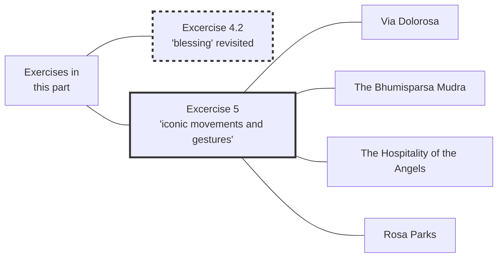

#TranscriptSummary

[[Preliminaries Regarding Voice, Movement, and Gesture - Part 3|Preliminaries Regarding Voice, Movement, and Gesture - Part 3 🡄]] | [[2020 Vajra Music|🡅]] | [[Preliminaries Regarding Voice, Movement, and Gesture - Part 5|🡆 Preliminaries Regarding Voice, Movement, and Gesture - Part 5]]

Series: [[2020 Vajra Music]]
Transcript: [[0304 Preliminaries Regarding Voice, Movement, and Gesture - Part 4]]
Transcript PDF: [[2020_0304 Preliminaries Regarding Voice, Movement, and Gesture - Part 4.pdf]]

<audio controls preload=metadata style=" width:300px;" controlslist="nodownload"><source src="https://dharmaseed.org/talks/62455/20200304-Rob_Burbea-GAIA-preliminaries_regarding_voice_movement_and_gesture_part_4-62455.mp3" type="audio/mpeg">???</audio>

## Index
_<a data-href="Soul" href="Soul" class="internal-link" target="_blank" rel="noopener">Soul</a> (136) · <a data-href="Image" href="Image" class="internal-link" target="_blank" rel="noopener">Image</a> (62) · <a data-href="Soulmaking" href="Soulmaking" class="internal-link" target="_blank" rel="noopener">Soulmaking</a> (40) · <a data-href="Imaginal" href="Imaginal" class="internal-link" target="_blank" rel="noopener">Imaginal</a> (37) · <a data-href="Daimon" href="Daimon" class="internal-link" target="_blank" rel="noopener">Daimon</a> (33) · <a data-href="Blessing" href="Blessing" class="internal-link" target="_blank" rel="noopener">Blessing</a> (32) · <a data-href="Energy Body" href="Energy+Body" class="internal-link" target="_blank" rel="noopener">Energy Body</a> (31) · <a data-href="Embodiment" href="Embodiment" class="internal-link" target="_blank" rel="noopener">Embodiment</a> (29) · <a data-href="Buddha" href="Buddha" class="internal-link" target="_blank" rel="noopener">Buddha</a> (26) · <a data-href="The Self" href="The+Self" class="internal-link" target="_blank" rel="noopener">The Self</a> (24) · <a data-href="Compassion" href="Compassion" class="internal-link" target="_blank" rel="noopener">Compassion</a> (13) · <a data-href="Dyad" href="Dyad" class="internal-link" target="_blank" rel="noopener">Dyad</a> (13) · <a data-href="Dimensionality" href="Dimensionality" class="internal-link" target="_blank" rel="noopener">Dimensionality</a> (11) · <a data-href="Fear" href="Fear" class="internal-link" target="_blank" rel="noopener">Fear</a> (11) · <a data-href="Sabbath" href="Sabbath" class="internal-link" target="_blank" rel="noopener">Sabbath</a> (11) · <a data-href="Abraham" href="Abraham" class="internal-link" target="_blank" rel="noopener">Abraham</a> (10) · <a data-href="Metta" href="Metta" class="internal-link" target="_blank" rel="noopener">Metta</a> (10) · <a data-href="Fullness of Intention" href="Fullness+of+Intention" class="internal-link" target="_blank" rel="noopener">Fullness of Intention</a> (9) · <a data-href="Attention" href="Attention" class="internal-link" target="_blank" rel="noopener">Attention</a> (8) · <a data-href="Christianity" href="Christianity" class="internal-link" target="_blank" rel="noopener">Christianity</a> (8) · <a data-href="Habit" href="Habit" class="internal-link" target="_blank" rel="noopener">Habit</a> (8) · <a data-href="Death" href="Death" class="internal-link" target="_blank" rel="noopener">Death</a> (7) · <a data-href="Duty" href="Duty" class="internal-link" target="_blank" rel="noopener">Duty</a> (7) · <a data-href="Meditation" href="Meditation" class="internal-link" target="_blank" rel="noopener">Meditation</a> (7) · <a data-href="Personhood" href="Personhood" class="internal-link" target="_blank" rel="noopener">Personhood</a> (7) · <a data-href="Telos" href="Telos" class="internal-link" target="_blank" rel="noopener">Telos</a> (7) · <a data-href="Awakening" href="Awakening" class="internal-link" target="_blank" rel="noopener">Awakening</a> (6) · <a data-href="Devotion" href="Devotion" class="internal-link" target="_blank" rel="noopener">Devotion</a> (6) · <a data-href="History" href="History" class="internal-link" target="_blank" rel="noopener">History</a> (6) · <a data-href="Mantra Practice" href="Mantra+Practice" class="internal-link" target="_blank" rel="noopener">Mantra Practice</a> (6) · <a data-href="Anxiety" href="Anxiety" class="internal-link" target="_blank" rel="noopener">Anxiety</a> (5) · <a data-href="Awareness" href="Awareness" class="internal-link" target="_blank" rel="noopener">Awareness</a> (5) · <a data-href="Contraction" href="Contraction" class="internal-link" target="_blank" rel="noopener">Contraction</a> (5) · <a data-href="Insight" href="Insight" class="internal-link" target="_blank" rel="noopener">Insight</a> (5) · <a data-href="Old Testament" href="Old+Testament" class="internal-link" target="_blank" rel="noopener">Old Testament</a> (5) · <a data-href="Perception" href="Perception" class="internal-link" target="_blank" rel="noopener">Perception</a> (5) · <a data-href="Preliminaries" href="Preliminaries" class="internal-link" target="_blank" rel="noopener">Preliminaries</a> (5) · <a data-href="Rosa Parks" href="Rosa+Parks" class="internal-link" target="_blank" rel="noopener">Rosa Parks</a> (5) · <a data-href="Dharmakaya" href="Dharmakaya" class="internal-link" target="_blank" rel="noopener">Dharmakaya</a> (4) · <a data-href="Dukkha" href="Dukkha" class="internal-link" target="_blank" rel="noopener">Dukkha</a> (4) · <a data-href="Emmett Till" href="Emmett+Till" class="internal-link" target="_blank" rel="noopener">Emmett Till</a> (4) · <a data-href="Energy" href="Energy" class="internal-link" target="_blank" rel="noopener">Energy</a> (4) · <a data-href="Experience" href="Experience" class="internal-link" target="_blank" rel="noopener">Experience</a> (4) · <a data-href="Mudra" href="Mudra" class="internal-link" target="_blank" rel="noopener">Mudra</a> (4) · <a data-href="Temenos" href="Temenos" class="internal-link" target="_blank" rel="noopener">Temenos</a> (4) · <a data-href="The Serpent" href="The+Serpent" class="internal-link" target="_blank" rel="noopener">The Serpent</a> (4) · <a data-href="Via Dolorosa" href="Via+Dolorosa" class="internal-link" target="_blank" rel="noopener">Via Dolorosa</a> (4) · <a data-href="Avalokiteshvara" href="Avalokiteshvara" class="internal-link" target="_blank" rel="noopener">Avalokiteshvara</a> (3) · <a data-href="Beauty" href="Beauty" class="internal-link" target="_blank" rel="noopener">Beauty</a> (3) · <a data-href="Buddhism" href="Buddhism" class="internal-link" target="_blank" rel="noopener">Buddhism</a> (3) · <a data-href="Divinity" href="Divinity" class="internal-link" target="_blank" rel="noopener">Divinity</a> (3) · <a data-href="Mindfulness" href="Mindfulness" class="internal-link" target="_blank" rel="noopener">Mindfulness</a> (3) · <a data-href="Music" href="Music" class="internal-link" target="_blank" rel="noopener">Music</a> (3) · <a data-href="Passion" href="Passion" class="internal-link" target="_blank" rel="noopener">Passion</a> (3) · <a data-href="Unfathomability" href="Unfathomability" class="internal-link" target="_blank" rel="noopener">Unfathomability</a> (3) · <a data-href="Art and Dharma" href="Art+and+Dharma" class="internal-link" target="_blank" rel="noopener">Art and Dharma</a> (2) · <a data-href="Consciousness" href="Consciousness" class="internal-link" target="_blank" rel="noopener">Consciousness</a> (2) · <a data-href="Create-Discover" href="Create-Discover" class="internal-link" target="_blank" rel="noopener">Create-Discover</a> (2) · <a data-href="Desire" href="Desire" class="internal-link" target="_blank" rel="noopener">Desire</a> (2) · <a data-href="Dzogchen" href="Dzogchen" class="internal-link" target="_blank" rel="noopener">Dzogchen</a> (2) · <a data-href="Emotions" href="Emotions" class="internal-link" target="_blank" rel="noopener">Emotions</a> (2) · <a data-href="Emptiness" href="Emptiness" class="internal-link" target="_blank" rel="noopener">Emptiness</a> (2) · <a data-href="Emptiness#Suchness" href="Emptiness#Suchness" class="internal-link" target="_blank" rel="noopener">Emptiness &gt; Suchness</a> (2) · <a data-href="Eros" href="Eros" class="internal-link" target="_blank" rel="noopener">Eros</a> (2) · <a data-href="Ethics" href="Ethics" class="internal-link" target="_blank" rel="noopener">Ethics</a> (2) · <a data-href="Mahayana" href="Mahayana" class="internal-link" target="_blank" rel="noopener">Mahayana</a> (2) · <a data-href="Mara" href="Mara" class="internal-link" target="_blank" rel="noopener">Mara</a> (2) · <a data-href="Materialism" href="Materialism" class="internal-link" target="_blank" rel="noopener">Materialism</a> (2) · <a data-href="Receptivity" href="Receptivity" class="internal-link" target="_blank" rel="noopener">Receptivity</a> (2) · <a data-href="Sangha" href="Sangha" class="internal-link" target="_blank" rel="noopener">Sangha</a> (2) · <a data-href="Thunderclap" href="Thunderclap" class="internal-link" target="_blank" rel="noopener">Thunderclap</a> (2) · <a data-href="Tibetan Buddhism" href="Tibetan+Buddhism" class="internal-link" target="_blank" rel="noopener">Tibetan Buddhism</a> (2) · <a data-href="Vajra" href="Vajra" class="internal-link" target="_blank" rel="noopener">Vajra</a> (2) · <a data-href="Ways of Looking" href="Ways+of+Looking" class="internal-link" target="_blank" rel="noopener">Ways of Looking</a> (2) · <a data-href="Bhumi" href="Bhumi" class="internal-link" target="_blank" rel="noopener">Bhumi</a> · <a data-href="Borne Aloft By Angels" href="Borne+Aloft+By+Angels" class="internal-link" target="_blank" rel="noopener">Borne Aloft By Angels</a> · <a data-href="Buddha-nature" href="Buddha-nature" class="internal-link" target="_blank" rel="noopener">Buddha-nature</a> · <a data-href="Catherine McGee" href="Catherine+McGee" class="internal-link" target="_blank" rel="noopener">Catherine McGee</a> · <a data-href="Dominant Culture" href="Dominant+Culture" class="internal-link" target="_blank" rel="noopener">Dominant Culture</a> · <a data-href="Eros Unfettered" href="Eros+Unfettered" class="internal-link" target="_blank" rel="noopener">Eros Unfettered</a> · <a data-href="Gestalt Psychology" href="Gestalt+Psychology" class="internal-link" target="_blank" rel="noopener">Gestalt Psychology</a> · <a data-href="Grief" href="Grief" class="internal-link" target="_blank" rel="noopener">Grief</a> · <a data-href="Guhyasamaja Tantra" href="Guhyasamaja+Tantra" class="internal-link" target="_blank" rel="noopener">Guhyasamaja Tantra</a> · <a data-href="Jhanas" href="Jhanas" class="internal-link" target="_blank" rel="noopener">Jhanas</a> · <a data-href="Mahamudra" href="Mahamudra" class="internal-link" target="_blank" rel="noopener">Mahamudra</a> · <a data-href="Near enemy" href="Near+enemy" class="internal-link" target="_blank" rel="noopener">Near enemy</a> · <a data-href="Ngöndro" href="Ng%C3%B6ndro" class="internal-link" target="_blank" rel="noopener">Ngöndro</a> · <a data-href="Nobility" href="Nobility" class="internal-link" target="_blank" rel="noopener">Nobility</a> · <a data-href="Om mani padme hum" href="Om+mani+padme+hum" class="internal-link" target="_blank" rel="noopener">Om mani padme hum</a> · <a data-href="Papanca" href="Papanca" class="internal-link" target="_blank" rel="noopener">Papanca</a> · <a data-href="Pontius Pilate" href="Pontius+Pilate" class="internal-link" target="_blank" rel="noopener">Pontius Pilate</a> · <a data-href="Relationships" href="Relationships" class="internal-link" target="_blank" rel="noopener">Relationships</a> · <a data-href="Retreat" href="Retreat" class="internal-link" target="_blank" rel="noopener">Retreat</a> · <a data-href="Seed Syllables" href="Seed+Syllables" class="internal-link" target="_blank" rel="noopener">Seed Syllables</a> · <a data-href="Sociology" href="Sociology" class="internal-link" target="_blank" rel="noopener">Sociology</a> · <a data-href="Tantra" href="Tantra" class="internal-link" target="_blank" rel="noopener">Tantra</a> · <a data-href="The Hospitality to the Angels" href="The+Hospitality+to+the+Angels" class="internal-link" target="_blank" rel="noopener">The Hospitality to the Angels</a> · <a data-href="Ultimate Truth" href="Ultimate+Truth" class="internal-link" target="_blank" rel="noopener">Ultimate Truth</a> · <a data-href="Vajrayana" href="Vajrayana" class="internal-link" target="_blank" rel="noopener">Vajrayana</a> · <a data-href="Voice, Movement, and the Possibilities of Soul" href="Voice%2C+Movement%2C+and+the+Possibilities+of+Soul" class="internal-link" target="_blank" rel="noopener">Voice, Movement, and the Possibilities of Soul</a>_
 

## Referenced talks
- "Art and Dharma" in the <a data-href="Dharma Seminars" href="Dharma+Seminars" class="internal-link" target="_blank" rel="noopener">Dharma Seminars</a>
- <a data-href="The World and More" href="The+World+and+More" class="internal-link" target="_blank" rel="noopener">The World and More</a>
- <a data-href="Voice, Movement, and the Possibilities of Soul" href="Voice%2C+Movement%2C+and+the+Possibilities+of+Soul" class="internal-link" target="_blank" rel="noopener">Voice, Movement, and the Possibilities of Soul</a>

## Paragraphs
[[Preliminaries Regarding Voice, Movement, and Gesture - Part 4 -|bare list]]

### 🟡 Excercises 4.2 revisited
_keywords: _

=> [[Preliminaries Regarding Voice, Movement, and Gesture - Part 3#0303 Preliminaries Regarding Voice Movement and Gesture - Part 3 13-4 13-4 🟡 Excercise 4 2 2nd part]]

#### What does "blessing" look like?
##### The question "what does blessing look like" is culturally contingent (Mode 1)
**<a data-href="0304 Preliminaries Regarding Voice, Movement, and Gesture - Part 4#^1-1" href="0304+Preliminaries+Regarding+Voice%2C+Movement%2C+and+Gesture+-+Part+4#^1-1" class="internal-link" target="_blank" rel="noopener">1-1</a>**: _<a data-href="Blessing" href="Blessing" class="internal-link" target="_blank" rel="noopener">Blessing</a> (4) · <a data-href="Dominant Culture" href="Dominant+Culture" class="internal-link" target="_blank" rel="noopener">Dominant Culture</a>_

---
##### "Blessing" in different traditions
**<a data-href="0304 Preliminaries Regarding Voice, Movement, and Gesture - Part 4#^1-2" href="0304+Preliminaries+Regarding+Voice%2C+Movement%2C+and+Gesture+-+Part+4#^1-2" class="internal-link" target="_blank" rel="noopener">1-2</a>**: _<a data-href="Blessing" href="Blessing" class="internal-link" target="_blank" rel="noopener">Blessing</a> (6) · <a data-href="Energy Body" href="Energy+Body" class="internal-link" target="_blank" rel="noopener">Energy Body</a> (3) · <a data-href="Energy" href="Energy" class="internal-link" target="_blank" rel="noopener">Energy</a> (2)_

---
##### Out of a traditional idea come particular movements, gestures, vocalizations
**<a data-href="0304 Preliminaries Regarding Voice, Movement, and Gesture - Part 4#^1-3" href="0304+Preliminaries+Regarding+Voice%2C+Movement%2C+and+Gesture+-+Part+4#^1-3" class="internal-link" target="_blank" rel="noopener">1-3</a>**: _<a data-href="Blessing" href="Blessing" class="internal-link" target="_blank" rel="noopener">Blessing</a> (4) · <a data-href="Retreat" href="Retreat" class="internal-link" target="_blank" rel="noopener">Retreat</a> · <a data-href="Embodiment" href="Embodiment" class="internal-link" target="_blank" rel="noopener">Embodiment</a>_

---
##### But the word "blessing" can also be a seed which can be blossom intosoulful direction (Mode 2)
**<a data-href="0304 Preliminaries Regarding Voice, Movement, and Gesture - Part 4#^2-1" href="0304+Preliminaries+Regarding+Voice%2C+Movement%2C+and+Gesture+-+Part+4#^2-1" class="internal-link" target="_blank" rel="noopener">2-1</a>**: _<a data-href="Blessing" href="Blessing" class="internal-link" target="_blank" rel="noopener">Blessing</a> (3) · <a data-href="Embodiment" href="Embodiment" class="internal-link" target="_blank" rel="noopener">Embodiment</a> · <a data-href="Soul" href="Soul" class="internal-link" target="_blank" rel="noopener">Soul</a> (4) · <a data-href="Imaginal" href="Imaginal" class="internal-link" target="_blank" rel="noopener">Imaginal</a> · <a data-href="Soulmaking" href="Soulmaking" class="internal-link" target="_blank" rel="noopener">Soulmaking</a> · <a data-href="Awareness" href="Awareness" class="internal-link" target="_blank" rel="noopener">Awareness</a> · <a data-href="Mindfulness" href="Mindfulness" class="internal-link" target="_blank" rel="noopener">Mindfulness</a>_

---
##### Just start with an intention and just start moving with that intention
**<a data-href="0304 Preliminaries Regarding Voice, Movement, and Gesture - Part 4#^2-2" href="0304+Preliminaries+Regarding+Voice%2C+Movement%2C+and+Gesture+-+Part+4#^2-2" class="internal-link" target="_blank" rel="noopener">2-2</a>**: _<a data-href="Soul" href="Soul" class="internal-link" target="_blank" rel="noopener">Soul</a> (4) · <a data-href="Blessing" href="Blessing" class="internal-link" target="_blank" rel="noopener">Blessing</a> · <a data-href="Embodiment" href="Embodiment" class="internal-link" target="_blank" rel="noopener">Embodiment</a> · <a data-href="Attention" href="Attention" class="internal-link" target="_blank" rel="noopener">Attention</a> (2)_

❝

So letting the movement/gesture/vocalization shape the action in time, as it goes, playing it by ear, so to speak, or creating the pottery, whatever you're making on the potter's wheel. Creating it as you're going, through the feel of it, through the feedback you're getting, through the signals of soul and of blessedness and blessingness that are coming back to you. 

---
##### What helps to be in Mode 2?
**<a data-href="0304 Preliminaries Regarding Voice, Movement, and Gesture - Part 4#^2-3" href="0304+Preliminaries+Regarding+Voice%2C+Movement%2C+and+Gesture+-+Part+4#^2-3" class="internal-link" target="_blank" rel="noopener">2-3</a>**: _<a data-href="Soulmaking" href="Soulmaking" class="internal-link" target="_blank" rel="noopener">Soulmaking</a> · <a data-href="Imaginal" href="Imaginal" class="internal-link" target="_blank" rel="noopener">Imaginal</a> · <a data-href="Soul" href="Soul" class="internal-link" target="_blank" rel="noopener">Soul</a> · <a data-href="Blessing" href="Blessing" class="internal-link" target="_blank" rel="noopener">Blessing</a>_
- slow down the movements
- pause in between movements
- rhythm

❝

What's the kind of rhythm that allows me to read, to sense, to be attuned and receptive to the sense of <a data-href="Soul" href="Soul" class="internal-link" target="_blank" rel="noopener">soulfulness</a> in the moment... 

---
##### It's just like doing walking meditation (pacing)
**<a data-href="0304 Preliminaries Regarding Voice, Movement, and Gesture - Part 4#^2-4" href="0304+Preliminaries+Regarding+Voice%2C+Movement%2C+and+Gesture+-+Part+4#^2-4" class="internal-link" target="_blank" rel="noopener">2-4</a>**: _<a data-href="Meditation" href="Meditation" class="internal-link" target="_blank" rel="noopener">Meditation</a> (3) · <a data-href="Ways of Looking" href="Ways+of+Looking" class="internal-link" target="_blank" rel="noopener">Ways of Looking</a> · <a data-href="Soul" href="Soul" class="internal-link" target="_blank" rel="noopener">Soul</a> · <a data-href="Soulmaking" href="Soulmaking" class="internal-link" target="_blank" rel="noopener">Soulmaking</a> · <a data-href="Blessing" href="Blessing" class="internal-link" target="_blank" rel="noopener">Blessing</a>_

---
##### Is it possible to let go of "oh, it's silly"
**<a data-href="0304 Preliminaries Regarding Voice, Movement, and Gesture - Part 4#^3-1" href="0304+Preliminaries+Regarding+Voice%2C+Movement%2C+and+Gesture+-+Part+4#^3-1" class="internal-link" target="_blank" rel="noopener">3-1</a>**: _<a data-href="Soul" href="Soul" class="internal-link" target="_blank" rel="noopener">Soul</a> · <a data-href="Dyad" href="Dyad" class="internal-link" target="_blank" rel="noopener">Dyad</a> · <a data-href="Fear" href="Fear" class="internal-link" target="_blank" rel="noopener">Fear</a> (2)_

---
##### Leaning into Mode 2
**<a data-href="0304 Preliminaries Regarding Voice, Movement, and Gesture - Part 4#^3-2" href="0304+Preliminaries+Regarding+Voice%2C+Movement%2C+and+Gesture+-+Part+4#^3-2" class="internal-link" target="_blank" rel="noopener">3-2</a>**: _<a data-href="Blessing" href="Blessing" class="internal-link" target="_blank" rel="noopener">Blessing</a> (3) · <a data-href="Receptivity" href="Receptivity" class="internal-link" target="_blank" rel="noopener">Receptivity</a> · <a data-href="Soul" href="Soul" class="internal-link" target="_blank" rel="noopener">Soul</a> (2) · <a data-href="Energy Body" href="Energy+Body" class="internal-link" target="_blank" rel="noopener">Energy Body</a>_

<audio controls preload=metadata style=" width:300px;" controlslist="nodownload"><source src="https://dharmaseed.org/talks/62455/20200304-Rob_Burbea-GAIA-preliminaries_regarding_voice_movement_and_gesture_part_4-62455.mp3#t=10:53" type="audio/mpeg">???</audio>

❝

[W]e're letting that intention lead us, and just starting the movement, and kind of reading it, surfing the whole situation, responding with our receptivity, with our sensitivity, responding to what we sense in terms of the <a data-href="Soul" href="Soul" class="internal-link" target="_blank" rel="noopener">soulfulness</a> and the blessingness, and letting that shape the movements, the gestures, the vocalizations we're doing. So we're letting the body and the [[energy body]] and the sense of the soulfulness in the moment guide the movements, the gestures, the vocalizations... 

---

#### Voice
##### We usually use voice to communicate something
**<a data-href="0304 Preliminaries Regarding Voice, Movement, and Gesture - Part 4#^3-3" href="0304+Preliminaries+Regarding+Voice%2C+Movement%2C+and+Gesture+-+Part+4#^3-3" class="internal-link" target="_blank" rel="noopener">3-3</a>**: _<a data-href="Insight" href="Insight" class="internal-link" target="_blank" rel="noopener">Insight</a> · <a data-href="Image" href="Image" class="internal-link" target="_blank" rel="noopener">Image</a>_

---
##### Mantras also don't necessarily have particular meaning either
**<a data-href="0304 Preliminaries Regarding Voice, Movement, and Gesture - Part 4#^3-4" href="0304+Preliminaries+Regarding+Voice%2C+Movement%2C+and+Gesture+-+Part+4#^3-4" class="internal-link" target="_blank" rel="noopener">3-4</a>**: _<a data-href="Mantra Practice" href="Mantra+Practice" class="internal-link" target="_blank" rel="noopener">Mantra Practice</a> (3) · <a data-href="Avalokiteshvara" href="Avalokiteshvara" class="internal-link" target="_blank" rel="noopener">Avalokiteshvara</a> (3) · <a data-href="Compassion" href="Compassion" class="internal-link" target="_blank" rel="noopener">Compassion</a> (5) · <a data-href="Seed Syllables" href="Seed+Syllables" class="internal-link" target="_blank" rel="noopener">Seed Syllables</a> · <a data-href="Om mani padme hum" href="Om+mani+padme+hum" class="internal-link" target="_blank" rel="noopener">Om mani padme hum</a>_

---
##### What if the sound itself was sensed with soul?
**<a data-href="0304 Preliminaries Regarding Voice, Movement, and Gesture - Part 4#^4-1" href="0304+Preliminaries+Regarding+Voice%2C+Movement%2C+and+Gesture+-+Part+4#^4-1" class="internal-link" target="_blank" rel="noopener">4-1</a>**: _<a data-href="Blessing" href="Blessing" class="internal-link" target="_blank" rel="noopener">Blessing</a> (3) · <a data-href="Soul" href="Soul" class="internal-link" target="_blank" rel="noopener">Soul</a> (2)_

---
##### There is a level of (the sounds of) my voice that transcends meaning
**<a data-href="0304 Preliminaries Regarding Voice, Movement, and Gesture - Part 4#^4-2" href="0304+Preliminaries+Regarding+Voice%2C+Movement%2C+and+Gesture+-+Part+4#^4-2" class="internal-link" target="_blank" rel="noopener">4-2</a>**: _<a data-href="Insight" href="Insight" class="internal-link" target="_blank" rel="noopener">Insight</a> · <a data-href="Soulmaking" href="Soulmaking" class="internal-link" target="_blank" rel="noopener">Soulmaking</a> · <a data-href="Music" href="Music" class="internal-link" target="_blank" rel="noopener">Music</a> · <a data-href="Soul" href="Soul" class="internal-link" target="_blank" rel="noopener">Soul</a> (3) · <a data-href="Unfathomability" href="Unfathomability" class="internal-link" target="_blank" rel="noopener">Unfathomability</a> · <a data-href="Dimensionality" href="Dimensionality" class="internal-link" target="_blank" rel="noopener">Dimensionality</a> (2)_

---
##### Dimensionality comes from both meaning and mystery
**<a data-href="0304 Preliminaries Regarding Voice, Movement, and Gesture - Part 4#^4-3" href="0304+Preliminaries+Regarding+Voice%2C+Movement%2C+and+Gesture+-+Part+4#^4-3" class="internal-link" target="_blank" rel="noopener">4-3</a>**: _<a data-href="Dimensionality" href="Dimensionality" class="internal-link" target="_blank" rel="noopener">Dimensionality</a> · <a data-href="Image" href="Image" class="internal-link" target="_blank" rel="noopener">Image</a> (6) · <a data-href="Unfathomability" href="Unfathomability" class="internal-link" target="_blank" rel="noopener">Unfathomability</a> (2)_

---
##### The mircacle of hearing and of sound
**<a data-href="0304 Preliminaries Regarding Voice, Movement, and Gesture - Part 4#^4-4" href="0304+Preliminaries+Regarding+Voice%2C+Movement%2C+and+Gesture+-+Part+4#^4-4" class="internal-link" target="_blank" rel="noopener">4-4</a>**: _<a data-href="Dimensionality" href="Dimensionality" class="internal-link" target="_blank" rel="noopener">Dimensionality</a> (3) · <a data-href="Soul" href="Soul" class="internal-link" target="_blank" rel="noopener">Soul</a> (2) · <a data-href="Music" href="Music" class="internal-link" target="_blank" rel="noopener">Music</a> (2)_

<audio controls preload=metadata style=" width:300px;" controlslist="nodownload"><source src="https://dharmaseed.org/talks/62455/20200304-Rob_Burbea-GAIA-preliminaries_regarding_voice_movement_and_gesture_part_4-62455.mp3#t=18:21" type="audio/mpeg">???</audio>

❝

The meaning of this and the dimensionality, or the meaning of this and the sensing with soul of what's opened up through the meaning of what's being said in my voice, but also the dimensions that are opened up just through the sound, through the [[music]] of it, the mystery of it, the miracle of hearing and of sound. This particular sound, right now. This particular music. Different than other musics. Unique, particular. 

---
##### In 4.1.x there is still meaning, in 4.2 we are opening up dimensionality and go beyond meaning
**<a data-href="0304 Preliminaries Regarding Voice, Movement, and Gesture - Part 4#^5-1" href="0304+Preliminaries+Regarding+Voice%2C+Movement%2C+and+Gesture+-+Part+4#^5-1" class="internal-link" target="_blank" rel="noopener">5-1</a>**: _<a data-href="Soul" href="Soul" class="internal-link" target="_blank" rel="noopener">Soul</a> (2) · <a data-href="Blessing" href="Blessing" class="internal-link" target="_blank" rel="noopener">Blessing</a> · <a data-href="Dimensionality" href="Dimensionality" class="internal-link" target="_blank" rel="noopener">Dimensionality</a> · <a data-href="Mantra Practice" href="Mantra+Practice" class="internal-link" target="_blank" rel="noopener">Mantra Practice</a> (3)_

<audio controls preload=metadata style=" width:300px;" controlslist="nodownload"><source src="https://dharmaseed.org/talks/62455/20200304-Rob_Burbea-GAIA-preliminaries_regarding_voice_movement_and_gesture_part_4-62455.mp3#t=19:29" type="audio/mpeg">???</audio>

---
##### Witness is just noticing (albeit by bringing the whole energy body into sensual relationship) 🟢
**<a data-href="0304 Preliminaries Regarding Voice, Movement, and Gesture - Part 4#^5-2" href="0304+Preliminaries+Regarding+Voice%2C+Movement%2C+and+Gesture+-+Part+4#^5-2" class="internal-link" target="_blank" rel="noopener">5-2</a>**: _<a data-href="Energy Body" href="Energy+Body" class="internal-link" target="_blank" rel="noopener">Energy Body</a> (6) · <a data-href="Blessing" href="Blessing" class="internal-link" target="_blank" rel="noopener">Blessing</a> · <a data-href="Embodiment" href="Embodiment" class="internal-link" target="_blank" rel="noopener">Embodiment</a> (2) · <a data-href="Voice, Movement, and the Possibilities of Soul" href="Voice%2C+Movement%2C+and+the+Possibilities+of+Soul" class="internal-link" target="_blank" rel="noopener">Voice, Movement, and the Possibilities of Soul</a> · <a data-href="Catherine McGee" href="Catherine+McGee" class="internal-link" target="_blank" rel="noopener">Catherine McGee</a> · <a data-href="Dyad" href="Dyad" class="internal-link" target="_blank" rel="noopener">Dyad</a> · <a data-href="Soul" href="Soul" class="internal-link" target="_blank" rel="noopener">Soul</a> · <a data-href="Emotions" href="Emotions" class="internal-link" target="_blank" rel="noopener">Emotions</a>_

---
##### Just noticing - it doesn't have to be this or that
**<a data-href="0304 Preliminaries Regarding Voice, Movement, and Gesture - Part 4#^5-3" href="0304+Preliminaries+Regarding+Voice%2C+Movement%2C+and+Gesture+-+Part+4#^5-3" class="internal-link" target="_blank" rel="noopener">5-3</a>**: _<a data-href="Experience" href="Experience" class="internal-link" target="_blank" rel="noopener">Experience</a> · <a data-href="Energy Body" href="Energy+Body" class="internal-link" target="_blank" rel="noopener">Energy Body</a>_

---
##### In case of feeling uncomfortable, the blesser is allowing themselves to pause, sense the space they're in (Method 1)
**<a data-href="0304 Preliminaries Regarding Voice, Movement, and Gesture - Part 4#^5-4" href="0304+Preliminaries+Regarding+Voice%2C+Movement%2C+and+Gesture+-+Part+4#^5-4" class="internal-link" target="_blank" rel="noopener">5-4</a>**: _<a data-href="The Self" href="The+Self" class="internal-link" target="_blank" rel="noopener">The Self</a> (2) · <a data-href="Energy Body" href="Energy+Body" class="internal-link" target="_blank" rel="noopener">Energy Body</a> (3) · <a data-href="Embodiment" href="Embodiment" class="internal-link" target="_blank" rel="noopener">Embodiment</a>_

❝

Allowing yourself to stop, pause, and sense, and taking the pressure off that way, but remaining attentive and connected and alive and attuned to the experience of self, other, world, energy body, and emotional body. And then, perhaps, out of that, out of that sensitivity and attunement in the pause comes the instigation, the seed of the next movement or gesture or [vocalization]. 

---
##### Just keep going (Method 2)
<a data-href="0304 Preliminaries Regarding Voice, Movement, and Gesture - Part 4#^6-1" href="0304+Preliminaries+Regarding+Voice%2C+Movement%2C+and+Gesture+-+Part+4#^6-1" class="internal-link" target="_blank" rel="noopener">6-1</a>

❝

You're not taking your hands off the clay on the potter's wheel. 

---
##### Also for Method 2, sense what you're doing
**<a data-href="0304 Preliminaries Regarding Voice, Movement, and Gesture - Part 4#^6-2" href="0304+Preliminaries+Regarding+Voice%2C+Movement%2C+and+Gesture+-+Part+4#^6-2" class="internal-link" target="_blank" rel="noopener">6-2</a>**: _<a data-href="Soul" href="Soul" class="internal-link" target="_blank" rel="noopener">Soul</a> · <a data-href="Energy" href="Energy" class="internal-link" target="_blank" rel="noopener">Energy</a> · <a data-href="Embodiment" href="Embodiment" class="internal-link" target="_blank" rel="noopener">Embodiment</a>_

---
##### I'm just tuning in and sensing as it rolls along, and I follow, soulfully
**<a data-href="0304 Preliminaries Regarding Voice, Movement, and Gesture - Part 4#^6-3" href="0304+Preliminaries+Regarding+Voice%2C+Movement%2C+and+Gesture+-+Part+4#^6-3" class="internal-link" target="_blank" rel="noopener">6-3</a>**: _<a data-href="Embodiment" href="Embodiment" class="internal-link" target="_blank" rel="noopener">Embodiment</a> · <a data-href="Soul" href="Soul" class="internal-link" target="_blank" rel="noopener">Soul</a>_

❝

I'm letting the material shape the creation, rather than the sort of pause in the inner sense and silence. 

---
#### Self-judgement
##### There might be self-consciousness arising
**<a data-href="0304 Preliminaries Regarding Voice, Movement, and Gesture - Part 4#^6-4" href="0304+Preliminaries+Regarding+Voice%2C+Movement%2C+and+Gesture+-+Part+4#^6-4" class="internal-link" target="_blank" rel="noopener">6-4</a>**: _<a data-href="The Self" href="The+Self" class="internal-link" target="_blank" rel="noopener">The Self</a> (3) · <a data-href="Embodiment" href="Embodiment" class="internal-link" target="_blank" rel="noopener">Embodiment</a> · <a data-href="Fear" href="Fear" class="internal-link" target="_blank" rel="noopener">Fear</a> (3) · <a data-href="History" href="History" class="internal-link" target="_blank" rel="noopener">History</a> · <a data-href="Soul" href="Soul" class="internal-link" target="_blank" rel="noopener">Soul</a> · <a data-href="Mindfulness" href="Mindfulness" class="internal-link" target="_blank" rel="noopener">Mindfulness</a> (2) · <a data-href="Anxiety" href="Anxiety" class="internal-link" target="_blank" rel="noopener">Anxiety</a> (3) · <a data-href="Consciousness" href="Consciousness" class="internal-link" target="_blank" rel="noopener">Consciousness</a> · <a data-href="Awareness" href="Awareness" class="internal-link" target="_blank" rel="noopener">Awareness</a>_

❝

The mindfulness expands to include that: "Oh, okay. There's self-consciousness going on as well. There's a bit of [[anxiety]], or even a lot of anxiety about looking silly or whatever it is, or sounding silly." Can there be a bit more space in the consciousness? Because anxiety will contract the space of the [[awareness]]. Sometimes just creating a bit more space can help. 

---
##### Opening up counteracts the contraction that's inherent in self-consciousness
**<a data-href="0304 Preliminaries Regarding Voice, Movement, and Gesture - Part 4#^7-1" href="0304+Preliminaries+Regarding+Voice%2C+Movement%2C+and+Gesture+-+Part+4#^7-1" class="internal-link" target="_blank" rel="noopener">7-1</a>**: _<a data-href="The Self" href="The+Self" class="internal-link" target="_blank" rel="noopener">The Self</a> (6) · <a data-href="Contraction" href="Contraction" class="internal-link" target="_blank" rel="noopener">Contraction</a> (4) · <a data-href="Attention" href="Attention" class="internal-link" target="_blank" rel="noopener">Attention</a> (6) · <a data-href="Consciousness" href="Consciousness" class="internal-link" target="_blank" rel="noopener">Consciousness</a> · <a data-href="Awareness" href="Awareness" class="internal-link" target="_blank" rel="noopener">Awareness</a> (3) · <a data-href="Anxiety" href="Anxiety" class="internal-link" target="_blank" rel="noopener">Anxiety</a> · <a data-href="Energy Body" href="Energy+Body" class="internal-link" target="_blank" rel="noopener">Energy Body</a>_

---
##### Set up the temenos in the beginning and include metta
**<a data-href="0304 Preliminaries Regarding Voice, Movement, and Gesture - Part 4#^7-2" href="0304+Preliminaries+Regarding+Voice%2C+Movement%2C+and+Gesture+-+Part+4#^7-2" class="internal-link" target="_blank" rel="noopener">7-2</a>**: _<a data-href="Fear" href="Fear" class="internal-link" target="_blank" rel="noopener">Fear</a> (3) · <a data-href="Metta" href="Metta" class="internal-link" target="_blank" rel="noopener">Metta</a> (4) · <a data-href="Compassion" href="Compassion" class="internal-link" target="_blank" rel="noopener">Compassion</a> (2) · <a data-href="Dyad" href="Dyad" class="internal-link" target="_blank" rel="noopener">Dyad</a> (2) · <a data-href="Temenos" href="Temenos" class="internal-link" target="_blank" rel="noopener">Temenos</a> (4) · <a data-href="The Self" href="The+Self" class="internal-link" target="_blank" rel="noopener">The Self</a> · <a data-href="Anxiety" href="Anxiety" class="internal-link" target="_blank" rel="noopener">Anxiety</a>_

---
##### Also add metta in an adhoc fassion to counteract self-consciousness
**<a data-href="0304 Preliminaries Regarding Voice, Movement, and Gesture - Part 4#^7-3" href="0304+Preliminaries+Regarding+Voice%2C+Movement%2C+and+Gesture+-+Part+4#^7-3" class="internal-link" target="_blank" rel="noopener">7-3</a>**: _<a data-href="Metta" href="Metta" class="internal-link" target="_blank" rel="noopener">Metta</a> (6) · <a data-href="Compassion" href="Compassion" class="internal-link" target="_blank" rel="noopener">Compassion</a> (6) · <a data-href="Fear" href="Fear" class="internal-link" target="_blank" rel="noopener">Fear</a> · <a data-href="Dyad" href="Dyad" class="internal-link" target="_blank" rel="noopener">Dyad</a> · <a data-href="The Self" href="The+Self" class="internal-link" target="_blank" rel="noopener">The Self</a>_

---
##### Sensing anything with soul also counters the contracted self-consciousness
**<a data-href="0304 Preliminaries Regarding Voice, Movement, and Gesture - Part 4#^7-4" href="0304+Preliminaries+Regarding+Voice%2C+Movement%2C+and+Gesture+-+Part+4#^7-4" class="internal-link" target="_blank" rel="noopener">7-4</a>**: _<a data-href="Perception" href="Perception" class="internal-link" target="_blank" rel="noopener">Perception</a> (2) · <a data-href="Dyad" href="Dyad" class="internal-link" target="_blank" rel="noopener">Dyad</a> · <a data-href="Soul" href="Soul" class="internal-link" target="_blank" rel="noopener">Soul</a> (6) · <a data-href="Contraction" href="Contraction" class="internal-link" target="_blank" rel="noopener">Contraction</a> · <a data-href="The Self" href="The+Self" class="internal-link" target="_blank" rel="noopener">The Self</a> (2)_

<audio controls preload=metadata style=" width:300px;" controlslist="nodownload"><source src="https://dharmaseed.org/talks/62455/20200304-Rob_Burbea-GAIA-preliminaries_regarding_voice_movement_and_gesture_part_4-62455.mp3#t=33:29" type="audio/mpeg">???</audio>

❝

Because when there's sensing with soul, it will tend to counter that kind of reified and <a data-href="Contraction" href="Contraction" class="internal-link" target="_blank" rel="noopener">contracted</a> <a data-href="The Self" href="The+Self" class="internal-link" target="_blank" rel="noopener">self-consciousness</a>, self-obsession, because that's not really a soul-movement. It may be a kind of squeezed, impoverished reflection of what's, if you like, originally a soul-movement, but in itself, it's not. So when we sense with soul, something opens that out. 

---
##### Place the affliction in the sight of the angels
**<a data-href="0304 Preliminaries Regarding Voice, Movement, and Gesture - Part 4#^8-1" href="0304+Preliminaries+Regarding+Voice%2C+Movement%2C+and+Gesture+-+Part+4#^8-1" class="internal-link" target="_blank" rel="noopener">8-1</a>**: _<a data-href="The Self" href="The+Self" class="internal-link" target="_blank" rel="noopener">The Self</a> (2) · <a data-href="Daimon" href="Daimon" class="internal-link" target="_blank" rel="noopener">Daimon</a> (5) · <a data-href="Soul" href="Soul" class="internal-link" target="_blank" rel="noopener">Soul</a> (3) · <a data-href="Image" href="Image" class="internal-link" target="_blank" rel="noopener">Image</a> · <a data-href="Imaginal" href="Imaginal" class="internal-link" target="_blank" rel="noopener">Imaginal</a>_

---
##### Re-ignite one's fullness of intention
**<a data-href="0304 Preliminaries Regarding Voice, Movement, and Gesture - Part 4#^8-2" href="0304+Preliminaries+Regarding+Voice%2C+Movement%2C+and+Gesture+-+Part+4#^8-2" class="internal-link" target="_blank" rel="noopener">8-2</a>**: _<a data-href="Fullness of Intention" href="Fullness+of+Intention" class="internal-link" target="_blank" rel="noopener">Fullness of Intention</a> (3) · <a data-href="Imaginal" href="Imaginal" class="internal-link" target="_blank" rel="noopener">Imaginal</a> · <a data-href="Soulmaking" href="Soulmaking" class="internal-link" target="_blank" rel="noopener">Soulmaking</a> (2)_

---
##### Re-cognize the eros for soulmaking
**<a data-href="0304 Preliminaries Regarding Voice, Movement, and Gesture - Part 4#^8-3" href="0304+Preliminaries+Regarding+Voice%2C+Movement%2C+and+Gesture+-+Part+4#^8-3" class="internal-link" target="_blank" rel="noopener">8-3</a>**: _<a data-href="Fullness of Intention" href="Fullness+of+Intention" class="internal-link" target="_blank" rel="noopener">Fullness of Intention</a> (3) · <a data-href="Soul" href="Soul" class="internal-link" target="_blank" rel="noopener">Soul</a> (7) · <a data-href="Eros" href="Eros" class="internal-link" target="_blank" rel="noopener">Eros</a> (2) · <a data-href="Soulmaking" href="Soulmaking" class="internal-link" target="_blank" rel="noopener">Soulmaking</a> (3) · <a data-href="Desire" href="Desire" class="internal-link" target="_blank" rel="noopener">Desire</a> (2)_

---
##### Remind yourself: It's an excercise, not a performance
**<a data-href="0304 Preliminaries Regarding Voice, Movement, and Gesture - Part 4#^8-4" href="0304+Preliminaries+Regarding+Voice%2C+Movement%2C+and+Gesture+-+Part+4#^8-4" class="internal-link" target="_blank" rel="noopener">8-4</a>**: _<a data-href="Soul" href="Soul" class="internal-link" target="_blank" rel="noopener">Soul</a> · <a data-href="Sangha" href="Sangha" class="internal-link" target="_blank" rel="noopener">Sangha</a> · <a data-href="The Self" href="The+Self" class="internal-link" target="_blank" rel="noopener">The Self</a>_

---
#### What can happen from Excercise 4
##### Something in the larger constellation may ignite and become image
**<a data-href="0304 Preliminaries Regarding Voice, Movement, and Gesture - Part 4#^9-1" href="0304+Preliminaries+Regarding+Voice%2C+Movement%2C+and+Gesture+-+Part+4#^9-1" class="internal-link" target="_blank" rel="noopener">9-1</a>**: _<a data-href="Embodiment" href="Embodiment" class="internal-link" target="_blank" rel="noopener">Embodiment</a> · <a data-href="Image" href="Image" class="internal-link" target="_blank" rel="noopener">Image</a> · <a data-href="Divinity" href="Divinity" class="internal-link" target="_blank" rel="noopener">Divinity</a> (2) · <a data-href="Imaginal" href="Imaginal" class="internal-link" target="_blank" rel="noopener">Imaginal</a> (5) · <a data-href="Soul" href="Soul" class="internal-link" target="_blank" rel="noopener">Soul</a> · <a data-href="The Self" href="The+Self" class="internal-link" target="_blank" rel="noopener">The Self</a>_

---
##### It can be a fully imaginal image without being necessarily clear or well-defined
**<a data-href="0304 Preliminaries Regarding Voice, Movement, and Gesture - Part 4#^9-2" href="0304+Preliminaries+Regarding+Voice%2C+Movement%2C+and+Gesture+-+Part+4#^9-2" class="internal-link" target="_blank" rel="noopener">9-2</a>**: _<a data-href="Image" href="Image" class="internal-link" target="_blank" rel="noopener">Image</a> (7) · <a data-href="Imaginal" href="Imaginal" class="internal-link" target="_blank" rel="noopener">Imaginal</a> (3) · <a data-href="Soulmaking" href="Soulmaking" class="internal-link" target="_blank" rel="noopener">Soulmaking</a> (2) · <a data-href="The Self" href="The+Self" class="internal-link" target="_blank" rel="noopener">The Self</a> · <a data-href="Blessing" href="Blessing" class="internal-link" target="_blank" rel="noopener">Blessing</a>_

---
##### When one constitutent of the larger constellation ignitates, then it's possible that the whole then ignites
**<a data-href="0304 Preliminaries Regarding Voice, Movement, and Gesture - Part 4#^9-3" href="0304+Preliminaries+Regarding+Voice%2C+Movement%2C+and+Gesture+-+Part+4#^9-3" class="internal-link" target="_blank" rel="noopener">9-3</a>**: _<a data-href="Image" href="Image" class="internal-link" target="_blank" rel="noopener">Image</a> · <a data-href="Imaginal" href="Imaginal" class="internal-link" target="_blank" rel="noopener">Imaginal</a> · <a data-href="Soul" href="Soul" class="internal-link" target="_blank" rel="noopener">Soul</a> (3) · <a data-href="Soulmaking" href="Soulmaking" class="internal-link" target="_blank" rel="noopener">Soulmaking</a>_

---
#### Variation on Excercise 4
##### Rather than actual person, dyad partner is intrapsychic image
**<a data-href="0304 Preliminaries Regarding Voice, Movement, and Gesture - Part 4#^9-5" href="0304+Preliminaries+Regarding+Voice%2C+Movement%2C+and+Gesture+-+Part+4#^9-5" class="internal-link" target="_blank" rel="noopener">9-5</a>**: _<a data-href="Dyad" href="Dyad" class="internal-link" target="_blank" rel="noopener">Dyad</a> (4) · <a data-href="Image" href="Image" class="internal-link" target="_blank" rel="noopener">Image</a> (3) · <a data-href="Personhood" href="Personhood" class="internal-link" target="_blank" rel="noopener">Personhood</a> · <a data-href="Daimon" href="Daimon" class="internal-link" target="_blank" rel="noopener">Daimon</a> (3) · <a data-href="Imaginal" href="Imaginal" class="internal-link" target="_blank" rel="noopener">Imaginal</a> · <a data-href="Blessing" href="Blessing" class="internal-link" target="_blank" rel="noopener">Blessing</a>_

<audio controls preload=metadata style=" width:300px;" controlslist="nodownload"><source src="https://dharmaseed.org/talks/62455/20200304-Rob_Burbea-GAIA-preliminaries_regarding_voice_movement_and_gesture_part_4-62455.mp3#t=43:31" type="audio/mpeg">???</audio>

❝

You're doing this in dyadic relationship with an image. Same thing though: you take your turn to move the body and make gestures and vocalize to the <a data-href="Daimon" href="Daimon" class="internal-link" target="_blank" rel="noopener">angel</a>, to your angel who is your dyad partner, to the image there, to the <a data-href="Imaginal" href="Imaginal" class="internal-link" target="_blank" rel="noopener">imaginal figure</a>. And then you receive, in your imagination, the movements, the gestures, the vocalizations, the [[blessing]] and just the mystery of that communication from the angel, in your imagination. 

---
##### Move/gesture/vocalize physically concretized, or just in the energy body
**<a data-href="0304 Preliminaries Regarding Voice, Movement, and Gesture - Part 4#^10-1" href="0304+Preliminaries+Regarding+Voice%2C+Movement%2C+and+Gesture+-+Part+4#^10-1" class="internal-link" target="_blank" rel="noopener">10-1</a>**: _<a data-href="Embodiment" href="Embodiment" class="internal-link" target="_blank" rel="noopener">Embodiment</a> (2) · <a data-href="Daimon" href="Daimon" class="internal-link" target="_blank" rel="noopener">Daimon</a> · <a data-href="Image" href="Image" class="internal-link" target="_blank" rel="noopener">Image</a> (2) · <a data-href="Energy Body" href="Energy+Body" class="internal-link" target="_blank" rel="noopener">Energy Body</a> · <a data-href="Imaginal" href="Imaginal" class="internal-link" target="_blank" rel="noopener">Imaginal</a> (2)_

---
##### Why do it with an imaginal dyad partner?
<a data-href="0304 Preliminaries Regarding Voice, Movement, and Gesture - Part 4#^10-2" href="0304+Preliminaries+Regarding+Voice%2C+Movement%2C+and+Gesture+-+Part+4#^10-2" class="internal-link" target="_blank" rel="noopener">10-2</a>

<audio controls preload=metadata style=" width:300px;" controlslist="nodownload"><source src="https://dharmaseed.org/talks/62455/20200304-Rob_Burbea-GAIA-preliminaries_regarding_voice_movement_and_gesture_part_4-62455.mp3#t=45:50" type="audio/mpeg">???</audio>

---
##### Less chance of self-consciousness arising if we do it with an imaginal dyad partner (Reason 1)
**<a data-href="0304 Preliminaries Regarding Voice, Movement, and Gesture - Part 4#^10-3" href="0304+Preliminaries+Regarding+Voice%2C+Movement%2C+and+Gesture+-+Part+4#^10-3" class="internal-link" target="_blank" rel="noopener">10-3</a>**: _<a data-href="The Self" href="The+Self" class="internal-link" target="_blank" rel="noopener">The Self</a> (2) · <a data-href="Meditation" href="Meditation" class="internal-link" target="_blank" rel="noopener">Meditation</a> · <a data-href="Imaginal" href="Imaginal" class="internal-link" target="_blank" rel="noopener">Imaginal</a> · <a data-href="Personhood" href="Personhood" class="internal-link" target="_blank" rel="noopener">Personhood</a>_

---
##### Also, the practice can become more subtle (Reason 2)
**<a data-href="0304 Preliminaries Regarding Voice, Movement, and Gesture - Part 4#^10-4" href="0304+Preliminaries+Regarding+Voice%2C+Movement%2C+and+Gesture+-+Part+4#^10-4" class="internal-link" target="_blank" rel="noopener">10-4</a>**: _<a data-href="Imaginal" href="Imaginal" class="internal-link" target="_blank" rel="noopener">Imaginal</a> (3) · <a data-href="Dyad" href="Dyad" class="internal-link" target="_blank" rel="noopener">Dyad</a> · <a data-href="Embodiment" href="Embodiment" class="internal-link" target="_blank" rel="noopener">Embodiment</a> · <a data-href="Soulmaking" href="Soulmaking" class="internal-link" target="_blank" rel="noopener">Soulmaking</a>_

❝

So we really want to keep that range of things, the more subtle range, open, and keep exploring it - not at the exclusion of the grosser, but just a reminder that sometimes the more subtle is actually the more powerful and the more fertile and the more profound. 

---
##### Can increase the range of what we're doing (Reason 3)
**<a data-href="0304 Preliminaries Regarding Voice, Movement, and Gesture - Part 4#^10-5" href="0304+Preliminaries+Regarding+Voice%2C+Movement%2C+and+Gesture+-+Part+4#^10-5" class="internal-link" target="_blank" rel="noopener">10-5</a>**: _<a data-href="Embodiment" href="Embodiment" class="internal-link" target="_blank" rel="noopener">Embodiment</a> (2) · <a data-href="Perception" href="Perception" class="internal-link" target="_blank" rel="noopener">Perception</a> · <a data-href="Soul" href="Soul" class="internal-link" target="_blank" rel="noopener">Soul</a> · <a data-href="Personhood" href="Personhood" class="internal-link" target="_blank" rel="noopener">Personhood</a> · <a data-href="Dimensionality" href="Dimensionality" class="internal-link" target="_blank" rel="noopener">Dimensionality</a>_

---
##### Some soul-secrets might be for the ears of the angel only (Reason 4)
**<a data-href="0304 Preliminaries Regarding Voice, Movement, and Gesture - Part 4#^10-6" href="0304+Preliminaries+Regarding+Voice%2C+Movement%2C+and+Gesture+-+Part+4#^10-6" class="internal-link" target="_blank" rel="noopener">10-6</a>**: _<a data-href="Personhood" href="Personhood" class="internal-link" target="_blank" rel="noopener">Personhood</a> (2) · <a data-href="Image" href="Image" class="internal-link" target="_blank" rel="noopener">Image</a> · <a data-href="Imaginal" href="Imaginal" class="internal-link" target="_blank" rel="noopener">Imaginal</a> · <a data-href="Soul" href="Soul" class="internal-link" target="_blank" rel="noopener">Soul</a> (5) · <a data-href="Daimon" href="Daimon" class="internal-link" target="_blank" rel="noopener">Daimon</a> (6) · <a data-href="Soulmaking" href="Soulmaking" class="internal-link" target="_blank" rel="noopener">Soulmaking</a> (2) · <a data-href="Materialism" href="Materialism" class="internal-link" target="_blank" rel="noopener">Materialism</a> (2) · <a data-href="Dimensionality" href="Dimensionality" class="internal-link" target="_blank" rel="noopener">Dimensionality</a>_

---
##### Remember: we are not seeking information
**<a data-href="0304 Preliminaries Regarding Voice, Movement, and Gesture - Part 4#^11-1" href="0304+Preliminaries+Regarding+Voice%2C+Movement%2C+and+Gesture+-+Part+4#^11-1" class="internal-link" target="_blank" rel="noopener">11-1</a>**: _<a data-href="Imaginal" href="Imaginal" class="internal-link" target="_blank" rel="noopener">Imaginal</a> (2) · <a data-href="Near enemy" href="Near+enemy" class="internal-link" target="_blank" rel="noopener">Near enemy</a> · <a data-href="Personhood" href="Personhood" class="internal-link" target="_blank" rel="noopener">Personhood</a> · <a data-href="Dyad" href="Dyad" class="internal-link" target="_blank" rel="noopener">Dyad</a> · <a data-href="Daimon" href="Daimon" class="internal-link" target="_blank" rel="noopener">Daimon</a> (2)_

---
##### Magick is not soulmaking
**<a data-href="0304 Preliminaries Regarding Voice, Movement, and Gesture - Part 4#^11-2" href="0304+Preliminaries+Regarding+Voice%2C+Movement%2C+and+Gesture+-+Part+4#^11-2" class="internal-link" target="_blank" rel="noopener">11-2</a>**: _<a data-href="Soulmaking" href="Soulmaking" class="internal-link" target="_blank" rel="noopener">Soulmaking</a> (2) · <a data-href="Fullness of Intention" href="Fullness+of+Intention" class="internal-link" target="_blank" rel="noopener">Fullness of Intention</a> (3) · <a data-href="The Self" href="The+Self" class="internal-link" target="_blank" rel="noopener">The Self</a> (2)_

❝

Usually when the intention goes into that kind of thing, that's when I'm seeking information; usually that information is for the sake of a reified self, and what this self can get, or how it can aggrandize itself in some way. (...) The fullness of intention is a much more powerful, much more primal, fundamental, beautiful, sacred intention than these other intentions that are more to do with a reified self, and power, and what it can get, etc. 

---

##### Summary Excercise 4 with ==variations==
**<a data-href="0304 Preliminaries Regarding Voice, Movement, and Gesture - Part 4#^11-3" href="0304+Preliminaries+Regarding+Voice%2C+Movement%2C+and+Gesture+-+Part+4#^11-3" class="internal-link" target="_blank" rel="noopener">11-3</a>**: _<a data-href="Dyad" href="Dyad" class="internal-link" target="_blank" rel="noopener">Dyad</a> · <a data-href="Personhood" href="Personhood" class="internal-link" target="_blank" rel="noopener">Personhood</a> · <a data-href="Soulmaking" href="Soulmaking" class="internal-link" target="_blank" rel="noopener">Soulmaking</a> · <a data-href="Imaginal" href="Imaginal" class="internal-link" target="_blank" rel="noopener">Imaginal</a> · <a data-href="Daimon" href="Daimon" class="internal-link" target="_blank" rel="noopener">Daimon</a> · <a data-href="Blessing" href="Blessing" class="internal-link" target="_blank" rel="noopener">Blessing</a> · <a data-href="Embodiment" href="Embodiment" class="internal-link" target="_blank" rel="noopener">Embodiment</a>_
1. actual person vs imaginal figure
2. intentionally blessing vs moving beyond it
3. which of movement/gesture/voice
---

### Excercises 5
##### Iconic movements and gestures
**<a data-href="0304 Preliminaries Regarding Voice, Movement, and Gesture - Part 4#^11-5" href="0304+Preliminaries+Regarding+Voice%2C+Movement%2C+and+Gesture+-+Part+4#^11-5" class="internal-link" target="_blank" rel="noopener">11-5</a>**: _<a data-href="Image" href="Image" class="internal-link" target="_blank" rel="noopener">Image</a> (3) · <a data-href="Soul" href="Soul" class="internal-link" target="_blank" rel="noopener">Soul</a> (2) · <a data-href="Energy Body" href="Energy+Body" class="internal-link" target="_blank" rel="noopener">Energy Body</a>_

<audio controls preload=metadata style=" width:300px;" controlslist="nodownload"><source src="https://dharmaseed.org/talks/62455/20200304-Rob_Burbea-GAIA-preliminaries_regarding_voice_movement_and_gesture_part_4-62455.mp3#t=54:50" type="audio/mpeg">???</audio>

❝

The exercise is to take one of these moments and embody it. Feel into the <a data-href="Soul" href="Soul" class="internal-link" target="_blank" rel="noopener">soul-sense</a> of that moment, and then let your body and your voice and your gesture and movement embody it. 

---
##### 🟡 Excercise 5.1: _Via Dolorosa_
**<a data-href="0304 Preliminaries Regarding Voice, Movement, and Gesture - Part 4#^12-1" href="0304+Preliminaries+Regarding+Voice%2C+Movement%2C+and+Gesture+-+Part+4#^12-1" class="internal-link" target="_blank" rel="noopener">12-1</a>**: _<a data-href="Via Dolorosa" href="Via+Dolorosa" class="internal-link" target="_blank" rel="noopener">Via Dolorosa</a> (2) · <a data-href="Passion" href="Passion" class="internal-link" target="_blank" rel="noopener">Passion</a> · <a data-href="Death" href="Death" class="internal-link" target="_blank" rel="noopener">Death</a> · <a data-href="Christianity" href="Christianity" class="internal-link" target="_blank" rel="noopener">Christianity</a> (2) · <a data-href="Pontius Pilate" href="Pontius+Pilate" class="internal-link" target="_blank" rel="noopener">Pontius Pilate</a> · <a data-href="Meditation" href="Meditation" class="internal-link" target="_blank" rel="noopener">Meditation</a>_

---
##### Doesn't have to be christ, can be martyrs in the Coliseum
**<a data-href="0304 Preliminaries Regarding Voice, Movement, and Gesture - Part 4#^12-2" href="0304+Preliminaries+Regarding+Voice%2C+Movement%2C+and+Gesture+-+Part+4#^12-2" class="internal-link" target="_blank" rel="noopener">12-2</a>**: _<a data-href="Christianity" href="Christianity" class="internal-link" target="_blank" rel="noopener">Christianity</a> · <a data-href="Death" href="Death" class="internal-link" target="_blank" rel="noopener">Death</a> (2)_

---
##### Faith, telos, duty
**<a data-href="0304 Preliminaries Regarding Voice, Movement, and Gesture - Part 4#^12-3" href="0304+Preliminaries+Regarding+Voice%2C+Movement%2C+and+Gesture+-+Part+4#^12-3" class="internal-link" target="_blank" rel="noopener">12-3</a>**: _<a data-href="Devotion" href="Devotion" class="internal-link" target="_blank" rel="noopener">Devotion</a> (2) · <a data-href="Daimon" href="Daimon" class="internal-link" target="_blank" rel="noopener">Daimon</a> (3) · <a data-href="Image" href="Image" class="internal-link" target="_blank" rel="noopener">Image</a> (4) · <a data-href="Death" href="Death" class="internal-link" target="_blank" rel="noopener">Death</a> (2) · <a data-href="Telos" href="Telos" class="internal-link" target="_blank" rel="noopener">Telos</a> · <a data-href="Duty" href="Duty" class="internal-link" target="_blank" rel="noopener">Duty</a>_

---
##### It's about the soul that is moving through that dukkha
**<a data-href="0304 Preliminaries Regarding Voice, Movement, and Gesture - Part 4#^12-4" href="0304+Preliminaries+Regarding+Voice%2C+Movement%2C+and+Gesture+-+Part+4#^12-4" class="internal-link" target="_blank" rel="noopener">12-4</a>**: _<a data-href="Dukkha" href="Dukkha" class="internal-link" target="_blank" rel="noopener">Dukkha</a> (4) · <a data-href="Death" href="Death" class="internal-link" target="_blank" rel="noopener">Death</a> · <a data-href="Telos" href="Telos" class="internal-link" target="_blank" rel="noopener">Telos</a> (3) · <a data-href="Soul" href="Soul" class="internal-link" target="_blank" rel="noopener">Soul</a> (9)_

---
##### Sense of rightness, and being stretched to the limit
**<a data-href="0304 Preliminaries Regarding Voice, Movement, and Gesture - Part 4#^12-5" href="0304+Preliminaries+Regarding+Voice%2C+Movement%2C+and+Gesture+-+Part+4#^12-5" class="internal-link" target="_blank" rel="noopener">12-5</a>**: _<a data-href="Daimon" href="Daimon" class="internal-link" target="_blank" rel="noopener">Daimon</a> · <a data-href="Dimensionality" href="Dimensionality" class="internal-link" target="_blank" rel="noopener">Dimensionality</a> · <a data-href="Fear" href="Fear" class="internal-link" target="_blank" rel="noopener">Fear</a> · <a data-href="Grief" href="Grief" class="internal-link" target="_blank" rel="noopener">Grief</a> · <a data-href="Soul" href="Soul" class="internal-link" target="_blank" rel="noopener">Soul</a> (2)_

<audio controls preload=metadata style=" width:300px;" controlslist="nodownload"><source src="https://dharmaseed.org/talks/62455/20200304-Rob_Burbea-GAIA-preliminaries_regarding_voice_movement_and_gesture_part_4-62455.mp3#t=01:01:31" type="audio/mpeg">???</audio>

---
##### The outer environment has the cruelty and jeering, the inner the faith, telos, duty
**<a data-href="0304 Preliminaries Regarding Voice, Movement, and Gesture - Part 4#^13-1" href="0304+Preliminaries+Regarding+Voice%2C+Movement%2C+and+Gesture+-+Part+4#^13-1" class="internal-link" target="_blank" rel="noopener">13-1</a>**: _<a data-href="Via Dolorosa" href="Via+Dolorosa" class="internal-link" target="_blank" rel="noopener">Via Dolorosa</a> · <a data-href="Image" href="Image" class="internal-link" target="_blank" rel="noopener">Image</a> (3) · <a data-href="Soul" href="Soul" class="internal-link" target="_blank" rel="noopener">Soul</a> (2) · <a data-href="Devotion" href="Devotion" class="internal-link" target="_blank" rel="noopener">Devotion</a> · <a data-href="Daimon" href="Daimon" class="internal-link" target="_blank" rel="noopener">Daimon</a> · <a data-href="Telos" href="Telos" class="internal-link" target="_blank" rel="noopener">Telos</a> · <a data-href="Duty" href="Duty" class="internal-link" target="_blank" rel="noopener">Duty</a>_

---
##### The practice is to sense the image in the energy body, with the soul-resonances, then receive movements, gestures, voice
**<a data-href="0304 Preliminaries Regarding Voice, Movement, and Gesture - Part 4#^13-2" href="0304+Preliminaries+Regarding+Voice%2C+Movement%2C+and+Gesture+-+Part+4#^13-2" class="internal-link" target="_blank" rel="noopener">13-2</a>**: _<a data-href="Image" href="Image" class="internal-link" target="_blank" rel="noopener">Image</a> · <a data-href="Soul" href="Soul" class="internal-link" target="_blank" rel="noopener">Soul</a> (2) · <a data-href="Energy Body" href="Energy+Body" class="internal-link" target="_blank" rel="noopener">Energy Body</a> (2)_

==That's the practice prescription==

---
##### 🟡 Excercise 5.2: _The Bhumisparsa Mudra_
**<a data-href="0304 Preliminaries Regarding Voice, Movement, and Gesture - Part 4#^13-3" href="0304+Preliminaries+Regarding+Voice%2C+Movement%2C+and+Gesture+-+Part+4#^13-3" class="internal-link" target="_blank" rel="noopener">13-3</a>**: _<a data-href="Buddhism" href="Buddhism" class="internal-link" target="_blank" rel="noopener">Buddhism</a> · <a data-href="Mudra" href="Mudra" class="internal-link" target="_blank" rel="noopener">Mudra</a> (2) · <a data-href="Bhumi" href="Bhumi" class="internal-link" target="_blank" rel="noopener">Bhumi</a> · <a data-href="Buddha" href="Buddha" class="internal-link" target="_blank" rel="noopener">Buddha</a> (4) · <a data-href="Awakening" href="Awakening" class="internal-link" target="_blank" rel="noopener">Awakening</a> (5) · <a data-href="Mara" href="Mara" class="internal-link" target="_blank" rel="noopener">Mara</a> (2)_

<audio controls preload=metadata style=" width:300px;" controlslist="nodownload"><source src="https://dharmaseed.org/talks/62455/20200304-Rob_Burbea-GAIA-preliminaries_regarding_voice_movement_and_gesture_part_4-62455.mp3#t=01:04:43" type="audio/mpeg">???</audio>

---
##### Buddha touching the earth is calling it to bear witness
**<a data-href="0304 Preliminaries Regarding Voice, Movement, and Gesture - Part 4#^13-4" href="0304+Preliminaries+Regarding+Voice%2C+Movement%2C+and+Gesture+-+Part+4#^13-4" class="internal-link" target="_blank" rel="noopener">13-4</a>**: _<a data-href="Passion" href="Passion" class="internal-link" target="_blank" rel="noopener">Passion</a> · <a data-href="Awakening" href="Awakening" class="internal-link" target="_blank" rel="noopener">Awakening</a> · <a data-href="Mudra" href="Mudra" class="internal-link" target="_blank" rel="noopener">Mudra</a> · <a data-href="Buddhism" href="Buddhism" class="internal-link" target="_blank" rel="noopener">Buddhism</a> (2)_

---
##### It's not an acting excercise
**<a data-href="0304 Preliminaries Regarding Voice, Movement, and Gesture - Part 4#^14-1" href="0304+Preliminaries+Regarding+Voice%2C+Movement%2C+and+Gesture+-+Part+4#^14-1" class="internal-link" target="_blank" rel="noopener">14-1</a>**: _<a data-href="Via Dolorosa" href="Via+Dolorosa" class="internal-link" target="_blank" rel="noopener">Via Dolorosa</a> · <a data-href="Energy Body" href="Energy+Body" class="internal-link" target="_blank" rel="noopener">Energy Body</a> (2) · <a data-href="Soul" href="Soul" class="internal-link" target="_blank" rel="noopener">Soul</a>_

❝

We're not interested in an exercise in acting, in developing our acting skills. We're not interested, **therefore**, in what it looks like to an outside observer. That, what it looks like to an outside observer, is much less important than your <a data-href="Energy Body" href="Energy+Body" class="internal-link" target="_blank" rel="noopener">sense of the energy body</a>, the emotional body, and the <a data-href="Soul" href="Soul" class="internal-link" target="_blank" rel="noopener">soul-sense</a> of what's happening, okay?  

NOTE

Doesn't the **therefore** point to a rather limited definition of what acting is? 

![[Pasted image 20210724215453.png]]

---
##### It's not important to recognise the situation from the outside, it's more important to resonate in the heart and the soul
**<a data-href="0304 Preliminaries Regarding Voice, Movement, and Gesture - Part 4#^14-2" href="0304+Preliminaries+Regarding+Voice%2C+Movement%2C+and+Gesture+-+Part+4#^14-2" class="internal-link" target="_blank" rel="noopener">14-2</a>**: _<a data-href="Energy Body" href="Energy+Body" class="internal-link" target="_blank" rel="noopener">Energy Body</a> (5) · <a data-href="Soul" href="Soul" class="internal-link" target="_blank" rel="noopener">Soul</a> (5)_

---
##### The Serpent
**<a data-href="0304 Preliminaries Regarding Voice, Movement, and Gesture - Part 4#^14-3" href="0304+Preliminaries+Regarding+Voice%2C+Movement%2C+and+Gesture+-+Part+4#^14-3" class="internal-link" target="_blank" rel="noopener">14-3</a>**: _<a data-href="The Serpent" href="The+Serpent" class="internal-link" target="_blank" rel="noopener">The Serpent</a> (3) · <a data-href="Buddha" href="Buddha" class="internal-link" target="_blank" rel="noopener">Buddha</a> · <a data-href="Mudra" href="Mudra" class="internal-link" target="_blank" rel="noopener">Mudra</a> · <a data-href="Soul" href="Soul" class="internal-link" target="_blank" rel="noopener">Soul</a>_

[[Preliminaries Regarding Voice, Movement, and Gesture - Part 2#^the-serpent]]

---
##### What's happening in Excercises 5 does not have to transfer to movement or sound at all
**<a data-href="0304 Preliminaries Regarding Voice, Movement, and Gesture - Part 4#^14-4" href="0304+Preliminaries+Regarding+Voice%2C+Movement%2C+and+Gesture+-+Part+4#^14-4" class="internal-link" target="_blank" rel="noopener">14-4</a>**: _<a data-href="The Serpent" href="The+Serpent" class="internal-link" target="_blank" rel="noopener">The Serpent</a> · <a data-href="Image" href="Image" class="internal-link" target="_blank" rel="noopener">Image</a> (2) · <a data-href="Duty" href="Duty" class="internal-link" target="_blank" rel="noopener">Duty</a> · <a data-href="Daimon" href="Daimon" class="internal-link" target="_blank" rel="noopener">Daimon</a> · <a data-href="Passion" href="Passion" class="internal-link" target="_blank" rel="noopener">Passion</a> · <a data-href="Telos" href="Telos" class="internal-link" target="_blank" rel="noopener">Telos</a> · <a data-href="Fear" href="Fear" class="internal-link" target="_blank" rel="noopener">Fear</a> · <a data-href="Beauty" href="Beauty" class="internal-link" target="_blank" rel="noopener">Beauty</a> · <a data-href="Devotion" href="Devotion" class="internal-link" target="_blank" rel="noopener">Devotion</a> · <a data-href="Nobility" href="Nobility" class="internal-link" target="_blank" rel="noopener">Nobility</a> · <a data-href="Imaginal" href="Imaginal" class="internal-link" target="_blank" rel="noopener">Imaginal</a> · <a data-href="Energy Body" href="Energy+Body" class="internal-link" target="_blank" rel="noopener">Energy Body</a>_

---
##### Holding an imaginal image and dancing at the same time is difficult
**<a data-href="0304 Preliminaries Regarding Voice, Movement, and Gesture - Part 4#^15-1" href="0304+Preliminaries+Regarding+Voice%2C+Movement%2C+and+Gesture+-+Part+4#^15-1" class="internal-link" target="_blank" rel="noopener">15-1</a>**: _<a data-href="Image" href="Image" class="internal-link" target="_blank" rel="noopener">Image</a> (3) · <a data-href="Imaginal" href="Imaginal" class="internal-link" target="_blank" rel="noopener">Imaginal</a> (4) · <a data-href="Soul" href="Soul" class="internal-link" target="_blank" rel="noopener">Soul</a> (3) · <a data-href="Soulmaking" href="Soulmaking" class="internal-link" target="_blank" rel="noopener">Soulmaking</a>_

❝

But actually to hold a fully authentic imaginal image, and be in relation to that image, and dance at the same time, in a way that both the dancing and the image, the soulfulness of both and the sensing with soul of both, is kind of mutually enhanced and mutually woven together and implicated, that's quite hard for most people - even most people who have a practice of dance, etc., and of the imaginal.  

---
##### Sensitivity is more important than clarity
**<a data-href="0304 Preliminaries Regarding Voice, Movement, and Gesture - Part 4#^15-2" href="0304+Preliminaries+Regarding+Voice%2C+Movement%2C+and+Gesture+-+Part+4#^15-2" class="internal-link" target="_blank" rel="noopener">15-2</a>**: _<a data-href="Image" href="Image" class="internal-link" target="_blank" rel="noopener">Image</a> (2)_

---
##### 🟡 Excercise 5.3: _The Hospitality to the Angels_ 🟢
**<a data-href="0304 Preliminaries Regarding Voice, Movement, and Gesture - Part 4#^15-3" href="0304+Preliminaries+Regarding+Voice%2C+Movement%2C+and+Gesture+-+Part+4#^15-3" class="internal-link" target="_blank" rel="noopener">15-3</a>**: _<a data-href="Image" href="Image" class="internal-link" target="_blank" rel="noopener">Image</a> (3) · <a data-href="Daimon" href="Daimon" class="internal-link" target="_blank" rel="noopener">Daimon</a> (3) · <a data-href="The Hospitality to the Angels" href="The+Hospitality+to+the+Angels" class="internal-link" target="_blank" rel="noopener">The Hospitality to the Angels</a> · <a data-href="Art and Dharma" href="Art+and+Dharma" class="internal-link" target="_blank" rel="noopener">Art and Dharma</a> · <a data-href="Christianity" href="Christianity" class="internal-link" target="_blank" rel="noopener">Christianity</a> · <a data-href="Abraham" href="Abraham" class="internal-link" target="_blank" rel="noopener">Abraham</a> (3) · <a data-href="Old Testament" href="Old+Testament" class="internal-link" target="_blank" rel="noopener">Old Testament</a> (3)_

https://en.wikipedia.org/wiki/Trinity_(Andrei_Rublev)
![[Pasted image 20210724220702.png]]

---
##### It's about the moments prior to the scene in the Rublev's image
**<a data-href="0304 Preliminaries Regarding Voice, Movement, and Gesture - Part 4#^15-4" href="0304+Preliminaries+Regarding+Voice%2C+Movement%2C+and+Gesture+-+Part+4#^15-4" class="internal-link" target="_blank" rel="noopener">15-4</a>**: _<a data-href="Art and Dharma" href="Art+and+Dharma" class="internal-link" target="_blank" rel="noopener">Art and Dharma</a> · <a data-href="Image" href="Image" class="internal-link" target="_blank" rel="noopener">Image</a> (2) · <a data-href="Daimon" href="Daimon" class="internal-link" target="_blank" rel="noopener">Daimon</a> (3) · <a data-href="Abraham" href="Abraham" class="internal-link" target="_blank" rel="noopener">Abraham</a> (3) · <a data-href="Christianity" href="Christianity" class="internal-link" target="_blank" rel="noopener">Christianity</a> · <a data-href="Soul" href="Soul" class="internal-link" target="_blank" rel="noopener">Soul</a> (2) · <a data-href="Receptivity" href="Receptivity" class="internal-link" target="_blank" rel="noopener">Receptivity</a> · <a data-href="Imaginal" href="Imaginal" class="internal-link" target="_blank" rel="noopener">Imaginal</a>_

❝

[W]e're focusing on the time prior to that, on Abraham and his openness of [[soul]], his soul-antennae, his receptivity, his hospitality to the angels... 

---

##### It's the soulmaking-poise, making oneself available for the visitation of the angels
**<a data-href="0304 Preliminaries Regarding Voice, Movement, and Gesture - Part 4#^15-5" href="0304+Preliminaries+Regarding+Voice%2C+Movement%2C+and+Gesture+-+Part+4#^15-5" class="internal-link" target="_blank" rel="noopener">15-5</a>**: _<a data-href="Soul" href="Soul" class="internal-link" target="_blank" rel="noopener">Soul</a> · <a data-href="Embodiment" href="Embodiment" class="internal-link" target="_blank" rel="noopener">Embodiment</a> (2) · <a data-href="Old Testament" href="Old+Testament" class="internal-link" target="_blank" rel="noopener">Old Testament</a> · <a data-href="Abraham" href="Abraham" class="internal-link" target="_blank" rel="noopener">Abraham</a> (2) · <a data-href="Soulmaking" href="Soulmaking" class="internal-link" target="_blank" rel="noopener">Soulmaking</a> · <a data-href="Meditation" href="Meditation" class="internal-link" target="_blank" rel="noopener">Meditation</a> · <a data-href="Image" href="Image" class="internal-link" target="_blank" rel="noopener">Image</a> · <a data-href="Daimon" href="Daimon" class="internal-link" target="_blank" rel="noopener">Daimon</a> · <a data-href="Imaginal" href="Imaginal" class="internal-link" target="_blank" rel="noopener">Imaginal</a> (2) · <a data-href="Create-Discover" href="Create-Discover" class="internal-link" target="_blank" rel="noopener">Create-Discover</a>_

❝

[T]his exercise number five aren't meant quite as "I'm just acting something." But when it's not even obvious what movement goes with it, and I'm not even that interested in it looking like that scene, then it becomes an exercise at a whole other level, to do with sensitivity and attunement and openness and just seeing and connecting [[soul]], <a data-href="Embodiment" href="Embodiment" class="internal-link" target="_blank" rel="noopener">movement, gesture, voice</a>. 

---
##### Elements which constitute the soulmaking poise
**<a data-href="0304 Preliminaries Regarding Voice, Movement, and Gesture - Part 4#^16-1" href="0304+Preliminaries+Regarding+Voice%2C+Movement%2C+and+Gesture+-+Part+4#^16-1" class="internal-link" target="_blank" rel="noopener">16-1</a>**: _<a data-href="Old Testament" href="Old+Testament" class="internal-link" target="_blank" rel="noopener">Old Testament</a> · <a data-href="Soulmaking" href="Soulmaking" class="internal-link" target="_blank" rel="noopener">Soulmaking</a> (2) · <a data-href="Image" href="Image" class="internal-link" target="_blank" rel="noopener">Image</a> (3) · <a data-href="Daimon" href="Daimon" class="internal-link" target="_blank" rel="noopener">Daimon</a> · <a data-href="Imaginal" href="Imaginal" class="internal-link" target="_blank" rel="noopener">Imaginal</a> · <a data-href="Energy Body" href="Energy+Body" class="internal-link" target="_blank" rel="noopener">Energy Body</a> · <a data-href="Create-Discover" href="Create-Discover" class="internal-link" target="_blank" rel="noopener">Create-Discover</a> · <a data-href="Ways of Looking" href="Ways+of+Looking" class="internal-link" target="_blank" rel="noopener">Ways of Looking</a> · <a data-href="Devotion" href="Devotion" class="internal-link" target="_blank" rel="noopener">Devotion</a> (2)_

---
##### The soulmaking poise has a range, is elastic with soft edges
**<a data-href="0304 Preliminaries Regarding Voice, Movement, and Gesture - Part 4#^16-2" href="0304+Preliminaries+Regarding+Voice%2C+Movement%2C+and+Gesture+-+Part+4#^16-2" class="internal-link" target="_blank" rel="noopener">16-2</a>**: _<a data-href="Image" href="Image" class="internal-link" target="_blank" rel="noopener">Image</a> (4) · <a data-href="Abraham" href="Abraham" class="internal-link" target="_blank" rel="noopener">Abraham</a> · <a data-href="Christianity" href="Christianity" class="internal-link" target="_blank" rel="noopener">Christianity</a> · <a data-href="Soulmaking" href="Soulmaking" class="internal-link" target="_blank" rel="noopener">Soulmaking</a> (4) · <a data-href="History" href="History" class="internal-link" target="_blank" rel="noopener">History</a> · <a data-href="Soul" href="Soul" class="internal-link" target="_blank" rel="noopener">Soul</a> · <a data-href="Imaginal" href="Imaginal" class="internal-link" target="_blank" rel="noopener">Imaginal</a> · <a data-href="Experience" href="Experience" class="internal-link" target="_blank" rel="noopener">Experience</a> · <a data-href="Meditation" href="Meditation" class="internal-link" target="_blank" rel="noopener">Meditation</a>_

---
##### Any element of the whole constellation of the imaginal can become imag (e.g. Shekhinah)
**<a data-href="0304 Preliminaries Regarding Voice, Movement, and Gesture - Part 4#^16-3" href="0304+Preliminaries+Regarding+Voice%2C+Movement%2C+and+Gesture+-+Part+4#^16-3" class="internal-link" target="_blank" rel="noopener">16-3</a>**: _<a data-href="Imaginal" href="Imaginal" class="internal-link" target="_blank" rel="noopener">Imaginal</a> (2) · <a data-href="Image" href="Image" class="internal-link" target="_blank" rel="noopener">Image</a> · <a data-href="Soulmaking" href="Soulmaking" class="internal-link" target="_blank" rel="noopener">Soulmaking</a> (2) · <a data-href="Sabbath" href="Sabbath" class="internal-link" target="_blank" rel="noopener">Sabbath</a> (11) · <a data-href="Divinity" href="Divinity" class="internal-link" target="_blank" rel="noopener">Divinity</a> · <a data-href="Blessing" href="Blessing" class="internal-link" target="_blank" rel="noopener">Blessing</a> · <a data-href="Abraham" href="Abraham" class="internal-link" target="_blank" rel="noopener">Abraham</a>_

---
##### 🟡 Exercise 5.4: _Rosa Parks_
**<a data-href="0304 Preliminaries Regarding Voice, Movement, and Gesture - Part 4#^17-1" href="0304+Preliminaries+Regarding+Voice%2C+Movement%2C+and+Gesture+-+Part+4#^17-1" class="internal-link" target="_blank" rel="noopener">17-1</a>**: _<a data-href="Rosa Parks" href="Rosa+Parks" class="internal-link" target="_blank" rel="noopener">Rosa Parks</a> · <a data-href="History" href="History" class="internal-link" target="_blank" rel="noopener">History</a> (3)_

![[20200304-Rob_Burbea-GAIA-preliminaries_regarding_voice_movement_and_gesture_part_4-62455.mp3#t=1:23:48]

---
##### Rosa Park not moving was an iconic moment
**<a data-href="0304 Preliminaries Regarding Voice, Movement, and Gesture - Part 4#^17-2" href="0304+Preliminaries+Regarding+Voice%2C+Movement%2C+and+Gesture+-+Part+4#^17-2" class="internal-link" target="_blank" rel="noopener">17-2</a>**: _<a data-href="Rosa Parks" href="Rosa+Parks" class="internal-link" target="_blank" rel="noopener">Rosa Parks</a>_

---
##### What she was doing was dangerous and therefore took courage
**<a data-href="0304 Preliminaries Regarding Voice, Movement, and Gesture - Part 4#^17-3" href="0304+Preliminaries+Regarding+Voice%2C+Movement%2C+and+Gesture+-+Part+4#^17-3" class="internal-link" target="_blank" rel="noopener">17-3</a>**: _<a data-href="Christianity" href="Christianity" class="internal-link" target="_blank" rel="noopener">Christianity</a> (2)_

---
##### She was fired and received death threats
**<a data-href="0304 Preliminaries Regarding Voice, Movement, and Gesture - Part 4#^17-4" href="0304+Preliminaries+Regarding+Voice%2C+Movement%2C+and+Gesture+-+Part+4#^17-4" class="internal-link" target="_blank" rel="noopener">17-4</a>**: _<a data-href="Death" href="Death" class="internal-link" target="_blank" rel="noopener">Death</a>_

---
##### <a data-href="0304 Preliminaries Regarding Voice, Movement, and Gesture - Part 4#^17-5" href="0304+Preliminaries+Regarding+Voice%2C+Movement%2C+and+Gesture+-+Part+4#^17-5" class="internal-link" target="_blank" rel="noopener">17-5</a> I felt a determination cover my body like a quilt on a winter night

---
##### There's a body in there
**<a data-href="0304 Preliminaries Regarding Voice, Movement, and Gesture - Part 4#^17-6" href="0304+Preliminaries+Regarding+Voice%2C+Movement%2C+and+Gesture+-+Part+4#^17-6" class="internal-link" target="_blank" rel="noopener">17-6</a>**: _<a data-href="Embodiment" href="Embodiment" class="internal-link" target="_blank" rel="noopener">Embodiment</a> · <a data-href="Soul" href="Soul" class="internal-link" target="_blank" rel="noopener">Soul</a> (4) · <a data-href="Experience" href="Experience" class="internal-link" target="_blank" rel="noopener">Experience</a> · <a data-href="Ethics" href="Ethics" class="internal-link" target="_blank" rel="noopener">Ethics</a> (2)_

---
##### Body, soul, soul-sense, voice
**<a data-href="0304 Preliminaries Regarding Voice, Movement, and Gesture - Part 4#^18-1" href="0304+Preliminaries+Regarding+Voice%2C+Movement%2C+and+Gesture+-+Part+4#^18-1" class="internal-link" target="_blank" rel="noopener">18-1</a>**: _<a data-href="Experience" href="Experience" class="internal-link" target="_blank" rel="noopener">Experience</a> · <a data-href="Embodiment" href="Embodiment" class="internal-link" target="_blank" rel="noopener">Embodiment</a> · <a data-href="Soul" href="Soul" class="internal-link" target="_blank" rel="noopener">Soul</a> (3) · <a data-href="Emmett Till" href="Emmett+Till" class="internal-link" target="_blank" rel="noopener">Emmett Till</a>_

---
##### She draws on an image (Emmett Till)
**<a data-href="0304 Preliminaries Regarding Voice, Movement, and Gesture - Part 4#^18-2" href="0304+Preliminaries+Regarding+Voice%2C+Movement%2C+and+Gesture+-+Part+4#^18-2" class="internal-link" target="_blank" rel="noopener">18-2</a>**: _<a data-href="Emmett Till" href="Emmett+Till" class="internal-link" target="_blank" rel="noopener">Emmett Till</a> (3) · <a data-href="Rosa Parks" href="Rosa+Parks" class="internal-link" target="_blank" rel="noopener">Rosa Parks</a> · <a data-href="Soul" href="Soul" class="internal-link" target="_blank" rel="noopener">Soul</a> · <a data-href="Image" href="Image" class="internal-link" target="_blank" rel="noopener">Image</a> (2)_

---
##### What enabled this immovability she had?
<a data-href="0304 Preliminaries Regarding Voice, Movement, and Gesture - Part 4#^18-3" href="0304+Preliminaries+Regarding+Voice%2C+Movement%2C+and+Gesture+-+Part+4#^18-3" class="internal-link" target="_blank" rel="noopener">18-3</a>

---
##### People always say I didn't give up my seat because I was tired
<a data-href="0304 Preliminaries Regarding Voice, Movement, and Gesture - Part 4#^18-4" href="0304+Preliminaries+Regarding+Voice%2C+Movement%2C+and+Gesture+-+Part+4#^18-4" class="internal-link" target="_blank" rel="noopener">18-4</a>

---
##### That's actually not true
<a data-href="0304 Preliminaries Regarding Voice, Movement, and Gesture - Part 4#^18-5" href="0304+Preliminaries+Regarding+Voice%2C+Movement%2C+and+Gesture+-+Part+4#^18-5" class="internal-link" target="_blank" rel="noopener">18-5</a>

---
##### She was tired of giving in
**<a data-href="0304 Preliminaries Regarding Voice, Movement, and Gesture - Part 4#^18-6" href="0304+Preliminaries+Regarding+Voice%2C+Movement%2C+and+Gesture+-+Part+4#^18-6" class="internal-link" target="_blank" rel="noopener">18-6</a>**: _<a data-href="Image" href="Image" class="internal-link" target="_blank" rel="noopener">Image</a> · <a data-href="Sociology" href="Sociology" class="internal-link" target="_blank" rel="noopener">Sociology</a>_

---
##### African American residents boycotted the public bus service
**<a data-href="0304 Preliminaries Regarding Voice, Movement, and Gesture - Part 4#^18-7" href="0304+Preliminaries+Regarding+Voice%2C+Movement%2C+and+Gesture+-+Part+4#^18-7" class="internal-link" target="_blank" rel="noopener">18-7</a>**: _<a data-href="Duty" href="Duty" class="internal-link" target="_blank" rel="noopener">Duty</a> · <a data-href="Soul" href="Soul" class="internal-link" target="_blank" rel="noopener">Soul</a> (2) · <a data-href="Beauty" href="Beauty" class="internal-link" target="_blank" rel="noopener">Beauty</a> · <a data-href="Rosa Parks" href="Rosa+Parks" class="internal-link" target="_blank" rel="noopener">Rosa Parks</a>_

❝

And then, again, in terms of consequences, one of the beautiful consequences - this is part of what we don't know, in terms of when we really act in line with the [[duty]] of our [[soul]] and the callings of our soul, we can't always know the [[beauty]] and the fruit that comes out of that act. 

---
##### Her demeanour was quiet and seren, dignified, with soul-conviction
**<a data-href="0304 Preliminaries Regarding Voice, Movement, and Gesture - Part 4#^19-1" href="0304+Preliminaries+Regarding+Voice%2C+Movement%2C+and+Gesture+-+Part+4#^19-1" class="internal-link" target="_blank" rel="noopener">19-1</a>**: _<a data-href="Rosa Parks" href="Rosa+Parks" class="internal-link" target="_blank" rel="noopener">Rosa Parks</a> · <a data-href="Image" href="Image" class="internal-link" target="_blank" rel="noopener">Image</a> · <a data-href="Soul" href="Soul" class="internal-link" target="_blank" rel="noopener">Soul</a> (3)_

---
##### Embodying, reflecting, refracting
**<a data-href="0304 Preliminaries Regarding Voice, Movement, and Gesture - Part 4#^19-2" href="0304+Preliminaries+Regarding+Voice%2C+Movement%2C+and+Gesture+-+Part+4#^19-2" class="internal-link" target="_blank" rel="noopener">19-2</a>**: _<a data-href="Image" href="Image" class="internal-link" target="_blank" rel="noopener">Image</a> (3) · <a data-href="Gestalt Psychology" href="Gestalt+Psychology" class="internal-link" target="_blank" rel="noopener">Gestalt Psychology</a> · <a data-href="Embodiment" href="Embodiment" class="internal-link" target="_blank" rel="noopener">Embodiment</a> (2) · <a data-href="Soul" href="Soul" class="internal-link" target="_blank" rel="noopener">Soul</a> (6)_

<audio controls preload=metadata style=" width:300px;" controlslist="nodownload"><source src="https://dharmaseed.org/talks/62455/20200304-Rob_Burbea-GAIA-preliminaries_regarding_voice_movement_and_gesture_part_4-62455.mp3#t=01:36:10" type="audio/mpeg">???</audio>

❝

Now, okay, so here's a certain personality, a certain kind of style of expression. Certainly it's not to imply that the only way to stand firm is in a quiet and serene way. I don't want to imply that at all. But if this is the kind of iconic moment we're drawing on or we're focusing on for this part of this exercise, then that's actually part of the [[image]], that it is quiet and serene. So maybe you can get a sense of that, of what would it be to sense into that whole, the whole <a data-href="Gestalt Psychology" href="Gestalt+Psychology" class="internal-link" target="_blank" rel="noopener">gestalt</a>, the whole configuration of that whole moment, that whole image, that whole time, that icon, that iconic moment, and then see how that wants to be mirrored or refracted or expressed with the body <a data-href="Embodiment" href="Embodiment" class="internal-link" target="_blank" rel="noopener">movement, gesture, voice</a>, or what wants to manifest or express in response to that or from that as a seed. 

---
### Recap Excercises
##### The excercises are seeds, not meant to be canonical
**<a data-href="0304 Preliminaries Regarding Voice, Movement, and Gesture - Part 4#^19-3" href="0304+Preliminaries+Regarding+Voice%2C+Movement%2C+and+Gesture+-+Part+4#^19-3" class="internal-link" target="_blank" rel="noopener">19-3</a>**: _<a data-href="Soulmaking" href="Soulmaking" class="internal-link" target="_blank" rel="noopener">Soulmaking</a>_

<audio controls preload=metadata style=" width:300px;" controlslist="nodownload"><source src="https://dharmaseed.org/talks/62455/20200304-Rob_Burbea-GAIA-preliminaries_regarding_voice_movement_and_gesture_part_4-62455.mp3#t=01:38:30" type="audio/mpeg">???</audio>

---
##### They are also path dependend, in response to different students that I've been working with
**<a data-href="0304 Preliminaries Regarding Voice, Movement, and Gesture - Part 4#^19-4" href="0304+Preliminaries+Regarding+Voice%2C+Movement%2C+and+Gesture+-+Part+4#^19-4" class="internal-link" target="_blank" rel="noopener">19-4</a>**: _<a data-href="Sangha" href="Sangha" class="internal-link" target="_blank" rel="noopener">Sangha</a>_

---
##### The principle is to make one body and soul
**<a data-href="0304 Preliminaries Regarding Voice, Movement, and Gesture - Part 4#^20-1" href="0304+Preliminaries+Regarding+Voice%2C+Movement%2C+and+Gesture+-+Part+4#^20-1" class="internal-link" target="_blank" rel="noopener">20-1</a>**: _<a data-href="Energy Body" href="Energy+Body" class="internal-link" target="_blank" rel="noopener">Energy Body</a> (2) · <a data-href="Soul" href="Soul" class="internal-link" target="_blank" rel="noopener">Soul</a> (10) · <a data-href="Embodiment" href="Embodiment" class="internal-link" target="_blank" rel="noopener">Embodiment</a> · <a data-href="Perception" href="Perception" class="internal-link" target="_blank" rel="noopener">Perception</a> (2)_

---
##### All principles of soulmaking apply
**<a data-href="0304 Preliminaries Regarding Voice, Movement, and Gesture - Part 4#^20-2" href="0304+Preliminaries+Regarding+Voice%2C+Movement%2C+and+Gesture+-+Part+4#^20-2" class="internal-link" target="_blank" rel="noopener">20-2</a>**: _<a data-href="Energy Body" href="Energy+Body" class="internal-link" target="_blank" rel="noopener">Energy Body</a> · <a data-href="Soul" href="Soul" class="internal-link" target="_blank" rel="noopener">Soul</a> (3) · <a data-href="Embodiment" href="Embodiment" class="internal-link" target="_blank" rel="noopener">Embodiment</a> · <a data-href="Soulmaking" href="Soulmaking" class="internal-link" target="_blank" rel="noopener">Soulmaking</a> · <a data-href="Duty" href="Duty" class="internal-link" target="_blank" rel="noopener">Duty</a>_

---
##### What out for rigid, reasserting habits
**<a data-href="0304 Preliminaries Regarding Voice, Movement, and Gesture - Part 4#^20-3" href="0304+Preliminaries+Regarding+Voice%2C+Movement%2C+and+Gesture+-+Part+4#^20-3" class="internal-link" target="_blank" rel="noopener">20-3</a>**: _<a data-href="Soul" href="Soul" class="internal-link" target="_blank" rel="noopener">Soul</a> · <a data-href="Habit" href="Habit" class="internal-link" target="_blank" rel="noopener">Habit</a> (5) · <a data-href="Energy" href="Energy" class="internal-link" target="_blank" rel="noopener">Energy</a> · <a data-href="Thunderclap" href="Thunderclap" class="internal-link" target="_blank" rel="noopener">Thunderclap</a> (2) · <a data-href="Embodiment" href="Embodiment" class="internal-link" target="_blank" rel="noopener">Embodiment</a> · <a data-href="Borne Aloft By Angels" href="Borne+Aloft+By+Angels" class="internal-link" target="_blank" rel="noopener">Borne Aloft By Angels</a>_

---
##### Practice from the place of a principle, to keep the pathways fully available for the influx of soul
**<a data-href="0304 Preliminaries Regarding Voice, Movement, and Gesture - Part 4#^20-4" href="0304+Preliminaries+Regarding+Voice%2C+Movement%2C+and+Gesture+-+Part+4#^20-4" class="internal-link" target="_blank" rel="noopener">20-4</a>**: _<a data-href="Habit" href="Habit" class="internal-link" target="_blank" rel="noopener">Habit</a> (3) · <a data-href="Daimon" href="Daimon" class="internal-link" target="_blank" rel="noopener">Daimon</a> · <a data-href="Insight" href="Insight" class="internal-link" target="_blank" rel="noopener">Insight</a> · <a data-href="Embodiment" href="Embodiment" class="internal-link" target="_blank" rel="noopener">Embodiment</a> · <a data-href="Soul" href="Soul" class="internal-link" target="_blank" rel="noopener">Soul</a> (3) · <a data-href="History" href="History" class="internal-link" target="_blank" rel="noopener">History</a>_

❝

If I just remember the principle, the range of what I'm doing will not shrink to just the ones that I'm used to doing, out of habit or indoctrination, or the cultures I've moved in, or whatever it is, or <a data-href="History" href="History" class="internal-link" target="_blank" rel="noopener">personal history</a>, or trauma, whatever it is. 

---

##### Understanding the structural principles will guide us, because we understand _why_
**<a data-href="0304 Preliminaries Regarding Voice, Movement, and Gesture - Part 4#^21-1" href="0304+Preliminaries+Regarding+Voice%2C+Movement%2C+and+Gesture+-+Part+4#^21-1" class="internal-link" target="_blank" rel="noopener">21-1</a>**: _<a data-href="Jhanas" href="Jhanas" class="internal-link" target="_blank" rel="noopener">Jhanas</a> · <a data-href="Emptiness" href="Emptiness" class="internal-link" target="_blank" rel="noopener">Emptiness</a> (2) · <a data-href="Insight" href="Insight" class="internal-link" target="_blank" rel="noopener">Insight</a> (2)_

---
##### We want the body and soul integrated together
**<a data-href="0304 Preliminaries Regarding Voice, Movement, and Gesture - Part 4#^21-2" href="0304+Preliminaries+Regarding+Voice%2C+Movement%2C+and+Gesture+-+Part+4#^21-2" class="internal-link" target="_blank" rel="noopener">21-2</a>**: _<a data-href="Soul" href="Soul" class="internal-link" target="_blank" rel="noopener">Soul</a> (6) · <a data-href="Embodiment" href="Embodiment" class="internal-link" target="_blank" rel="noopener">Embodiment</a> · <a data-href="Telos" href="Telos" class="internal-link" target="_blank" rel="noopener">Telos</a> · <a data-href="Duty" href="Duty" class="internal-link" target="_blank" rel="noopener">Duty</a> (2) · <a data-href="Relationships" href="Relationships" class="internal-link" target="_blank" rel="noopener">Relationships</a>_

❝

This is what we want. We want the body and the [[soul]] integrated together. We want the possibility of soul to manifest, express, flow through and flow from all aspects of the being, including the <a data-href="Embodiment" href="Embodiment" class="internal-link" target="_blank" rel="noopener">body movement</a>, the body sense, the gesturing, the voice, the language, all of it. We want soul to be able to come through there as soul wants to come through there, so that we _can_ follow our [[telos]], we _can_ discharge our [[duty]], we _can_ carry that out, we _can_ have a fuller sense of ourselves, sense ourselves with soul, sense our life with soul, our work, our duty, our relationships, our being, the aspects of our being. This is what we want. 

NOTE

That's actually the overarching motto. Maybe have a "Why are we doing this?" section at the start of the series of talks. 

---
### "Thus I have heard"
##### 🟢sarvatathāgatakāyavākcittaguhyahṛdayavajra
**<a data-href="0304 Preliminaries Regarding Voice, Movement, and Gesture - Part 4#^21-3" href="0304+Preliminaries+Regarding+Voice%2C+Movement%2C+and+Gesture+-+Part+4#^21-3" class="internal-link" target="_blank" rel="noopener">21-3</a>**: _<a data-href="Eros Unfettered" href="Eros+Unfettered" class="internal-link" target="_blank" rel="noopener">Eros Unfettered</a> · <a data-href="Guhyasamaja Tantra" href="Guhyasamaja+Tantra" class="internal-link" target="_blank" rel="noopener">Guhyasamaja Tantra</a> · <a data-href="Buddha" href="Buddha" class="internal-link" target="_blank" rel="noopener">Buddha</a> (5)_

<audio controls preload=metadata style=" width:300px;" controlslist="nodownload"><source src="https://dharmaseed.org/talks/62455/20200304-Rob_Burbea-GAIA-preliminaries_regarding_voice_movement_and_gesture_part_4-62455.mp3#t=01:47:55" type="audio/mpeg">???</audio>

references <a data-href="The World and More" href="The+World+and+More" class="internal-link" target="_blank" rel="noopener">The World and More</a>

---
##### All the Tathāgatas
**<a data-href="0304 Preliminaries Regarding Voice, Movement, and Gesture - Part 4#^21-4" href="0304+Preliminaries+Regarding+Voice%2C+Movement%2C+and+Gesture+-+Part+4#^21-4" class="internal-link" target="_blank" rel="noopener">21-4</a>**: _<a data-href="Buddha" href="Buddha" class="internal-link" target="_blank" rel="noopener">Buddha</a> (10) · <a data-href="Mahayana" href="Mahayana" class="internal-link" target="_blank" rel="noopener">Mahayana</a> (2) · <a data-href="Papanca" href="Papanca" class="internal-link" target="_blank" rel="noopener">Papanca</a> · <a data-href="Vajrayana" href="Vajrayana" class="internal-link" target="_blank" rel="noopener">Vajrayana</a> · <a data-href="Emptiness#Suchness" href="Emptiness#Suchness" class="internal-link" target="_blank" rel="noopener">Emptiness &gt; Suchness</a> (2)_

---
##### Dwelling in the indestructible heart essence of the body, speach and mind of all those who are gone to and come from the truth
**<a data-href="0304 Preliminaries Regarding Voice, Movement, and Gesture - Part 4#^22-1" href="0304+Preliminaries+Regarding+Voice%2C+Movement%2C+and+Gesture+-+Part+4#^22-1" class="internal-link" target="_blank" rel="noopener">22-1</a>**: _<a data-href="Buddha" href="Buddha" class="internal-link" target="_blank" rel="noopener">Buddha</a> (3) · <a data-href="Tantra" href="Tantra" class="internal-link" target="_blank" rel="noopener">Tantra</a> · <a data-href="Vajra" href="Vajra" class="internal-link" target="_blank" rel="noopener">Vajra</a> (2)_

---
##### Open up so that we, too, are dwelling there
**<a data-href="0304 Preliminaries Regarding Voice, Movement, and Gesture - Part 4#^22-2" href="0304+Preliminaries+Regarding+Voice%2C+Movement%2C+and+Gesture+-+Part+4#^22-2" class="internal-link" target="_blank" rel="noopener">22-2</a>**: _<a data-href="Soulmaking" href="Soulmaking" class="internal-link" target="_blank" rel="noopener">Soulmaking</a> (2) · <a data-href="Soul" href="Soul" class="internal-link" target="_blank" rel="noopener">Soul</a> (2) · <a data-href="Imaginal" href="Imaginal" class="internal-link" target="_blank" rel="noopener">Imaginal</a> · <a data-href="Beauty" href="Beauty" class="internal-link" target="_blank" rel="noopener">Beauty</a> · <a data-href="Dharmakaya" href="Dharmakaya" class="internal-link" target="_blank" rel="noopener">Dharmakaya</a> · <a data-href="Buddha" href="Buddha" class="internal-link" target="_blank" rel="noopener">Buddha</a> (3) · <a data-href="Embodiment" href="Embodiment" class="internal-link" target="_blank" rel="noopener">Embodiment</a> · <a data-href="Emotions" href="Emotions" class="internal-link" target="_blank" rel="noopener">Emotions</a>_

❝

Can we exercise and open up the channels of our being, the movements we make, the body, the <a data-href="Embodiment" href="Embodiment" class="internal-link" target="_blank" rel="noopener">sense of the body</a>, the sense of the emotions, the gestures, the voice, so that, at times, at least, we, too, are dwelling, vijahāra, in the diamond, the indestructible, the eternal heart essence of the body, speech, and mind of all Buddhas, all Tathāgatas, all those who go to and come from this transcendent truth, this transcendent reality, this reality that is both transcendent and immanent?  

---
##### The soul-duty of the dharmakāya
**<a data-href="0304 Preliminaries Regarding Voice, Movement, and Gesture - Part 4#^22-3" href="0304+Preliminaries+Regarding+Voice%2C+Movement%2C+and+Gesture+-+Part+4#^22-3" class="internal-link" target="_blank" rel="noopener">22-3</a>**: _<a data-href="Buddha-nature" href="Buddha-nature" class="internal-link" target="_blank" rel="noopener">Buddha-nature</a> · <a data-href="Embodiment" href="Embodiment" class="internal-link" target="_blank" rel="noopener">Embodiment</a> · <a data-href="Soulmaking" href="Soulmaking" class="internal-link" target="_blank" rel="noopener">Soulmaking</a> (2) · <a data-href="Dharmakaya" href="Dharmakaya" class="internal-link" target="_blank" rel="noopener">Dharmakaya</a> (3) · <a data-href="Soul" href="Soul" class="internal-link" target="_blank" rel="noopener">Soul</a> (4)_

---
##### To _be_ sould and to _make_ soul
**<a data-href="0304 Preliminaries Regarding Voice, Movement, and Gesture - Part 4#^22-4" href="0304+Preliminaries+Regarding+Voice%2C+Movement%2C+and+Gesture+-+Part+4#^22-4" class="internal-link" target="_blank" rel="noopener">22-4</a>**: _<a data-href="Soul" href="Soul" class="internal-link" target="_blank" rel="noopener">Soul</a> (3)_

---
### Preliminaries <-> Ngöndro
##### What starts as preliminary becomes in itself soulmaking
**<a data-href="0304 Preliminaries Regarding Voice, Movement, and Gesture - Part 4#^22-5" href="0304+Preliminaries+Regarding+Voice%2C+Movement%2C+and+Gesture+-+Part+4#^22-5" class="internal-link" target="_blank" rel="noopener">22-5</a>**: _<a data-href="Preliminaries" href="Preliminaries" class="internal-link" target="_blank" rel="noopener">Preliminaries</a> · <a data-href="Soulmaking" href="Soulmaking" class="internal-link" target="_blank" rel="noopener">Soulmaking</a> (3) · <a data-href="Dimensionality" href="Dimensionality" class="internal-link" target="_blank" rel="noopener">Dimensionality</a>_

---
##### Rinpoches spend most of their time doing Ngöndro, what are basically preliminary excercises
**<a data-href="0304 Preliminaries Regarding Voice, Movement, and Gesture - Part 4#^23-1" href="0304+Preliminaries+Regarding+Voice%2C+Movement%2C+and+Gesture+-+Part+4#^23-1" class="internal-link" target="_blank" rel="noopener">23-1</a>**: _<a data-href="Tibetan Buddhism" href="Tibetan+Buddhism" class="internal-link" target="_blank" rel="noopener">Tibetan Buddhism</a> (2) · <a data-href="Dzogchen" href="Dzogchen" class="internal-link" target="_blank" rel="noopener">Dzogchen</a> (2) · <a data-href="Ultimate Truth" href="Ultimate+Truth" class="internal-link" target="_blank" rel="noopener">Ultimate Truth</a> · <a data-href="Mahamudra" href="Mahamudra" class="internal-link" target="_blank" rel="noopener">Mahamudra</a> · <a data-href="Ngöndro" href="Ng%C3%B6ndro" class="internal-link" target="_blank" rel="noopener">Ngöndro</a> · <a data-href="Preliminaries" href="Preliminaries" class="internal-link" target="_blank" rel="noopener">Preliminaries</a>_

---
##### I'm not really sure about the word 'preliminary'
**<a data-href="0304 Preliminaries Regarding Voice, Movement, and Gesture - Part 4#^23-2" href="0304+Preliminaries+Regarding+Voice%2C+Movement%2C+and+Gesture+-+Part+4#^23-2" class="internal-link" target="_blank" rel="noopener">23-2</a>**: _<a data-href="Preliminaries" href="Preliminaries" class="internal-link" target="_blank" rel="noopener">Preliminaries</a> (2) · <a data-href="Soul" href="Soul" class="internal-link" target="_blank" rel="noopener">Soul</a> · <a data-href="Soulmaking" href="Soulmaking" class="internal-link" target="_blank" rel="noopener">Soulmaking</a>_

---
##### There are preliminaries, and there's soulmaking
**<a data-href="0304 Preliminaries Regarding Voice, Movement, and Gesture - Part 4#^23-3" href="0304+Preliminaries+Regarding+Voice%2C+Movement%2C+and+Gesture+-+Part+4#^23-3" class="internal-link" target="_blank" rel="noopener">23-3</a>**: _<a data-href="Soulmaking" href="Soulmaking" class="internal-link" target="_blank" rel="noopener">Soulmaking</a> (2) · <a data-href="Preliminaries" href="Preliminaries" class="internal-link" target="_blank" rel="noopener">Preliminaries</a>_
