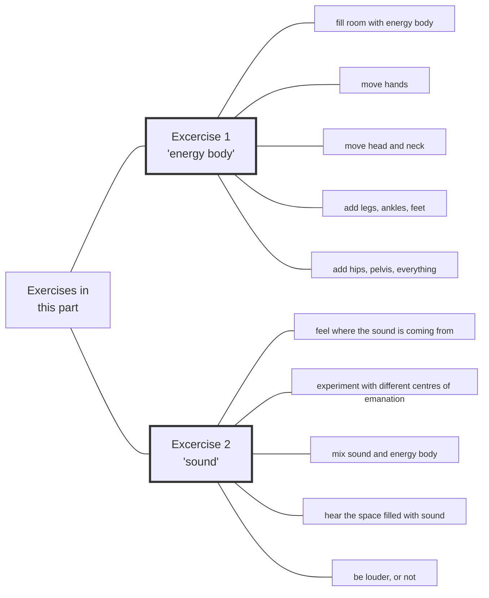

#Talk

 | [[2020 Vajra Music|🡅]] | [[Preliminaries Regarding Voice, Movement, and Gesture - Part 2|🡆 Preliminaries Regarding Voice, Movement, and Gesture - Part 2]]

Series: [[2020 Vajra Music]]
Transcript: [[0301 Preliminaries Regarding Voice, Movement, and Gesture - Part 1]]
Transcript PDF: [[2020_0301 Preliminaries Regarding Voice, Movement, and Gesture - Part 1.pdf]]

<audio controls preload=metadata style=" width:300px;" controlslist="nodownload"><source src="https://dharmaseed.org/talks/62452/20200301-Rob_Burbea-GAIA-preliminaries_regarding_voice_movement_and_gesture_part_1-62452.mp3" type="audio/mpeg">???</audio>

admonitions for structured listening are ==marked==

## Index
_[[Energy Body]] (51) · [[Embodiment]] (30) · [[Meditation]] (24) · [[Soulmaking]] (23) · [[Music]] (21) · [[Soul]] (21) · [[Inertia]] (18) · [[Desire]] (17) · [[Fantasy]] (17) · [[Awareness]] (15) · [[Dharma]] (14) · [[Dukkha]] (14) · [[Love]] (14) · [[Image]] (13) · [[Preliminaries]] (12) · [[Centre]] (11) · [[Conceptual Framework]] (11) · [[Jhanas]] (11) · [[Elitism]] (10) · [[Retreat]] (10) · [[Freedom]] (9) · [[Music#Jazz]] (9) · [[Soulmaking Dynamic]] (8) · [[Energy]] (7) · [[Experience]] (7) · [[Awakening]] (6) · [[Grief]] (6) · [[Beauty]] (5) · [[Passion]] (5) · [[Steadiness]] (5) · [[Active listening]] (4) · [[Four Noble Truths]] (4) · [[History]] (4) · [[Imaginal]] (4) · [[Scientific research]] (4) · [[Emptiness]] (3) · [[Eros]] (3) · [[Conventional reality]] (2) · [[Devotion]] (2) · [[Hearing All Sounds as Mantra]] (2) · [[Mind]] (2) · [[Mindfulness]] (2) · [[Nondualism]] (2) · [[Personhood]] (2) · [[Seeing That Frees]] (2) · [[The Movement of Devotion]] (2) · [[Albert Einstein]] · [[Anatta]] · [[Anthropology]] · [[Blessing]] · [[Breath]] · [[Buddha]] · [[Compassion]] · [[Consciousness]] · [[Death]] · [[Dimensionality]] · [[Engagement and Activism]] · [[Equanimity]] · [[Gaia House]] · [[Infinity]] · [[Insight]] · [[Ludwig van Beethoven]] · [[Mahayana]] · [[Metta]] · [[Orienting to This Jhana Retreat]] · [[Practicing the Jhanas (retreat)]] · [[Rebirth]] · [[Relationships]] · [[Sangha]] · [[Satipatthana Sutta]] · [[Spirituality]] · [[Theravada]] · [[Tibetan Buddhism]] · [[Voice, Movement, and the Possibilities of Soul]]_
 

## Referenced talks
[[Voice, Movement, and the Possibilities of Soul]]
[[The Movement of Devotion]]
[[Hearing All Sounds as Mantra]]
[[Engagement and Activism]]
[[Orienting to This Jhana Retreat]]

## Paragraphs
[[Preliminaries Regarding Voice, Movement, and Gesture - Part 1 -|plain list]]

### Intro

---
##### Time is short, thus these talks
[[0301 Preliminaries Regarding Voice, Movement, and Gesture - Part 1#^1-1|1-1]]

---
##### "Études", Preliminaries"
**[[0301 Preliminaries Regarding Voice, Movement, and Gesture - Part 1#^1-2|1-2]]**: _[[Preliminaries]] (4) · [[Tibetan Buddhism]] · [[Soulmaking]]_

---
##### It's going to be about movement, gesture, and voice
**[[0301 Preliminaries Regarding Voice, Movement, and Gesture - Part 1#^1-3|1-3]]**: _[[Preliminaries]] · [[Embodiment]] (2) · [[Experience]] · [[Soul]] · [[Personhood]] (2) · [[Anthropology]]_
 
---
##### This is a beginning which should be developed
**[[0301 Preliminaries Regarding Voice, Movement, and Gesture - Part 1#^1-4|1-4]]**: _[[Preliminaries]] · [[Embodiment]] · [[History]] · [[Soulmaking]] · [[Soulmaking Dynamic]]_

---
##### Earlier talks 🟢
**[[0301 Preliminaries Regarding Voice, Movement, and Gesture - Part 1#^1-5|1-5]]**: _[[Embodiment]] · [[Meditation]] (2) · [[Voice, Movement, and the Possibilities of Soul]] · [[The Movement of Devotion]]_

---
##### Instructions then were difficult to absorb 🟢
**[[0301 Preliminaries Regarding Voice, Movement, and Gesture - Part 1#^2-1|2-1]]**: _[[Soulmaking]] · [[The Movement of Devotion]] · [[Meditation]] (2) · [[Hearing All Sounds as Mantra]]_

---
##### A lot was going on then
[[0301 Preliminaries Regarding Voice, Movement, and Gesture - Part 1#^2-2|2-2]]

---
##### I'm always in a rush! 😀
**[[0301 Preliminaries Regarding Voice, Movement, and Gesture - Part 1#^2-3|2-3]]**: _[[Engagement and Activism]] · [[Energy Body]] (2) · [[Devotion]] (2) · [[Meditation]] (2) · [[Breath]] · [[Jhanas]] · [[Practicing the Jhanas (retreat)]] · [[Orienting to This Jhana Retreat]] · [[Embodiment]]_

❝

But again, how many people will actually take that out, and extract it, and capitalize on it, and repeat it, isolate it and repeat it as something, as a practice, as a set of instructions that are developable, remains to be seen. 

---
##### ==Make a set of instructions==
**[[0301 Preliminaries Regarding Voice, Movement, and Gesture - Part 1#^3-1|3-1]]**: _[[Sangha]]_

<audio controls preload=metadata style=" width:300px;" controlslist="nodownload"><source src="https://dharmaseed.org/talks/62452/20200301-Rob_Burbea-GAIA-preliminaries_regarding_voice_movement_and_gesture_part_1-62452.mp3#t=09:23" type="audio/mpeg">???</audio>

❝

One could, if one gets really interested in this stuff, go back to all those talks, and listen again, and listen to what's being said in the background, and those instructions that one might miss. Take the material out. Extract it. Write it down. Make a set of instructions. Start practising it. So there's an invitation there. 

Think about that

In which way is this relevant for the Custodians? 

---
##### We need wings to fly in Soulmaking
**[[0301 Preliminaries Regarding Voice, Movement, and Gesture - Part 1#^3-2|3-2]]**: _[[Embodiment]] · [[Preliminaries]] · [[Soulmaking]] (2)_

---
##### What's required may not be obvious at all
**[[0301 Preliminaries Regarding Voice, Movement, and Gesture - Part 1#^3-3|3-3]]**: _[[Freedom]]_

NOTE

simile: Tiny bone in a bird 

---
##### Not central, but indispensable
**[[0301 Preliminaries Regarding Voice, Movement, and Gesture - Part 1#^3-4|3-4]]**: _[[Freedom]] (2) · [[Soulmaking]] (3)_

---
##### Soulmaking Dynamic
**[[0301 Preliminaries Regarding Voice, Movement, and Gesture - Part 1#^3-5|3-5]]**: _[[Soulmaking Dynamic]] (5) · [[Soul]]_

<audio controls preload=metadata style=" width:300px;" controlslist="nodownload"><source src="https://dharmaseed.org/talks/62452/20200301-Rob_Burbea-GAIA-preliminaries_regarding_voice_movement_and_gesture_part_1-62452.mp3#t=13:09" type="audio/mpeg">???</audio>

---
##### Soulmaking wants to include movement, gesture, and voice
**[[0301 Preliminaries Regarding Voice, Movement, and Gesture - Part 1#^4-1|4-1]]**: _[[Soulmaking Dynamic]] (2) · [[Embodiment]] (3)_

---
##### Note that I'm often going too fast
**[[0301 Preliminaries Regarding Voice, Movement, and Gesture - Part 1#^4-2|4-2]]**: _[[Retreat]]_

---
### Condensing
##### ==Is it possible to listen more actively?==
[[0301 Preliminaries Regarding Voice, Movement, and Gesture - Part 1#^4-3|4-3]]

<audio controls preload=metadata style=" width:300px;" controlslist="nodownload"><source src="https://dharmaseed.org/talks/62452/20200301-Rob_Burbea-GAIA-preliminaries_regarding_voice_movement_and_gesture_part_1-62452.mp3#t=17:00" type="audio/mpeg">???</audio>

❝

But still, when you listen to this, this set of talks, when you listen to talks that have already been given - maybe by me; maybe by another teacher - is it possible to <i>think</i> about listening more actively? 

---
##### ==Actively extract meditations, excercises, from what's being said==
[[0301 Preliminaries Regarding Voice, Movement, and Gesture - Part 1#^4-4|4-4]]

Think about that

In which way is this relevant for the Custodians? 

---
##### ==Actively extract larger principles==
**[[0301 Preliminaries Regarding Voice, Movement, and Gesture - Part 1#^4-5|4-5]]**: _[[Conceptual Framework]] · [[History]]_

---
##### Example: the concept of "inertia"
**[[0301 Preliminaries Regarding Voice, Movement, and Gesture - Part 1#^5-1|5-1]]**: _[[Meditation]] · [[Retreat]] (2) · [[Gaia House]] · [[Jhanas]] (2) · [[Inertia]] (5) · [[Dharma]] · [[Mind]]_

Interesting

see below, inertia is an important concept 

---
##### Listening to talks together
**[[0301 Preliminaries Regarding Voice, Movement, and Gesture - Part 1#^5-2|5-2]]**: _[[Meditation]] (2)_

<audio controls preload=metadata style=" width:300px;" controlslist="nodownload"><source src="https://dharmaseed.org/talks/62452/20200301-Rob_Burbea-GAIA-preliminaries_regarding_voice_movement_and_gesture_part_1-62452.mp3#t=21:14" type="audio/mpeg">???</audio>

NOTE

Could that be a routine agenda topic in the HAF yogis meetings? 

---
##### Receptive listening tills the soil of the soul
**[[0301 Preliminaries Regarding Voice, Movement, and Gesture - Part 1#^5-3|5-3]]**: _[[Active listening]] (3) · [[Soul]] (2) · [[Retreat]]_

---
##### Seeing That Frees is often read too fast, without doing the practices
**[[0301 Preliminaries Regarding Voice, Movement, and Gesture - Part 1#^5-4|5-4]]**: _[[Seeing That Frees]] · [[Mind]] · [[Inertia]] (5) · [[Active listening]]_

---
##### Listening with blinders on
**[[0301 Preliminaries Regarding Voice, Movement, and Gesture - Part 1#^6-1|6-1]]**: _[[Inertia]]_

---
##### Listening is automatically sifting for significance
**[[0301 Preliminaries Regarding Voice, Movement, and Gesture - Part 1#^6-2|6-2]]**: _[[Soul]] (2) · [[Consciousness]]_

---
##### So be careful that topics might be not central but still are significant
**[[0301 Preliminaries Regarding Voice, Movement, and Gesture - Part 1#^6-3|6-3]]**: _[[Soulmaking]] · [[Imaginal]] · [[Image]] (4)_

---
##### Wisely assessing significance is hard
**[[0301 Preliminaries Regarding Voice, Movement, and Gesture - Part 1#^6-4|6-4]]**: _[[Imaginal]] (2) · [[Image]] (3)_

---
##### ==Structural listening==
**[[0301 Preliminaries Regarding Voice, Movement, and Gesture - Part 1#^7-1|7-1]]**: _[[Dharma]] (2) · [[Seeing That Frees]] · [[Conceptual Framework]] (7) · [[Insight]] · [[Soulmaking]] · [[Emptiness]] · [[Conventional reality]] (2)_

❝

What would it be to listen or read _for_ and _from_ the whole conceptual framework? I'm listening _for_, or I'm reading _for_, to get a sense of, what is the whole conceptual framework. And then, when I think I have that, I'm listening _from_ the perspective of the whole conceptual framework. And that listening _from_ an understanding of the whole conceptual framework, holding it there, it frames my listening... 

---
##### Because I understand where things are and how they work, I can find them a lot easier
**[[0301 Preliminaries Regarding Voice, Movement, and Gesture - Part 1#^7-2|7-2]]**: _[[Conceptual Framework]] (2)_

---
##### Inquiry into inertia is important
**[[0301 Preliminaries Regarding Voice, Movement, and Gesture - Part 1#^7-3|7-3]]**: _[[Inertia]] (6) · [[Meditation]] · [[Steadiness]]_

---
##### Where's the inertia?
**[[0301 Preliminaries Regarding Voice, Movement, and Gesture - Part 1#^7-3|7-3]]**: _[[Inertia]] (6) · [[Meditation]] · [[Steadiness]]_

❝

Now, I would say that that inquiry into inertia, even though we're not really going into it at the moment [laughs] - again, I'm postponing it, or just mentioning it; I don't know if I'll ever get back to it - I would actually say that's _more_ important as a teaching, as an inquiry, structurally it's more important, at the meta-level it's more important than anything else that I might say in this set of talks about movement and gesture or anything else. 

---
##### (Liberation of) sustained desire is needed to a goal
**[[0301 Preliminaries Regarding Voice, Movement, and Gesture - Part 1#^8-1|8-1]]**: _[[Jhanas]] (4) · [[Retreat]] · [[Desire]] (7)_

---
##### We can't help to move in the domain of my desires
**[[0301 Preliminaries Regarding Voice, Movement, and Gesture - Part 1#^8-2|8-2]]**: _[[Jhanas]] (3) · [[Desire]] (2) · [[Meditation]] (2) · [[Freedom]] (2) · [[Inertia]]_

<audio controls preload=metadata style=" width:300px;" controlslist="nodownload"><source src="https://dharmaseed.org/talks/62452/20200301-Rob_Burbea-GAIA-preliminaries_regarding_voice_movement_and_gesture_part_1-62452.mp3#t=36:30" type="audio/mpeg">???</audio>

---
### "Why?
##### The "why" of these excercies is related to the "why" of practice in general
[[0301 Preliminaries Regarding Voice, Movement, and Gesture - Part 1#^8-3|8-3]]

---
##### The "why" (images and fantasies) will always have consequences
**[[0301 Preliminaries Regarding Voice, Movement, and Gesture - Part 1#^8-4|8-4]]**: _[[Passion]] · [[Fantasy]] (8) · [[Dharma]] (3) · [[Awakening]] · [[Image]] (2) · [[Meditation]]_

---
##### Do we want to unlimit them, if they're limited in an unhelpful way?
**[[0301 Preliminaries Regarding Voice, Movement, and Gesture - Part 1#^9-1|9-1]]**: _[[Fantasy]] (3) · [[Awakening]]_

---
##### "My husband doesn't need to meditate" (i.e. is already calm)
**[[0301 Preliminaries Regarding Voice, Movement, and Gesture - Part 1#^9-2|9-2]]**: _[[Retreat]] (2)_

---
##### That's a limited idea
**[[0301 Preliminaries Regarding Voice, Movement, and Gesture - Part 1#^9-3|9-3]]**: _[[Steadiness]] (2) · [[Meditation]] (3) · [[Retreat]] (2)_

---
##### It maybe would not be if it was a thoroughly investgated view
**[[0301 Preliminaries Regarding Voice, Movement, and Gesture - Part 1#^9-4|9-4]]**: _[[Meditation]] (2) · [[Emptiness]] · [[Awareness]] · [[Freedom]] · [[Retreat]]_

---
##### So "doesn't need to" might be a valid statement
**[[0301 Preliminaries Regarding Voice, Movement, and Gesture - Part 1#^9-5|9-5]]**: _[[Metta]] · [[Compassion]] · [[Love]] · [[Equanimity]] · [[Mindfulness]] (2) · [[Experience]] (3)_

<audio controls preload=metadata style=" width:300px;" controlslist="nodownload"><source src="https://dharmaseed.org/talks/62452/20200301-Rob_Burbea-GAIA-preliminaries_regarding_voice_movement_and_gesture_part_1-62452.mp3#t=45:04" type="audio/mpeg">???</audio>

---
##### But imagine a musician who doesn't need to make music
**[[0301 Preliminaries Regarding Voice, Movement, and Gesture - Part 1#^10-1|10-1]]**: _[[Music]] (2) · [[Fantasy]] (3) · [[Scientific research]] (3) · [[Love]] (5) · [[Soul]]_

---
##### Inexhausibilities of those needs
**[[0301 Preliminaries Regarding Voice, Movement, and Gesture - Part 1#^10-2|10-2]]**: _[[Beauty]] (2) · [[Love]] · [[Music]] (4) · [[Infinity]] · [[Soul]] (2) · [[Scientific research]]_

---
##### It's not something that there's an end to
**[[0301 Preliminaries Regarding Voice, Movement, and Gesture - Part 1#^10-3|10-3]]**: _[[Steadiness]] · [[Music]] · [[Passion]] · [[Love]] (2) · [[Beauty]] (2) · [[Eros]] (2) · [[Soul]] (2) · [[Meditation]] · [[Experience]]_

---
##### The desire itself is beautiful
**[[0301 Preliminaries Regarding Voice, Movement, and Gesture - Part 1#^11-1|11-1]]**: _[[Dukkha]] (2) · [[Steadiness]] · [[Awareness]] · [[Anatta]] · [[Albert Einstein]] · [[Ludwig van Beethoven]] · [[Desire]] (4) · [[Beauty]] · [[Blessing]]_

---
### Fantasy of the Self and the Path
##### This relates to the fantasy of the self and the path
**[[0301 Preliminaries Regarding Voice, Movement, and Gesture - Part 1#^11-2|11-2]]**: _[[Fantasy]] · [[Dharma]] · [[Image]]_

<audio controls preload=metadata style=" width:300px;" controlslist="nodownload"><source src="https://dharmaseed.org/talks/62452/20200301-Rob_Burbea-GAIA-preliminaries_regarding_voice_movement_and_gesture_part_1-62452.mp3#t=52:29" type="audio/mpeg">???</audio>

---
##### "Just don't struggle"
**[[0301 Preliminaries Regarding Voice, Movement, and Gesture - Part 1#^11-3|11-3]]**: _[[Dharma]] (6) · [[Fantasy]] · [[Awakening]] · [[Freedom]] · [[Nondualism]] · [[Meditation]]_

---
##### "Don't deal with concepts"
**[[0301 Preliminaries Regarding Voice, Movement, and Gesture - Part 1#^11-4|11-4]]**: _[[Nondualism]] · [[Conceptual Framework]] · [[Spirituality]]_

❝

Then out of that comes a kind of mode of practising - effectively a technique (although one tries to think of it as _not_ a technique, because one isn't struggling, or supposedly not struggling and doing, and not thinking, etc., and it's non-dual). The idea is that it's open, but actually, it ends up being very closed, because we've cut off a bunch of possibilities... 

---
##### There can be very little art when we are doing very little
**[[0301 Preliminaries Regarding Voice, Movement, and Gesture - Part 1#^11-5|11-5]]**: _[[Fantasy]] · [[Image]] · [[Awakening]]_

---
##### Soulmaking is elitist
**[[0301 Preliminaries Regarding Voice, Movement, and Gesture - Part 1#^12-1|12-1]]**: _[[Soulmaking]] (3) · [[Dharma]] · [[Emptiness]] · [[Preliminaries]] (2) · [[Dimensionality]] · [[Elitism]] (4) · [[Music]] · [[Image]] · [[Jhanas]] · [[Awakening]] · [[Dukkha]] (3)_

<audio controls preload=metadata style=" width:300px;" controlslist="nodownload"><source src="https://dharmaseed.org/talks/62452/20200301-Rob_Burbea-GAIA-preliminaries_regarding_voice_movement_and_gesture_part_1-62452.mp3#t=56:44" type="audio/mpeg">???</audio>

---
##### The legacy of the Four Noble Truths
**[[0301 Preliminaries Regarding Voice, Movement, and Gesture - Part 1#^12-2|12-2]]**: _[[Four Noble Truths]] (2) · [[Dukkha]] (4) · [[Freedom]] · [[Rebirth]]_

❝

what does a reduction in suffering actually _mean_? And what does it look like? And how noticeable is it at different levels? 

---
##### "Suffering" is not universally applicable to everyone and everything
**[[0301 Preliminaries Regarding Voice, Movement, and Gesture - Part 1#^12-3|12-3]]**: _[[Four Noble Truths]] (2) · [[Dukkha]] (3) · [[Theravada]] · [[Mahayana]]_

---
### Music and Soul-Grief
##### "Elitist" means to have the desire to play at the highest, deepest, freest levels
**[[0301 Preliminaries Regarding Voice, Movement, and Gesture - Part 1#^12-4|12-4]]**: _[[Music]] (4) · [[Desire]] (3) · [[Elitism]]_

---
##### There is no problem with being elitist
**[[0301 Preliminaries Regarding Voice, Movement, and Gesture - Part 1#^13-1|13-1]]**: _[[Elitism]] (5) · [[Music]] · [[Awakening]] · [[Dukkha]] (2)_

---
##### Example: Rob playing the Jazz guitar
**[[0301 Preliminaries Regarding Voice, Movement, and Gesture - Part 1#^13-2|13-2]]**: _[[Music]] (2) · [[History]] · [[Music#Jazz]] (6) · [[Energy]]_

<audio controls preload=metadata style=" width:300px;" controlslist="nodownload"><source src="https://dharmaseed.org/talks/62452/20200301-Rob_Burbea-GAIA-preliminaries_regarding_voice_movement_and_gesture_part_1-62452.mp3#t=01:03:48" type="audio/mpeg">???</audio>

❝

Learning to improvise jazz guitar, improvising jazz guitar, it's a lot of different skills and arts. It's not one thing. It's many, many. And again, it's just open-ended and it's infinite in the possibilities there. 

---
##### Sudden growth of ability
**[[0301 Preliminaries Regarding Voice, Movement, and Gesture - Part 1#^13-3|13-3]]**: _[[Love]] (3) · [[Music]] (2) · [[Eros]] · [[Freedom]]_

comes out of
- love
- listing
- playing
- practicing 

---
##### Soul-grief from not practicing being fluid
**[[0301 Preliminaries Regarding Voice, Movement, and Gesture - Part 1#^14-1|14-1]]**: _[[Death]] · [[Grief]] (4) · [[Relationships]] · [[Soul]] (3) · [[Music#Jazz]]_

[[Preliminaries Regarding Voice, Movement, and Gesture - Part 2#With regard to the grief there were plenty of things within jazz that I figured out on my own soul-grief]]

---
##### Fluidity wasn't taught then
**[[0301 Preliminaries Regarding Voice, Movement, and Gesture - Part 1#^14-2|14-2]]**: _[[Music#Jazz]] · [[Music]] · [[History]]_

---
##### It was not enabled to become fully physically manifest
**[[0301 Preliminaries Regarding Voice, Movement, and Gesture - Part 1#^14-3|14-3]]**: _[[Grief]] (2) · [[Desire]] · [[Passion]] (3) · [[Music]] · [[Meditation]] (2)_

---
##### There is hope that practice opens possibilities
**[[0301 Preliminaries Regarding Voice, Movement, and Gesture - Part 1#^15-1|15-1]]**: _[[Music#Jazz]] · [[Meditation]] · [[Soulmaking]] (5) · [[Soul]] (3) · [[Love]] (2)_

<audio controls preload=metadata style=" width:300px;" controlslist="nodownload"><source src="https://dharmaseed.org/talks/62452/20200301-Rob_Burbea-GAIA-preliminaries_regarding_voice_movement_and_gesture_part_1-62452.mp3#t=01:13:44" type="audio/mpeg">???</audio>

Check

Unclear what he is pointing to in this paragraph 

---
##### Some of you will be Soulmaking musicians
**[[0301 Preliminaries Regarding Voice, Movement, and Gesture - Part 1#^15-2|15-2]]**: _[[Music]] (2) · [[Soulmaking]] (3) · [[Soul]] (4)_

### Excercises
##### Five excercises
**[[0301 Preliminaries Regarding Voice, Movement, and Gesture - Part 1#^15-3|15-3]]**: _[[Soulmaking]] · [[Experience]]_

---
##### There are a lot of variations
**[[0301 Preliminaries Regarding Voice, Movement, and Gesture - Part 1#^15-4|15-4]]**: _[[Preliminaries]] (3) · [[Soulmaking]]_

#### Excercise 1
##### Excercise 1 can be done with the physical  or with the energy body
**[[0301 Preliminaries Regarding Voice, Movement, and Gesture - Part 1#^15-5|15-5]]**: _[[Embodiment]] (3) · [[Energy Body]] (3)_

---
##### Excercise 1 can be done in 4 postures
**[[0301 Preliminaries Regarding Voice, Movement, and Gesture - Part 1#^16-1|16-1]]**: _[[Energy Body]] (3) · [[Satipatthana Sutta]]_

---
##### Excercise 1 has 5 parts
[[0301 Preliminaries Regarding Voice, Movement, and Gesture - Part 1#^16-3|16-3]]

<audio controls preload=metadata style=" width:300px;" controlslist="nodownload"><source src="https://dharmaseed.org/talks/62452/20200301-Rob_Burbea-GAIA-preliminaries_regarding_voice_movement_and_gesture_part_1-62452.mp3#t=01:19:50" type="audio/mpeg">???</audio>

---
##### 🟡 Excercise 1.1: fill the room with the energy body
**[[0301 Preliminaries Regarding Voice, Movement, and Gesture - Part 1#^16-4|16-4]]**: _[[Energy Body]] (6) · [[Embodiment]]_

---
##### It's about sensitivity
**[[0301 Preliminaries Regarding Voice, Movement, and Gesture - Part 1#^16-5|16-5]]**: _[[Experience]] · [[Energy Body]] (4)_

---
##### 🟡 Excercise 1.2: move hands and feel it in the energy body
**[[0301 Preliminaries Regarding Voice, Movement, and Gesture - Part 1#^16-6|16-6]]**: _[[Energy Body]] (2) · [[Energy]] · [[Embodiment]]_

---
##### The kinaesthetic sense of energy fills the whole space
**[[0301 Preliminaries Regarding Voice, Movement, and Gesture - Part 1#^17-1|17-1]]**: _[[Awareness]] (5) · [[Energy Body]] (4) · [[Energy]] (3) · [[Embodiment]]_

Reminder

- can be done physically or just in the imagination, but both with the energy body 
- remember to vary the postures 

❝

We're talking about an energy body sense - expanding, moving, and feeling, sensing and imagining not just the space of the energy body in its usual size, but also the extended sense of the energy in the room, and how that's connected with and impacted by and filled by the energy of your body movements. It's more than just the space of awareness. We're talking about energy body sensitivity here 

---
##### 🟡 Excercise 1.3: move head and neck
**[[0301 Preliminaries Regarding Voice, Movement, and Gesture - Part 1#^17-2|17-2]]**: _[[Awareness]]_

NOTE

yet another variation: move only hands then only head, or do things cumulative 

❝

the sensitivity, the imagination, the projection, the inhabiting, the filling of the space 

---
##### 🟡 Excercise 1.4: add legs, feet, ankles
**[[0301 Preliminaries Regarding Voice, Movement, and Gesture - Part 1#^17-3|17-3]]**: _[[Embodiment]]_

---
##### 🟡 Excercise 1.5: add hips, pelvis, everything
**[[0301 Preliminaries Regarding Voice, Movement, and Gesture - Part 1#^17-4|17-4]]**: _[[Embodiment]] (2)_

---
##### let the energy body project to fill the space
**[[0301 Preliminaries Regarding Voice, Movement, and Gesture - Part 1#^17-5|17-5]]**: _[[Energy Body]] (4)_

<audio controls preload=metadata style=" width:300px;" controlslist="nodownload"><source src="https://dharmaseed.org/talks/62452/20200301-Rob_Burbea-GAIA-preliminaries_regarding_voice_movement_and_gesture_part_1-62452.mp3#t=01:26:37" type="audio/mpeg">???</audio>

---
##### Variation: start with slow movements, then faster
[[0301 Preliminaries Regarding Voice, Movement, and Gesture - Part 1#^17-6|17-6]]

NOTE

It's about: 
- sensitivity 
- capacity to project 

---
##### Faster is much more tricky to maintain
[[0301 Preliminaries Regarding Voice, Movement, and Gesture - Part 1#^18-1|18-1]]

NOTE

Is this excercise compatible with a all-around-the-day practice? What would be needed to maintain the sense of the energy body, in varying projections (near and far)? 

#### Excercise 2
##### Voice excercise (again: physical or imagined)
**[[0301 Preliminaries Regarding Voice, Movement, and Gesture - Part 1#^18-3|18-3]]**: _[[Energy Body]] (2) · [[Image]]_

<audio controls preload=metadata style=" width:300px;" controlslist="nodownload"><source src="https://dharmaseed.org/talks/62452/20200301-Rob_Burbea-GAIA-preliminaries_regarding_voice_movement_and_gesture_part_1-62452.mp3#t=01:28:43" type="audio/mpeg">???</audio>

---
##### long notes, full range
[[0301 Preliminaries Regarding Voice, Movement, and Gesture - Part 1#^18-4|18-4]]

---
##### 🟡 Excercise 2.1: Feel where the sound is coming from, against energy body background
**[[0301 Preliminaries Regarding Voice, Movement, and Gesture - Part 1#^18-5|18-5]]**: _[[Embodiment]] (4) · [[Centre]] (5) · [[Energy Body]] (4)_

---
##### 🟡 Excercise 2.2: experiment with different centres of emanation
**[[0301 Preliminaries Regarding Voice, Movement, and Gesture - Part 1#^18-6|18-6]]**: _[[Energy Body]] (3) · [[Embodiment]] (4) · [[Centre]] (4)_

❝

... the whole range becomes more evenly available, that the sound that you're sounding, that the body is sounding, can emanate full-bloodedly, full-bodiedly, with full presence and full _oomph_ from any place in the body, and you're comfortable. 

---
##### Energy body as centre of emanating
**[[0301 Preliminaries Regarding Voice, Movement, and Gesture - Part 1#^19-1|19-1]]**: _[[Hearing All Sounds as Mantra]] · [[Meditation]] · [[Energy Body]] (2) · [[Embodiment]]_

---
##### 🟡 Excercise 2.3: mix sound and energy body
**[[0301 Preliminaries Regarding Voice, Movement, and Gesture - Part 1#^19-2|19-2]]**: _[[Energy Body]] (4) · [[Buddha]]_

---
##### 🟡 Excercise 2.4: hear the space filled with sound
**[[0301 Preliminaries Regarding Voice, Movement, and Gesture - Part 1#^19-3|19-3]]**: _[[Awareness]] (4) · [[Energy Body]] (2) · [[Energy]] · [[Imaginal]]_

---
##### 🟡 Excercise 2.5: be louder, or not
**[[0301 Preliminaries Regarding Voice, Movement, and Gesture - Part 1#^19-4|19-4]]**: _[[Energy Body]]_

---
##### Summary of the excercises
**[[0301 Preliminaries Regarding Voice, Movement, and Gesture - Part 1#^20-1|20-1]]**: _[[Energy Body]] (5) · [[Embodiment]] (3) · [[Centre]] (2) · [[Awareness]] (3) · [[Energy]]_

<audio controls preload=metadata style=" width:300px;" controlslist="nodownload"><source src="https://dharmaseed.org/talks/62452/20200301-Rob_Burbea-GAIA-preliminaries_regarding_voice_movement_and_gesture_part_1-62452.mp3#t=01:39:23" type="audio/mpeg">???</audio>

---
##### The excercises are relatively simple, but still really worth doing
[[0301 Preliminaries Regarding Voice, Movement, and Gesture - Part 1#^20-2|20-2]]
