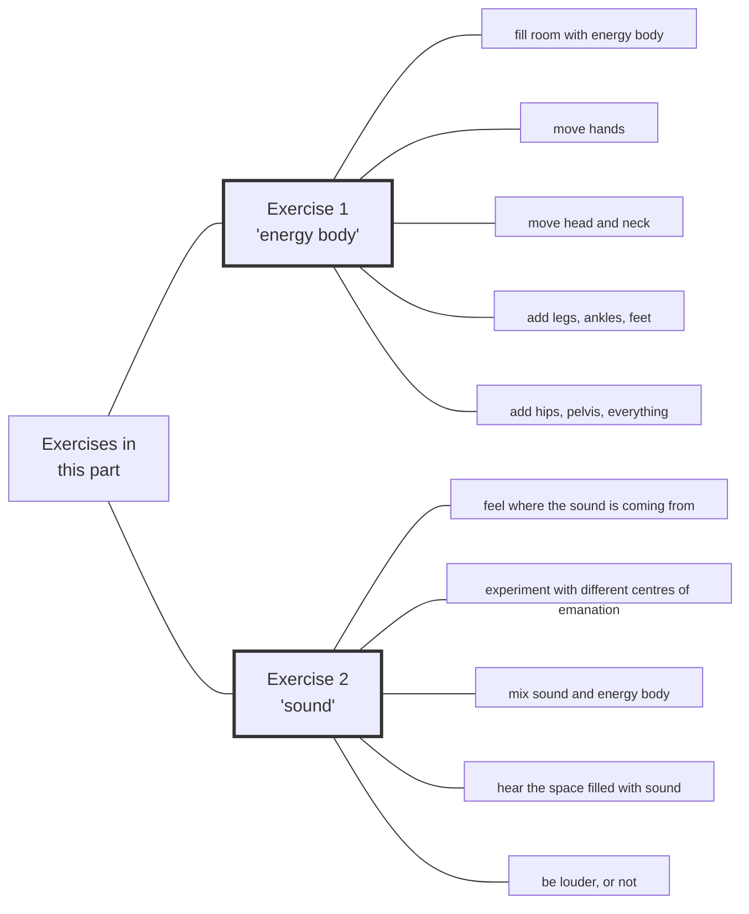

#Talk

 | [[2020 Vajra Music|🡅]] | [[Preliminaries Regarding Voice, Movement, and Gesture - Part 2|🡆 Preliminaries Regarding Voice, Movement, and Gesture - Part 2]]

Series: [[2020 Vajra Music]]
Transcript: [[0301 Preliminaries Regarding Voice, Movement, and Gesture - Part 1]]
Transcript PDF: [[2020_0301 Preliminaries Regarding Voice, Movement, and Gesture - Part 1.pdf]]

<audio controls preload=metadata style=" width:300px;" controlslist="nodownload"><source src="https://dharmaseed.org/talks/62452/20200301-Rob_Burbea-GAIA-preliminaries_regarding_voice_movement_and_gesture_part_1-62452.mp3" type="audio/mpeg">???</audio>

admonitions for structured listening are ==marked==

## Index
_<a data-href="Energy body" class="internal-link">Energy body</a> (51) · <a data-href="Embodiment" class="internal-link">Embodiment</a> (30) · <a data-href="Meditation" class="internal-link">Meditation</a> (24) · <a data-href="Soulmaking" class="internal-link">Soulmaking</a> (23) · <a data-href="Music" class="internal-link">Music</a> (21) · <a data-href="Soul" class="internal-link">Soul</a> (21) · <a data-href="Inertia" class="internal-link">Inertia</a> (18) · <a data-href="Desire" class="internal-link">Desire</a> (17) · <a data-href="Fantasy" class="internal-link">Fantasy</a> (17) · <a data-href="Awareness" class="internal-link">Awareness</a> (15) · <a data-href="Dharma" class="internal-link">Dharma</a> (14) · <a data-href="Dukkha" class="internal-link">Dukkha</a> (14) · <a data-href="Love" class="internal-link">Love</a> (14) · <a data-href="Image" class="internal-link">Image</a> (13) · <a data-href="Jhanas" class="internal-link">Jhanas</a> (12) · <a data-href="Preliminaries" class="internal-link">Preliminaries</a> (12) · <a data-href="Centre" class="internal-link">Centre</a> (11) · <a data-href="Conceptual framework" class="internal-link">Conceptual framework</a> (11) · <a data-href="Retreat" class="internal-link">Retreat</a> (11) · <a data-href="Elitism" class="internal-link">Elitism</a> (10) · <a data-href="Freedom" class="internal-link">Freedom</a> (9) · <a aria-label-position="top" aria-label="Music > Jazz" data-href="Music#Jazz" class="internal-link">Music &gt; Jazz</a> (9) · <a data-href="Soulmaking dynamic" class="internal-link">Soulmaking dynamic</a> (8) · <a data-href="Energy" class="internal-link">Energy</a> (7) · <a data-href="Experience" class="internal-link">Experience</a> (7) · <a data-href="Awakening" class="internal-link">Awakening</a> (6) · <a data-href="Grief" class="internal-link">Grief</a> (6) · <a data-href="Beauty" class="internal-link">Beauty</a> (5) · <a data-href="Passion" class="internal-link">Passion</a> (5) · <a data-href="Steadiness" class="internal-link">Steadiness</a> (5) · <a data-href="Active listening" class="internal-link">Active listening</a> (4) · <a data-href="Four Noble Truths" class="internal-link">Four Noble Truths</a> (4) · <a data-href="History" class="internal-link">History</a> (4) · <a data-href="Imaginal" class="internal-link">Imaginal</a> (4) · <a data-href="Scientific research" class="internal-link">Scientific research</a> (4) · <a data-href="Emptiness" class="internal-link">Emptiness</a> (3) · <a data-href="Eros" class="internal-link">Eros</a> (3) · <a data-href="Conventional reality" class="internal-link">Conventional reality</a> (2) · <a data-href="Devotion" class="internal-link">Devotion</a> (2) · <a data-href="Hearing All Sounds as Mantra" class="internal-link">Hearing All Sounds as Mantra</a> (2) · <a data-href="Mind" class="internal-link">Mind</a> (2) · <a data-href="Mindfulness" class="internal-link">Mindfulness</a> (2) · <a data-href="Nondualism" class="internal-link">Nondualism</a> (2) · <a data-href="Personhood" class="internal-link">Personhood</a> (2) · <a data-href="Seeing That Frees" class="internal-link">Seeing That Frees</a> (2) · <a data-href="The Movement of Devotion" class="internal-link">The Movement of Devotion</a> (2) · <a data-href="Albert Einstein" class="internal-link">Albert Einstein</a> · <a data-href="Anatta" class="internal-link">Anatta</a> · <a data-href="Anthropology" class="internal-link">Anthropology</a> · <a data-href="Blessing" class="internal-link">Blessing</a> · <a data-href="Breath" class="internal-link">Breath</a> · <a data-href="Buddha" class="internal-link">Buddha</a> · <a data-href="Compassion" class="internal-link">Compassion</a> · <a data-href="Consciousness" class="internal-link">Consciousness</a> · <a data-href="Death" class="internal-link">Death</a> · <a data-href="Dimensionality" class="internal-link">Dimensionality</a> · <a data-href="Engagement and Activism" class="internal-link">Engagement and Activism</a> · <a data-href="Equanimity" class="internal-link">Equanimity</a> · <a data-href="Gaia House" class="internal-link">Gaia House</a> · <a data-href="Infinity" class="internal-link">Infinity</a> · <a data-href="Insight" class="internal-link">Insight</a> · <a data-href="Ludwig van Beethoven" class="internal-link">Ludwig van Beethoven</a> · <a data-href="Mahayana" class="internal-link">Mahayana</a> · <a data-href="Metta" class="internal-link">Metta</a> · <a data-href="Practicing the Jhanas (retreat)" class="internal-link">Practicing the Jhanas (retreat)</a> · <a data-href="Rebirth" class="internal-link">Rebirth</a> · <a data-href="Relationships" class="internal-link">Relationships</a> · <a data-href="Sangha" class="internal-link">Sangha</a> · <a data-href="Satipatthana Sutta" class="internal-link">Satipatthana Sutta</a> · <a data-href="Spirituality" class="internal-link">Spirituality</a> · <a data-href="Theravada" class="internal-link">Theravada</a> · <a data-href="Tibetan Buddhism" class="internal-link">Tibetan Buddhism</a> · <a data-href="Voice, Movement, and the Possibilities of Soul" class="internal-link">Voice, Movement, and the Possibilities of Soul</a>_
 

## Referenced talks
<a data-href="Voice, Movement, and the Possibilities of Soul" class="internal-link">Voice, Movement, and the Possibilities of Soul</a>
<a data-href="The Movement of Devotion" class="internal-link">The Movement of Devotion</a>
<a data-href="Hearing All Sounds as Mantra" class="internal-link">Hearing All Sounds as Mantra</a>
<a data-href="Engagement and Activism" class="internal-link">Engagement and Activism</a>
[[Orienting to This Jhana Retreat]]

## Paragraphs
[[Preliminaries Regarding Voice, Movement, and Gesture - Part 1 -|plain list]]

### Intro

##### Time is short, thus these talks
<a aria-label-position="top" aria-label="0301 Preliminaries Regarding Voice, Movement, and Gesture - Part 1 > ^1-1" data-href="0301 Preliminaries Regarding Voice, Movement, and Gesture - Part 1#^1-1" class="internal-link">1-1</a>
Hello, everyone. There are a few things I would like to offer, so I'm making this recording, these recordings. I think usually I would probably have waited a little longer to (1) gather a little more material around these topics, and (2) to just hope that I felt a little bit more capable physically and mentally. But despite the difficulties, I think it's probably wiser not to wait, and just take this window of opportunity as it presents itself right now, as I don't know what the future will bring.

---
##### "Études", Preliminaries"
**<a aria-label-position="top" aria-label="0301 Preliminaries Regarding Voice, Movement, and Gesture - Part 1 > ^1-2" data-href="0301 Preliminaries Regarding Voice, Movement, and Gesture - Part 1#^1-2" class="internal-link">1-2</a>**: _<a data-href="Preliminaries" class="internal-link">Preliminaries</a> (4) · <a data-href="Tibetan Buddhism" class="internal-link">Tibetan Buddhism</a> · <a data-href="Soulmaking" class="internal-link">Soulmaking</a>_
So a few things I wanted to offer. And really, mostly they're kind of exercises. That's the way I'm thinking about them, like _études_, or exercises, or <a data-href="preliminaries" class="internal-link">preliminaries</a>, if you know that word that's used in <a aria-label-position="top" aria-label="Tibetan Buddhism" data-href="Tibetan Buddhism" class="internal-link">Tibetan Buddhist</a> circles - preliminary exercises, <a aria-label-position="top" aria-label="Preliminaries" data-href="Preliminaries" class="internal-link">preliminary trainings</a>, <a aria-label-position="top" aria-label="Preliminaries" data-href="Preliminaries" class="internal-link">preliminary requirements</a>, <a aria-label-position="top" aria-label="Preliminaries" data-href="Preliminaries" class="internal-link">preliminary developments</a>. Of course, it's a little strange, however many years we are into unfolding the <a aria-label-position="top" aria-label="Soulmaking" data-href="Soulmaking" class="internal-link">soulmaking teachings</a>, to start now putting out, beginning to accrue a set of preliminary exercises, but the teachings have grown very organically and, as we grow, we kind of recognize, "Ah, this is needed. That's needed. This is what we need to add here." So, it doesn't matter. Anyway.

---
##### It's going to be about movement, gesture, and voice
**<a aria-label-position="top" aria-label="0301 Preliminaries Regarding Voice, Movement, and Gesture - Part 1 > ^1-3" data-href="0301 Preliminaries Regarding Voice, Movement, and Gesture - Part 1#^1-3" class="internal-link">1-3</a>**: _<a data-href="Preliminaries" class="internal-link">Preliminaries</a> · <a data-href="Embodiment" class="internal-link">Embodiment</a> (2) · <a data-href="Experience" class="internal-link">Experience</a> · <a data-href="Soul" class="internal-link">Soul</a> · <a data-href="Personhood" class="internal-link">Personhood</a> (2) · <a data-href="Anthropology" class="internal-link">Anthropology</a>_
I'd like to offer some, what we might call '<a data-href="preliminaries" class="internal-link">preliminaries</a>,' some exercises. Primarily, these exercises involve, centre around, movement and gesture. So the <a aria-label-position="top" aria-label="Embodiment" data-href="Embodiment" class="internal-link">physical body</a>, in movement and gesture, or the <a aria-label-position="top" aria-label="Experience" data-href="Experience" class="internal-link">bodily experience</a>, let's say, in movement and gesture, _and_ voice. <a aria-label-position="top" aria-label="Embodiment" data-href="Embodiment" class="internal-link">Movement, gesture, and voice</a>. And woven into that, hopefully, I'd like to kind of include some thoughts and teachings about <a data-href="soul" class="internal-link">soul</a>, about <a data-href="personhood" class="internal-link">personhood</a>, and about <a aria-label-position="top" aria-label="Personhood" data-href="Personhood" class="internal-link">human being</a> - <a data-href="anthropology" class="internal-link">anthropology</a>, if you like - as it's very much woven into the way we're thinking about all this.
 
---
##### This is a beginning which should be developed
**<a aria-label-position="top" aria-label="0301 Preliminaries Regarding Voice, Movement, and Gesture - Part 1 > ^1-4" data-href="0301 Preliminaries Regarding Voice, Movement, and Gesture - Part 1#^1-4" class="internal-link">1-4</a>**: _<a data-href="Preliminaries" class="internal-link">Preliminaries</a> · <a data-href="Embodiment" class="internal-link">Embodiment</a> · <a data-href="History" class="internal-link">History</a> · <a data-href="Soulmaking" class="internal-link">Soulmaking</a> · <a data-href="Soulmaking dynamic" class="internal-link">Soulmaking dynamic</a>_
So, <a data-href="preliminaries" class="internal-link">preliminaries</a> at this stage of development, of the growth, the organic growth of the teachings. This is a beginning, and a beginning, at least, to this offering of this. Whatever I will offer in these talks is a beginning that can hopefully be developed. It _should_ be developed. It will naturally, _should_ naturally evoke, suggest, elicit development. And hopefully that development will be very discerning, congruent, sensitive, appropriate, intelligent. <a aria-label-position="top" aria-label="Embodiment" data-href="Embodiment" class="internal-link">Movement, gesture, voice</a> - these are huge areas, and we can add all kinds of things willy-nilly, just because we like it, or we have a <a data-href="history" class="internal-link">history</a> there, or it makes us feel good or whatever. But hopefully these kinds of exercises can be added to, and can be developed. Naturally, this is the way of <a data-href="soulmaking" class="internal-link">soulmaking</a>, of things that get swept up into the <a data-href="soulmaking dynamic" class="internal-link">soulmaking dynamic</a>: they _will_ develop. They have to develop.

---
##### Earlier talks 🟢
**<a aria-label-position="top" aria-label="0301 Preliminaries Regarding Voice, Movement, and Gesture - Part 1 > ^1-5" data-href="0301 Preliminaries Regarding Voice, Movement, and Gesture - Part 1#^1-5" class="internal-link">1-5</a>**: _<a data-href="Embodiment" class="internal-link">Embodiment</a> · <a data-href="Meditation" class="internal-link">Meditation</a> (2) · <a data-href="Voice, Movement, and the Possibilities of Soul" class="internal-link">Voice, Movement, and the Possibilities of Soul</a> · <a data-href="The Movement of Devotion" class="internal-link">The Movement of Devotion</a>_
So this is a beginning. Hopefully, they will be developed and grown, become more sophisticated, wider, further, deeper, etc., more varied. Actually, it's not even a complete beginning, because I have, and many of you will already know that there have been other teachings offered that focus on <a aria-label-position="top" aria-label="Embodiment" data-href="Embodiment" class="internal-link">movement, gesture, voice</a>, etc. In a way, what we're going to say in these talks, offer in these talks, adds to that thread that's already there, in fact, through other talks, through other exercises I've given out in the past, through instructions and <a aria-label-position="top" aria-label="Meditation" data-href="Meditation" class="internal-link">guided meditations</a> from the past - however long it is - five years or whatever, six years. And I can't remember the names. I remember - I had a quick look before, earlier today. There were a couple of talks called "<a data-href="Voice, Movement, and the Possibilities of Soul" class="internal-link">Voice, Movement, and the Possibilities of Soul</a>", <a aria-label-position="top" aria-label="Meditation" data-href="Meditation" class="internal-link">guided meditations</a>, exercises, instructions on there. There's something called "<a data-href="The Movement of Devotion" class="internal-link">The Movement of Devotion</a>", if I remember, and a couple of versions of that. And perhaps there may have been, the first one - I think I explained, "Well, I just started it all too subtle, too difficult for a first teaching."

---
##### Instructions then were difficult to absorb 🟢
**<a aria-label-position="top" aria-label="0301 Preliminaries Regarding Voice, Movement, and Gesture - Part 1 > ^2-1" data-href="0301 Preliminaries Regarding Voice, Movement, and Gesture - Part 1#^2-1" class="internal-link">2-1</a>**: _<a data-href="Soulmaking" class="internal-link">Soulmaking</a> · <a data-href="The Movement of Devotion" class="internal-link">The Movement of Devotion</a> · <a data-href="Meditation" class="internal-link">Meditation</a> (2) · <a data-href="Hearing All Sounds as Mantra" class="internal-link">Hearing All Sounds as Mantra</a>_
As I said, the teachings are growing kind of organically, rather than in any linear way. Their chronological order of presentation over the years doesn't necessarily match how one would, if one was starting from zero, so to speak, to unfold the <a aria-label-position="top" aria-label="Soulmaking" data-href="Soulmaking" class="internal-link">Soulmaking Dharma</a>, doesn't at all match that. Anyway, so there's that one ("<a data-href="The Movement of Devotion" class="internal-link">The Movement of Devotion</a>"). There are even things, for example, <a aria-label-position="top" aria-label="Meditation" data-href="Meditation" class="internal-link">guided meditations</a> we did - "<a data-href="Hearing All Sounds as Mantra" class="internal-link">Hearing All Sounds as Mantra</a>", things like that, those kinds of things that we've done, where there's a lot going on. There's a lot of instructions going out. I'm asking people in the room to chant, and move, and do this and that, and interact with each other. While they're doing that, I may have been giving instructions, kind of throwing them into the space at the same time. Very understandable if a lot of those instructions didn't get so well-absorbed, taken on, if that kind of practice didn't get built on and repeated, if the principles hidden in those instructions that were in the mix of this very complex, effectively intense social situation, <a aria-label-position="top" aria-label="Meditation" data-href="Meditation" class="internal-link">guided meditation</a>, new experiences, etc. - very understandable if the principles hidden in the instructions, underlying the instructions, undergirding the instructions, were not drawn out and capitalized upon and made clear. Of course, very understandable.

---
##### A lot was going on then
<a aria-label-position="top" aria-label="0301 Preliminaries Regarding Voice, Movement, and Gesture - Part 1 > ^2-2" data-href="0301 Preliminaries Regarding Voice, Movement, and Gesture - Part 1#^2-2" class="internal-link">2-2</a>
And also, too, similarly in rituals and ceremonies that we've done, we've played with, there are often background instructions thrown in, but there's so much going on in the choreography, in the sociality and the interactions of that whole larger situation there, that it would be very surprising if those were taken on board as instructions in a way that one would actually build on them, or even recognize that there was anything there to build on or to extract. So all that's completely understandable.

---
##### I'm always in a rush! 😀
**<a aria-label-position="top" aria-label="0301 Preliminaries Regarding Voice, Movement, and Gesture - Part 1 > ^2-3" data-href="0301 Preliminaries Regarding Voice, Movement, and Gesture - Part 1#^2-3" class="internal-link">2-3</a>**: _<a data-href="Engagement and Activism" class="internal-link">Engagement and Activism</a> · <a data-href="Energy body" class="internal-link">Energy body</a> (2) · <a data-href="Devotion" class="internal-link">Devotion</a> (2) · <a data-href="Meditation" class="internal-link">Meditation</a> (2) · <a data-href="Breath" class="internal-link">Breath</a> · <a data-href="Jhanas" class="internal-link">Jhanas</a> (2) · <a data-href="Practicing the Jhanas (retreat)" class="internal-link">Practicing the Jhanas (retreat)</a> · <a data-href="Retreat" class="internal-link">Retreat</a> · <a data-href="Embodiment" class="internal-link">Embodiment</a>_
And even recently, in the last few months, I remember - I think it was in one of those online seminars; I can't remember what it was called, but it was something to do with <a data-href="Engagement and Activism" class="internal-link">Engagement and Activism</a> - and I remember just saying something about the <a data-href="energy body" class="internal-link">energy body</a> and <a data-href="devotion" class="internal-link">devotion</a>, and throwing something out, and intending it really as a set of <a aria-label-position="top" aria-label="Meditation" data-href="Meditation" class="internal-link">meditation instructions</a>, but it was way too quick. Way too quick in explaining that and expecting people to actually hear, "Oh, this is a set of instructions, and I can take this and practise it and do it a lot, like I do my <a aria-label-position="top" aria-label="Breath" data-href="Breath" class="internal-link">breath meditation</a> a lot." So I didn't set it up that way. I didn't take the time that way, just because there are a million other things to talk about, or it _seems_ to me there always are, so I'm always in a rush! [laughs] And similarly on the Practising the <a data-href="Jhanas" class="internal-link">Jhanas</a>. Actually, on the <a aria-label-position="top" aria-label="Practicing the Jhanas (retreat)" data-href="Practicing the Jhanas (retreat)" class="internal-link">jhāna retreat</a>, at some point - it might even have been in the opening talk, "Orienting to This <a aria-label-position="top" aria-label="Jhanas" data-href="Jhanas" class="internal-link">Jhana</a> <a data-href="Retreat" class="internal-link">Retreat</a>" - I did guide people very briefly through a <a data-href="meditation" class="internal-link">meditation</a> with <a aria-label-position="top" aria-label="Embodiment" data-href="Embodiment" class="internal-link">body</a> and <a data-href="devotion" class="internal-link">devotion</a> and <a data-href="energy body" class="internal-link">energy body</a>, etc. ==But again, how many people will actually take that out, and extract it, and capitalize on it, and repeat it, isolate it and repeat it as something, as a practice, as a set of instructions that are developable, remains to be seen.==

---
##### ==Make a set of instructions==
**<a aria-label-position="top" aria-label="0301 Preliminaries Regarding Voice, Movement, and Gesture - Part 1 > ^3-1" data-href="0301 Preliminaries Regarding Voice, Movement, and Gesture - Part 1#^3-1" class="internal-link">3-1</a>**: _<a data-href="Sangha" class="internal-link">Sangha</a>_
<audio controls preload=metadata style=" width:300px;" controlslist="nodownload"><source src="https://dharmaseed.org/talks/62452/20200301-Rob_Burbea-GAIA-preliminaries_regarding_voice_movement_and_gesture_part_1-62452.mp3#t=09:23" type="audio/mpeg">???</audio>
Anyway, a beginning here that will be developable. Actually, not _really_ a beginning, because it ties in with other threads that we've put out in all these different talks. In a way, following on from what I've just said, an implication (which, here, I'm going to draw it out now): one could, if one gets really interested in this stuff, go back to all those talks, and listen again, and listen to what's being said in the background, and those instructions that one might miss. Take the material out. Extract it. Write it down. Make a set of instructions. Start practising it. So there's an invitation there. Of course, that's much more work for you as a listener, or as a Saṅgha, than if I just offer these instructions there, and it's a separate thing, and all you have to do is press 'play' and follow the instructions. But there's the invitation.

❝

One could, if one gets really interested in this stuff, go back to all those talks, and listen again, and listen to what's being said in the background, and those instructions that one might miss. Take the material out. Extract it. Write it down. Make a set of instructions. Start practising it. So there's an invitation there. 

Think about that

In which way is this relevant for the Custodians? 

---
##### We need wings to fly in Soulmaking
**<a aria-label-position="top" aria-label="0301 Preliminaries Regarding Voice, Movement, and Gesture - Part 1 > ^3-2" data-href="0301 Preliminaries Regarding Voice, Movement, and Gesture - Part 1#^3-2" class="internal-link">3-2</a>**: _<a data-href="Embodiment" class="internal-link">Embodiment</a> · <a data-href="Preliminaries" class="internal-link">Preliminaries</a> · <a data-href="Soulmaking" class="internal-link">Soulmaking</a> (2)_
So, why this area? I'm going to explain more why this area around <a aria-label-position="top" aria-label="Embodiment" data-href="Embodiment" class="internal-link">movement, gesture, and voice</a>. I'm going to explain more later as we go on. But it's very much connected with this idea of <a data-href="preliminaries" class="internal-link">preliminaries</a>, and what's necessary, what's required to - if we use a certain analogy - be able to fly in <a aria-label-position="top" aria-label="Soulmaking" data-href="Soulmaking" class="internal-link">soulmaking practice</a>, to really be able to soar on the air currents, and glide easily and gracefully and freely, to wheel around and cartwheel and manoeuvre. A lot is required. And sometimes the pieces that are required, you know, they're really obvious, like "two wings are required," whatever that analogy might be in a <a aria-label-position="top" aria-label="Soulmaking" data-href="Soulmaking" class="internal-link">Soulmaking Dharma</a>. We need these really big structural pieces.

---
##### What's required may not be obvious at all
**<a aria-label-position="top" aria-label="0301 Preliminaries Regarding Voice, Movement, and Gesture - Part 1 > ^3-3" data-href="0301 Preliminaries Regarding Voice, Movement, and Gesture - Part 1#^3-3" class="internal-link">3-3</a>**: _<a data-href="Freedom" class="internal-link">Freedom</a>_
But other times, what's required may not be obvious at all. So in this beautiful bird's anatomy, there may be a tiny, little bone somewhere, that just connects, for instance, this part, this bone in the neck, let's say, to a bone, a particular bone in the wing. It's a tiny, little bone, and the muscles are a tiny, little muscle. It doesn't seem that significant, but take it away, and maybe the bird can even still fly a little bit, but its <a data-href="freedom" class="internal-link">freedom</a> of movement, its ease, its gracefulness, its security - severely curtailed there.

NOTE

simile: Tiny bone in a bird 

---
##### Not central, but indispensable
**<a aria-label-position="top" aria-label="0301 Preliminaries Regarding Voice, Movement, and Gesture - Part 1 > ^3-4" data-href="0301 Preliminaries Regarding Voice, Movement, and Gesture - Part 1#^3-4" class="internal-link">3-4</a>**: _<a data-href="Freedom" class="internal-link">Freedom</a> (2) · <a data-href="Soulmaking" class="internal-link">Soulmaking</a> (3)_
So to be able to fly, we need all kinds of things, some of which are obvious, and some of which are less obvious. There are some trainings which are really obvious, and some trainings which are really less obvious. And some which are obviously very central, and some which are really not - we don't actually notice them at first. That might be something like that, as an analogy: not central, but indispensable, really, in the long run, to really have that <a data-href="freedom" class="internal-link">freedom</a>, the <a data-href="freedom" class="internal-link">freedom</a> to fly in <a aria-label-position="top" aria-label="Soulmaking" data-href="Soulmaking" class="internal-link">soulmaking practice</a>, and the whole range of <a aria-label-position="top" aria-label="Soulmaking" data-href="Soulmaking" class="internal-link">soulmaking practice</a>, and the whole potential range of <a aria-label-position="top" aria-label="Soulmaking" data-href="Soulmaking" class="internal-link">soulmaking practice</a>. Or, you know, like an airplane - similar, same analogy. You look, "Oh, it needs its engine. It needs its propellers or whatever they are, and wings, of course. It needs this and that." But maybe there's just one bolt somewhere [laughs], and it's just a tiny, little piece, but if it's missing, it's a big deal. Maybe you only notice it when you're trying to do a certain thing, like - I don't know - land, or turn around, or whatever it is. So, that kind of thing.

---
##### Soulmaking Dynamic
**<a aria-label-position="top" aria-label="0301 Preliminaries Regarding Voice, Movement, and Gesture - Part 1 > ^3-5" data-href="0301 Preliminaries Regarding Voice, Movement, and Gesture - Part 1#^3-5" class="internal-link">3-5</a>**: _<a data-href="Soulmaking dynamic" class="internal-link">Soulmaking dynamic</a> (5) · <a data-href="Soul" class="internal-link">Soul</a>_
<audio controls preload=metadata style=" width:300px;" controlslist="nodownload"><source src="https://dharmaseed.org/talks/62452/20200301-Rob_Burbea-GAIA-preliminaries_regarding_voice_movement_and_gesture_part_1-62452.mp3#t=13:09" type="audio/mpeg">???</audio>
[13:09] The <a data-href="soulmaking dynamic" class="internal-link">soulmaking dynamic</a>, it should be clear to you by now from past teachings, the <a data-href="soulmaking dynamic" class="internal-link">soulmaking dynamic</a> will eventually expand. Because of the way the <a aria-label-position="top" aria-label="Soulmaking dynamic" data-href="Soulmaking dynamic" class="internal-link">eros-psyche-logos dynamic</a> works, it will expand. And it will expand to include within itself, to involve within its dynamic, within its creativity and discovery, it will expand to include every aspect of our being and every aspect of our life - even more aspects than we realize exist now: "I didn't even know I had that aspect to my being, or that aspect to my life." And then it starts to come to be involved, to be <a aria-label-position="top" aria-label="Soul" data-href="Soul" class="internal-link">ensouled</a>, to be involved in the <a data-href="soulmaking dynamic" class="internal-link">soulmaking dynamic</a>. It starts to become involved in the <a data-href="soulmaking dynamic" class="internal-link">soulmaking dynamic</a>, and included. That aspect becomes included.

---
##### Soulmaking wants to include movement, gesture, and voice
**<a aria-label-position="top" aria-label="0301 Preliminaries Regarding Voice, Movement, and Gesture - Part 1 > ^4-1" data-href="0301 Preliminaries Regarding Voice, Movement, and Gesture - Part 1#^4-1" class="internal-link">4-1</a>**: _<a data-href="Soulmaking dynamic" class="internal-link">Soulmaking dynamic</a> (2) · <a data-href="Embodiment" class="internal-link">Embodiment</a> (3)_
Just so, as the <a data-href="soulmaking dynamic" class="internal-link">soulmaking dynamic</a> expands, it _should_, it wants naturally to start including <a aria-label-position="top" aria-label="Embodiment" data-href="Embodiment" class="internal-link">movement, gesture, and voice</a>. And these areas (<a aria-label-position="top" aria-label="Embodiment" data-href="Embodiment" class="internal-link">movement, gesture, and voice</a>) can also be particular areas where our relationship to them is also, without us even realizing it, a little bit blocked. We're blocking something there. We're holding back something there, so that the <a data-href="soulmaking dynamic" class="internal-link">soulmaking dynamic</a> _doesn't_ naturally flow in to open them further. It doesn't actually manage to quite reach them, and we don't quite realize it. I'm going to expand on this later. So there are a number of reasons why this particular focus (<a aria-label-position="top" aria-label="Embodiment" data-href="Embodiment" class="internal-link">movement, gesture, voice</a>) right now.

---
##### Note that I'm often going too fast
**<a aria-label-position="top" aria-label="0301 Preliminaries Regarding Voice, Movement, and Gesture - Part 1 > ^4-2" data-href="0301 Preliminaries Regarding Voice, Movement, and Gesture - Part 1#^4-2" class="internal-link">4-2</a>**: _<a data-href="Retreat" class="internal-link">Retreat</a>_
But again, by way of introduction - slightly long introduction - before we get on to the material, I want to say something also about listening. It connects with something I said just now anyway. Often, when I'm teaching, I probably go too fast. I speak very quickly. For me, it feels like there's a lot to say, a lot to put in a talk. There's so much I want to share, and there's so much I want to convey, and time is limited in all kinds of ways. But often I'm aware I go very fast. Occasionally, a person says to me, "Oh, I heard your talks. It's mostly repeat." And when I hear a little bit back about what they're thinking and how they're practising, etc., it's clear that they've just missed a lot. They're not hearing a lot of details. So I actually think the opposite is true: I'm going too fast, rather than I'm just lingering a lot and repeating. What I often _don't_ do is exactly stop and give you an exercise, give you homework - especially if I'm recording, like I am now, alone at home. <a aria-label-position="top" aria-label="Retreat" data-href="Retreat" class="internal-link">On retreat</a>, we sometimes slow things down. You can feel what's happening in the room, and what's appropriate, what people need there. But often I don't stop and isolate something, extract something, and point it out: "This is a set of instructions. One, two, three, four, five. Right? Do that," and set it up, and give it a name, and make it a thing. And again, it's just not very skilful teaching to expect people to do that. Naïvely, a part of me was expecting that, or has been in the past. And I just think it's naïve.

---
##### ==Is it possible to listen more actively?==
<a aria-label-position="top" aria-label="0301 Preliminaries Regarding Voice, Movement, and Gesture - Part 1 > ^4-3" data-href="0301 Preliminaries Regarding Voice, Movement, and Gesture - Part 1#^4-3" class="internal-link">4-3</a>
<audio controls preload=metadata style=" width:300px;" controlslist="nodownload"><source src="https://dharmaseed.org/talks/62452/20200301-Rob_Burbea-GAIA-preliminaries_regarding_voice_movement_and_gesture_part_1-62452.mp3#t=17:00" type="audio/mpeg">???</audio>
So, time is still limited. I'm going to try and do exactly that: give you exercises to do, etc. But still, when you listen to this, this set of talks, when you listen to talks that have already been given - maybe by me; maybe by another teacher - is it possible to think about listening more actively?

❝

But still, when you listen to this, this set of talks, when you listen to talks that have already been given - maybe by me; maybe by another teacher - is it possible to <i>think</i> about listening more actively? 

---
##### ==Actively extract meditations, exercises, from what's being said==
<a aria-label-position="top" aria-label="0301 Preliminaries Regarding Voice, Movement, and Gesture - Part 1 > ^4-4" data-href="0301 Preliminaries Regarding Voice, Movement, and Gesture - Part 1#^4-4" class="internal-link">4-4</a>
**(1)** Actually, there might be a job for you, or several jobs for you to do as a listener, and one of them might be for you to **actively extract meditations, exercises, from what's being said**. What would it be to listen to talks - even, maybe, a talk you've listened to before, and you just haven't listened with those kinds of ears on: "I just sit, and I kind of hear it, and it touches me, or I kind of get the ideas, or whatever" - what would it be to put the hat of that particular job on? You're actually actively extracting meditations and exercises, number one.

Think about that

In which way is this relevant for the Custodians? 

---
##### ==Actively extract larger principles==
**<a aria-label-position="top" aria-label="0301 Preliminaries Regarding Voice, Movement, and Gesture - Part 1 > ^4-5" data-href="0301 Preliminaries Regarding Voice, Movement, and Gesture - Part 1#^4-5" class="internal-link">4-5</a>**: _<a data-href="Conceptual framework" class="internal-link">Conceptual framework</a> · <a data-href="History" class="internal-link">History</a>_
**(2)** Number two: is it possible to **actively extract larger principles**? Sometimes these are even _less_ obvious. Of course, sometimes I'll linger a lot on a <a aria-label-position="top" aria-label="Conceptual framework" data-href="Conceptual framework" class="internal-link">larger principle</a>, and explaining something, and why it's important, and what the concept is, and how it all fits together, and even why it's important in our <a data-href="history" class="internal-link">history</a>, and all kinds of stuff. But sometimes not, or to differing degrees. So what would it be for you as a listener also to listen at times with the hat on, listening to extract larger principles (which are sometimes less obvious)? And they'll be, as I said before, especially less obvious if I don't even bother to explain why we're doing this or that in a certain ritual or a ceremony that we've just made up, and maybe we'll just do once. Of course that's not going to be obvious. But there are reasons why we choose to do this, or why I said that - all of it. So that takes quite a lot of intelligence, perhaps, to listen that way, and try and extract those larger principles.

---
##### Example: the concept of "inertia"
**<a aria-label-position="top" aria-label="0301 Preliminaries Regarding Voice, Movement, and Gesture - Part 1 > ^5-1" data-href="0301 Preliminaries Regarding Voice, Movement, and Gesture - Part 1#^5-1" class="internal-link">5-1</a>**: _<a data-href="Meditation" class="internal-link">Meditation</a> · <a data-href="Retreat" class="internal-link">Retreat</a> (2) · <a data-href="Gaia House" class="internal-link">Gaia House</a> · <a data-href="Jhanas" class="internal-link">Jhanas</a> (2) · <a data-href="Inertia" class="internal-link">Inertia</a> (5) · <a data-href="Dharma" class="internal-link">Dharma</a> · <a data-href="Mind" class="internal-link">Mind</a>_
So two possibilities for listening at different times: (1) extracting <a data-href="meditation" class="internal-link">meditation</a> possibilities and exercises, number one; (2) number two, extracting larger principles, which may be more or less explicit. Just like the exercises, I may make a very light suggestion, maybe explicit, but I just touch on it so quickly. It may just be implicit in what I'm saying, okay? So there's an invitation. Maybe think about doing that sometimes, experiment with that kind of listening. I taught a recent <a data-href="retreat" class="internal-link">retreat</a> at <a data-href="Gaia House" class="internal-link">Gaia House</a> on the theme of the _<a aria-label-position="top" aria-label="Jhanas" data-href="Jhanas" class="internal-link">jhānas</a>_, _<a aria-label-position="top" aria-label="Jhanas" data-href="Jhanas" class="internal-link">jhāna</a>_ practice, and one of the things I mentioned there was about <a data-href="inertia" class="internal-link">inertia</a>, and our <a data-href="inertia" class="internal-link">inertia</a> as practitioners, as students of the <a data-href="Dharma" class="internal-link">Dharma</a>, but also as human beings. I would have, had there been more time, spent a lot longer really exploring that theme of <a data-href="inertia" class="internal-link">inertia</a>, and really asking people to inquire into where does <a data-href="inertia" class="internal-link">inertia</a>, how and where and in what ways does <a data-href="inertia" class="internal-link">inertia</a> operate for them - in the way they relate to their practice, in the way that they practise, in the way that they listen, in what they practise and how they practise, all that. To me, there's a huge, really, really important inquiry there, but I just mentioned it on the <a data-href="retreat" class="internal-link">retreat</a>, and sort of pulled back from giving people too much to do. Even though we had three and a half weeks, it still felt like it would be a bit much. But in my <a data-href="mind" class="internal-link">mind</a>, it felt actually really, really important.

Interesting

see below, inertia is an important concept 

---
##### Listening to talks together
**<a aria-label-position="top" aria-label="0301 Preliminaries Regarding Voice, Movement, and Gesture - Part 1 > ^5-2" data-href="0301 Preliminaries Regarding Voice, Movement, and Gesture - Part 1#^5-2" class="internal-link">5-2</a>**: _<a data-href="Meditation" class="internal-link">Meditation</a> (2)_
<audio controls preload=metadata style=" width:300px;" controlslist="nodownload"><source src="https://dharmaseed.org/talks/62452/20200301-Rob_Burbea-GAIA-preliminaries_regarding_voice_movement_and_gesture_part_1-62452.mp3#t=21:14" type="audio/mpeg">???</audio>
[21:14] Still on this theme of listening, recently Nic and Sarah were listening to some talks, a set of talks, and they were listening together, as people sometimes do. And they decided - I don't know if they decided, or it just spontaneously occurred - that they would listen, and then they would sort of ask each other, "Oh, can I press 'pause' for a sec?" And they would pause. Someone would press 'pause.' They would say, "Okay," and press 'pause.' And one person would say, "Should we just do that practice he just mentioned?" And sometimes it was just that I was implying a practice, as I was saying, or just mentioning it. It wasn't only that they pressed it when there was an actual <a aria-label-position="top" aria-label="Meditation" data-href="Meditation" class="internal-link">guided meditation</a>, that I would say, "Ah, now I'm going to do a <a aria-label-position="top" aria-label="Meditation" data-href="Meditation" class="internal-link">guided meditation</a>." "Okay, let's do this." So they were really listening in quite a different way, and being together enabled them to listen in that way. They actually got into a kind of mode of listening where they were pressing 'pause' quite a lot, or pressing 'pause' to stop and actually discuss something that they'd just heard, or question something, if one person didn't quite understand, or just questioned, "That can't be right," or _da-da-da-da_, whatever.

NOTE

Could that be a routine agenda topic in the HAF yogis meetings? 

---
##### Receptive listening tills the soil of the soul
**<a aria-label-position="top" aria-label="0301 Preliminaries Regarding Voice, Movement, and Gesture - Part 1 > ^5-3" data-href="0301 Preliminaries Regarding Voice, Movement, and Gesture - Part 1#^5-3" class="internal-link">5-3</a>**: _<a data-href="Active listening" class="internal-link">Active listening</a> (3) · <a data-href="Soul" class="internal-link">Soul</a> (2) · <a data-href="Retreat" class="internal-link">Retreat</a>_
Sometimes a talk, a two-hour talk, I have no idea how long it ended up taking them to listen to, but it certainly sounded like they were having a lot of fun doing it that way. Maybe it was _more_ fun. I don't know. Maybe other times, of course, it's much more fun doing it on your own and listening right through, straight through, without interruption. Maybe they were digesting more, assimilating more. So there's a question. But we can have, for instance, <a data-href="active listening" class="internal-link">active listening</a> modes, if we call that '<a data-href="active listening" class="internal-link">active listening</a>,' as well as <a aria-label-position="top" aria-label="Active listening" data-href="Active listening" class="internal-link">receptive listening</a> - to differing degrees, just letting it kind of come in, without interrupting, without turning the soil, stopping to turn the soil. But what is it to till the soil, to till the <a data-href="soul" class="internal-link">soul</a>? It _will_ need tilling at some point, the soil of the <a data-href="soul" class="internal-link">soul</a>. Whether that's actually while I'm listening, or after, at some point it needs that, and that cannot happen without you being active, and without you taking some kind of initiative and responsibility, and making choices, and being intelligent, sort of listening - I think I said on a recent <a data-href="retreat" class="internal-link">retreat</a> - listening on the tip of your toes or at the edge of your seat. "On the tip of your toes," I think I said.

---
##### Seeing That Frees is often read too fast, without doing the practices
**<a aria-label-position="top" aria-label="0301 Preliminaries Regarding Voice, Movement, and Gesture - Part 1 > ^5-4" data-href="0301 Preliminaries Regarding Voice, Movement, and Gesture - Part 1#^5-4" class="internal-link">5-4</a>**: _<a data-href="Seeing That Frees" class="internal-link">Seeing That Frees</a> · <a data-href="Mind" class="internal-link">Mind</a> · <a data-href="Inertia" class="internal-link">Inertia</a> (5) · <a data-href="Active listening" class="internal-link">Active listening</a>_
Similar goes for reading. Some people - unfortunately, a surprising amount of people - sort of make it clear that they read _<a data-href="Seeing That Frees" class="internal-link">Seeing That Frees</a>_ without doing any of the practices, or without really spending much time at all on any of the practices. To my <a data-href="mind" class="internal-link">mind</a>, it's like, how much can you hope to really get out of it? There's not the working of the soil enough. And even reading it just too quickly, that particular [book] - lots of books are, and lots of books aren't, but that particular book is very dense. There's a lot there. "Why _that_ word? What does it mean? What does it imply? What does it suggest about my practice? What does it suggest about what I'm thinking and how what's being written or said might be a little bit different, or even a lot different from what I'm actually thinking?" So anyway, just this question about <a data-href="inertia" class="internal-link">inertia</a>, and in this case, an <a data-href="inertia" class="internal-link">inertia</a> about how we practise. Also an <a data-href="inertia" class="internal-link">inertia</a> about how we listen, or <a data-href="inertia" class="internal-link">inertia</a> in regards to how we listen. We get stuck in certain <a aria-label-position="top" aria-label="Active listening" data-href="Active listening" class="internal-link">modes of listening</a>, certain modes of reading. And it takes a bit of work to push ourself out of that particular kind of groove or rut, basically, that we're in. <a data-href="Inertia" class="internal-link">Inertia</a> in physics takes work to overcome. It takes force to overcome.

---
##### Listening with blinders on
**<a aria-label-position="top" aria-label="0301 Preliminaries Regarding Voice, Movement, and Gesture - Part 1 > ^6-1" data-href="0301 Preliminaries Regarding Voice, Movement, and Gesture - Part 1#^6-1" class="internal-link">6-1</a>**: _<a data-href="Inertia" class="internal-link">Inertia</a>_
Again, there can be an <a data-href="inertia" class="internal-link">inertia</a> regarding what we hear, and what we read, and without even realizing it, we actually end up hearing and end up reading what we already think we know. I'm actually just chopping off, shaving off, just literally not hearing or seeing what doesn't actually fit into what I think I already know, and so I end up just reading something that's, in fact, quite different, or quite challenging to what I already know, but I think I've just read something that's completely confirmed it, or just has said what I already know in different words.

---
##### Listening is automatically sifting for significance
**<a aria-label-position="top" aria-label="0301 Preliminaries Regarding Voice, Movement, and Gesture - Part 1 > ^6-2" data-href="0301 Preliminaries Regarding Voice, Movement, and Gesture - Part 1#^6-2" class="internal-link">6-2</a>**: _<a data-href="Soul" class="internal-link">Soul</a> (2) · <a data-href="Consciousness" class="internal-link">Consciousness</a>_
So there are all kinds of possibilities here for kind of energizing and bringing some _oomph_ and some electricity and some fire and some <a data-href="soul" class="internal-link">soul</a>, some more <a data-href="soul" class="internal-link">soul</a>, really, into the listening and reading. All kinds of possibilities. There's also the question, when we're listening and reading, about - and this is related to what I've just said - we can't help listening and reading (and I think this is just the way <a data-href="consciousness" class="internal-link">consciousness</a> needs to work) without kind of, usually unconsciously, having a process where we're determining or trying to determine, judging the significance of this or that thing that we're hearing right now. So here's a talk. It's an hour or whatever it is, two hours or whatever. "This part's not that significant. _That_ part's significant." Or here's something I'm reading, whatever. So this, I think, is just natural to the way we need to listen as human beings, to structure, to make sense of what we're listening [to] or what we're reading: "What is the significance of this? How much significance does it have?"

---
##### So be careful that topics might be not central but still are significant
**<a aria-label-position="top" aria-label="0301 Preliminaries Regarding Voice, Movement, and Gesture - Part 1 > ^6-3" data-href="0301 Preliminaries Regarding Voice, Movement, and Gesture - Part 1#^6-3" class="internal-link">6-3</a>**: _<a data-href="Soulmaking" class="internal-link">Soulmaking</a> · <a data-href="Imaginal" class="internal-link">Imaginal</a> · <a data-href="Image" class="internal-link">Image</a> (4)_
Some of what we're going to get into in this offering, this series of talks - I don't know how long it'll end up being - some of these exercises, they will not seem, or they probably will not seem that significant. So I'm going to say that right now: they probably will not seem that significant. But it's a bit like that tiny, little bone at the bird's shoulder, that just connects the wing, or one little bone in the wing, and set of little filaments of muscle in the wing, to a small bone or another bone in the chest, whatever it is. It doesn't seem that significant. Or that bolt in the airplane. Some of these exercises won't seem that significant. We can tend to think, especially with <a aria-label-position="top" aria-label="Soulmaking" data-href="Soulmaking" class="internal-link">soulmaking practice</a> and <a aria-label-position="top" aria-label="Imaginal" data-href="Imaginal" class="internal-link">imaginal practice</a>, "Well, if there's an <a data-href="image" class="internal-link">image</a>, especially if I get a clear <a data-href="image" class="internal-link">image</a> and a clear sense of the <a data-href="image" class="internal-link">image</a>, _that's_ significant." But if I'm just doing something, and there's no real moving or gesturing or voice or something, there's no real <a data-href="image" class="internal-link">image</a>, it may not seem that significant.

---
##### Wisely assessing significance is hard
**<a aria-label-position="top" aria-label="0301 Preliminaries Regarding Voice, Movement, and Gesture - Part 1 > ^6-4" data-href="0301 Preliminaries Regarding Voice, Movement, and Gesture - Part 1#^6-4" class="internal-link">6-4</a>**: _<a data-href="Imaginal" class="internal-link">Imaginal</a> (2) · <a data-href="Image" class="internal-link">Image</a> (3)_
So something can _seem_ to have more impact, and it can certainly _seem_ to be more to the point of and in line with what <a aria-label-position="top" aria-label="Imaginal" data-href="Imaginal" class="internal-link">imaginal practice</a> is. Obviously, if there _is_ an <a data-href="image" class="internal-link">image</a> and we're impacted, it can _seem_ that that's more significant. But in the long run, it may not be. You might think, "Oh, it's a 'wow' <a data-href="image" class="internal-link">image</a>." Maybe in the long run, it was just some 'wow,' and I definitely felt impacted and affected, and it was beautiful and everything, but in the long run, it may not be that significant. Just the fact that we talk about <a aria-label-position="top" aria-label="Imaginal" data-href="Imaginal" class="internal-link">imaginal practice</a>, you think, "Well, obviously <a aria-label-position="top" aria-label="Image" data-href="Image" class="internal-link">images</a> must be significant." It may or may not be, relatively speaking. Sometimes it's hard to really be that wisely discerning in assessing: what actually is significant, and what is its significance? Hard. It's hard for us. All this is very normal.

---
##### ==Structural listening==
**<a aria-label-position="top" aria-label="0301 Preliminaries Regarding Voice, Movement, and Gesture - Part 1 > ^7-1" data-href="0301 Preliminaries Regarding Voice, Movement, and Gesture - Part 1#^7-1" class="internal-link">7-1</a>**: _<a data-href="Dharma" class="internal-link">Dharma</a> (2) · <a data-href="Seeing That Frees" class="internal-link">Seeing That Frees</a> · <a data-href="Conceptual framework" class="internal-link">Conceptual framework</a> (7) · <a data-href="Insight" class="internal-link">Insight</a> · <a data-href="Soulmaking" class="internal-link">Soulmaking</a> · <a data-href="Emptiness" class="internal-link">Emptiness</a> · <a data-href="Conventional reality" class="internal-link">Conventional reality</a> (2)_
I think I remember at some point using the phrase - I can't remember how often, or even when it was; it feels like a long time ago - using the phrase 'structural listening.' Can we listen to a Dharma talk structurally, or read a book - like, for example, _Seeing That Frees_ - structurally? Again, very, very rare. Very rare to have that capacity to kind of listen for the larger structure of ideas, and the sort of way it all hangs together, and the progress of ideas there, the larger Conceptual framework. What would it be to actually develop that capacity as well? That's a training. That's a big deal. As I said, it's very rare. What would it be to listen or read _for_ and _from_ the whole Conceptual framework? I'm listening _for_, or I'm reading _for_, to get a sense of, what is the whole Conceptual framework. And then, when I think I have that, I'm listening _from_ the perspective of the whole Conceptual framework. And that listening _from_ an understanding of the whole Conceptual framework, holding it there, it frames my listening - whether it's Soulmaking Dharma, that Conceptual framework; whether it's emptiness or mainstream Dharma, whatever it is. That frames my listening, and creates a kind of meta-view from which I can then discern with intelligence. I can then discern. It helps me to discern the relative significance and the relative place of this or that thing that I'm hearing, or this or that instruction, or this or that word, even, that I'm hearing right now, or reading right now.

❝

What would it be to listen or read <i>for</i> and <i>from</i> the whole conceptual framework? I'm listening <i>for</i>, or I'm reading <i>for</i>, to get a sense of, what is the whole conceptual framework. And then, when I think I have that, I'm listening <i>from</i> the perspective of the whole conceptual framework. And that listening <i>from</i> an understanding of the whole conceptual framework, holding it there, it frames my listening... 

---
##### Because I understand where things are and how they work, I can find them a lot easier
**<a aria-label-position="top" aria-label="0301 Preliminaries Regarding Voice, Movement, and Gesture - Part 1 > ^7-2" data-href="0301 Preliminaries Regarding Voice, Movement, and Gesture - Part 1#^7-2" class="internal-link">7-2</a>**: _<a data-href="Conceptual framework" class="internal-link">Conceptual framework</a> (2)_
This is hard. Or rather, it's very rare. It's rare for someone to have that as that's normally the way they go about things. It does exist, but it's very rare. It can be trained. Listen, read, for and from the whole <a data-href="Conceptual framework" class="internal-link">Conceptual framework</a>. In the end, it ends up being a lot _less_ work to do things that way, because things are ordered, because the very <a data-href="Conceptual framework" class="internal-link">Conceptual framework</a> tells me where things will be. It informs me about what I might do in practice at any moment. It suggests. It tells me how ideas fit together, so they're not just a random sort of, "Here's another idea. Here's another idea. Here's another one," and I've just got this pile of stuff to sort through, random sort of objects - all of which, or most of which, maybe look a little interesting or glistening or kind of curious or whatever, instead of this big structure where they fit together and I can understand where things are, etc. Because I understand where things are and how they work, I can find them a lot easier. Things make sense. They're more accessible. I can make choices a lot easier, a lot more intuiltively eventually, and a lot more intelligently, a lot more helpfully.

---
##### Inquiry into inertia is important
**<a aria-label-position="top" aria-label="0301 Preliminaries Regarding Voice, Movement, and Gesture - Part 1 > ^7-3" data-href="0301 Preliminaries Regarding Voice, Movement, and Gesture - Part 1#^7-3" class="internal-link">7-3</a>**: _<a data-href="Inertia" class="internal-link">Inertia</a> (6) · <a data-href="Meditation" class="internal-link">Meditation</a> · <a data-href="Steadiness" class="internal-link">Steadiness</a>_
Even just now, up to now, we've thrown out this idea about <a data-href="inertia" class="internal-link">inertia</a>, and this question. It's like, actually taking on this question, this inquiry: where's the <a data-href="inertia" class="internal-link">inertia</a> for me in relation to <a aria-label-position="top" aria-label="Meditation" data-href="Meditation" class="internal-link">Dharma practice</a>, how and what I practise, in relationship to how and what I study or hear, or how I listen? Where's the <a data-href="inertia" class="internal-link">inertia</a>? And how does that <a data-href="inertia" class="internal-link">inertia</a> balance with a need for <a data-href="steadiness" class="internal-link">steadiness</a>? I actually need to stay with something for a while. Then I can get too entrenched in something. So all this inquiry into <a data-href="inertia" class="internal-link">inertia</a>. Now, I would say that that inquiry into <a data-href="inertia" class="internal-link">inertia</a>, even though we're not really going into it at the moment [laughs] - again, I'm postponing it, or just mentioning it; I don't know if I'll ever get back to it - I would actually say that's _more_ important as a teaching, as an inquiry, structurally it's more important, at the meta-level it's more important than anything else that I might say in this set of talks about movement and gesture or anything else.

---
##### (Liberation of) sustained desire is needed to a goal
**<a aria-label-position="top" aria-label="0301 Preliminaries Regarding Voice, Movement, and Gesture - Part 1 > ^8-1" data-href="0301 Preliminaries Regarding Voice, Movement, and Gesture - Part 1#^8-1" class="internal-link">8-1</a>**: _<a data-href="Jhanas" class="internal-link">Jhanas</a> (4) · <a data-href="Retreat" class="internal-link">Retreat</a> · <a data-href="Desire" class="internal-link">Desire</a> (7)_
Similar thing on the recent _<a aria-label-position="top" aria-label="Jhanas" data-href="Jhanas" class="internal-link">jhāna</a>_ <a data-href="retreat" class="internal-link">retreat</a>. We talked about all these different techniques, and the way you can move between this _<a aria-label-position="top" aria-label="Jhanas" data-href="Jhanas" class="internal-link">jhāna</a>_ and that, and how you can do this and that. All really important stuff. Great. What I think was much more important for most people (and if it _wasn't_ during those three and a half weeks, it _will_ be at some point, or it will have been at some point), much more important than all those little bits of really valuable technique was the whole relationship with <a data-href="desire" class="internal-link">desire</a>, _<a aria-label-position="top" aria-label="Jhanas" data-href="Jhanas" class="internal-link">jhāna</a>_ practice being a goal-oriented practice. I need <a data-href="desire" class="internal-link">desire</a>, because I'm moving towards this. I want to achieve whatever it is - the third _<a aria-label-position="top" aria-label="Jhanas" data-href="Jhanas" class="internal-link">jhāna</a>_ or whatever. This is what I'm trying for. I have an aim. I need to put in effort, and I need <a data-href="desire" class="internal-link">desire</a>. And then the whole question, the whole area of questions around difficulties, around complications, around my relationship with <a data-href="desire" class="internal-link">desire</a>, my relationship with goals, my relationship with effort - all that comes up. How much stuff there is there. Much more important in the long run to really open that up, to understand oneself with that, to liberate oneself in relationship to <a data-href="desire" class="internal-link">desire</a>, and being able to sustain a <a data-href="desire" class="internal-link">desire</a>, a <a aria-label-position="top" aria-label="Desire" data-href="Desire" class="internal-link">deep desire</a>, and move towards a goal without getting completely tied up in knots.

---
##### We can't help to move in the domain of my desires
**<a aria-label-position="top" aria-label="0301 Preliminaries Regarding Voice, Movement, and Gesture - Part 1 > ^8-2" data-href="0301 Preliminaries Regarding Voice, Movement, and Gesture - Part 1#^8-2" class="internal-link">8-2</a>**: _<a data-href="Jhanas" class="internal-link">Jhanas</a> (3) · <a data-href="Desire" class="internal-link">Desire</a> (2) · <a data-href="Meditation" class="internal-link">Meditation</a> (2) · <a data-href="Freedom" class="internal-link">Freedom</a> (2) · <a data-href="Inertia" class="internal-link">Inertia</a>_
<audio controls preload=metadata style=" width:300px;" controlslist="nodownload"><source src="https://dharmaseed.org/talks/62452/20200301-Rob_Burbea-GAIA-preliminaries_regarding_voice_movement_and_gesture_part_1-62452.mp3#t=36:30" type="audio/mpeg">???</audio>
[36:30] First of all, it's important because I'm going to need that to do the _<a aria-label-position="top" aria-label="Jhanas" data-href="Jhanas" class="internal-link">jhāna</a>_ practice. As much as I need to hear this little tip or technique for moving between this _<a aria-label-position="top" aria-label="Jhanas" data-href="Jhanas" class="internal-link">jhāna</a>_ and the other, I'm also going to bump in - I can't help but move in the domain of my <a aria-label-position="top" aria-label="Desire" data-href="Desire" class="internal-link">desires</a> and the difficulties of my <a aria-label-position="top" aria-label="Desire" data-href="Desire" class="internal-link">desires</a>. So I'm going to need that for _<a aria-label-position="top" aria-label="Jhanas" data-href="Jhanas" class="internal-link">jhāna</a>_ practice. And it's a subject that's going to pertain to any other <a aria-label-position="top" aria-label="Meditation" data-href="Meditation" class="internal-link">Dharma practice</a> I do, pretty much, and loads of stuff that's outside of my <a aria-label-position="top" aria-label="Meditation" data-href="Meditation" class="internal-link">meditation practice</a>, just pertaining to my life. Structurally, it's a much, much more important issue and area of investigation and concern, and possibility of <a data-href="freedom" class="internal-link">freedom</a> (in the broader sense, I mean '<a data-href="freedom" class="internal-link">freedom</a>') than just technique, or this piece of technique. So again, you can hear. I mentioned <a data-href="inertia" class="internal-link">inertia</a> tonight. Even that, it's just, structurally, "Oh, that's actually more important than anything else," even though these other pieces are, as I said, really important. Okay? There's a lot here, but this is all by way of introduction.

---
##### The "why" of these exercies is related to the "why" of practice in general
<a aria-label-position="top" aria-label="0301 Preliminaries Regarding Voice, Movement, and Gesture - Part 1 > ^8-3" data-href="0301 Preliminaries Regarding Voice, Movement, and Gesture - Part 1#^8-3" class="internal-link">8-3</a>
A little bit more introduction, actually, if you can stand it: as I said, I will hopefully unfold more about the 'why' of these exercises - why I am offering them now, why I'm emphasizing them now. That, as the talks unfold and the instructions unfold, I hopefully will include. I intend to include more about the 'why.' But just to say right now: of course the 'why' of these exercises is related to the 'why' of practice in general. It has to be, right? Of course. The larger question of why I'm practising informs the smaller question of why these exercises: "Why practise these exercises? Why might they be important?" The 'why' of these exercises is related to the bigger 'why' of, "Why practise? Why am I practising?" It has to be, of course. Just think that through, if it's not obvious.

---
##### The "why" (images and fantasies) will always have consequences
**<a aria-label-position="top" aria-label="0301 Preliminaries Regarding Voice, Movement, and Gesture - Part 1 > ^8-4" data-href="0301 Preliminaries Regarding Voice, Movement, and Gesture - Part 1#^8-4" class="internal-link">8-4</a>**: _<a data-href="Passion" class="internal-link">Passion</a> · <a data-href="Fantasy" class="internal-link">Fantasy</a> (8) · <a data-href="Dharma" class="internal-link">Dharma</a> (3) · <a data-href="Awakening" class="internal-link">Awakening</a> · <a data-href="Image" class="internal-link">Image</a> (2) · <a data-href="Meditation" class="internal-link">Meditation</a>_
And that, of course, is intimately related to what we've been <a aria-label-position="top" aria-label="Passion" data-href="Passion" class="internal-link">calling</a> the <a aria-label-position="top" aria-label="Fantasy" data-href="Fantasy" class="internal-link">fantasy of the path</a>, the <a aria-label-position="top" aria-label="Fantasy" data-href="Fantasy" class="internal-link">fantasy of the goal of the path</a>, the <a aria-label-position="top" aria-label="Fantasy" data-href="Fantasy" class="internal-link">fantasy of awakening</a>, the <a aria-label-position="top" aria-label="Fantasy" data-href="Fantasy" class="internal-link">fantasy of the self</a> on <a aria-label-position="top" aria-label="Dharma" data-href="Dharma" class="internal-link">the path</a> (or <a aria-label-position="top" aria-label="Fantasy" data-href="Fantasy" class="internal-link">fantasies</a>). So the 'why' of these examples, the reasons why we're addressing, focusing, emphasizing, filling them out now, opening them out now, is related to the 'why' of practice, and the <a aria-label-position="top" aria-label="Fantasy" data-href="Fantasy" class="internal-link">fantasies</a> of practice, path, <a data-href="awakening" class="internal-link">awakening</a>, self as practitioner, self on <a aria-label-position="top" aria-label="Dharma" data-href="Dharma" class="internal-link">the path</a>. Most of you will have heard me talk about this before and emphasize it's so crucial. This 'why' - "Why am I practising? What's my idea of why I'm practising? And what's my <a data-href="image" class="internal-link">image</a> or <a aria-label-position="top" aria-label="Fantasy" data-href="Fantasy" class="internal-link">fantasy of practice</a>, of path, of where it's leading, and of my self on <a aria-label-position="top" aria-label="Dharma" data-href="Dharma" class="internal-link">the path</a>?" - those ideas and those <a aria-label-position="top" aria-label="Image" data-href="Image" class="internal-link">images</a> and <a aria-label-position="top" aria-label="Fantasy" data-href="Fantasy" class="internal-link">fantasies</a> will _always_ have consequences. Major, major consequences. Consequences at every level of our <a aria-label-position="top" aria-label="Meditation" data-href="Meditation" class="internal-link">Dharma practice</a> - actually, at every level of our life.

---
##### Do we want to unlimit them, if they're limited in an unhelpful way?
**<a aria-label-position="top" aria-label="0301 Preliminaries Regarding Voice, Movement, and Gesture - Part 1 > ^9-1" data-href="0301 Preliminaries Regarding Voice, Movement, and Gesture - Part 1#^9-1" class="internal-link">9-1</a>**: _<a data-href="Fantasy" class="internal-link">Fantasy</a> (3) · <a data-href="Awakening" class="internal-link">Awakening</a>_
Our ideas about why we practise, and our <a aria-label-position="top" aria-label="Fantasy" data-href="Fantasy" class="internal-link">fantasies of path</a>, goal, self, <a data-href="awakening" class="internal-link">awakening</a>, etc., will have massive consequences, certainly in our practice, at every level of our practice, and also beyond our practice, in the rest of our life. And one of the questions, then, is: do we realize it? A second question is: do we realize that these ideas and <a aria-label-position="top" aria-label="Fantasy" data-href="Fantasy" class="internal-link">fantasies</a> can be limiting? They can also be nonsensical. So we can end up with a sort of conglomerate of ideas and <a aria-label-position="top" aria-label="Fantasy" data-href="Fantasy" class="internal-link">fantasies</a> about the 'why' of practice, and what practice is, and where we're going, that actually don't really make sense together. They're not very coherent. They're also limiting. That's possible. That's very, very possible. They will _always_ have consequences. The question is: do we want to unlimit them, if they're limited in an unhelpful way? Do we want them to be coherent and to make sense, if they don't actually make sense once we start looking at them, and questioning them, and prodding them a bit? Which, often, we don't. Often practitioners _don't_ really. We've talked about all this before in other talks. There will always be consequences. I have to realize that.

---
##### "My husband doesn't need to meditate" (i.e. is already calm)
**<a aria-label-position="top" aria-label="0301 Preliminaries Regarding Voice, Movement, and Gesture - Part 1 > ^9-2" data-href="0301 Preliminaries Regarding Voice, Movement, and Gesture - Part 1#^9-2" class="internal-link">9-2</a>**: _<a data-href="Retreat" class="internal-link">Retreat</a> (2)_
I remember teaching in another country. This was quite some years ago now. And I was talking with a woman. I can't remember the context. I don't think it was in an interview. It was either before or after the <a data-href="retreat" class="internal-link">retreat</a>, or some other situation. It may have been <a aria-label-position="top" aria-label="Retreat" data-href="Retreat" class="internal-link">on retreat</a>; I can't remember. Anyway. She said to me, or to a group of us (I can't remember), "My husband doesn't need to meditate." She was probably in her late sixties then, is my guess. I could be wrong, but I'm assuming, and it sounded like her husband was a similar age. "My husband doesn't need to meditate." I don't know if she elaborated on that, but certainly my ears pricked up at that point. "My husband doesn't need to meditate." She may have said something like, or what she then said implied that what she meant was, "He's already calm. He's already kind of a very steady character and calm," or something like that.

---
##### That's a limited idea
**<a aria-label-position="top" aria-label="0301 Preliminaries Regarding Voice, Movement, and Gesture - Part 1 > ^9-3" data-href="0301 Preliminaries Regarding Voice, Movement, and Gesture - Part 1#^9-3" class="internal-link">9-3</a>**: _<a data-href="Steadiness" class="internal-link">Steadiness</a> (2) · <a data-href="Meditation" class="internal-link">Meditation</a> (3) · <a data-href="Retreat" class="internal-link">Retreat</a> (2)_
And of course, implicit in that was her view that <a aria-label-position="top" aria-label="Steadiness" data-href="Steadiness" class="internal-link">calmness</a> and <a data-href="steadiness" class="internal-link">steadiness</a> was the point of and the <a aria-label-position="top" aria-label="Meditation" data-href="Meditation" class="internal-link">goal of meditation</a>, and that's why she was coming to <a data-href="retreat" class="internal-link">retreat</a>, and that's why her husband didn't need to, because he was already calm and steady. I think that the situation wasn't such that I was in the teacher role at that point. I can't remember the situation exactly, but it didn't seem appropriate for me to ask a question in response, or probe that a little more. But to me, it was very clear that she was holding a very limited idea of what she was there for <a aria-label-position="top" aria-label="Retreat" data-href="Retreat" class="internal-link">on retreat</a>, what she hoped to get from <a data-href="meditation" class="internal-link">meditation</a>, what <a data-href="meditation" class="internal-link">meditation</a> was for. And this was, in fact, borne out by other interactions I had with her and things that I saw.

---
##### It maybe would not be if it was a thoroughly investgated view
**<a aria-label-position="top" aria-label="0301 Preliminaries Regarding Voice, Movement, and Gesture - Part 1 > ^9-4" data-href="0301 Preliminaries Regarding Voice, Movement, and Gesture - Part 1#^9-4" class="internal-link">9-4</a>**: _<a data-href="Meditation" class="internal-link">Meditation</a> (2) · <a data-href="Emptiness" class="internal-link">Emptiness</a> · <a data-href="Awareness" class="internal-link">Awareness</a> · <a data-href="Freedom" class="internal-link">Freedom</a> · <a data-href="Retreat" class="internal-link">Retreat</a>_
Now, that's fine, if that's her view, or rather, if that's her thoroughly investigated view, and that's where she arrives at, freely and independently: "This is all I want <a data-href="meditation" class="internal-link">meditation</a> to be. I know there's this option, and that option, that option, that option, and that option as well, but I actually just wanted to be calm and steady, because I've looked at my life, and looked at everything else, and all the other things, either I can get them elsewhere - I can understand the <a data-href="emptiness" class="internal-link">emptiness</a> of <a data-href="awareness" class="internal-link">awareness</a> elsewhere" - which is highly unlikely, of course, but - "or some other kind of <a data-href="freedom" class="internal-link">freedom</a> I can get elsewhere, whatever it is, or they're just not things that I'm interested in." But my sense was that she hadn't actually thoroughly opened up that inquiry, and so there was this quite small area delineated for the range and the purpose of <a data-href="meditation" class="internal-link">meditation</a> and <a data-href="retreat" class="internal-link">retreat</a> and all that. And you could also, as I said, pick that up in other ways, in terms of her responses and reactions to teachings that went beyond that.

---
##### So "doesn't need to" might be a valid statement
**<a aria-label-position="top" aria-label="0301 Preliminaries Regarding Voice, Movement, and Gesture - Part 1 > ^9-5" data-href="0301 Preliminaries Regarding Voice, Movement, and Gesture - Part 1#^9-5" class="internal-link">9-5</a>**: _<a data-href="Metta" class="internal-link">Metta</a> · <a data-href="Compassion" class="internal-link">Compassion</a> · <a data-href="Love" class="internal-link">Love</a> · <a data-href="Equanimity" class="internal-link">Equanimity</a> · <a data-href="Mindfulness" class="internal-link">Mindfulness</a> (2) · <a data-href="Experience" class="internal-link">Experience</a> (3)_
<audio controls preload=metadata style=" width:300px;" controlslist="nodownload"><source src="https://dharmaseed.org/talks/62452/20200301-Rob_Burbea-GAIA-preliminaries_regarding_voice_movement_and_gesture_part_1-62452.mp3#t=45:04" type="audio/mpeg">???</audio>
[45:04] Now, it could have been something else. She or someone else could have said, maybe not calm and steady - they could have replaced it by, "Oh, he/she/they have so much patience. They don't need to meditate. They're just so patient." Or, "They have just unshakeable _<a aria-label-position="top" aria-label="Metta" data-href="Metta" class="internal-link">mettā</a>_ and <a data-href="compassion" class="internal-link">compassion</a>. They just seem to <a data-href="love" class="internal-link">love</a> everyone, and it's just not shakeable. Someone can be really difficult or whatever, and they're just always kind. They don't need to meditate." Or, "They have incredible <a data-href="equanimity" class="internal-link">equanimity</a>. This or that happens, and they're just really steady." Or, "They're just naturally <a aria-label-position="top" aria-label="Mindfulness" data-href="Mindfulness" class="internal-link">mindful</a>. I forget this and I forget that. They're just naturally <a aria-label-position="top" aria-label="Mindfulness" data-href="Mindfulness" class="internal-link">mindful</a>." Or, even, they could say, "He/she/they don't <a data-href="experience" class="internal-link">experience</a> a self. I've talked to them, and they don't actually <a data-href="experience" class="internal-link">experience</a> a self. They only <a data-href="experience" class="internal-link">experience</a> this sort of flow of moments," or whatever it is that they would explain, etc. It could be anything. We could put _anything_ there: "They don't need to meditate because …" Fill it with whatever you want.

---
##### But imagine a musician who doesn't need to make music
**<a aria-label-position="top" aria-label="0301 Preliminaries Regarding Voice, Movement, and Gesture - Part 1 > ^10-1" data-href="0301 Preliminaries Regarding Voice, Movement, and Gesture - Part 1#^10-1" class="internal-link">10-1</a>**: _<a data-href="Music" class="internal-link">Music</a> (2) · <a data-href="Fantasy" class="internal-link">Fantasy</a> (3) · <a data-href="Scientific research" class="internal-link">Scientific research</a> (3) · <a data-href="Love" class="internal-link">Love</a> (5) · <a data-href="Soul" class="internal-link">Soul</a>_
But compare that to saying something like, "My husband doesn't need to make art. He doesn't need to make <a data-href="music" class="internal-link">music</a>," if they're an artist or a musician. "Doesn't need," if they're a scientific researcher, if we look at some of these other <a aria-label-position="top" aria-label="Fantasy" data-href="Fantasy" class="internal-link">fantasies</a> that we've talked about, <a aria-label-position="top" aria-label="Fantasy" data-href="Fantasy" class="internal-link">fantasies of the path</a>, "They don't need to do <a data-href="scientific research" class="internal-link">scientific research</a> any more, or ever." Or the <a data-href="fantasy" class="internal-link">fantasy</a> of the lover: "They don't need …" what? They don't need to make <a data-href="love" class="internal-link">love</a>? They don't need to spend time with their beloved? They don't need to expand or let expand, support the expansion of the range of landscapes and <a aria-label-position="top" aria-label="Soul" data-href="Soul" class="internal-link">soul-territories</a> that one moves through and in with one's lover, creates and discovers with one's lover? Compare it to saying something like that. "They don't need to meditate because they don't need to make art. They don't need to make <a data-href="music" class="internal-link">music</a>. They don't need to do <a data-href="scientific research" class="internal-link">scientific research</a>, or any more <a data-href="scientific research" class="internal-link">scientific research</a>. Or they don't need to be in <a data-href="love" class="internal-link">love</a> any more, and be in <a data-href="love" class="internal-link">love</a>, and do in <a data-href="love" class="internal-link">love</a>, and be together in <a data-href="love" class="internal-link">love</a>, in relationship any more."

---
##### Inexhausibilities of those needs
**<a aria-label-position="top" aria-label="0301 Preliminaries Regarding Voice, Movement, and Gesture - Part 1 > ^10-2" data-href="0301 Preliminaries Regarding Voice, Movement, and Gesture - Part 1#^10-2" class="internal-link">10-2</a>**: _<a data-href="Beauty" class="internal-link">Beauty</a> (2) · <a data-href="Love" class="internal-link">Love</a> · <a data-href="Music" class="internal-link">Music</a> (4) · <a data-href="Infinity" class="internal-link">Infinity</a> · <a data-href="Soul" class="internal-link">Soul</a> (2) · <a data-href="Scientific research" class="internal-link">Scientific research</a>_
_That_ need, to one who feels the need, the <a data-href="beauty" class="internal-link">beauty</a> of those needs - I mean, for some people, they only really relate to the in <a data-href="love" class="internal-link">love</a> one; I don't know. But for me, certainly, the scientific researcher, the artist, the making <a data-href="music" class="internal-link">music</a>, meaning composing <a data-href="music" class="internal-link">music</a>, etc., improvising <a data-href="music" class="internal-link">music</a>, whatever it is, to one who feels that need, feels the depth of that need, and <a aria-label-position="top" aria-label="Infinity" data-href="Infinity" class="internal-link">the infinite</a> depth of that need, those needs, and the <a data-href="beauty" class="internal-link">beauty</a> of those needs, the inexhaustibility of those needs, the mystery of those needs, those kind of needs are not needs that there is really an end to. Not if you're really called that way, if the <a data-href="soul" class="internal-link">soul</a> is called, if the <a data-href="soul" class="internal-link">soul</a> is on fire. You don't think, "Oh, I get to the point where I don't need to do any more <a data-href="scientific research" class="internal-link">scientific research</a>. I don't need to write any more <a data-href="music" class="internal-link">music</a>, or whatever it is. I don't need to …" There's no end to that, and you wouldn't _want_ there to be an end to it, because if there's an end to it, something has died.

---
##### It's not something that there's an end to
**<a aria-label-position="top" aria-label="0301 Preliminaries Regarding Voice, Movement, and Gesture - Part 1 > ^10-3" data-href="0301 Preliminaries Regarding Voice, Movement, and Gesture - Part 1#^10-3" class="internal-link">10-3</a>**: _<a data-href="Steadiness" class="internal-link">Steadiness</a> · <a data-href="Music" class="internal-link">Music</a> · <a data-href="Passion" class="internal-link">Passion</a> · <a data-href="Love" class="internal-link">Love</a> (2) · <a data-href="Beauty" class="internal-link">Beauty</a> (2) · <a data-href="Eros" class="internal-link">Eros</a> (2) · <a data-href="Soul" class="internal-link">Soul</a> (2) · <a data-href="Meditation" class="internal-link">Meditation</a> · <a data-href="Experience" class="internal-link">Experience</a>_
And it's not _about_ reaching an end. It's not about achieving <a aria-label-position="top" aria-label="Steadiness" data-href="Steadiness" class="internal-link">calmness</a>. Imagine some physicist: "I've just discovered this in physics. Great. Okay. I think I'm done now. That's all I wanted to know." That's not how that kind of deep curiosity works. Or a person says, "I wrote one song. I wrote one piece of <a data-href="music" class="internal-link">music</a>, or I had that time improvising there. I took a solo, whatever it was. Yeah, I don't think I need to do it any more." [laughs] That's not how it works! It's insatiable. It's bottomless. It's not even _ours_. It's <a aria-label-position="top" aria-label="Passion" data-href="Passion" class="internal-link">calling</a> us from a distance that is beyond us. It is not ours, and it's ours. It's infinitely far away, and it's the most intimate thing. It's not something that there's an end to. It's not something that we would _want_ there to be an end to. It comes out of <a data-href="love" class="internal-link">love</a>, out of <a data-href="beauty" class="internal-link">beauty</a>, out of <a data-href="eros" class="internal-link">eros</a> and delight, out of <a data-href="soul" class="internal-link">soul</a>, out of curiosity, out of the depths of our being, just as can the intention for <a aria-label-position="top" aria-label="Meditation" data-href="Meditation" class="internal-link">meditation practice</a> come out of <a data-href="love" class="internal-link">love</a>, out of <a data-href="beauty" class="internal-link">beauty</a>, of <a data-href="eros" class="internal-link">eros</a>, delight, <a data-href="soul" class="internal-link">soul</a>, curiosity, depth, rather than, "I want to be steady like my husband is steady, or calmer," or whatever, or even, "I want to <a data-href="experience" class="internal-link">experience</a> this thing where I don't have a self, and there's just a sort of flow of moments." Why stop there? Gosh, there's so much more than that, wonderful as that might be.

---
##### The desire itself is beautiful
**<a aria-label-position="top" aria-label="0301 Preliminaries Regarding Voice, Movement, and Gesture - Part 1 > ^11-1" data-href="0301 Preliminaries Regarding Voice, Movement, and Gesture - Part 1#^11-1" class="internal-link">11-1</a>**: _<a data-href="Dukkha" class="internal-link">Dukkha</a> (2) · <a data-href="Steadiness" class="internal-link">Steadiness</a> · <a data-href="Awareness" class="internal-link">Awareness</a> · <a data-href="Anatta" class="internal-link">Anatta</a> · <a data-href="Albert Einstein" class="internal-link">Albert Einstein</a> · <a data-href="Ludwig van Beethoven" class="internal-link">Ludwig van Beethoven</a> · <a data-href="Desire" class="internal-link">Desire</a> (4) · <a data-href="Beauty" class="internal-link">Beauty</a> · <a data-href="Blessing" class="internal-link">Blessing</a>_
And of course, if you're listening to this, and you're just really caught up in _<a data-href="dukkha" class="internal-link">dukkha</a>_ that seems like it has nothing but _<a data-href="dukkha" class="internal-link">dukkha</a>_, of course we're going to want the <a aria-label-position="top" aria-label="Steadiness" data-href="Steadiness" class="internal-link">calmness</a>. We've talked about all this before. But once you've reached, let's say, even that place where there's just this kind of open self, or there's just an open sense of <a data-href="awareness" class="internal-link">awareness</a> and (I'll put this in strong inverted commas) '<a aria-label-position="top" aria-label="Anatta" data-href="Anatta" class="internal-link">no-self</a>,' why stop there? Honestly, it would be like <a aria-label-position="top" aria-label="Albert Einstein" data-href="Albert Einstein" class="internal-link">Einstein</a> saying, "Oh, I've done my special theory of relativity. I think I'll stop there." Or <a aria-label-position="top" aria-label="Ludwig van Beethoven" data-href="Ludwig van Beethoven" class="internal-link">Beethoven</a> saying, "Yeah, I wrote my Second Symphony. I think that's it now." It doesn't make sense. We're talking about allowing a <a data-href="desire" class="internal-link">desire</a> to come from a different place, recognizing that a <a data-href="desire" class="internal-link">desire</a> comes from a different place. And this very much has to do, again, with who we are as human beings. It's mine, and it's not mine. It comes from an infinite distance, an infinite beyond, and it's the most intimate thing. And it's beautiful. The <a data-href="desire" class="internal-link">desire</a> itself is beautiful. We wouldn't want it to end. And yes, along with that very <a data-href="desire" class="internal-link">desire</a>, it brings difficulties. It brings frustrations, exasperations, challenges. We feel we're stuck at different points. It burns. It hurts. There's disappointment. There's all that, along with the <a data-href="beauty" class="internal-link">beauty</a> and the joys, and the <a aria-label-position="top" aria-label="Blessing" data-href="Blessing" class="internal-link">gifts</a>, and the creations/discoveries of it all.

---
##### This relates to the fantasy of the self and the path
**<a aria-label-position="top" aria-label="0301 Preliminaries Regarding Voice, Movement, and Gesture - Part 1 > ^11-2" data-href="0301 Preliminaries Regarding Voice, Movement, and Gesture - Part 1#^11-2" class="internal-link">11-2</a>**: _<a data-href="Fantasy" class="internal-link">Fantasy</a> · <a data-href="Dharma" class="internal-link">Dharma</a> · <a data-href="Image" class="internal-link">Image</a>_
<audio controls preload=metadata style=" width:300px;" controlslist="nodownload"><source src="https://dharmaseed.org/talks/62452/20200301-Rob_Burbea-GAIA-preliminaries_regarding_voice_movement_and_gesture_part_1-62452.mp3#t=52:29" type="audio/mpeg">???</audio>
[52:29] The 'why' of these exercises is related to "Why am I practising?" It _has_ to be related to that, in the larger sense. And that is related to my <a aria-label-position="top" aria-label="Fantasy" data-href="Fantasy" class="internal-link">fantasy of the self</a> and <a aria-label-position="top" aria-label="Dharma" data-href="Dharma" class="internal-link">the path</a>. All of this is tied together. What ideas, what <a aria-label-position="top" aria-label="Image" data-href="Image" class="internal-link">images</a> do I have that are operating? How helpful are they? How limiting are they? How much sense do they even make? How coherent are they? They will have consequences.

---
##### "Just don't struggle"
**<a aria-label-position="top" aria-label="0301 Preliminaries Regarding Voice, Movement, and Gesture - Part 1 > ^11-3" data-href="0301 Preliminaries Regarding Voice, Movement, and Gesture - Part 1#^11-3" class="internal-link">11-3</a>**: _<a data-href="Dharma" class="internal-link">Dharma</a> (6) · <a data-href="Fantasy" class="internal-link">Fantasy</a> · <a data-href="Awakening" class="internal-link">Awakening</a> · <a data-href="Freedom" class="internal-link">Freedom</a> · <a data-href="Nondualism" class="internal-link">Nondualism</a> · <a data-href="Meditation" class="internal-link">Meditation</a>_
Very different situation: I remember talking to other people, and being in very different <a data-href="Dharma" class="internal-link">Dharma</a> backgrounds, and this woman I described who had been basically, also, to be fair, trained in from the beginning a presentation of the <a data-href="Dharma" class="internal-link">Dharma</a> that didn't actually present the <a data-href="Dharma" class="internal-link">Dharma</a> as much more than that. So that's what she had been taught the <a data-href="Dharma" class="internal-link">Dharma</a> was. She was trained in that. Very different <a data-href="Dharma" class="internal-link">Dharma</a> scene I'm thinking of. Different teachings. Sometimes people get into, again, certain ideas about what they're doing, certain <a aria-label-position="top" aria-label="Fantasy" data-href="Fantasy" class="internal-link">fantasies</a>. The idea, because obviously the <a data-href="Dharma" class="internal-link">Dharma</a> has to do with <a aria-label-position="top" aria-label="Awakening" data-href="Awakening" class="internal-link">liberation</a> and <a data-href="freedom" class="internal-link">freedom</a>, and "therefore it has to do with not struggling." And if we're into something called '<a aria-label-position="top" aria-label="Nondualism" data-href="Nondualism" class="internal-link">non-duality</a>,' then just drop the struggle right now, and don't struggle in <a data-href="meditation" class="internal-link">meditation</a>. Don't struggle at all. Don't even struggle to stay awake. Just don't struggle.

---
##### "Don't deal with concepts"
**<a aria-label-position="top" aria-label="0301 Preliminaries Regarding Voice, Movement, and Gesture - Part 1 > ^11-4" data-href="0301 Preliminaries Regarding Voice, Movement, and Gesture - Part 1#^11-4" class="internal-link">11-4</a>**: _<a data-href="Nondualism" class="internal-link">Nondualism</a> · <a data-href="Conceptual framework" class="internal-link">Conceptual framework</a> · <a data-href="Spirituality" class="internal-link">Spirituality</a>_
Or that idea, together with the idea - and it often goes with, I would say, narrow ideas of non-duality - "Don't deal with concepts. Just don't be conceptual. Just drop the whole conceptual thing. It's a lot more easy, simpler, less struggle. More spiritual, because non-conceptuality and spirituality go together, right?" All these kind of things. Then out of that comes a kind of mode of practising - effectively a technique (although one tries to think of it as _not_ a technique, because one isn't struggling, or supposedly not struggling and doing, and not thinking, etc., and it's non-dual). The idea is that it's open, but actually, it ends up being very closed, because we've cut off a bunch of possibilities: no struggling in any way at all. No thinking. We have to conceive, but only a little bit of conceiving is allowed: it's that conceiving isn't allowed, and try and be non-dualistic, etc., whatever that means.

❝

Then out of that comes a kind of mode of practising - effectively a technique (although one tries to think of it as <i>not</i> a technique, because one isn't struggling, or supposedly not struggling and doing, and not thinking, etc., and it's non-dual). The idea is that it's open, but actually, it ends up being very closed, because we've cut off a bunch of possibilities... 

---
##### There can be very little art when we are doing very little
**<a aria-label-position="top" aria-label="0301 Preliminaries Regarding Voice, Movement, and Gesture - Part 1 > ^11-5" data-href="0301 Preliminaries Regarding Voice, Movement, and Gesture - Part 1#^11-5" class="internal-link">11-5</a>**: _<a data-href="Fantasy" class="internal-link">Fantasy</a> · <a data-href="Image" class="internal-link">Image</a> · <a data-href="Awakening" class="internal-link">Awakening</a>_
What that also means, if we link it to other <a aria-label-position="top" aria-label="Fantasy" data-href="Fantasy" class="internal-link">fantasies</a>, is that there can be very little art, because there's very little doing. There's a shrinking of options. There's a shrinking of the possibilities for creation and discovery. It's not this infinite range and expanding sort of playground of creation/discovery, of artistic possibilities. Practice just ends up being almost like one thing. In all this rhetoric and convincing ideas and <a aria-label-position="top" aria-label="Image" data-href="Image" class="internal-link">images</a> about openness and <a aria-label-position="top" aria-label="Awakening" data-href="Awakening" class="internal-link">liberation</a>, etc., it actually ends up being quite narrow, just doing the same thing over and over. It's one thing, and it's not really leading anywhere, except to the same thing over and over. So what's supposed to be open ends up being quite closed, or closing possibilities, closing the possibility of art in the larger sense there.

---
##### Soulmaking is elitist
**<a aria-label-position="top" aria-label="0301 Preliminaries Regarding Voice, Movement, and Gesture - Part 1 > ^12-1" data-href="0301 Preliminaries Regarding Voice, Movement, and Gesture - Part 1#^12-1" class="internal-link">12-1</a>**: _<a data-href="Soulmaking" class="internal-link">Soulmaking</a> (3) · <a data-href="Dharma" class="internal-link">Dharma</a> · <a data-href="Emptiness" class="internal-link">Emptiness</a> · <a data-href="Preliminaries" class="internal-link">Preliminaries</a> (2) · <a data-href="Dimensionality" class="internal-link">Dimensionality</a> · <a data-href="Elitism" class="internal-link">Elitism</a> (4) · <a data-href="Music" class="internal-link">Music</a> · <a data-href="Image" class="internal-link">Image</a> · <a data-href="Jhanas" class="internal-link">Jhanas</a> · <a data-href="Awakening" class="internal-link">Awakening</a> · <a data-href="Dukkha" class="internal-link">Dukkha</a> (3)_
<audio controls preload=metadata style=" width:300px;" controlslist="nodownload"><source src="https://dharmaseed.org/talks/62452/20200301-Rob_Burbea-GAIA-preliminaries_regarding_voice_movement_and_gesture_part_1-62452.mp3#t=56:44" type="audio/mpeg">???</audio>
[56:44] When we come to a <a aria-label-position="top" aria-label="Soulmaking" data-href="Soulmaking" class="internal-link">Soulmaking Dharma</a>, you know, we've said this and we've emphasized it - we could pick other <a data-href="Dharma" class="internal-link">Dharma</a> areas: <a data-href="emptiness" class="internal-link">emptiness</a>, whatever, but let's just stay with <a aria-label-position="top" aria-label="Soulmaking" data-href="Soulmaking" class="internal-link">Soulmaking Dharma</a> - it requires so much by way of bases, of <a aria-label-position="top" aria-label="Preliminaries" data-href="Preliminaries" class="internal-link">stepping-stones</a>, of prerequisites, <a data-href="preliminaries" class="internal-link">preliminaries</a>. It's so sophisticated and subtle. It's so wide and so deep. So many <a aria-label-position="top" aria-label="Dimensionality" data-href="Dimensionality" class="internal-link">dimensions</a> and aspects of our being are involved and demanded. Demands are made from them, and a lot of sophistication and subtlety, and ability and facility in all these different areas. One could say it's pretty <a aria-label-position="top" aria-label="Elitism" data-href="Elitism" class="internal-link">elitist</a>. And actually, I would agree. I think it _is_ <a aria-label-position="top" aria-label="Elitism" data-href="Elitism" class="internal-link">elitist</a> in that sense. I'm not sure what the etymology of <a aria-label-position="top" aria-label="Elitism" data-href="Elitism" class="internal-link">elitist</a> is, but it probably has to do with choosing. Anyway, it _is_ <a aria-label-position="top" aria-label="Elitism" data-href="Elitism" class="internal-link">elitist</a> in the sense that probably - well, let's say it the other way round: I think that (and again, picking up the <a data-href="music" class="internal-link">music</a> analogy a little bit) maybe a better <a data-href="image" class="internal-link">image</a>, maybe a better way of thinking about what we're doing, let's say, when we're teaching <a aria-label-position="top" aria-label="Soulmaking" data-href="Soulmaking" class="internal-link">Soulmaking Dharma practice</a> (or we could actually say even teaching _<a aria-label-position="top" aria-label="Jhanas" data-href="Jhanas" class="internal-link">jhāna</a>_ practice or whatever), a better way of thinking about it, rather than the usual way, which is, "This is to do with <a aria-label-position="top" aria-label="Awakening" data-href="Awakening" class="internal-link">liberation</a> from <a aria-label-position="top" aria-label="Dukkha" data-href="Dukkha" class="internal-link">suffering</a>. This is to do with at least reducing <a aria-label-position="top" aria-label="Dukkha" data-href="Dukkha" class="internal-link">suffering</a>. And as such, as a teaching about the reduction of <a aria-label-position="top" aria-label="Dukkha" data-href="Dukkha" class="internal-link">suffering</a> or reduction of stress, it's for everyone and available to everyone. Therefore, we want teachings that anyone can apply and anyone can understand, and it's really important that they're accessible in that way."

---
##### The legacy of the Four Noble Truths
**<a aria-label-position="top" aria-label="0301 Preliminaries Regarding Voice, Movement, and Gesture - Part 1 > ^12-2" data-href="0301 Preliminaries Regarding Voice, Movement, and Gesture - Part 1#^12-2" class="internal-link">12-2</a>**: _<a data-href="Four Noble Truths" class="internal-link">Four Noble Truths</a> (2) · <a data-href="Dukkha" class="internal-link">Dukkha</a> (4) · <a data-href="Freedom" class="internal-link">Freedom</a> · <a data-href="Rebirth" class="internal-link">Rebirth</a>_
So there's a kind of legacy we get from the <a data-href="Four Noble Truths" class="internal-link">Four Noble Truths</a>, which is that, basically, "This is for reducing <a aria-label-position="top" aria-label="Dukkha" data-href="Dukkha" class="internal-link">suffering</a>," if we kind of water it down a little bit and just say _reducing_ <a aria-label-position="top" aria-label="Dukkha" data-href="Dukkha" class="internal-link">suffering</a>. There's a legacy we get from that. Of course, it's a wonderful legacy we get from the <a data-href="Four Noble Truths" class="internal-link">Four Noble Truths</a>. It's so rich and so brilliant as a teaching, and so powerful as a teaching. I've talked about that lots before. But it's actually a mixed blessing, this legacy. It has a shadow side, and I've talked about that as well. And particularly it has a shadow side when, in this day and age, we start to question: ==what does a reduction in <a aria-label-position="top" aria-label="Dukkha" data-href="Dukkha" class="internal-link">suffering</a> actually _mean_? And what does it look like? And how noticeable is it at different levels?== When we've kind of done away with the universality, or there is no more a universality of belief that the <a aria-label-position="top" aria-label="Freedom" data-href="Freedom" class="internal-link">end of suffering</a> is the <a aria-label-position="top" aria-label="Rebirth" data-href="Rebirth" class="internal-link">ending of rebirth</a>, then what exactly do we mean by 'ending <a aria-label-position="top" aria-label="Dukkha" data-href="Dukkha" class="internal-link">suffering</a>'? We've been into all that before.

---
##### "Suffering" is not universally applicable to everyone and everything
**<a aria-label-position="top" aria-label="0301 Preliminaries Regarding Voice, Movement, and Gesture - Part 1 > ^12-3" data-href="0301 Preliminaries Regarding Voice, Movement, and Gesture - Part 1#^12-3" class="internal-link">12-3</a>**: _<a data-href="Four Noble Truths" class="internal-link">Four Noble Truths</a> (2) · <a data-href="Dukkha" class="internal-link">Dukkha</a> (3) · <a data-href="Theravada" class="internal-link">Theravada</a> · <a data-href="Mahayana" class="internal-link">Mahayana</a>_
But with all that, despite the massive confusion there, what actually do we mean by the <a aria-label-position="top" aria-label="Four Noble Truths" data-href="Four Noble Truths" class="internal-link">Third Noble Truth</a>, and by implication, the <a aria-label-position="top" aria-label="Four Noble Truths" data-href="Four Noble Truths" class="internal-link">First Noble Truth</a> (and of course, the second and the fourth, but principally the first and the third)? What do we mean by '<a aria-label-position="top" aria-label="Dukkha" data-href="Dukkha" class="internal-link">suffering</a>'? What do we mean by 'ending <a aria-label-position="top" aria-label="Dukkha" data-href="Dukkha" class="internal-link">suffering</a>'? In the kind of swamp of confusion that has come with that, in the aftermath of this kind of dropping of a universality of what that looks like - whether it's even a <a aria-label-position="top" aria-label="Theravada" data-href="Theravada" class="internal-link">Theravāda</a> universality, or a <a aria-label-position="top" aria-label="Mahayana" data-href="Mahayana" class="internal-link">Mahāyāna</a> universality or whatever - and then, coupled with that, that because it's reducing <a aria-label-position="top" aria-label="Dukkha" data-href="Dukkha" class="internal-link">suffering</a>, it somehow needs to apply to everyone. It needs to be equally applicable to everyone, and accessible and everything. That model, it brings with it all kinds of issues and problems. It brings with it its own sort of stumbling blocks and limitations.

---
##### "Elitist" means to have the desire to play at the highest, deepest, freest levels
**<a aria-label-position="top" aria-label="0301 Preliminaries Regarding Voice, Movement, and Gesture - Part 1 > ^12-4" data-href="0301 Preliminaries Regarding Voice, Movement, and Gesture - Part 1#^12-4" class="internal-link">12-4</a>**: _<a data-href="Music" class="internal-link">Music</a> (4) · <a data-href="Desire" class="internal-link">Desire</a> (3) · <a data-href="Elitism" class="internal-link">Elitism</a>_
Sometimes, and more recently, I'm thinking, well, why not just conceive the whole thing like <a aria-label-position="top" aria-label="Music" data-href="Music" class="internal-link">music school</a>, or art school? And we teach all levels at this <a aria-label-position="top" aria-label="Music" data-href="Music" class="internal-link">music school</a> or art school - from beginners (never even put my lips to a recorder or whatever it is, never even banged on a drum with my fingers, whatever it is, shook a rattle). We teach all levels, and we teach right from that beginner level all the way - there's no end to it, in fact. There's no end, where we stop that. We can just keep going in this <a aria-label-position="top" aria-label="Music" data-href="Music" class="internal-link">music school</a>. But we understand: only some of the people who will want to take up <a data-href="music" class="internal-link">music</a>, and come and learn, and play, and develop, and practise, etc., only some of them will have a really <a aria-label-position="top" aria-label="Desire" data-href="Desire" class="internal-link">deep desire</a>, or that really <a aria-label-position="top" aria-label="Desire" data-href="Desire" class="internal-link">deep desire</a> to just play at the highest, deepest, freest levels. Of course, only some people will have it. In that sense, it's <a aria-label-position="top" aria-label="Elitism" data-href="Elitism" class="internal-link">elitist</a>. It's up to you. So, if 'elite' is etymologically related to 'elect' and 'choose,' it's _your_ choice. It's your choice how far you want to go. Everyone will be challenged by something, or in relation to something, within that whole range of what's possible there in practice and development. But it's your choice, and your choice about what you <a data-href="desire" class="internal-link">desire</a>, and how far you want to go, and how much you want to develop things.

---
##### There is no problem with being elitist
**<a aria-label-position="top" aria-label="0301 Preliminaries Regarding Voice, Movement, and Gesture - Part 1 > ^13-1" data-href="0301 Preliminaries Regarding Voice, Movement, and Gesture - Part 1#^13-1" class="internal-link">13-1</a>**: _<a data-href="Elitism" class="internal-link">Elitism</a> (5) · <a data-href="Music" class="internal-link">Music</a> · <a data-href="Awakening" class="internal-link">Awakening</a> · <a data-href="Dukkha" class="internal-link">Dukkha</a> (2)_
That would be an example. Yes, it's <a aria-label-position="top" aria-label="Elitism" data-href="Elitism" class="internal-link">elitist</a>. No problem. What's the problem with being <a aria-label-position="top" aria-label="Elitism" data-href="Elitism" class="internal-link">elitist</a>? It's <a aria-label-position="top" aria-label="Elitism" data-href="Elitism" class="internal-link">elitist</a> in the same way that <a aria-label-position="top" aria-label="Music" data-href="Music" class="internal-link">music school</a> is <a aria-label-position="top" aria-label="Elitism" data-href="Elitism" class="internal-link">elitist</a>. It's not refusing anyone entry. It's just saying, "Yeah, but if you want to do _that_, then you need to do _this_ first, because otherwise you won't be able to do that. We can teach you this, and after you do that, then yeah, let's talk about the other thing, if that's what you really want." Sometimes, or more recently, I've just thought that's a much better model. But we're hampered a little bit and tied to this. We keep thinking about words like '<a aria-label-position="top" aria-label="Awakening" data-href="Awakening" class="internal-link">liberation</a>,' and 'ending <a aria-label-position="top" aria-label="Dukkha" data-href="Dukkha" class="internal-link">suffering</a>,' or 'reducing <a aria-label-position="top" aria-label="Dukkha" data-href="Dukkha" class="internal-link">suffering</a>,' and then there are all kinds of other accretions that go with that, particularly around <a aria-label-position="top" aria-label="Elitism" data-href="Elitism" class="internal-link">non-elitism</a> and accessibility and "it's for everyone," all this stuff. It might just be simpler to change the analogy.

---
##### Example: Rob playing the Jazz guitar
**<a aria-label-position="top" aria-label="0301 Preliminaries Regarding Voice, Movement, and Gesture - Part 1 > ^13-2" data-href="0301 Preliminaries Regarding Voice, Movement, and Gesture - Part 1#^13-2" class="internal-link">13-2</a>**: _<a data-href="Music" class="internal-link">Music</a> (2) · <a data-href="History" class="internal-link">History</a> · <a aria-label-position="top" aria-label="Music > Jazz" data-href="Music#Jazz" class="internal-link">Music &gt; Jazz</a> (6) · <a data-href="Energy" class="internal-link">Energy</a>_
<audio controls preload=metadata style=" width:300px;" controlslist="nodownload"><source src="https://dharmaseed.org/talks/62452/20200301-Rob_Burbea-GAIA-preliminaries_regarding_voice_movement_and_gesture_part_1-62452.mp3#t=01:03:48" type="audio/mpeg">???</audio>
[1:03:48] This is all still introduction, by the way. [laughs] I want to extend the analogy, the musical analogy. It gets a little limited here. Or rather, extend one thread of the <a data-href="music" class="internal-link">music</a> analogy. There are limitations to any analogy, and it'll be clear here, but I think it's useful. I'm speaking about <a data-href="music" class="internal-link">music</a> because obviously that's something that I have, as you know, a <a data-href="history" class="internal-link">history</a> with, so I know that whole area. I was, well, different kinds of musician at different times. I was a composer, but before that, I was a <a aria-label-position="top" aria-label="Music > Jazz" data-href="Music#Jazz" class="internal-link">jazz</a> musician, and I studied <a aria-label-position="top" aria-label="Music > Jazz" data-href="Music#Jazz" class="internal-link">jazz</a>, and worked to develop the art of improvising on the guitar in sort of different <a aria-label-position="top" aria-label="Music > Jazz" data-href="Music#Jazz" class="internal-link">jazz</a> idioms. It was something that I was completely dedicated to and put an enormous amount of <a data-href="energy" class="internal-link">energy</a> into. So I'll use that as an example. And, you know, sometimes what happens is, what you've got there in, let's say, learning to improvise <a aria-label-position="top" aria-label="Music > Jazz" data-href="Music#Jazz" class="internal-link">jazz guitar</a>, is you've got a lot of different skills and arts within one thing. ==Learning to improvise <a aria-label-position="top" aria-label="Music > Jazz" data-href="Music#Jazz" class="internal-link">jazz guitar</a>, improvising <a aria-label-position="top" aria-label="Music > Jazz" data-href="Music#Jazz" class="internal-link">jazz guitar</a>, it's a lot of different skills and arts. It's not one thing. It's many, many. And again, it's just open-ended and it's infinite in the possibilities there.==

---
##### Sudden growth of ability
**<a aria-label-position="top" aria-label="0301 Preliminaries Regarding Voice, Movement, and Gesture - Part 1 > ^13-3" data-href="0301 Preliminaries Regarding Voice, Movement, and Gesture - Part 1#^13-3" class="internal-link">13-3</a>**: _<a data-href="Love" class="internal-link">Love</a> (3) · <a data-href="Music" class="internal-link">Music</a> (2) · <a data-href="Eros" class="internal-link">Eros</a> · <a data-href="Freedom" class="internal-link">Freedom</a>_
Sometimes what happens, if you really get into all this stuff and give yourself to it, sometimes there's a sort of sudden growth of ability, like of what you can do, what you can play or create or improvise, and you're not even quite sure how that sudden jump of level happened. Of course, it comes out of <a data-href="love" class="internal-link">love</a>. It comes out of loving what you're doing, and loving that whole area, and loving the <a data-href="music" class="internal-link">music</a>. And it comes out of listening, and listening with <a data-href="love" class="internal-link">love</a>, and listening with <a data-href="eros" class="internal-link">eros</a> to other musicians and <a data-href="music" class="internal-link">music</a> you <a data-href="love" class="internal-link">love</a>. It comes, of course, out of playing. And it comes definitely out of practising. So it comes out of all those four things. But it's not necessarily the case that I practised X, and then I was able to _do_ X. Of course, sometimes it _is_: I practised X, and then, eventually, I was able to do X. Great. So now I can do X. It's added to my playground. It's added to the <a data-href="freedom" class="internal-link">freedom</a> that I have to create and discover musically in the moment.

comes out of
- love
- listing
- playing
- practicing 

---
##### Soul-grief from not practicing being fluid
**<a aria-label-position="top" aria-label="0301 Preliminaries Regarding Voice, Movement, and Gesture - Part 1 > ^14-1" data-href="0301 Preliminaries Regarding Voice, Movement, and Gesture - Part 1#^14-1" class="internal-link">14-1</a>**: _<a data-href="Death" class="internal-link">Death</a> · <a data-href="Grief" class="internal-link">Grief</a> (4) · <a data-href="Relationships" class="internal-link">Relationships</a> · <a data-href="Soul" class="internal-link">Soul</a> (3) · <a aria-label-position="top" aria-label="Music > Jazz" data-href="Music#Jazz" class="internal-link">Music &gt; Jazz</a>_
But other times, I don't practise X. Sometimes I don't practise X, and I'm somehow able to do X by some way; I don't even understand how it happened. Probably more often than not, I don't practise X, and then I'm never able to do X, whatever X is. It will never appear in my playing. It will never appear in my creating/discovering, my improvisation, etc., because I never practised it. I could talk a lot about this, but I want to keep it short. You know, I'm looking at <a data-href="death" class="internal-link">death</a> now, and look back at my life and think, and realize, you know, there's one <a data-href="grief" class="internal-link">grief</a>. I think there's one <a data-href="grief" class="internal-link">grief</a>. I've obviously been in and out of lots of different <a data-href="relationships" class="internal-link">relationships</a> and situations, and all kinds of things. And for me, there's one <a data-href="grief" class="internal-link">grief</a> in my <a data-href="soul" class="internal-link">soul</a> that I think I will take with me to my grave. It feels like a deep <a aria-label-position="top" aria-label="Soul" data-href="Soul" class="internal-link">soul-grief</a>. And that is specifically around - how can I say this? - not developing certain things in <a aria-label-position="top" aria-label="Music > Jazz" data-href="Music#Jazz" class="internal-link">jazz guitar</a>, my ability to do certain things to a level that I would have liked - a level of virtuosity and fluidity, specifically, that I would have liked. Specifically, it's about technique, actually. I don't know; maybe that sounds very weird to some people, to look back at a life, and [they] think, "Well, that's a strange thing to have <a data-href="grief" class="internal-link">grief</a> about." I don't know. But to me, that's what it is, and as I said, as far as I can tell, it's the one thing, and it goes very deep for me. It's a real <a aria-label-position="top" aria-label="Soul" data-href="Soul" class="internal-link">soul-grief</a>.

[[Preliminaries Regarding Voice, Movement, and Gesture - Part 2#With regard to the grief there were plenty of things within jazz that I figured out on my own soul-grief]]

---
##### Fluidity wasn't taught then
**<a aria-label-position="top" aria-label="0301 Preliminaries Regarding Voice, Movement, and Gesture - Part 1 > ^14-2" data-href="0301 Preliminaries Regarding Voice, Movement, and Gesture - Part 1#^14-2" class="internal-link">14-2</a>**: _<a aria-label-position="top" aria-label="Music > Jazz" data-href="Music#Jazz" class="internal-link">Music &gt; Jazz</a> · <a data-href="Music" class="internal-link">Music</a> · <a data-href="History" class="internal-link">History</a>_
And in a way, there's a story behind that. I did develop all kinds of abilities on <a aria-label-position="top" aria-label="Music > Jazz" data-href="Music#Jazz" class="internal-link">jazz guitar</a>, and some very sort of rare abilities, I would say, and abilities to do things that are really quite rare. Other things that were maybe less rare, or more sort of obvious-seeming, I never got the chance to develop. And the reason I never got the chance to develop them was partly - well, mostly because they weren't taught, okay? There was no one at that time. There is now, however many years later - thirty years later or more; more than thirty years later. There are now people teaching electric guitar technique with a plectrum, with a pick. But back in those days, it wasn't really taught. So I went to <a data-href="music" class="internal-link">music</a> conservatories and college. No one could teach that. They could teach it for every _other_ instrument, because all those other instruments had hundreds of years of <a data-href="history" class="internal-link">history</a> behind them for people to figure out, "How do you teach piano technique so that people can be very fluid and fly that way?" But on the guitar, it seemed like no one really - if they could do that, they didn't really know how they figured it out. It was something they just stumbled across, and they didn't even realize quite what they were doing. They never put it under a microscope. It just worked, so they went with it. But a lot of people didn't, couldn't actually do that stuff, really, to the level that _I'm_ talking about.

---
##### It was not enabled to become fully physically manifest
**<a aria-label-position="top" aria-label="0301 Preliminaries Regarding Voice, Movement, and Gesture - Part 1 > ^14-3" data-href="0301 Preliminaries Regarding Voice, Movement, and Gesture - Part 1#^14-3" class="internal-link">14-3</a>**: _<a data-href="Grief" class="internal-link">Grief</a> (2) · <a data-href="Desire" class="internal-link">Desire</a> · <a data-href="Passion" class="internal-link">Passion</a> (3) · <a data-href="Music" class="internal-link">Music</a> · <a data-href="Meditation" class="internal-link">Meditation</a> (2)_
So I wasn't alone in this boat, and I had to kind of make do with what I could do, and kind of work around my inabilities, my incapacities. I feel really good about that. But there's a <a data-href="grief" class="internal-link">grief</a> here, you know? And it has to do with just, again, this deep, unfathomably <a aria-label-position="top" aria-label="Desire" data-href="Desire" class="internal-link">deep, visceral desire</a>, <a aria-label-position="top" aria-label="Passion" data-href="Passion" class="internal-link">calling</a>, <a aria-label-position="top" aria-label="Passion" data-href="Passion" class="internal-link">vocation</a>, for <a data-href="music" class="internal-link">music</a> to come through, which was then not able, not enabled to be fully physically manifest. I'm going to say that again, because I'm not just telling a story here; this is really key to what I'm talking about in all these talks: it was not enabled to become fully physically manifest. Not enabled to become fully physically manifest. It was never explained to me. I couldn't find anyone to explain, to teach me those things, which, on other instruments, would be completely basic - completely, like, "Well, this is just part of how you learn the instrument - exercises, etc." So there's a <a data-href="grief" class="internal-link">grief</a> for me there. It's too late to go back. And I eventually gave up the guitar, got more into composing, partly because of that, because I felt the limitations, partly. I eventually gave up that, and became a <a aria-label-position="top" aria-label="Meditation" data-href="Meditation" class="internal-link">Dharma teacher</a>. So who knows? Had I had available to me that enabling and that teaching of that technique, and was enabled to fully physically manifest that degree of musical creation in improvisation, maybe I wouldn't have taken those other steps, and I wouldn't be giving this talk today. I wouldn't be a <a aria-label-position="top" aria-label="Meditation" data-href="Meditation" class="internal-link">Dharma teacher</a>. But that's also been very wonderful, of course. I know that you know that. And I feel very much that's, of course, part of my <a aria-label-position="top" aria-label="Passion" data-href="Passion" class="internal-link">calling</a> too.

---
##### There is hope that practice opens possibilities
**<a aria-label-position="top" aria-label="0301 Preliminaries Regarding Voice, Movement, and Gesture - Part 1 > ^15-1" data-href="0301 Preliminaries Regarding Voice, Movement, and Gesture - Part 1#^15-1" class="internal-link">15-1</a>**: _<a aria-label-position="top" aria-label="Music > Jazz" data-href="Music#Jazz" class="internal-link">Music &gt; Jazz</a> · <a data-href="Meditation" class="internal-link">Meditation</a> · <a data-href="Soulmaking" class="internal-link">Soulmaking</a> (5) · <a data-href="Soul" class="internal-link">Soul</a> (3) · <a data-href="Love" class="internal-link">Love</a> (2)_
<audio controls preload=metadata style=" width:300px;" controlslist="nodownload"><source src="https://dharmaseed.org/talks/62452/20200301-Rob_Burbea-GAIA-preliminaries_regarding_voice_movement_and_gesture_part_1-62452.mp3#t=01:13:44" type="audio/mpeg">???</audio>
Anyway, the point here - actually, there's lots relevant here. But for this talk, there's one main reason for sharing this, and it's about this: exercises that allow something to become fully physically manifest, that enable that possibility, those possibilities. So just as there are lots of, as I said, elements or techniques and capacities and abilities that go together to make up being an improvising <a aria-label-position="top" aria-label="Music > Jazz" data-href="Music#Jazz" class="internal-link">jazz</a> guitarist, there are many that go to make up <a aria-label-position="top" aria-label="Meditation" data-href="Meditation" class="internal-link">Dharma practice</a>. There's lots in there, and there's lots even that go to make up <a aria-label-position="top" aria-label="Soulmaking" data-href="Soulmaking" class="internal-link">Soulmaking Dharma practice</a>. When we come to <a aria-label-position="top" aria-label="Soulmaking" data-href="Soulmaking" class="internal-link">Soulmaking Dharma practice</a>, when we come to wanting to <a aria-label-position="top" aria-label="Soul" data-href="Soul" class="internal-link">live a life of soul</a>, we can hope that, "Well, I'll just practise, and I'll just <a data-href="love" class="internal-link">love</a> all this <a data-href="soulmaking" class="internal-link">soulmaking</a> business, and I'll listen to the talks, and I <a data-href="love" class="internal-link">love</a> them for the most part, and I play, and I meet with friends, and we play <a data-href="soulmaking" class="internal-link">soulmaking</a> together," and all that stuff, and it may be, or I can _hope_ that it opens possibilities. And it _will_ open possibilities. But the question is, will it leave some possibilities not opened to me, to my practice, to my <a aria-label-position="top" aria-label="Soulmaking" data-href="Soulmaking" class="internal-link">Soulmaking Dharma practice</a>, but also to my life, and my life in <a data-href="soul" class="internal-link">soul</a>, and my <a data-href="soul" class="internal-link">soul</a> in life?

Check

Unclear what he is pointing to in this paragraph 

---
##### Some of you will be Soulmaking musicians
**<a aria-label-position="top" aria-label="0301 Preliminaries Regarding Voice, Movement, and Gesture - Part 1 > ^15-2" data-href="0301 Preliminaries Regarding Voice, Movement, and Gesture - Part 1#^15-2" class="internal-link">15-2</a>**: _<a data-href="Music" class="internal-link">Music</a> (2) · <a data-href="Soulmaking" class="internal-link">Soulmaking</a> (3) · <a data-href="Soul" class="internal-link">Soul</a> (4)_
[1:13:44] So we can hope, and maybe it will to a certain extent, but maybe not. When we talk about exercises and techniques, they're not everything. Some of you will be musicians. You know that. You're playing a scale; it's not really <a data-href="music" class="internal-link">music</a> yet, you know? And some of these things that we're going to talk about, they're not necessarily even <a data-href="soulmaking" class="internal-link">soulmaking</a>. I mean, they might be. But like that bone in the wing of the bird, or near the wing of the bird, or like just the ability to do certain things, they're crucial. They're absolutely crucial. They're not everything, but they're necessary for <a data-href="music" class="internal-link">music</a>. They're necessary for the fullness of <a data-href="soul" class="internal-link">soul</a>, the fullness of <a data-href="soulmaking" class="internal-link">soulmaking</a> formal practice, and the fullness of <a data-href="soulmaking" class="internal-link">soulmaking</a> in one's life, and <a data-href="soul" class="internal-link">soul</a> in one's life, and <a data-href="soul" class="internal-link">soul</a> through one's life, and life in <a data-href="soul" class="internal-link">soul</a>.

---
##### Five exercises
**<a aria-label-position="top" aria-label="0301 Preliminaries Regarding Voice, Movement, and Gesture - Part 1 > ^15-3" data-href="0301 Preliminaries Regarding Voice, Movement, and Gesture - Part 1#^15-3" class="internal-link">15-3</a>**: _<a data-href="Soulmaking" class="internal-link">Soulmaking</a> · <a data-href="Experience" class="internal-link">Experience</a>_
Okay, that's the end of the introduction. [laughs] What I want to offer is five exercises. And 'exercises' means they're for practice, which means, in this sense, like doing technical exercises on the piano or whatever it is, or this scale. The point is repeating them, maybe gaining facility through the repetition - not just something to do maybe once or twice, but actually doing them until you really don't need to do them any more. They're not necessarily <a data-href="soulmaking" class="internal-link">soulmaking</a>, as we've just said. They won't necessarily, these exercises, bring a kind of sense of a 'wow' <a data-href="experience" class="internal-link">experience</a>, or some kind of dramatic shift in anything: "Suddenly, I was doing this thing, this exercise, following the recording, and suddenly there was this shift." They won't necessarily - they _might_, but they won't necessarily do that.

---
##### There are a lot of variations
**<a aria-label-position="top" aria-label="0301 Preliminaries Regarding Voice, Movement, and Gesture - Part 1 > ^15-4" data-href="0301 Preliminaries Regarding Voice, Movement, and Gesture - Part 1#^15-4" class="internal-link">15-4</a>**: _<a data-href="Preliminaries" class="internal-link">Preliminaries</a> (3) · <a data-href="Soulmaking" class="internal-link">Soulmaking</a>_
So five exercises. There's no prescribed order, I don't think, between these five. But, as I said, I'm regarding them as <a data-href="preliminaries" class="internal-link">preliminaries</a>, in a way. I hope you can get a sense of what I mean by that. So even if you're well into <a aria-label-position="top" aria-label="Soulmaking" data-href="Soulmaking" class="internal-link">Soulmaking Dharma practice</a> by now, they will still be good to add, I think, and to explore. No prescribed order. They form part of what we might call a set of <a data-href="preliminaries" class="internal-link">preliminaries</a>, or might, hopefully, again, develop into a set of <a data-href="preliminaries" class="internal-link">preliminaries</a>. We'll talk about other ones more later on. As I said, I want to explain more about the 'why' as we go through.

---
##### Exercise 1 can be done with the physical  or with the energy body
**<a aria-label-position="top" aria-label="0301 Preliminaries Regarding Voice, Movement, and Gesture - Part 1 > ^15-5" data-href="0301 Preliminaries Regarding Voice, Movement, and Gesture - Part 1#^15-5" class="internal-link">15-5</a>**: _<a data-href="Embodiment" class="internal-link">Embodiment</a> (3) · <a data-href="Energy body" class="internal-link">Energy body</a> (3)_
Okay. So five exercises, no prescribed order. I need to choose to start, so I'll start with one which I'll call exercise number one, but not because it's really number one. We're just calling it that. And it's a movement exercise, okay? All of them have <a aria-label-position="top" aria-label="Embodiment" data-href="Embodiment" class="internal-link">movement, gesture, and voice</a>, and some of them are a lot more complex. This starts relatively simple, relatively simply. Okay, exercise number one. Now, immediately you're going to hear there are lots of variations possible. So there are five exercises, but lots of variations within each exercise, because _this_ exercise can be done in two ways, okay? It can be done as an actual physical movement. Your actual <a aria-label-position="top" aria-label="Embodiment" data-href="Embodiment" class="internal-link">physical body</a> is moving, and someone else in the room can see that you're moving. Or it can be done just with the <a data-href="energy body" class="internal-link">energy body</a> and the imagination, and there's no physical movement. Okay? All the different variations within this, exercise number one, can be done either physically, or just in the <a data-href="energy body" class="internal-link">energy body</a> and the imagination, without the physical movement. Between these two possibilities - <a aria-label-position="top" aria-label="Embodiment" data-href="Embodiment" class="internal-link">physical body</a>, or just <a data-href="energy body" class="internal-link">energy body</a> - there isn't an order, or I don't think there's an order. Try. If you're going to do these a number of times, at least, I hope, then experiment with different orders: first the physical, and then not, and then the other way round.

---
##### Exercise 1 can be done in 4 postures
**<a aria-label-position="top" aria-label="0301 Preliminaries Regarding Voice, Movement, and Gesture - Part 1 > ^16-1" data-href="0301 Preliminaries Regarding Voice, Movement, and Gesture - Part 1#^16-1" class="internal-link">16-1</a>**: _<a data-href="Energy body" class="internal-link">Energy body</a> (3) · <a data-href="Satipatthana Sutta" class="internal-link">Satipatthana Sutta</a>_
Okay, so two large camps: with physical, and just the <a data-href="energy body" class="internal-link">energy body</a>. Also, then, starting in four postures. So already we've got eight variations, right? I haven't actually started yet. Four postures: sitting, standing, walking, and lying down - the four classic postures of the _<a aria-label-position="top" aria-label="Satipatthana Sutta" data-href="Satipatthana Sutta" class="internal-link">Satipaṭṭhāna Sutta</a>_. That already leads to eight. And then the actual parts of the exercise, we're going to say there are five. [laughs] Actually, even more. But you can see, just already, proliferating variations. I could [do this] just in the <a data-href="energy body" class="internal-link">energy body</a>, standing, or physical movement starting in the walking posture, okay? They're **different variations** of these different kind of categories of choice, if you like. One category, whether it's **physical or** whether it's just **<a data-href="energy body" class="internal-link">energy body</a>**; the second category, **which of the four postures you're going to start in**. As an example, let's say you start standing.

---
[1:19:50, **exercise one** begins]

---
##### Exercise 1 has 5 parts
<a aria-label-position="top" aria-label="0301 Preliminaries Regarding Voice, Movement, and Gesture - Part 1 > ^16-3" data-href="0301 Preliminaries Regarding Voice, Movement, and Gesture - Part 1#^16-3" class="internal-link">16-3</a>
<audio controls preload=metadata style=" width:300px;" controlslist="nodownload"><source src="https://dharmaseed.org/talks/62452/20200301-Rob_Burbea-GAIA-preliminaries_regarding_voice_movement_and_gesture_part_1-62452.mp3#t=01:19:50" type="audio/mpeg">???</audio>
Then there are five parts of the exercise, okay?

---
##### 🟡 Exercise 1.1: fill the room with the energy body
**<a aria-label-position="top" aria-label="0301 Preliminaries Regarding Voice, Movement, and Gesture - Part 1 > ^16-4" data-href="0301 Preliminaries Regarding Voice, Movement, and Gesture - Part 1#^16-4" class="internal-link">16-4</a>**: _<a data-href="Energy body" class="internal-link">Energy body</a> (6) · <a data-href="Embodiment" class="internal-link">Embodiment</a>_
**(1.1)** The first one is, you adopt your starting posture, and you feel the <a data-href="energy body" class="internal-link">energy body</a>. Let's say it's standing. You adopt the standing posture, and you feel your <a data-href="energy body" class="internal-link">energy body</a> in that posture. Then you feel or imagine the <a data-href="energy body" class="internal-link">energy body</a> extending to fill the room that you're in, so that it touches the walls. This isn't something we would always want to do with the <a data-href="energy body" class="internal-link">energy body</a> at all. Usually we talk about <a data-href="energy body" class="internal-link">energy body</a> just a little bit bigger than the <a aria-label-position="top" aria-label="Embodiment" data-href="Embodiment" class="internal-link">physical body</a>, but here, with your primarily kinaesthetic imagination, you're feeling, imagining your <a data-href="energy body" class="internal-link">energy body</a> extending to fill the room and touch the walls of the room, and the ceiling, and the floor, etc. What does that feel like? Maybe there are some visuals to it, but primarily, you want it kinaesthetic. That's the first thing. You're just standing, and you're imagining doing that.

---
##### It's about sensitivity
**<a aria-label-position="top" aria-label="0301 Preliminaries Regarding Voice, Movement, and Gesture - Part 1 > ^16-5" data-href="0301 Preliminaries Regarding Voice, Movement, and Gesture - Part 1#^16-5" class="internal-link">16-5</a>**: _<a data-href="Experience" class="internal-link">Experience</a> · <a data-href="Energy body" class="internal-link">Energy body</a> (4)_
**(1.2)** Second (so this is the second of five options), you begin to move. You have to really take your time working through these. We really want the <a data-href="experience" class="internal-link">experience</a>. The intention here (I'll repeat this at the end) is sensitivity to the <a data-href="energy body" class="internal-link">energy body</a>, and in this case, also the projected or expanded <a data-href="energy body" class="internal-link">energy body</a> and the space you're in. So really feeling a sense of sensitivity to the <a data-href="energy body" class="internal-link">energy body</a>, the sensitivity to the expanded <a data-href="energy body" class="internal-link">energy body</a>, and the kind of inhabiting or filling of the space you're in. That's the intention. It's primarily about sensitivity.

---
##### 🟡 Exercise 1.2: move hands and feel it in the energy body
**<a aria-label-position="top" aria-label="0301 Preliminaries Regarding Voice, Movement, and Gesture - Part 1 > ^16-6" data-href="0301 Preliminaries Regarding Voice, Movement, and Gesture - Part 1#^16-6" class="internal-link">16-6</a>**: _<a data-href="Energy body" class="internal-link">Energy body</a> (2) · <a data-href="Energy" class="internal-link">Energy</a> · <a data-href="Embodiment" class="internal-link">Embodiment</a>_
Okay, so you've adopted the starting posture. You've expanded. And you're feeling that. You've extended the <a data-href="energy body" class="internal-link">energy body</a>, and you're feeling that. Second, you start moving your hands and your wrists and your arms - slowly, just in an improvised way. Move your hands and wrists and arms any way you want, and feel your <a data-href="energy body" class="internal-link">energy body</a>, and feel (and again, sense, imagine) the, so to speak, imagine the space - as if, like, you're pushing water or air, whichever you're doing, as you move. You're pushing the air or the <a data-href="energy" class="internal-link">energy</a> in the room. Or just imagine you're standing in a swimming pool or floating in a swimming pool, and you're alone in the swimming pool, and just the movement of your arms is going to send ripples out. The movement of the <a aria-label-position="top" aria-label="Embodiment" data-href="Embodiment" class="internal-link">body</a> will just automatically send ripples out through the space, through the water there in the pool, and they will reach the sides, and then they will bounce off, etc.

---
##### The kinaesthetic sense of energy fills the whole space
**<a aria-label-position="top" aria-label="0301 Preliminaries Regarding Voice, Movement, and Gesture - Part 1 > ^17-1" data-href="0301 Preliminaries Regarding Voice, Movement, and Gesture - Part 1#^17-1" class="internal-link">17-1</a>**: _<a data-href="Awareness" class="internal-link">Awareness</a> (5) · <a data-href="Energy body" class="internal-link">Energy body</a> (4) · <a data-href="Energy" class="internal-link">Energy</a> (3) · <a data-href="Embodiment" class="internal-link">Embodiment</a>_
<audio controls preload=metadata style=" width:300px;" controlslist="nodownload"><source src="https://dharmaseed.org/talks/62452/20200301-Rob_Burbea-GAIA-preliminaries_regarding_voice_movement_and_gesture_part_1-62452.mp3#t=01:23:05" type="audio/mpeg">???</audio>
We're not just talking about the space of <a data-href="awareness" class="internal-link">awareness</a>. We're not just talking about expanding the space of <a data-href="awareness" class="internal-link">awareness</a>, okay? That's a different practice. ==We're talking about an <a aria-label-position="top" aria-label="Energy body" data-href="Energy body" class="internal-link">energy body sense</a> - expanding, moving, and feeling, sensing and imagining not just the space of the <a data-href="energy body" class="internal-link">energy body</a> in its usual size, but also the extended sense of the <a data-href="energy" class="internal-link">energy</a> in the room, and how that's connected with and impacted by and filled by the <a data-href="energy" class="internal-link">energy</a> of your <a aria-label-position="top" aria-label="Embodiment" data-href="Embodiment" class="internal-link">body</a> movements. It's more than just the space of <a data-href="awareness" class="internal-link">awareness</a>. We're talking about <a data-href="energy body" class="internal-link">energy body</a> sensitivity here==. Of course the <a data-href="awareness" class="internal-link">awareness</a> must extend, if we're going to do this exercise, from, for example, the palms of my hands to the walls. So actually, I first have to have that much expansion of the <a data-href="awareness" class="internal-link">awareness</a>. But we're saying more than that. Then it's this sense, imagination, felt, kinaesthetic sense of <a data-href="energy" class="internal-link">energy</a>, through the movement, in the movement, with the movement, initiated by the movement, propped up by the movement, occupying, filling the whole space. The second part of this is your hands, your wrists, and your arms. Remember, this can be done physically; it can be just in the imagination with the <a data-href="energy body" class="internal-link">energy body</a>, [and] there's no obvious physical movement there. It could be done from the standing posture. It could be done from the lying down posture, from the sitting posture. There are all these variations, okay? Spend some time doing that.

Reminder

- can be done physically or just in the imagination, but both with the energy body 
- remember to vary the postures 

---
##### 🟡 Exercise 1.3: move head and neck
**<a aria-label-position="top" aria-label="0301 Preliminaries Regarding Voice, Movement, and Gesture - Part 1 > ^17-2" data-href="0301 Preliminaries Regarding Voice, Movement, and Gesture - Part 1#^17-2" class="internal-link">17-2</a>**: _<a data-href="Awareness" class="internal-link">Awareness</a>_
**(1.3)** A third stage is to then move your head and neck. Now, you could stop moving your hands and arms and wrists, and _just_ move your head and neck, but the same thing - the same <a data-href="awareness" class="internal-link">awareness</a>, the same sensitivity, the same expansion, the same kinaesthetic sense and imagination and feeling extending there. Or you could make it kind of cumulative, so now you're moving your hands and wrists and arms _and_ your head and neck, freely, improvisationally. Same thing - ==the sensitivity, the imagination, the projection, the inhabiting, the filling of the space==.

NOTE

yet another variation: move only hands then only head, or do things cumulative 

---
##### 🟡 Exercise 1.4: add legs, feet, ankles
**<a aria-label-position="top" aria-label="0301 Preliminaries Regarding Voice, Movement, and Gesture - Part 1 > ^17-3" data-href="0301 Preliminaries Regarding Voice, Movement, and Gesture - Part 1#^17-3" class="internal-link">17-3</a>**: _<a data-href="Embodiment" class="internal-link">Embodiment</a>_
**(1.4)** And then, fourth stage, to add your legs, your feet, your ankles. They can start moving, slowly, improvisationally. And again, that could be everything else becomes still, and you just move them, or you add that to the other areas of the <a aria-label-position="top" aria-label="Embodiment" data-href="Embodiment" class="internal-link">body</a> that are already moving.

---
##### 🟡 Exercise 1.5: add hips, pelvis, everything
**<a aria-label-position="top" aria-label="0301 Preliminaries Regarding Voice, Movement, and Gesture - Part 1 > ^17-4" data-href="0301 Preliminaries Regarding Voice, Movement, and Gesture - Part 1#^17-4" class="internal-link">17-4</a>**: _<a data-href="Embodiment" class="internal-link">Embodiment</a> (2)_
**(1.5)** And then, a last stage: improvised movement including all the <a aria-label-position="top" aria-label="Embodiment" data-href="Embodiment" class="internal-link">whole body</a>, all the <a aria-label-position="top" aria-label="Embodiment" data-href="Embodiment" class="internal-link">body</a>. So the hips, pelvis, everything. Okay?

---
##### let the energy body project to fill the space
**<a aria-label-position="top" aria-label="0301 Preliminaries Regarding Voice, Movement, and Gesture - Part 1 > ^17-5" data-href="0301 Preliminaries Regarding Voice, Movement, and Gesture - Part 1#^17-5" class="internal-link">17-5</a>**: _<a data-href="Energy body" class="internal-link">Energy body</a> (4)_
<audio controls preload=metadata style=" width:300px;" controlslist="nodownload"><source src="https://dharmaseed.org/talks/62452/20200301-Rob_Burbea-GAIA-preliminaries_regarding_voice_movement_and_gesture_part_1-62452.mp3#t=01:26:37" type="audio/mpeg">???</audio>
[1:26:37] Lots of variations in there. Lots of possibilities in there. The intention is the sensitivity to the <a data-href="energy body" class="internal-link">energy body</a> in the usual-size sense, but also to the much more projected, the larger size - the projected, expanded <a data-href="energy body" class="internal-link">energy body</a>, and the whole sense, if you like, of the space that you're in, and of inhabiting and filling that space with the <a data-href="energy body" class="internal-link">energy body</a>, letting the <a data-href="energy body" class="internal-link">energy body</a> project to fill that space.

---
##### Variation: start with slow movements, then faster
<a aria-label-position="top" aria-label="0301 Preliminaries Regarding Voice, Movement, and Gesture - Part 1 > ^17-6" data-href="0301 Preliminaries Regarding Voice, Movement, and Gesture - Part 1#^17-6" class="internal-link">17-6</a>
Another variation is that actually we can do the same thing with faster movements. I would probably start it slower, because there's much more chance of the sensitivity. This really _does_ take a lot of sensitivity. This is the prime intention of this exercise - actually, a lot of these exercises. It's the sensitivity. Not all of them, but for this one. And actually, the capacity to expand, the capacity to project and not always be held back. I'll talk more about this later.

NOTE

It's about: 
- sensitivity 
- capacity to project 

---
##### Faster is much more tricky to maintain
<a aria-label-position="top" aria-label="0301 Preliminaries Regarding Voice, Movement, and Gesture - Part 1 > ^18-1" data-href="0301 Preliminaries Regarding Voice, Movement, and Gesture - Part 1#^18-1" class="internal-link">18-1</a>
But when you've done this a little while, or when you've done this a few times, then you may want to experiment with faster movements. And it may well be that doing it faster is much more tricky to maintain, and really tune in and feel, and have a good kinaesthetic sense or imagination there. But see. See what happens. And if it's too fast, then you can just slow it down till you can find what does work, or maybe just stay with the faster a little longer, because maybe it will come alive. So that's the first exercise. You can see: lots of different variations there. I'm not going to repeat that, because you can just rewind and listen to it again.

NOTE

Is this exercise compatible with a all-around-the-day practice? What would be needed to maintain the sense of the energy body, in varying projections (near and far)? 

---
[1:28:43, **exercise two** begins]

---
##### Voice exercise (again: physical or imagined)
**<a aria-label-position="top" aria-label="0301 Preliminaries Regarding Voice, Movement, and Gesture - Part 1 > ^18-3" data-href="0301 Preliminaries Regarding Voice, Movement, and Gesture - Part 1#^18-3" class="internal-link">18-3</a>**: _<a data-href="Energy body" class="internal-link">Energy body</a> (2) · <a data-href="Image" class="internal-link">Image</a>_
<audio controls preload=metadata style=" width:300px;" controlslist="nodownload"><source src="https://dharmaseed.org/talks/62452/20200301-Rob_Burbea-GAIA-preliminaries_regarding_voice_movement_and_gesture_part_1-62452.mp3#t=01:28:43" type="audio/mpeg">???</audio>
Okay, second exercise. I realize there are lots of variations, but relatively speaking, it's pretty simple. It gets maybe a little more involved later on in the exercise. The second exercise is a voice exercise. So the first one is really movement, we could say. The second one is a voice exercise. Again, broadly speaking, we can do it two ways: we can do this voicing, making an actual sound that's audible to ourselves and to others, or we can do it only imagining making a sound and feeling that in the <a data-href="energy body" class="internal-link">energy body</a> (so with <a data-href="image" class="internal-link">image</a> and <a aria-label-position="top" aria-label="Energy body" data-href="Energy body" class="internal-link">energy body sense</a>; there's not a physical sound, and neither is there physical movement here). So two ways of doing it again, and two ways of doing any element of it.

---
##### long notes, full range
<a aria-label-position="top" aria-label="0301 Preliminaries Regarding Voice, Movement, and Gesture - Part 1 > ^18-4" data-href="0301 Preliminaries Regarding Voice, Movement, and Gesture - Part 1#^18-4" class="internal-link">18-4</a>
What we're going to do here is you're going to sound extended tones, extended notes - vowels, probably, or syllables, or they may be mantric syllables. In this exercise, it doesn't matter which. It doesn't actually matter that much which sound, or if it's a mantric syllable, which one. It doesn't matter for these purposes at all. You make an extended [sound]. You hold a note for a long time. Not till you're out of breath, but just the idea is long notes. And within that, you have notes, at different times, higher notes or lower notes. So use your whole range. Use your full range, however high you can go, however low you can go. It's not directly to do with stretching that range, but eventually it may be connected with that. But use your full range, without being uncomfortable - high and low.

---
##### 🟡 Exercise 2.1: Feel where the sound is coming from, against energy body background
**<a aria-label-position="top" aria-label="0301 Preliminaries Regarding Voice, Movement, and Gesture - Part 1 > ^18-5" data-href="0301 Preliminaries Regarding Voice, Movement, and Gesture - Part 1#^18-5" class="internal-link">18-5</a>**: _<a data-href="Embodiment" class="internal-link">Embodiment</a> (4) · <a data-href="Centre" class="internal-link">Centre</a> (5) · <a data-href="Energy body" class="internal-link">Energy body</a> (4)_
**(2.1)** First thing to notice is, where in the <a aria-label-position="top" aria-label="Embodiment" data-href="Embodiment" class="internal-link">body</a> is the <a aria-label-position="top" aria-label="Centre" data-href="Centre" class="internal-link">centre of emanation</a> of this sound that you're making right now? Can you notice and feel? At the same time as you're, again, let's say you're standing there doing this, you're still feeling your <a aria-label-position="top" aria-label="Energy body" data-href="Energy body" class="internal-link">whole energy body</a>, as we do pretty much any practice - feeling the <a aria-label-position="top" aria-label="Energy body" data-href="Energy body" class="internal-link">whole energy body</a> as at least a background. You've still got there that <a aria-label-position="top" aria-label="Energy body" data-href="Energy body" class="internal-link">whole energy body awareness</a>. But where in the <a aria-label-position="top" aria-label="Embodiment" data-href="Embodiment" class="internal-link">body</a> is the <a data-href="centre" class="internal-link">centre</a> of the emanation of the sound? Can you notice, and can you feel that? Any trained singer, at least, anyone who sings really should be aware of this: different pitches will feel like they're coming from different places in the <a aria-label-position="top" aria-label="Embodiment" data-href="Embodiment" class="internal-link">body</a>. A very high pitch comes from actually higher in the <a aria-label-position="top" aria-label="Embodiment" data-href="Embodiment" class="internal-link">body</a>, or feels like it does - the top of the head. Right from the top of the head to the pelvic bone is the usual place where a singer will feel, or someone voicing will feel, is the sort of <a aria-label-position="top" aria-label="Centre" data-href="Centre" class="internal-link">centre of resonance</a>, the <a aria-label-position="top" aria-label="Centre" data-href="Centre" class="internal-link">centre of emanation</a> of the sound. First thing is, can you just notice and feel where it's coming from, within that range, from the top of your head, the crown of your head, to your pelvic bone, right down to your perineum? You've got the <a aria-label-position="top" aria-label="Energy body" data-href="Energy body" class="internal-link">whole energy body awareness</a>, and then you notice where the <a data-href="centre" class="internal-link">centre</a> is.

---
##### 🟡 Exercise 2.2: experiment with different centres of emanation
**<a aria-label-position="top" aria-label="0301 Preliminaries Regarding Voice, Movement, and Gesture - Part 1 > ^18-6" data-href="0301 Preliminaries Regarding Voice, Movement, and Gesture - Part 1#^18-6" class="internal-link">18-6</a>**: _<a data-href="Energy body" class="internal-link">Energy body</a> (3) · <a data-href="Embodiment" class="internal-link">Embodiment</a> (4) · <a data-href="Centre" class="internal-link">Centre</a> (4)_
**(2.2)** Then, actually, is it possible to include the arms and legs, and the possibility that the sound may - or _can_ you feel; it's just a question - can you feel it as also emanating from your arms and legs as well? Can it come from the whole energy body? And again, usually energy body is bigger than the physical body a little bit. Do you notice that it's easier to feel and to sound from certain places than others? Not so much hit the note, but to feel the centre of emanation and be comfortable with it really emanating strongly and surely and full-bloodedly and embodiedly from that centre? Over time, you might notice, "Oh, it's kind of like the lower belly, it's hard for me to really inhabit that, and fill it out, and let that really be a centre. Something's - I don't know - blocked. Is it? Or just not available there? I don't know what it is." I don't have to figure it out, but just to notice, whereas something up in the throat is much more possible, or a higher note; other people, the other way round. Notice. And maybe, over time, with practice, it might be that the whole range becomes more evenly available, that the sound that you're sounding, that the body is sounding, can emanate full-bloodedly, full-bodiedly, with full presence and full _oomph_ from any place in the body, and you're comfortable. It doesn't feel like somehow it's a bit of a dead spot, or it's hard to get a feeling there or whatever. Okay, so that's the first part of this second exercise. It's five parts. Where in the body is the centre of emanation of the sound? Actually, I've already mentioned the second one, which is: can I have the sense of the whole energy body emanating?

❝

... the whole range becomes more evenly available, that the sound that you're sounding, that the body is sounding, can emanate full-bloodedly, full-bodiedly, with full presence and full <i>oomph</i> from any place in the body, and you're comfortable. 

---
##### Energy body as centre of emanating
**<a aria-label-position="top" aria-label="0301 Preliminaries Regarding Voice, Movement, and Gesture - Part 1 > ^19-1" data-href="0301 Preliminaries Regarding Voice, Movement, and Gesture - Part 1#^19-1" class="internal-link">19-1</a>**: _<a data-href="Hearing All Sounds as Mantra" class="internal-link">Hearing All Sounds as Mantra</a> · <a data-href="Meditation" class="internal-link">Meditation</a> · <a data-href="Energy body" class="internal-link">Energy body</a> (2) · <a data-href="Embodiment" class="internal-link">Embodiment</a>_
And again, this is something that I'm almost certain that I've thrown out at different times. I'm pretty sure I encouraged it in the instructions when we were doing the "<a data-href="Hearing All Sounds as Mantra" class="internal-link">Hearing All Sounds as Mantra</a>," when we were doing that <a aria-label-position="top" aria-label="Meditation" data-href="Meditation" class="internal-link">guided meditation</a>. You think, where's your voice coming from? "It's coming from my mouth and my throat," right? But what is it to really feel - let yourself imagine it at first, but have a kinaesthetic imagination, a felt sense, of the <a aria-label-position="top" aria-label="Energy body" data-href="Energy body" class="internal-link">whole energy body</a> (which, again, means a little bit bigger than the <a aria-label-position="top" aria-label="Embodiment" data-href="Embodiment" class="internal-link">physical body</a>), the <a aria-label-position="top" aria-label="Energy body" data-href="Energy body" class="internal-link">whole energy body</a> emanating that sound? It's really coming from that whole space. Okay, so that's the second part of the exercise.

---
##### 🟡 Exercise 2.3: mix sound and energy body
**<a aria-label-position="top" aria-label="0301 Preliminaries Regarding Voice, Movement, and Gesture - Part 1 > ^19-2" data-href="0301 Preliminaries Regarding Voice, Movement, and Gesture - Part 1#^19-2" class="internal-link">19-2</a>**: _<a data-href="Energy body" class="internal-link">Energy body</a> (4) · <a data-href="Buddha" class="internal-link">Buddha</a>_
**(2.3)** The third part of the exercise: can the sound that you're making, and the <a aria-label-position="top" aria-label="Energy body" data-href="Energy body" class="internal-link">sense of the energy body</a>, feel like they're mixed together (to quote from the <a data-href="Buddha" class="internal-link">Buddha</a>) "like water in milk"?^[SN 36:19 https://www.dhammatalks.org/suttas/SN/SN36_19.html] So they're not exactly the same thing, but once you mix them together, it becomes almost impossible to tell them apart. They're not going to separate like oil and water. Can you sense, get a kinaesthetic sense, and an aural sense as well, of the sound and the <a data-href="energy body" class="internal-link">energy body</a> mixed together, almost impossible to separate them apart? They almost become palpably the same thing. The sound _is_ the <a data-href="energy body" class="internal-link">energy body</a>, is vibration. The vibration is the sound. The <a data-href="energy body" class="internal-link">energy body</a> _is_ sound, has become sound, has become vibration.

---
##### 🟡 Exercise 2.4: hear the space filled with sound
**<a aria-label-position="top" aria-label="0301 Preliminaries Regarding Voice, Movement, and Gesture - Part 1 > ^19-3" data-href="0301 Preliminaries Regarding Voice, Movement, and Gesture - Part 1#^19-3" class="internal-link">19-3</a>**: _<a data-href="Awareness" class="internal-link">Awareness</a> (4) · <a data-href="Energy body" class="internal-link">Energy body</a> (2) · <a data-href="Energy" class="internal-link">Energy</a> · <a data-href="Imaginal" class="internal-link">Imaginal</a>_
**(2.4)** Okay, fourth part of the exercise: we've got this <a data-href="awareness" class="internal-link">awareness</a> of the <a data-href="energy body" class="internal-link">energy body</a>, as usual, and we've got the <a data-href="awareness" class="internal-link">awareness</a> of the sound, of course. And, to add to it, similar to the first exercise, a sense of the space around you, and the waves in the pool, the ripples in the pool around you. Now, actually sound _is_, in fact, waves in the air. That's what actually makes sound. Sound is waves in air. What is it to have the <a aria-label-position="top" aria-label="Energy body" data-href="Energy body" class="internal-link">energy body awareness</a>, to have the <a data-href="awareness" class="internal-link">awareness</a> of the sound, to be really in that, and open to that, and sensitive to that, and then also open the <a data-href="awareness" class="internal-link">awareness</a> to the sense of the space around, the sense of the medium, if you like? And imagine, feel, hear that medium resonating with the sound, filled with the sound. That sound, that <a data-href="energy" class="internal-link">energy</a> that _you_ are sounding, that's coming through you, is filling the space, is reaching the walls. Can you get a kinaesthetic, felt sense, a kinaesthetic <a data-href="imaginal" class="internal-link">imaginal</a>/imaginative sense, hearing it and feeling it as reaching the walls, the ceiling, the floor, etc., filling the space?

---
##### 🟡 Exercise 2.5: be louder, or not
**<a aria-label-position="top" aria-label="0301 Preliminaries Regarding Voice, Movement, and Gesture - Part 1 > ^19-4" data-href="0301 Preliminaries Regarding Voice, Movement, and Gesture - Part 1#^19-4" class="internal-link">19-4</a>**: _<a data-href="Energy body" class="internal-link">Energy body</a>_
**(2.5)** We sometimes think, "Oh, well, I need to get louder." Not necessarily. So here's a little sub-variation. Sometimes it's good - get loud. Let yourself get loud, because sometimes (and this is very related to one of the reasons why I'm doing this) people really hold themselves back from being loud. I'll return to this. Sometimes let yourself get loud as part of filling the space. But you can also have this sense of filling the space, of projecting with the <a data-href="energy body" class="internal-link">energy body</a> and the sound, and letting it fill, and letting it fill and impact and shape and flow through and penetrate the medium when you're not necessarily getting louder, even in a big room. It still feels like, you're imagining even, that it's projecting. You're feeling it as projecting and filling the room.

---
##### Summary of the exercises
**<a aria-label-position="top" aria-label="0301 Preliminaries Regarding Voice, Movement, and Gesture - Part 1 > ^20-1" data-href="0301 Preliminaries Regarding Voice, Movement, and Gesture - Part 1#^20-1" class="internal-link">20-1</a>**: _<a data-href="Energy body" class="internal-link">Energy body</a> (5) · <a data-href="Embodiment" class="internal-link">Embodiment</a> (3) · <a data-href="Centre" class="internal-link">Centre</a> (2) · <a data-href="Awareness" class="internal-link">Awareness</a> (3) · <a data-href="Energy" class="internal-link">Energy</a>_
<audio controls preload=metadata style=" width:300px;" controlslist="nodownload"><source src="https://dharmaseed.org/talks/62452/20200301-Rob_Burbea-GAIA-preliminaries_regarding_voice_movement_and_gesture_part_1-62452.mp3#t=01:39:23" type="audio/mpeg">???</audio>
[1:39:23] So that was actually - again, I've said it - this is the fifth variation: sometimes to do it loud, and sometimes to do it soft. I've run through because I elided some of them together. Remember, all this can be with sound, or just with the imagination and the <a data-href="energy body" class="internal-link">energy body</a>. Extended tones, doesn't matter what. High and low pitches, different pitches over your whole range. First part: where in the <a aria-label-position="top" aria-label="Embodiment" data-href="Embodiment" class="internal-link">body</a> is the <a data-href="centre" class="internal-link">centre</a> of the emanation of the sound? Can you notice that? Can you feel it? Whole tip of the head to pelvis. And then, actually, include more, and see: where is it easier? And what happens over time to that sense of where it's easier to have that sense of the <a data-href="centre" class="internal-link">centre</a> of the emanation? Second part: can you have a felt sense, a felt imagination, of the <a aria-label-position="top" aria-label="Embodiment" data-href="Embodiment" class="internal-link">whole body</a> emanating, the <a aria-label-position="top" aria-label="Embodiment" data-href="Embodiment" class="internal-link">whole body</a> radiating sound that way? Third part: can the sound and the <a data-href="energy body" class="internal-link">energy body</a> become mixed? The vibration, the resonance, and the <a data-href="energy body" class="internal-link">energy body</a> become mixed like water in milk, like milk in water. Fourth part: with the <a data-href="energy body" class="internal-link">energy body</a> and the sound <a data-href="awareness" class="internal-link">awareness</a>, the <a data-href="awareness" class="internal-link">awareness</a> of the <a data-href="energy body" class="internal-link">energy body</a> and the <a data-href="awareness" class="internal-link">awareness</a> of sound, can we also feel, imagine, hear, get a kinaesthetic and aural sense of the whole medium of the space that we're in, and the whole space that we're in resonant with that sound, filled with, filling that space with the sound and <a data-href="energy" class="internal-link">energy</a>, reaching the walls, etc.? And fifth: can we do that both loudly and softly, but it still fills, expands, radiates?

---
##### The exercises are relatively simple, but still really worth doing
<a aria-label-position="top" aria-label="0301 Preliminaries Regarding Voice, Movement, and Gesture - Part 1 > ^20-2" data-href="0301 Preliminaries Regarding Voice, Movement, and Gesture - Part 1#^20-2" class="internal-link">20-2</a>
Okay. So I'm going to stop there now, and go through the other exercises in another part. As I said, these are relatively simple, but still, I think, really worth doing. They may sound completely boring or pointless to you. Hopefully I'll explain more about why they're important. But I hope that's clear enough for now. We'll stop there.
---
