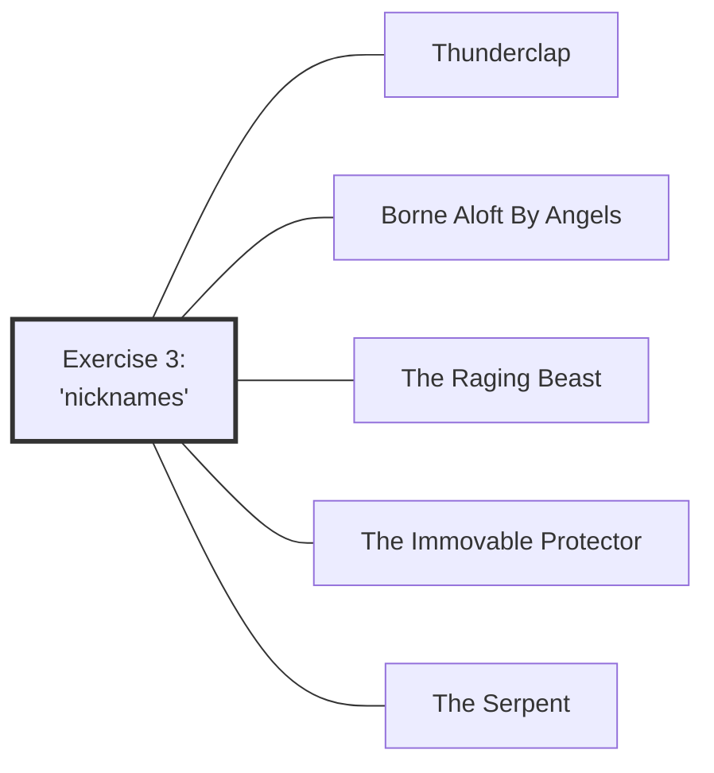

#Talk

[[Preliminaries Regarding Voice, Movement, and Gesture - Part 1|Preliminaries Regarding Voice, Movement, and Gesture - Part 1 🡄]] | [[2020 Vajra Music|🡅]] | [[Preliminaries Regarding Voice, Movement, and Gesture - Part 3|🡆 Preliminaries Regarding Voice, Movement, and Gesture - Part 3]]

Series: [[2020 Vajra Music]]
Transcript: [[0302 Preliminaries Regarding Voice, Movement, and Gesture - Part 2]]
Transcript PDF: [[2020_0302 Preliminaries Regarding Voice, Movement, and Gesture - Part 2.pdf]]

<audio controls preload=metadata style=" width:300px;" controlslist="nodownload"><source src="https://dharmaseed.org/talks/62453/20200302-Rob_Burbea-GAIA-preliminaries_regarding_voice_movement_and_gesture_part_2-62453.mp3" type="audio/mpeg">???</audio>

## Index
_<a data-href="Embodiment" class="internal-link">Embodiment</a> (95) · <a data-href="Soul" class="internal-link">Soul</a> (88) · <a data-href="Image" class="internal-link">Image</a> (62) · <a data-href="Retreat" class="internal-link">Retreat</a> (34) · <a data-href="Soulmaking" class="internal-link">Soulmaking</a> (30) · <a data-href="Energy body" class="internal-link">Energy body</a> (28) · <a data-href="Circuits" class="internal-link">Circuits</a> (22) · <a data-href="Daimon" class="internal-link">Daimon</a> (22) · <a data-href="Imaginal" class="internal-link">Imaginal</a> (17) · <a data-href="Anger" class="internal-link">Anger</a> (15) · <a data-href="Experience" class="internal-link">Experience</a> (14) · <a data-href="Soulmaking dynamic" class="internal-link">Soulmaking dynamic</a> (14) · <a data-href="Energy" class="internal-link">Energy</a> (13) · <a data-href="Dharma" class="internal-link">Dharma</a> (12) · <a data-href="Preliminaries" class="internal-link">Preliminaries</a> (12) · <a data-href="Mind" class="internal-link">Mind</a> (10) · <a data-href="Eros" class="internal-link">Eros</a> (9) · <a data-href="Inertia" class="internal-link">Inertia</a> (8) · <a data-href="Sankhara" class="internal-link">Sankhara</a> (7) · <a data-href="Duty" class="internal-link">Duty</a> (6) · <a data-href="Pedagogy" class="internal-link">Pedagogy</a> (6) · <a data-href="The Self" class="internal-link">The Self</a> (6) · <a data-href="Thunderclap" class="internal-link">Thunderclap</a> (6) · <a data-href="Meditation" class="internal-link">Meditation</a> (5) · <a data-href="The Immovable Protector" class="internal-link">The Immovable Protector</a> (5) · <a data-href="Ethics" class="internal-link">Ethics</a> (4) · <a data-href="Goenka" class="internal-link">Goenka</a> (4) · <a data-href="Grief" class="internal-link">Grief</a> (4) · <a data-href="Manifestations" class="internal-link">Manifestations</a> (4) · <a data-href="Music" class="internal-link">Music</a> (4) · <a aria-label-position="top" aria-label="Music > Jazz" data-href="Music#Jazz" class="internal-link">Music &gt; Jazz</a> (4) · <a data-href="The Serpent" class="internal-link">The Serpent</a> (4) · <a data-href="Alchemy" class="internal-link">Alchemy</a> (3) · <a data-href="Diamond Approach" class="internal-link">Diamond Approach</a> (3) · <a data-href="Dukkha" class="internal-link">Dukkha</a> (3) · <a data-href="Habit" class="internal-link">Habit</a> (3) · <a data-href="Insight" class="internal-link">Insight</a> (3) · <a data-href="Sila" class="internal-link">Sila</a> (3) · <a data-href="Sociology" class="internal-link">Sociology</a> (3) · <a data-href="Awareness" class="internal-link">Awareness</a> (2) · <a data-href="Beauty" class="internal-link">Beauty</a> (2) · <a data-href="Borne Aloft By Angels" class="internal-link">Borne Aloft By Angels</a> (2) · <a data-href="Citta" class="internal-link">Citta</a> (2) · <a data-href="Contraction" class="internal-link">Contraction</a> (2) · <a data-href="Devotion" class="internal-link">Devotion</a> (2) · <a data-href="Dominant culture" class="internal-link">Dominant culture</a> (2) · <a data-href="Hindrances" class="internal-link">Hindrances</a> (2) · <a data-href="Juiciness" class="internal-link">Juiciness</a> (2) · <a data-href="Love" class="internal-link">Love</a> (2) · <a data-href="Mindfulness" class="internal-link">Mindfulness</a> (2) · <a data-href="Pain" class="internal-link">Pain</a> (2) · <a data-href="Personhood" class="internal-link">Personhood</a> (2) · <a data-href="Precepts" class="internal-link">Precepts</a> (2) · <a data-href="Psyche" class="internal-link">Psyche</a> (2) · <a data-href="The Spreading of Five Wings" class="internal-link">The Spreading of Five Wings</a> (2) · <a data-href="Vessel" class="internal-link">Vessel</a> (2) · <a data-href="Voice, Movement, and the Possibilities of Soul" class="internal-link">Voice, Movement, and the Possibilities of Soul</a> (2) · <a data-href="Buddhism" class="internal-link">Buddhism</a> · <a data-href="Catherine McGee" class="internal-link">Catherine McGee</a> · <a data-href="Create-Discover" class="internal-link">Create-Discover</a> · <a data-href="Dana" class="internal-link">Dana</a> · <a data-href="Dharma Seed" class="internal-link">Dharma Seed</a> · <a data-href="Dimensionality" class="internal-link">Dimensionality</a> · <a data-href="Fantasy" class="internal-link">Fantasy</a> · <a data-href="Foundations of a Soulmaking Dharma" class="internal-link">Foundations of a Soulmaking Dharma</a> · <a data-href="Gaia House" class="internal-link">Gaia House</a> · <a data-href="Impermanence" class="internal-link">Impermanence</a> · <a data-href="In Psyche's Orchard" class="internal-link">In Psyche&#x27;s Orchard</a> · <a data-href="Logos" class="internal-link">Logos</a> · <a data-href="Metta" class="internal-link">Metta</a> · <a data-href="Middle Way" class="internal-link">Middle Way</a> · <a data-href="Passion" class="internal-link">Passion</a> · <a data-href="Receptivity" class="internal-link">Receptivity</a> · <a data-href="Relationships" class="internal-link">Relationships</a> · <a data-href="Sangha" class="internal-link">Sangha</a> · <a data-href="Sila and Soul" class="internal-link">Sila and Soul</a> · <a data-href="Spirituality" class="internal-link">Spirituality</a> · <a data-href="The Image of Ethics" class="internal-link">The Image of Ethics</a> · <a data-href="The Raging Beast" class="internal-link">The Raging Beast</a> · <a data-href="Theravada" class="internal-link">Theravada</a> · <a data-href="Wonder" class="internal-link">Wonder</a>_
 

## Referenced talks
- [[Daimon, Refracted]]
- <a data-href="Voice, Movement, and the Possibilities of Soul" class="internal-link">Voice, Movement, and the Possibilities of Soul</a>
- <a data-href="Sila and Soul" class="internal-link">Sila and Soul</a>
- <a data-href="The Image of Ethics" class="internal-link">The Image of Ethics</a>
- <a data-href="The Spreading of Five Wings" class="internal-link">The Spreading of Five Wings</a>
- <a data-href="Pain, as Void and as Sacrament" class="internal-link">Pain, as Void and as Sacrament</a>

## Paragraphs
[[Preliminaries Regarding Voice, Movement, and Gesture - Part 2 -|plain list]]

##### Third set of exercises, but a few general things first
<a aria-label-position="top" aria-label="0302 Preliminaries Regarding Voice, Movement, and Gesture - Part 2 > ^1-1" data-href="0302 Preliminaries Regarding Voice, Movement, and Gesture - Part 2#^1-1" class="internal-link">1-1</a>
Okay, I'd like to continue and explain the third exercise, or this set of exercises, really - the third set of exercises or exercise, depending on how we're conceiving of them. But I also want to say a few more general things. We'll start with the general things, and take our time, and not rush, and then introduce the third one, and say a little bit more about the 'why' of all this.

---
##### "Daimon, Refracted" 🟢
**<a aria-label-position="top" aria-label="0302 Preliminaries Regarding Voice, Movement, and Gesture - Part 2 > ^1-2" data-href="0302 Preliminaries Regarding Voice, Movement, and Gesture - Part 2#^1-2" class="internal-link">1-2</a>**: _<a data-href="Embodiment" class="internal-link">Embodiment</a> (2) · <a data-href="Retreat" class="internal-link">Retreat</a> · <a data-href="Meditation" class="internal-link">Meditation</a> · <a data-href="Soulmaking" class="internal-link">Soulmaking</a>_
So these <a aria-label-position="top" aria-label="Embodiment" data-href="Embodiment" class="internal-link">movement, gesture, and voice</a> exercises, these instructions, this material, is in addition, to be added to what is already there in previous talks that we've recorded over the last years. And I tried to give a little list, but I know there are some I'm forgetting. In fact, I remember sitting right here, not on a <a data-href="retreat" class="internal-link">retreat</a>, recording something, offering some instructions or some possibility for <a data-href="meditation" class="internal-link">meditation</a> around ensouling the voice, but I cannot for the life of me recollect where that is.^[Rob may be referring to "Daimon, Refracted" (30 May 2019), [https://dharmaseed.org/teacher/210/talk/58766/](https://dharmaseed.org/teacher/210/talk/58766/), accessedAug. 2020. The guided meditation begins at 1:45:24] So there may be other material as well. But anyway, it's all to be taken together, put together as a <a aria-label-position="top" aria-label="Embodiment" data-href="Embodiment" class="internal-link">body</a> of material - a kind of strand within the <a aria-label-position="top" aria-label="Soulmaking" data-href="Soulmaking" class="internal-link">Soulmaking Dharma</a>, within the practices. Some of what we'll say in this set of talks will repeat some of what's there, and some stuff will be there that's not here. In other words, I said other stuff there that I'm not going to repeat here, and vice versa - there will be new stuff here that wasn't said there.

references [[Daimon, Refracted]]

---
##### "Voice, Movement, and the Possibilities of Soul" ... but how many have picked it up? 🟢
**<a aria-label-position="top" aria-label="0302 Preliminaries Regarding Voice, Movement, and Gesture - Part 2 > ^1-3" data-href="0302 Preliminaries Regarding Voice, Movement, and Gesture - Part 2#^1-3" class="internal-link">1-3</a>**: _<a data-href="Retreat" class="internal-link">Retreat</a> · <a data-href="Foundations of a Soulmaking Dharma" class="internal-link">Foundations of a Soulmaking Dharma</a> · <a data-href="Dharma Seed" class="internal-link">Dharma Seed</a> · <a data-href="Voice, Movement, and the Possibilities of Soul" class="internal-link">Voice, Movement, and the Possibilities of Soul</a>_
I'm just curious. I wonder, or I am wondering, how many people who have listened to or even took part in those exercises - I can't remember which <a data-href="retreat" class="internal-link">retreat</a> it was; it might have been _<a data-href="Foundations of a Soulmaking Dharma" class="internal-link">Foundations of a Soulmaking Dharma</a>_. I can't remember, but the talks are up on <a data-href="Dharma Seed" class="internal-link">Dharma Seed</a>, called "<a data-href="Voice, Movement, and the Possibilities of Soul" class="internal-link">Voice, Movement, and the Possibilities of Soul</a>," I think, and I think there are two parts.^[Rob Burbea, "Voice, Movement, and the Possibilities of Soul" [Partsand 2] (24-26 June 2018), [https://dharmaseed.org/teacher/210/?search=voice+movement+possibilities](https://dharmaseed.org/teacher/210/?search=voice+movement+possibilities), accessedAug. 2020] I wonder how many people, of everyone who has perhaps listened to those talks, how many actually picked up those exercises and practised them, repeated them in practice? Or how many even listened and practised, as opposed to just listened? But really, how many actually picked it up, picked those exercises up, and pursued it, and developed it as a practice? I'm actually genuinely curious about that.

---
##### If not, why not?
**<a aria-label-position="top" aria-label="0302 Preliminaries Regarding Voice, Movement, and Gesture - Part 2 > ^1-4" data-href="0302 Preliminaries Regarding Voice, Movement, and Gesture - Part 2#^1-4" class="internal-link">1-4</a>**: _<a data-href="Inertia" class="internal-link">Inertia</a> · <a data-href="Energy" class="internal-link">Energy</a> · <a data-href="Meditation" class="internal-link">Meditation</a>_
I'm also genuinely curious that, if not - in other words, if you perhaps heard those talks, or had a little go with it, and then you didn't pursue it - why not? I'm genuinely curious about that, and I'm going to suggest that it would be good for all of us to be genuinely curious, if that's the case. Why not? I think that's probably an interesting question, and I really mean it as a question, not as, if someone says, "Why not? Why didn't you do that?", and then it just becomes a self-judgment thing: "Oh, yes. It's another thing that I've failed at, or didn't do well, or whatever, neglected, whatever it is." But actually, it's an interesting question. If I didn't, if you didn't, why not? It's an interesting question, insofar as it might shed light on those areas and issues we touched on yesterday: <a data-href="inertia" class="internal-link">inertia</a>. How much of not taking up those practices, and not kind of galvanizing oneself to do what's unfamiliar, what _does_ take a bit of <a data-href="energy" class="internal-link">energy</a> and a bit of _oomph_ and a bit of, "Pff. Now I really have to do this," and it's different than sitting there quietly with the legs crossed in the usual <a aria-label-position="top" aria-label="Meditation" data-href="Meditation" class="internal-link">meditation posture</a>, or on a chair or whatever it is, doing my usual practice.

NOTE

revisits <a data-href="Inertia" class="internal-link">Inertia</a> 

---
##### "Why not?" points to failing to discriminate/discern signifiance
**<a aria-label-position="top" aria-label="0302 Preliminaries Regarding Voice, Movement, and Gesture - Part 2 > ^2-1" data-href="0302 Preliminaries Regarding Voice, Movement, and Gesture - Part 2#^2-1" class="internal-link">2-1</a>**: _<a data-href="Inertia" class="internal-link">Inertia</a> (2)_
It's an interesting question. If one didn't, the "why not?" becomes an interesting question, insofar as it might illuminate those areas and issues we talked about, <a data-href="inertia" class="internal-link">inertia</a>, and also the question of discriminating significance, or failing to discriminate/discern significance. These are two things we talked about yesterday. Maybe I didn't because of inertias of different kinds in my practice, in my relationship with practice, what and how I practise and all that, and the form of practice, and how that can get kind of just rigidified, kind of set. Practice is something that you don't move much, or it doesn't make much noise. It's not loud like that. We're quite wild, rambunctious, you know, some of what was there. Was it <a data-href="inertia" class="internal-link">inertia</a>, partly, or was it, "I just didn't discern it. Didn't occur to me as something … I didn't grasp it as something significant"?

---
##### The question also sheds light on pedagogy
**<a aria-label-position="top" aria-label="0302 Preliminaries Regarding Voice, Movement, and Gesture - Part 2 > ^2-2" data-href="0302 Preliminaries Regarding Voice, Movement, and Gesture - Part 2#^2-2" class="internal-link">2-2</a>**: _<a data-href="Pedagogy" class="internal-link">Pedagogy</a> (2) · <a data-href="Mind" class="internal-link">Mind</a> · <a data-href="Inertia" class="internal-link">Inertia</a>_
There were, as I mentioned yesterday, lots of other reasons why not, to do with how I put the teaching out, and not taking enough time, and rushing through things, etc. But insofar as it sheds light on those two areas - I mean, also <a aria-label-position="top" aria-label="Pedagogy" data-href="Pedagogy" class="internal-link">pedagogically</a>, I think; it's interesting, as we go forward, to take more time, and really earmark something: "Okay, this is a thing now. This is a practice. And here we put a ring fence around it, and make it a thing, and make people do it." So <a aria-label-position="top" aria-label="Pedagogy" data-href="Pedagogy" class="internal-link">pedagogically</a> it's also an interesting question and something to bear in <a data-href="mind" class="internal-link">mind</a>. But as far as it sheds light, as I said, on the issues, the areas of <a data-href="inertia" class="internal-link">inertia</a>, and the capacity to discern the significance of something that we read or hear. It becomes a very interesting question: "Why didn't I pick that up, and pursue it, and develop it, and repeat it, and practise it?" So I'll leave that with you.

---
##### Recap from yesterday: it's about sensitivity
**<a aria-label-position="top" aria-label="0302 Preliminaries Regarding Voice, Movement, and Gesture - Part 2 > ^2-3" data-href="0302 Preliminaries Regarding Voice, Movement, and Gesture - Part 2#^2-3" class="internal-link">2-3</a>**: _<a data-href="Soulmaking" class="internal-link">Soulmaking</a> (2) · <a data-href="Energy body" class="internal-link">Energy body</a>_
We introduced yesterday these two first exercises. We just called them exercises one and two. And just to repeat a little bit, again, a little too brief: why? Some of the 'why' for those two exercises has to do with, well, firstly, developing sensitivity. Again, how much sensitivity, and the development of sensitivities, is part of, so much an integral part of, a necessary part of, <a aria-label-position="top" aria-label="Soulmaking" data-href="Soulmaking" class="internal-link">Soulmaking Dharma practice</a>, practices. They so depend on sensitivity, and sensitivity, in this case, to movement, to gesture, to voice; sensitivity to <a data-href="energy body" class="internal-link">energy body</a>; sensitivity to the space, to sound. So all that was in exercises one and two, this possibility of developing sensitivity, and how important that is in <a aria-label-position="top" aria-label="Soulmaking" data-href="Soulmaking" class="internal-link">Soulmaking Dharma practice</a> - increasing the scope or the area in which we are sensitive, and to which we are sensitive, and the range of aspects of being and expression to which we are sensitive, and increasing the sensitivity as well.

---
##### We are often held back or holding in of our energy
**<a aria-label-position="top" aria-label="0302 Preliminaries Regarding Voice, Movement, and Gesture - Part 2 > ^2-4" data-href="0302 Preliminaries Regarding Voice, Movement, and Gesture - Part 2#^2-4" class="internal-link">2-4</a>**: _<a data-href="The Self" class="internal-link">The Self</a> · <a data-href="Sociology" class="internal-link">Sociology</a> · <a data-href="Energy" class="internal-link">Energy</a> (4) · <a data-href="Embodiment" class="internal-link">Embodiment</a> (2) · <a data-href="Sankhara" class="internal-link">Sankhara</a> (7) · <a data-href="Eros" class="internal-link">Eros</a> (3) · <a data-href="Soul" class="internal-link">Soul</a> (2) · <a data-href="Dominant culture" class="internal-link">Dominant culture</a> · <a data-href="Dharma" class="internal-link">Dharma</a>_
A second reason why has to do with: is it possible (and I think it _is_ very possible) that we can live as human beings in this culture of ours, this complex culture of ours, a complex <a aria-label-position="top" aria-label="The Self" data-href="The Self" class="internal-link">sense of self</a>, complex <a aria-label-position="top" aria-label="Sociology" data-href="Sociology" class="internal-link">social dynamics</a>, etc., complex psychologies, and our <a data-href="energy" class="internal-link">energy</a> and our voice can be held in, our <a aria-label-position="top" aria-label="Embodiment" data-href="Embodiment" class="internal-link">body</a> can be held in, held back, habitually, often unconsciously, and often not even through a conscious choice? We're holding ourselves back, holding ourselves in, as a <a aria-label-position="top" aria-label="Sankhara" data-href="Sankhara" class="internal-link">habitual holding</a>. And that <a aria-label-position="top" aria-label="Sankhara" data-href="Sankhara" class="internal-link">holding back of</a> our <a data-href="energy" class="internal-link">energy</a> and our voice, <a aria-label-position="top" aria-label="Sankhara" data-href="Sankhara" class="internal-link">holding back of</a> our bodily expression, as well, is actually a <a aria-label-position="top" aria-label="Sankhara" data-href="Sankhara" class="internal-link">holding back of</a> our libido, of our life <a data-href="energy" class="internal-link">energy</a>, of our <a aria-label-position="top" aria-label="Eros" data-href="Eros" class="internal-link">life force</a>, and also of our <a data-href="eros" class="internal-link">eros</a> (again, in the larger, in the fuller, richer sense of that word, '<a data-href="eros" class="internal-link">eros</a>'), and a <a aria-label-position="top" aria-label="Sankhara" data-href="Sankhara" class="internal-link">holding back of</a> our <a data-href="soul" class="internal-link">soul</a>. And this, I think, is very, very common <a aria-label-position="top" aria-label="Dominant culture" data-href="Dominant culture" class="internal-link">in our culture</a>, and it may be common - I'm going to say more about this as we go on - it may be especially common in certain ways in some <a aria-label-position="top" aria-label="Dharma" data-href="Dharma" class="internal-link">Dharma cultures</a>. Why exercises one and two, the development of sensitivity in certain areas, and just the increase of sensitivity, both in - what would you say? - refinement and depth, but also in scope? And also this question of, "Is there a <a aria-label-position="top" aria-label="Sankhara" data-href="Sankhara" class="internal-link">habitual holding</a> back or holding in of my <a data-href="energy" class="internal-link">energy</a>, of my voice, through my <a aria-label-position="top" aria-label="Embodiment" data-href="Embodiment" class="internal-link">body</a>, which is actually a <a aria-label-position="top" aria-label="Sankhara" data-href="Sankhara" class="internal-link">holding back of</a> my libido and my <a data-href="soul" class="internal-link">soul</a>? Do I have a choice in that? Am I even conscious of that?" It's very important, I think. Very, very important. We'll elaborate on this. I'll elaborate as we go forward.

---
##### "Preliminaries" can become ensouled
**<a aria-label-position="top" aria-label="0302 Preliminaries Regarding Voice, Movement, and Gesture - Part 2 > ^3-1" data-href="0302 Preliminaries Regarding Voice, Movement, and Gesture - Part 2#^3-1" class="internal-link">3-1</a>**: _<a data-href="Preliminaries" class="internal-link">Preliminaries</a> (7) · <a data-href="Mindfulness" class="internal-link">Mindfulness</a> · <a data-href="Energy body" class="internal-link">Energy body</a> · <a data-href="Soul" class="internal-link">Soul</a> · <a data-href="Retreat" class="internal-link">Retreat</a>_
And we talked about, we used this language of '<a data-href="preliminaries" class="internal-link">preliminaries</a>' and 'exercises.' It's probably obvious, but if we call those exercises and the other exercises we'll give today and hopefully in the coming days, if we call them '<a data-href="preliminaries" class="internal-link">preliminaries</a>,' they're also already presupposing _other_ <a data-href="preliminaries" class="internal-link">preliminaries</a> (for example, <a data-href="mindfulness" class="internal-link">mindfulness</a>, some degree of <a aria-label-position="top" aria-label="Energy body" data-href="Energy body" class="internal-link">energy body awareness</a>). So they're also <a data-href="preliminaries" class="internal-link">preliminaries</a> that are resting on other <a data-href="preliminaries" class="internal-link">preliminaries</a>, you could say. That's probably obvious. But also, just a little bit, if you've been listening to the teachings over the last while, even just over the last couple of years, let's say, you can see that some of what we might call '<a data-href="preliminaries" class="internal-link">preliminaries</a>,' and what we might ask for as <a data-href="preliminaries" class="internal-link">preliminaries</a> from a practitioner, as prerequisites, can then become <a aria-label-position="top" aria-label="Soul" data-href="Soul" class="internal-link">ensouled</a>. On another <a data-href="retreat" class="internal-link">retreat</a>, we talked about the difference between 'foundation' and 'root,' and a root as being something that can actually grow. A foundation is something that's fixed.

---
##### Energy body exercises open towards relating to it as imaginal image
**<a aria-label-position="top" aria-label="0302 Preliminaries Regarding Voice, Movement, and Gesture - Part 2 > ^3-2" data-href="0302 Preliminaries Regarding Voice, Movement, and Gesture - Part 2#^3-2" class="internal-link">3-2</a>**: _<a data-href="Soul" class="internal-link">Soul</a> (4) · <a data-href="Preliminaries" class="internal-link">Preliminaries</a> · <a data-href="Energy body" class="internal-link">Energy body</a> (4) · <a data-href="Awareness" class="internal-link">Awareness</a> (2) · <a data-href="Embodiment" class="internal-link">Embodiment</a> · <a data-href="Imaginal" class="internal-link">Imaginal</a> (4)_
So this, what is a kind of prerequisite or preliminary, can then become an <a aria-label-position="top" aria-label="Soul" data-href="Soul" class="internal-link">ensouled</a> area, and grow and be developed to other levels that we had never, never even anticipated or intuited or dreamt of. This is very clear, for example, if we take two areas that we can consider as <a data-href="preliminaries" class="internal-link">preliminaries</a>: the <a data-href="energy body" class="internal-link">energy body</a> - and we've seen <a data-href="energy body" class="internal-link">energy body</a> is this kind of thing, <a data-href="awareness" class="internal-link">awareness</a>, this kind of <a data-href="awareness" class="internal-link">awareness</a>, this kind of <a aria-label-position="top" aria-label="Embodiment" data-href="Embodiment" class="internal-link">sense of the body</a>; people get a hang of that. But after a while, we talked about the <a aria-label-position="top" aria-label="Energy body" data-href="Energy body" class="internal-link">imaginal-energy body</a>, that that very <a aria-label-position="top" aria-label="Energy body" data-href="Energy body" class="internal-link">sense of the energy body</a> can become <a data-href="imaginal" class="internal-link">imaginal</a>, and can be related to as <a aria-label-position="top" aria-label="Imaginal" data-href="Imaginal" class="internal-link">imaginal image</a>. It's not just a sort of basic instrument; it becomes itself an <a aria-label-position="top" aria-label="Imaginal" data-href="Imaginal" class="internal-link">erotic-imaginal object</a>. It becomes <a aria-label-position="top" aria-label="Soul" data-href="Soul" class="internal-link">ensouled</a>. It becomes alive and <a aria-label-position="top" aria-label="Soul" data-href="Soul" class="internal-link">ensouled</a>. Its depth, the range of its possibility, what it can be, how it can manifest, how we can feel it, the whole relationship with it becomes erotic and <a data-href="imaginal" class="internal-link">imaginal</a>. And the whole thing just kind of balloons out exponentially to include other possibilities. So that would be one example of a preliminary or prerequisite that then becomes <a aria-label-position="top" aria-label="Soul" data-href="Soul" class="internal-link">ensouled</a>, and then just completely opens out, actually infinitely, to other possibilities.

---
##### "Sila and Soul", "The Image of Ethics" 🟢
**<a aria-label-position="top" aria-label="0302 Preliminaries Regarding Voice, Movement, and Gesture - Part 2 > ^3-3" data-href="0302 Preliminaries Regarding Voice, Movement, and Gesture - Part 2#^3-3" class="internal-link">3-3</a>**: _<a data-href="Sila" class="internal-link">Sila</a> (3) · <a data-href="Ethics" class="internal-link">Ethics</a> (4) · <a data-href="Dharma" class="internal-link">Dharma</a> (3) · <a data-href="Precepts" class="internal-link">Precepts</a> (2) · <a data-href="Theravada" class="internal-link">Theravada</a> · <a data-href="Buddhism" class="internal-link">Buddhism</a> · <a data-href="Sila and Soul" class="internal-link">Sila and Soul</a> · <a data-href="The Image of Ethics" class="internal-link">The Image of Ethics</a> · <a data-href="Soulmaking dynamic" class="internal-link">Soulmaking dynamic</a> · <a data-href="Imaginal" class="internal-link">Imaginal</a> · <a data-href="Soul" class="internal-link">Soul</a> (2) · <a data-href="Dimensionality" class="internal-link">Dimensionality</a> · <a data-href="Beauty" class="internal-link">Beauty</a>_
A second example would be _<a aria-label-position="top" aria-label="Sila" data-href="Sila" class="internal-link">sīla</a>_, <a data-href="ethics" class="internal-link">ethics</a>. Again, we rest our teaching, as <a aria-label-position="top" aria-label="Dharma" data-href="Dharma" class="internal-link">Dharma teachings</a>, as a set of <a aria-label-position="top" aria-label="Dharma" data-href="Dharma" class="internal-link">Dharma teachings</a> within the <a aria-label-position="top" aria-label="Dharma" data-href="Dharma" class="internal-link">Dharma teachings</a> of <a aria-label-position="top" aria-label="Sila" data-href="Sila" class="internal-link">sīla</a>, of <a data-href="ethics" class="internal-link">ethics</a>, and in our case, the <a aria-label-position="top" aria-label="Precepts" data-href="Precepts" class="internal-link">five precepts</a> that we receive from the <a aria-label-position="top" aria-label="Theravada" data-href="Theravada" class="internal-link">Theravādan</a> <a aria-label-position="top" aria-label="Buddhism" data-href="Buddhism" class="internal-link">Buddhist tradition</a>, taking those very seriously as a basis. And as practice develops (and I've outlined in two sets of talks now: "<a data-href="Sila and Soul" class="internal-link">Sila and Soul</a>"^[Rob Burbea, "Sila and Soul" [Parts 1-9] (9-17 June 2019), [https://dharmaseed.org/teacher/210/?search=sila+and+soul](https://dharmaseed.org/teacher/210/?search=sila+and+soul), accessedAug. 2020] and "<a data-href="The Image of Ethics" class="internal-link">The Image of Ethics</a>"), and as ^[Rob Burbea, "The Image of Ethics" [Parts 1-6] (14-19 Feb. 2020), [https://dharmaseed.org/teacher/210/?search=the+image+of+ethics+orchard](https://dharmaseed.org/teacher/210/?search=the+image+of+ethics+orchard), accessedAug. 2020]practice develops the <a data-href="soulmaking dynamic" class="internal-link">soulmaking dynamic</a> starts involving <a data-href="ethics" class="internal-link">ethics</a>, in the sense <a data-href="ethics" class="internal-link">ethics</a> itself becomes, or values and virtues become, <a aria-label-position="top" aria-label="Imaginal" data-href="Imaginal" class="internal-link">erotic-imaginal objects</a>, and the whole domain of <a aria-label-position="top" aria-label="Sila" data-href="Sila" class="internal-link">sīla</a> becomes erotically alive, and alive to the <a data-href="soul" class="internal-link">soul</a> and for the <a data-href="soul" class="internal-link">soul</a>, then that whole preliminary basis of the <a aria-label-position="top" aria-label="Precepts" data-href="Precepts" class="internal-link">five precepts</a>, again, just balloons out in complexity and depth, and <a data-href="dimensionality" class="internal-link">dimensionality</a> and range, and demand and <a data-href="beauty" class="internal-link">beauty</a> - all of that.

---
##### Why "preliminaries"? Because it expands soulmaking
**<a aria-label-position="top" aria-label="0302 Preliminaries Regarding Voice, Movement, and Gesture - Part 2 > ^3-4" data-href="0302 Preliminaries Regarding Voice, Movement, and Gesture - Part 2#^3-4" class="internal-link">3-4</a>**: _<a data-href="Soul" class="internal-link">Soul</a> · <a data-href="Dana" class="internal-link">Dana</a> · <a data-href="Mindfulness" class="internal-link">Mindfulness</a> · <a data-href="Preliminaries" class="internal-link">Preliminaries</a> (3) · <a data-href="Soulmaking dynamic" class="internal-link">Soulmaking dynamic</a> (2) · <a data-href="Experience" class="internal-link">Experience</a> (2) · <a data-href="Insight" class="internal-link">Insight</a> · <a data-href="Vessel" class="internal-link">Vessel</a>_
So those would be two examples of areas where a preliminary becomes <a aria-label-position="top" aria-label="Soul" data-href="Soul" class="internal-link">ensouled</a>, and then it becomes something that's potentially - I don't know - the opposite of preliminary: super advanced. But the same could be said of something like _<a aria-label-position="top" aria-label="Dana" data-href="Dana" class="internal-link">dāna</a>_, or even <a data-href="mindfulness" class="internal-link">mindfulness</a>. Lots of possibilities there in relation to this idea of <a data-href="preliminaries" class="internal-link">preliminaries</a>. And again, to touch on this thread - I'll keep coming back to this, the 'why' of all this, and repeat something I think I said yesterday - why <a data-href="preliminaries" class="internal-link">preliminaries</a>? Why these exercises, these kinds of exercises? Why even _think_ in terms of exercises or <a data-href="preliminaries" class="internal-link">preliminaries</a>? As I said, we can just hope that the <a data-href="soulmaking dynamic" class="internal-link">soulmaking dynamic</a> - we know, we've heard, or we've even had <a data-href="experience" class="internal-link">experience</a> of the <a data-href="soulmaking dynamic" class="internal-link">soulmaking dynamic</a> - what it does is it will expand things. It will expand its range. It will include more and more. And it will expand something that it's kind of got in its vortex, in its dynamics - some area or aspect of our being or our life. It expands that area. We expand with it. Our <a aria-label-position="top" aria-label="Insight" data-href="Insight" class="internal-link">understanding</a> and our <a data-href="experience" class="internal-link">experience</a> of that area or aspect of being expands with it, or shatters in the <a aria-label-position="top" aria-label="Vessel" data-href="Vessel" class="internal-link">breaking of the vessels</a>, and then has to be built in a larger way, a deeper, fuller, more far-reaching way.

---
##### If we like practicing soulmaking the soulmaking dynamic will expand
**<a aria-label-position="top" aria-label="0302 Preliminaries Regarding Voice, Movement, and Gesture - Part 2 > ^4-1" data-href="0302 Preliminaries Regarding Voice, Movement, and Gesture - Part 2#^4-1" class="internal-link">4-1</a>**: _<a data-href="Soulmaking" class="internal-link">Soulmaking</a> · <a data-href="Soulmaking dynamic" class="internal-link">Soulmaking dynamic</a> (2) · <a data-href="Vessel" class="internal-link">Vessel</a> · <a data-href="Embodiment" class="internal-link">Embodiment</a>_
<audio controls preload=metadata style=" width:300px;" controlslist="nodownload"><source src="https://dharmaseed.org/talks/62453/20200302-Rob_Burbea-GAIA-preliminaries_regarding_voice_movement_and_gesture_part_2-62453.mp3#t=15:46" type="audio/mpeg">???</audio>
[15:46] So it might be that we can just hope that if we're practising <a data-href="soulmaking" class="internal-link">soulmaking</a>, we like it, practising, and we can just hope that the <a data-href="soulmaking dynamic" class="internal-link">soulmaking dynamic</a> will expand, will get hold in its expansion or in the <a aria-label-position="top" aria-label="Vessel" data-href="Vessel" class="internal-link">breaking of vessels</a> that happens occasionally, from time to time (sometimes it's just a stretch; sometimes it's actually a shattering), in that whole process, over time, that eventually it will just, by itself, come to involve and include and ensoul <a aria-label-position="top" aria-label="Embodiment" data-href="Embodiment" class="internal-link">movement, gesture, voice</a>. You can just hope that, because that's what the <a data-href="soulmaking dynamic" class="internal-link">soulmaking dynamic</a> does.

---
##### There can be blocks which are too entrenched
**<a aria-label-position="top" aria-label="0302 Preliminaries Regarding Voice, Movement, and Gesture - Part 2 > ^4-2" data-href="0302 Preliminaries Regarding Voice, Movement, and Gesture - Part 2#^4-2" class="internal-link">4-2</a>**: _<a data-href="Embodiment" class="internal-link">Embodiment</a> (2) · <a data-href="Soulmaking dynamic" class="internal-link">Soulmaking dynamic</a> (5) · <a data-href="Eros" class="internal-link">Eros</a> (3) · <a data-href="Psyche" class="internal-link">Psyche</a> · <a data-href="Logos" class="internal-link">Logos</a> · <a data-href="Soul" class="internal-link">Soul</a>_
However, if those areas - <a aria-label-position="top" aria-label="Embodiment" data-href="Embodiment" class="internal-link">movement, gesture, and voice</a>, or, let's say, some directions and possibilities within <a aria-label-position="top" aria-label="Embodiment" data-href="Embodiment" class="internal-link">movement, gesture, and voice</a> - if the blocks there that we have are really entrenched, if they're entrenched enough, then the power of expansion of the <a data-href="soulmaking dynamic" class="internal-link">soulmaking dynamic</a>, propelled by <a data-href="eros" class="internal-link">eros</a>, etc., the <a aria-label-position="top" aria-label="Soulmaking dynamic" data-href="Soulmaking dynamic" class="internal-link">eros-psyche-logos dynamic</a>, if the blocks are more entrenched and effectively more powerful than the <a data-href="soulmaking dynamic" class="internal-link">soulmaking dynamic</a> at that point, it _won't_. It won't ensoul those areas or those possibilities within those areas. Sometimes it does: the <a data-href="eros" class="internal-link">eros</a> and the <a data-href="soulmaking dynamic" class="internal-link">soulmaking dynamic</a> just does its thing, and it overcomes, or it stretches those walls, those blocks (we've talked about this), whether they're blocks of <a data-href="eros" class="internal-link">eros</a>, or <a data-href="psyche" class="internal-link">psyche</a>, or <a data-href="logos" class="internal-link">logos</a>, or whatever it is. And sometimes it will come up against them and it won't be strong enough. The blocks are too entrenched. And so those areas will not be included in the <a data-href="soulmaking dynamic" class="internal-link">soulmaking dynamic</a>. They won't be <a aria-label-position="top" aria-label="Soul" data-href="Soul" class="internal-link">ensouled</a>. Certain things won't open up as possibilities. It will stop there. The walls are not moving. The limitations stay where they are.

---
##### Those areas remain out of reach
**<a aria-label-position="top" aria-label="0302 Preliminaries Regarding Voice, Movement, and Gesture - Part 2 > ^4-3" data-href="0302 Preliminaries Regarding Voice, Movement, and Gesture - Part 2#^4-3" class="internal-link">4-3</a>**: _<a data-href="Soulmaking dynamic" class="internal-link">Soulmaking dynamic</a> (2) · <a data-href="Create-Discover" class="internal-link">Create-Discover</a> · <a data-href="Soul" class="internal-link">Soul</a> (2)_
Now, I don't know. Can we know in advance, with respect to any aspect of our being or area of our life, whether whatever blocks we have there - which are often unconscious anyway - whether they will be weaker or stronger than the push of the <a data-href="soulmaking dynamic" class="internal-link">soulmaking dynamic</a>, the fermentation, the force of fermentation of the <a data-href="soulmaking dynamic" class="internal-link">soulmaking dynamic</a> as it moves into those areas, as it reaches those areas and those aspects of our being and our life? I don't know. How would we know that in advance? Of course, it may well be in many cases that it _does_ expand those limits, push open those walls, <a aria-label-position="top" aria-label="Create-Discover" data-href="Create-Discover" class="internal-link">create/discover</a>, open new possibilities, new roads for <a data-href="soul" class="internal-link">soul</a>, new territories and landscapes. But there will be blocks and walls and limits that <a data-href="soul" class="internal-link">soul</a>, in its dynamic, in its process, which it encounters, that it does not overcome. It stops there. And those areas remain out of reach, not open. No entry. The road there is not open.

---
##### What does it mean for movement/gesture/voice to be ensouled?
**<a aria-label-position="top" aria-label="0302 Preliminaries Regarding Voice, Movement, and Gesture - Part 2 > ^4-4" data-href="0302 Preliminaries Regarding Voice, Movement, and Gesture - Part 2#^4-4" class="internal-link">4-4</a>**: _<a data-href="Embodiment" class="internal-link">Embodiment</a> (2) · <a data-href="Soul" class="internal-link">Soul</a> (2)_
<audio controls preload=metadata style=" width:300px;" controlslist="nodownload"><source src="https://dharmaseed.org/talks/62453/20200302-Rob_Burbea-GAIA-preliminaries_regarding_voice_movement_and_gesture_part_2-62453.mp3#t=19:22" type="audio/mpeg">???</audio>
What does it mean, for example, for <a aria-label-position="top" aria-label="Embodiment" data-href="Embodiment" class="internal-link">movement/gesture/voice</a> to be '<a aria-label-position="top" aria-label="Soul" data-href="Soul" class="internal-link">ensouled</a>'? We use this term. What does it mean? What are _we_ meaning, at least, when we say <a aria-label-position="top" aria-label="Embodiment" data-href="Embodiment" class="internal-link">movement/gesture/voice</a> can become <a aria-label-position="top" aria-label="Soul" data-href="Soul" class="internal-link">ensouled</a>? Well, I think for right now it means two main things at least. It means at least these two things, and they're both quite big.

---
##### There are roads that are open
**<a aria-label-position="top" aria-label="0302 Preliminaries Regarding Voice, Movement, and Gesture - Part 2 > ^4-5" data-href="0302 Preliminaries Regarding Voice, Movement, and Gesture - Part 2#^4-5" class="internal-link">4-5</a>**: _<a data-href="Soul" class="internal-link">Soul</a> (8) · <a data-href="Embodiment" class="internal-link">Embodiment</a> (4) · <a data-href="Music" class="internal-link">Music</a>_
The first is, it means that if the <a data-href="soul" class="internal-link">soul</a> wants to express and communicate through or using these aspects of our being, <a aria-label-position="top" aria-label="Embodiment" data-href="Embodiment" class="internal-link">movement/gesture/voice</a>, it _can_. They are available. Within those domains of <a aria-label-position="top" aria-label="Embodiment" data-href="Embodiment" class="internal-link">movement/gesture/voice</a>, there are roads that are open. Travel is possible. Expansion is possible. So if it means that, to be <a aria-label-position="top" aria-label="Soul" data-href="Soul" class="internal-link">ensouled</a>, <a aria-label-position="top" aria-label="Embodiment" data-href="Embodiment" class="internal-link">movement/gesture/voice</a> to be <a aria-label-position="top" aria-label="Soul" data-href="Soul" class="internal-link">ensouled</a>, means that if <a data-href="soul" class="internal-link">soul</a> wants to express or communicate using or through those aspects of our being, it _can_, because they are there. They're available and they're open. And, you know, the degree of possible development there is infinite. Again, if we go back to the sort of example, the analogy of <a data-href="music" class="internal-link">music</a>, it's just completely open-ended, to what degree those arts can be developed. We're talking about the art of movement (say, dance, or a gesture, or a voice), and how the art of the <a data-href="soul" class="internal-link">soul</a>, using those media (<a aria-label-position="top" aria-label="Embodiment" data-href="Embodiment" class="internal-link">movement, gesture, voice</a>) as expression - there's no limit to the depth and height of the art that is possible there, the arts that are possible there. It's just staggering, what some people are able to do - certainly in terms of technique, etc., but then if you think about in terms of the depth and the height of <a data-href="soul" class="internal-link">soul</a> and the breadth of <a data-href="soul" class="internal-link">soul</a> that can be coupled with that technique, to bring that sort of really deep <a aria-label-position="top" aria-label="Soul" data-href="Soul" class="internal-link">soul-power</a> that comes through in really great art.

---
##### (1) If soul wants to manifest, it can
**<a aria-label-position="top" aria-label="0302 Preliminaries Regarding Voice, Movement, and Gesture - Part 2 > ^5-1" data-href="0302 Preliminaries Regarding Voice, Movement, and Gesture - Part 2#^5-1" class="internal-link">5-1</a>**: _<a data-href="Soul" class="internal-link">Soul</a> (7) · <a data-href="Embodiment" class="internal-link">Embodiment</a>_
So certainly that, but also, probably for most of us, what we're really talking about is it's available just as part of the soul manifesting, or some of the ways the soul manifests and wants to manifest in everyday life, in living our life soulfully, or doing our soul-duties, so to speak. So _if_ it wants to express and communicate through and using those aspects of being, if soul wants that, it _can_. And that may mean developing the art of movement/gesture/voice to some degree - maybe even to an extraordinary degree. But probably for most of us it means just it _can_, in life, in the ordinary manifesting of soul in life. There's not something that bars those directions and domains from being ensouled, bars soul from flowing through and expressing and communicating in and through and with those aspects of our being.

What does it mean for movement/gesture/voice to be ensouled?
1. if soul wants to manifest, it can
2. ordinary usages of movement/gesture/voice can be sensed with soul

❝

So <i>if</i> it wants to express and communicate through and using those aspects of being, if soul wants that, it <i>can</i>. ... There's not something that bars those directions and domains from being ensouled, bars soul from flowing through and expressing and communicating in and through and with those aspects of our being. 

---
##### (2) Ordinary usages of movement/gesture/voice can be sensed with soul
**<a aria-label-position="top" aria-label="0302 Preliminaries Regarding Voice, Movement, and Gesture - Part 2 > ^5-2" data-href="0302 Preliminaries Regarding Voice, Movement, and Gesture - Part 2#^5-2" class="internal-link">5-2</a>**: _<a data-href="Embodiment" class="internal-link">Embodiment</a> (3) · <a data-href="Soul" class="internal-link">Soul</a> (4) · <a data-href="Daimon" class="internal-link">Daimon</a> (2) · <a data-href="Soulmaking" class="internal-link">Soulmaking</a>_
So that's one thing that it means, for movement/gesture/voice to be ensouled. A second thing that it means is that the movement, gesture, and voice of oneself or of another, in their everyday, ordinary usages - just the voice speaking, or just having a conversation, or exclaiming something, or the hand moving as it speaks, or whatever it is - those ordinary usages of movement, of gesture, of voice can be sensed with soul, can be sensed, therefore, as angelic, as refracting the angel, the daimon. They are sensed as dimensional, unfathomable, as divine in origin, as echoing the eternal. So for movement/gesture/voice to be ensouled, it means these two main things. I think they're both really, really important, if we talk about opening our lives to soulmaking, or our lives being open to soul.

❝

A second thing that it means is that the movement, gesture, and voice of oneself or of another, in their everyday, ordinary usages - just the voice speaking, or just having a conversation, or exclaiming something, or the hand moving as it speaks, or whatever it is - those ordinary usages of movement, of gesture, of voice can be sensed with soul, can be sensed, therefore, as angelic, as refracting the <a aria-label-position="top" aria-label="Daimon" data-href="Daimon" class="internal-link">angel</a>, the daimon.  

---
##### With regard to the "grief", there were plenty of things within jazz that I figured out on my own
**<a aria-label-position="top" aria-label="0302 Preliminaries Regarding Voice, Movement, and Gesture - Part 2 > ^5-3" data-href="0302 Preliminaries Regarding Voice, Movement, and Gesture - Part 2#^5-3" class="internal-link">5-3</a>**: _<a data-href="Grief" class="internal-link">Grief</a> (3) · <a aria-label-position="top" aria-label="Music > Jazz" data-href="Music#Jazz" class="internal-link">Music &gt; Jazz</a> (4) · <a data-href="Music" class="internal-link">Music</a> · <a data-href="Eros" class="internal-link">Eros</a>_
I shared about what I called my <a data-href="grief" class="internal-link">grief</a>, particularly in relation to that one sort of area around <a aria-label-position="top" aria-label="Music > Jazz" data-href="Music#Jazz" class="internal-link">jazz guitar</a>, improvising <a aria-label-position="top" aria-label="Music > Jazz" data-href="Music#Jazz" class="internal-link">jazz guitar</a>, and particularly the technique, really. My <a data-href="grief" class="internal-link">grief</a>. A better word might be 'regret.' I mean, there's definitely a <a data-href="grief" class="internal-link">grief</a> there, but there's also a kind of regret. People might ask, "Oh, you're going to die soon. Is there anything you regret?" Well, that's what I said. There's one thing. There's just one thing, and it's that. Why the word 'regret'? Because, even though I did go to <a aria-label-position="top" aria-label="Music" data-href="Music" class="internal-link">music school</a> and all that, and conservatory and blah blah blah, it's like, you actually end up having to figure out a lot of stuff on your own, especially if you're doing <a aria-label-position="top" aria-label="Music > Jazz" data-href="Music#Jazz" class="internal-link">jazz</a>. You have to find your own ways to do things, and your own kind of avenues that you're interested in, and develop them. There were plenty of things within <a aria-label-position="top" aria-label="Music > Jazz" data-href="Music#Jazz" class="internal-link">jazz</a> that I figured out on my own - so to speak, 'on my own'; you're never on your own completely with anything, but. Certainly picking up different pieces here and there, following my intuition, following my <a data-href="eros" class="internal-link">eros</a>, essentially, and playing, experimenting, creating/discovering - plenty of things I figured out on my own.

[[Preliminaries Regarding Voice, Movement, and Gesture - Part 1#Soul-grief from not practicing being fluid]]

---
##### I could have just kept bashing away, but I didn't
**<a aria-label-position="top" aria-label="0302 Preliminaries Regarding Voice, Movement, and Gesture - Part 2 > ^5-4" data-href="0302 Preliminaries Regarding Voice, Movement, and Gesture - Part 2#^5-4" class="internal-link">5-4</a>**: _<a data-href="Music" class="internal-link">Music</a> · <a data-href="Pedagogy" class="internal-link">Pedagogy</a>_
And looking back, of course, I _could_ have chosen technique in the sense that I was talking about it the other day - these particular areas of technique. I _could_ have chosen that as something to focus on, and say, "Okay, let me just really try and figure this out and get really interested in it." But actually, I effectively chose other areas instead - other areas of music, other areas of guitar playing, in fact, as well. And I developed them. That was wonderful, and very fruitful and beautiful, but I could have chosen technique. So it's actually a kind of regret. Yes, I wasn't taught it, because, as I said, there wasn't the pedagogy there at that time. But I could have just kept bashing away in this dogged way that one has if one really wants something. I didn't. I chose other things instead. So there's regret. There's some responsibility that falls on me.

❝

Yes, I wasn't taught it, because, as I said, there wasn't the <a data-href="pedagogy" class="internal-link">pedagogy</a> there at that time. But I could have just kept bashing away in this dogged way that one has if one really wants something. I didn't. I chose other things instead. So there's regret. There's some responsibility that falls on me. 

---
##### So practice in a way that you don't end up regretting
**<a aria-label-position="top" aria-label="0302 Preliminaries Regarding Voice, Movement, and Gesture - Part 2 > ^6-1" data-href="0302 Preliminaries Regarding Voice, Movement, and Gesture - Part 2#^6-1" class="internal-link">6-1</a>**: _<a data-href="Soulmaking" class="internal-link">Soulmaking</a> (2) · <a data-href="Soul" class="internal-link">Soul</a> (3)_
In a way, [I'm] offering these particular teachings now, offering them so that there's the possibility that you can practise, and practise in a way that you don't end up regretting, that you don't end up regretting not supporting yourself fully, or allowing yourself or enabling yourself fully to move in the direction or be moved in the direction of what _you_ want with respect to Soulmaking Dharma, and also what you want with respect to soul in life, the expression and the living of soul in life, _your_ soul in _your_ life. We must call that Soulmaking Dharma; it's not something separate.

❝

In a way, I'm offering these particular teachings now, offering them so that there's the possibility that you can practise, and practise in a way that you don't end up regretting, that you don't end up regretting not supporting yourself fully, or allowing yourself or enabling yourself fully to move in the direction or be moved in the direction of what <i>you</i> want with respect to <a aria-label-position="top" aria-label="Soulmaking" data-href="Soulmaking" class="internal-link">Soulmaking Dharma</a>, and also what you want with respect to <a data-href="soul" class="internal-link">soul</a> in life, the expression and the living of soul in life, <i>your</i> soul in <i>your</i> life. We must call that Soulmaking Dharma; it's not something separate. 

---
##### We need to take care about the basic nuts and bolts
**<a aria-label-position="top" aria-label="0302 Preliminaries Regarding Voice, Movement, and Gesture - Part 2 > ^6-2" data-href="0302 Preliminaries Regarding Voice, Movement, and Gesture - Part 2#^6-2" class="internal-link">6-2</a>**: _<a data-href="Grief" class="internal-link">Grief</a> · <a data-href="Soul" class="internal-link">Soul</a>_
<audio controls preload=metadata style=" width:300px;" controlslist="nodownload"><source src="https://dharmaseed.org/talks/62453/20200302-Rob_Burbea-GAIA-preliminaries_regarding_voice_movement_and_gesture_part_2-62453.mp3#t=28:15" type="audio/mpeg">???</audio>
So offering these, it's part of the 'why'; that's why I shared the story of that <a data-href="grief" class="internal-link">grief</a> and regret. It's like, yeah, because sometimes there are things that are really important to our <a data-href="soul" class="internal-link">soul</a>, and it's only the fact that we didn't take care of some really basic nuts and bolts that we actually were not able then to reap the benefit and play in the fields of the territories that we would have loved to. This offering is so that you have that choice, and you have a conscious choice, and you can practise so you don't regret.

---
##### What does hearing about preliminaries do to you? First extreme: never bother
**<a aria-label-position="top" aria-label="0302 Preliminaries Regarding Voice, Movement, and Gesture - Part 2 > ^6-3" data-href="0302 Preliminaries Regarding Voice, Movement, and Gesture - Part 2#^6-3" class="internal-link">6-3</a>**: _<a data-href="Embodiment" class="internal-link">Embodiment</a> · <a data-href="Preliminaries" class="internal-link">Preliminaries</a>_
One of the things we said yesterday was these are small pieces, these exercises, this emphasis on <a aria-label-position="top" aria-label="Embodiment" data-href="Embodiment" class="internal-link">movement/gesture/voice</a>, and the exercises we'll do. They're little, small pieces, but they're indispensable - both. They're not super central, a super big deal, but they're indispensable - both. There's a kind of … not contradictory, but two sides of that statement, obviously. How do you pick it up? What does hearing something like that _do_ to your relationship and attitude to this whole notion of <a data-href="preliminaries" class="internal-link">preliminaries</a> and exercises, and these particular ones that we're working through? We probably want to avoid two extremes here. I say they're small pieces; therefore, one hears, "Nah, it's not important," and one maybe never bothers to do these exercises. Or, "Well, okay. I'll do them once or twice." That would be one extreme, and I think it would be probably a mistake for most people. Maybe not for everyone, but for most people. Not for everyone.

---
##### Second extreme: spend hours and years on them before doing something else
**<a aria-label-position="top" aria-label="0302 Preliminaries Regarding Voice, Movement, and Gesture - Part 2 > ^6-4" data-href="0302 Preliminaries Regarding Voice, Movement, and Gesture - Part 2#^6-4" class="internal-link">6-4</a>**: _<a data-href="Middle Way" class="internal-link">Middle Way</a> · <a data-href="Inertia" class="internal-link">Inertia</a> · <a data-href="Insight" class="internal-link">Insight</a>_
The other extreme that you want to avoid is then you hear this, "Okay, small piece, but they're indispensable," and therefore I drop everything else, and I just spend hours every day doing these exercises, and I vow to do no other practices until I've completed three years of just these exercises every day or whatever it is. As usual, a little bit of <a data-href="Middle Way" class="internal-link">Middle Way</a> can go a long way, bringing some intelligence here, knowing one's patterns, recognizing the kinds of <a data-href="inertia" class="internal-link">inertia</a> one typically gets entrenched in, falls into. All that's really important. As usual, it's really about <a aria-label-position="top" aria-label="Insight" data-href="Insight" class="internal-link">discernment</a>, intelligence, and applying that to one's practice.

---
##### And always listen to you body, adapt it if necessary
**<a aria-label-position="top" aria-label="0302 Preliminaries Regarding Voice, Movement, and Gesture - Part 2 > ^6-5" data-href="0302 Preliminaries Regarding Voice, Movement, and Gesture - Part 2#^6-5" class="internal-link">6-5</a>**: _<a data-href="Embodiment" class="internal-link">Embodiment</a> (5)_
And just a small but important practical thing that I didn't say yesterday: if anything in these exercises, if for any reasons (physical reasons, or reasons of your health), if any part of an exercise or any exercise feels like, "Mm, that wouldn't be good for my <a aria-label-position="top" aria-label="Embodiment" data-href="Embodiment" class="internal-link">body</a>," or "That's just not possible for my <a aria-label-position="top" aria-label="Embodiment" data-href="Embodiment" class="internal-link">body</a>," or "It would be dangerous" or something, which is the case for me at this point for one or two of these things, just don't do it, or adapt it. Understand, discern what the kernel of it, what the point is, and adapt it, adapt it to your <a aria-label-position="top" aria-label="Embodiment" data-href="Embodiment" class="internal-link">body</a>, your <a aria-label-position="top" aria-label="Embodiment" data-href="Embodiment" class="internal-link">body</a>'s condition right now, and the needs and capabilities of your <a aria-label-position="top" aria-label="Embodiment" data-href="Embodiment" class="internal-link">body</a> right now, okay?

---
##### Exercise 3 has 5 parts
**<a aria-label-position="top" aria-label="0302 Preliminaries Regarding Voice, Movement, and Gesture - Part 2 > ^7-1" data-href="0302 Preliminaries Regarding Voice, Movement, and Gesture - Part 2#^7-1" class="internal-link">7-1</a>**: _<a data-href="Energy body" class="internal-link">Energy body</a> (3) · <a data-href="Image" class="internal-link">Image</a>_
Let's move on and introduce exercise three. Now, again, there are five exercises within this. So again, whether it's actually 'exercise three' or 'exercise _series_ three,' I don't know. It doesn't matter. There are five within them. I'll go through them. But again, each of these five could be done physically - in other words, that it's concretized into an actual movement and vocalization or whatever, movements and vocalizations. It could be done concretely, physically. Or it can be done just with the <a data-href="energy body" class="internal-link">energy body</a>, so to speak, and the <a aria-label-position="top" aria-label="Energy body" data-href="Energy body" class="internal-link">sense of the energy body</a> in the imagination only, and there's nothing physical or audible, perceptible there. Each of the five can be done in either or both of those ways, and I would encourage exploring both - really, really encourage exploring both: both concrete, physical, and the not concretized, not physicalized, just the <a data-href="energy body" class="internal-link">energy body</a>, just the <a aria-label-position="top" aria-label="Image" data-href="Image" class="internal-link">image-sense</a>.

==variations==
- do it concretely, physically
- do it just with the energy body, with the image-sense

---
##### The parts have nicknames
<a aria-label-position="top" aria-label="0302 Preliminaries Regarding Voice, Movement, and Gesture - Part 2 > ^7-2" data-href="0302 Preliminaries Regarding Voice, Movement, and Gesture - Part 2#^7-2" class="internal-link">7-2</a>
I can give these sort of little nicknames, these five. I'm not sure I'm such a fan of the nicknames I've just come up with very hastily, but it doesn't really matter. You can just go by numbers, or you can make your own nickname.

---
(**exercise three** begins)

---
##### This was the one which started it all
**<a aria-label-position="top" aria-label="0302 Preliminaries Regarding Voice, Movement, and Gesture - Part 2 > ^7-4" data-href="0302 Preliminaries Regarding Voice, Movement, and Gesture - Part 2#^7-4" class="internal-link">7-4</a>**: _<a data-href="Thunderclap" class="internal-link">Thunderclap</a> (2)_
<audio controls preload=metadata style=" width:300px;" controlslist="nodownload"><source src="https://dharmaseed.org/talks/62453/20200302-Rob_Burbea-GAIA-preliminaries_regarding_voice_movement_and_gesture_part_2-62453.mp3#t=33:34" type="audio/mpeg">???</audio>
**(3.1)** The first one of the five I've just called something like '<a data-href="thunderclap" class="internal-link">thunderclap</a>,' or '<a aria-label-position="top" aria-label="Thunderclap" data-href="Thunderclap" class="internal-link">thunder and lightning</a>,' okay? But don't take that - certainly don't take it too literally, and don't take it too narrowly either. What I mean by this exercise, what I want to get at by this exercise - and I think this one is really, really important. It was actually _this_ one, more than any other of all the exercises that I'm offering, that kind of was the start of this idea that something needs to be offered, it would be a good idea to offer something. This one, I think, is very important.

Interesting

This one was the one which made Rob compile those offerings, so it's really, really important 

---
##### Emphatic gesture
**<a aria-label-position="top" aria-label="0302 Preliminaries Regarding Voice, Movement, and Gesture - Part 2 > ^7-5" data-href="0302 Preliminaries Regarding Voice, Movement, and Gesture - Part 2#^7-5" class="internal-link">7-5</a>**: _<a data-href="Energy" class="internal-link">Energy</a> (2) · <a data-href="Soul" class="internal-link">Soul</a> (5) · <a data-href="Imaginal" class="internal-link">Imaginal</a> · <a data-href="Eros" class="internal-link">Eros</a> · <a data-href="Mind" class="internal-link">Mind</a> · <a data-href="Embodiment" class="internal-link">Embodiment</a> (3)_
What I mean is, the object is, an emphatic, brief or sudden gesture or movement, maybe with a vocalization. But the whole thing is maybe two seconds, roughly. Something very emphatic and relatively short. If there's a vocalization, it's also relatively short. But within that, 'emphatic' means there's force in it. There's power in it. There's <a data-href="energy" class="internal-link">energy</a> and strength in it. And <a data-href="soul" class="internal-link">soul</a> is coming through. In this case, I mean '<a data-href="soul" class="internal-link">soul</a>' in a slightly more limited sense, or rather, as a minimum in a limited sense; it may come through in a kind of fully <a aria-label-position="top" aria-label="Imaginal" data-href="Imaginal" class="internal-link">imaginal sense</a>, etc., but I don't necessarily mean that at the start. It's just an exercise. I mean '<a data-href="soul" class="internal-link">soul</a> coming through,' I mean '<a data-href="soul" class="internal-link">soul</a>' as the spirit, the <a aria-label-position="top" aria-label="Eros" data-href="Eros" class="internal-link">life force</a>, the being, the person, the <a data-href="energy" class="internal-link">energy</a>. And really, it's coming through in a consolidation, in a gesture, in a movement, in a vocalization that consolidates, coheres, coalesces <a data-href="mind" class="internal-link">mind</a>, intention, <a data-href="soul" class="internal-link">soul</a>, and <a aria-label-position="top" aria-label="Embodiment" data-href="Embodiment" class="internal-link">body</a>, in and through <a aria-label-position="top" aria-label="Embodiment" data-href="Embodiment" class="internal-link">body</a> <a aria-label-position="top" aria-label="Embodiment" data-href="Embodiment" class="internal-link">movement, gesture</a>, or voice.
- relativly short
- maybe with vocalization
- emphatic, i.e. force, energy, strength in it
- soul is coming through

---
##### Thunderclap examples
**<a aria-label-position="top" aria-label="0302 Preliminaries Regarding Voice, Movement, and Gesture - Part 2 > ^7-6" data-href="0302 Preliminaries Regarding Voice, Movement, and Gesture - Part 2#^7-6" class="internal-link">7-6</a>**: _<a data-href="Mind" class="internal-link">Mind</a> · <a data-href="Embodiment" class="internal-link">Embodiment</a> (3)_
So something like just a stamp of the foot and maybe some kind of gesture with the arms or the fists, or just a gesture with the arms, or just stamping the foot/feet or whatever, or a kick, or a step, or a karate chop - something like that. The movement itself, anyone can do the movement - well, some of us can't do these kinds of movement at this point, but most people without physical difficulties, struggles, can do something like that movement. What's much harder is to have that sense of real coming together, coherence, congruence, consolidation, coalescence, integration, in that brief - whatever it is - two seconds. The integration of <a data-href="mind" class="internal-link">mind</a>, intention, <a aria-label-position="top" aria-label="Embodiment" data-href="Embodiment" class="internal-link">body</a>, person, in and through the <a aria-label-position="top" aria-label="Embodiment" data-href="Embodiment" class="internal-link">body</a> <a aria-label-position="top" aria-label="Embodiment" data-href="Embodiment" class="internal-link">movement, gesture, and voice</a>.
- stamp the foot
- gesture with arms or fists
- kick
- karate chop

=> needs coming togehter, coherence, congruence

---
##### ==variations==
<a aria-label-position="top" aria-label="0302 Preliminaries Regarding Voice, Movement, and Gesture - Part 2 > ^7-7" data-href="0302 Preliminaries Regarding Voice, Movement, and Gesture - Part 2#^7-7" class="internal-link">7-7</a>
And again, the vocalization could be anything. It could be a "hah!", or a slightly longer tone. It really doesn't matter. And again, we talked about it could be spontaneous: ==you don't actually know what you're going to do. You just feel the impulse, and let that coalesce, and let it come out. Or it could be it's a precise move. You've rehearsed it, and you know exactly what it looks like and what it's going to sound like, and you do that. Those two alternatives will apply to all of these five examples.==

- sponteneous
- rehearsed

=> up to fifteen seconds, then kind of gathering (citta, energy body, awareness), stopping, regrouping. Then another burst

**"Phet"**
- https://www.youtube.com/watch?v=iqNhj5QL5GA&ab_channel=RoamingYogi
- https://www.youtube.com/watch?v=ycK9s495xlY&ab_channel=PemakoBuddhism
- https://www.youtube.com/watch?v=0VeK_XCyRRc&ab_channel=PemakoBuddhism

---
##### Bring everything together: mind, intention, soul, body
**<a aria-label-position="top" aria-label="0302 Preliminaries Regarding Voice, Movement, and Gesture - Part 2 > ^8-1" data-href="0302 Preliminaries Regarding Voice, Movement, and Gesture - Part 2#^8-1" class="internal-link">8-1</a>**: _<a data-href="Mind" class="internal-link">Mind</a> · <a data-href="Soul" class="internal-link">Soul</a> · <a data-href="Embodiment" class="internal-link">Embodiment</a>_
It would be easier if you could see me and I could demonstrate, even though I'm very limited in what I can do physically right now, but I hope you can get the sense of this. You know, when someone is doing kung fu or karate, in a way, that's what they're doing. They chop bricks or whatever it is, or they make a move. That's part of their training, is to bring everything together: <a data-href="mind" class="internal-link">mind</a>, intention, <a data-href="soul" class="internal-link">soul</a>, and <a aria-label-position="top" aria-label="Embodiment" data-href="Embodiment" class="internal-link">body</a>, like that. And it's surprisingly rare, and in some circles, it's even more rare than it might be in other circles. So can I do this? Can I train in doing that? And as I said, I think, or for me, this is the most important one, even, perhaps, of everything that I'm going to offer. And there are reasons for me saying that. I'll come back to that. But it may be you just think, "Well, I don't know. That doesn't sound very interesting at all." Just notice your response.

---
##### You assess it first (the student)
**<a aria-label-position="top" aria-label="0302 Preliminaries Regarding Voice, Movement, and Gesture - Part 2 > ^8-2" data-href="0302 Preliminaries Regarding Voice, Movement, and Gesture - Part 2#^8-2" class="internal-link">8-2</a>**: _<a data-href="Retreat" class="internal-link">Retreat</a> (4) · <a data-href="Thunderclap" class="internal-link">Thunderclap</a> (2) · <a data-href="Embodiment" class="internal-link">Embodiment</a> · <a data-href="Energy" class="internal-link">Energy</a>_
After that, after you've done your gesture, if this was <a aria-label-position="top" aria-label="Retreat" data-href="Retreat" class="internal-link">on retreat</a>, if we were doing this <a aria-label-position="top" aria-label="Retreat" data-href="Retreat" class="internal-link">on retreat</a>, or if this was a <a aria-label-position="top" aria-label="Retreat" data-href="Retreat" class="internal-link">retreat setting</a> and I was introducing this, I would say, "Okay, the way we're going to do this is" - let's say we have this whole week, whatever, if it's a week <a data-href="retreat" class="internal-link">retreat</a> - "every day, you're going to come into an interview room with me, and I'm going to sit there, and you're going to do this <a data-href="thunderclap" class="internal-link">thunderclap</a> or <a aria-label-position="top" aria-label="Thunderclap" data-href="Thunderclap" class="internal-link">thunder and lightning</a> <a aria-label-position="top" aria-label="Embodiment" data-href="Embodiment" class="internal-link">movement, gesture</a>, vocalization thing. You just come in. Prepare yourself, and then you do it in front of me, and I'm watching you." Then, after you do it, _you_ assess it. Maybe you say, "Oh, yeah, it felt like I wasn't quite in my feet there," or "I could feel I was holding back a little in my voice," or "Mm, I could feel that the <a data-href="energy" class="internal-link">energy</a> was really coming through, but it was more, I guess, hysterical than coherent. It wasn't really congruent like that."

---
##### Then I assess it (the teacher)
**<a aria-label-position="top" aria-label="0302 Preliminaries Regarding Voice, Movement, and Gesture - Part 2 > ^8-3" data-href="0302 Preliminaries Regarding Voice, Movement, and Gesture - Part 2#^8-3" class="internal-link">8-3</a>**: _<a data-href="Dominant culture" class="internal-link">Dominant culture</a> · <a data-href="Dharma" class="internal-link">Dharma</a> (2) · <a data-href="Retreat" class="internal-link">Retreat</a> (2)_
And then after _you_ assess, _I_ assess you. [laughs] I'll explain why. In our culture, in our Dharma culture, this would be a very odd thing, a kind of little exam where you have to do something in front of the teacher, and then they sort of assess you. I'll explain why that would even be part of it in a retreat setting. Of course, if you're not in a retreat setting, then either you have to just do it on your own and _you_ assess, or you could do it with a Dharma friend, etc. But I think even the ability to really read these things in another person and sense them is also quite rare, and something that needs developing, and probably will only develop, again, through practice. For most people, it will probably only develop through practice and through doing it oneself. Then some people will develop the ability to sort of get a sense with other people. We can be easily misled in these areas, very easily misled. And that's something I'll come back to later.

❝

But I think even the ability to really read these things in another person and sense them is also quite rare ... For most people, it will probably only develop through practice and through doing it oneself. Then some people will develop the ability to sort of get a sense with other people. We can be easily misled in these areas, very easily misled. 

---
##### "I'll come back to what's this assessment bit about" ^assessment-1
**<a aria-label-position="top" aria-label="0302 Preliminaries Regarding Voice, Movement, and Gesture - Part 2 > ^8-4" data-href="0302 Preliminaries Regarding Voice, Movement, and Gesture - Part 2#^8-4" class="internal-link">8-4</a>**: _<a data-href="Retreat" class="internal-link">Retreat</a> (2) · <a data-href="Meditation" class="internal-link">Meditation</a> · <a data-href="Energy body" class="internal-link">Energy body</a> · <a data-href="Imaginal" class="internal-link">Imaginal</a> · <a data-href="Gaia House" class="internal-link">Gaia House</a>_
Again, if we were on a <a aria-label-position="top" aria-label="Retreat" data-href="Retreat" class="internal-link">retreat setting</a>, and I was introducing this, and say that, "Okay, come once a day. You're going to do this thing. It will be a thread through your <a data-href="retreat" class="internal-link">retreat</a>," and you can practise these exercises or that exercise on your own as much as you want in motionless, <a aria-label-position="top" aria-label="Meditation" data-href="Meditation" class="internal-link">silent meditation</a>, as I said, just with the <a data-href="energy body" class="internal-link">energy body</a> and with the <a aria-label-position="top" aria-label="Imaginal" data-href="Imaginal" class="internal-link">imaginal sense</a> or the imaginative sense. And you could also practise, for example, if we were at <a data-href="Gaia House" class="internal-link">Gaia House</a>, you can go out onto the grounds and just practise that as much as you want. Then, once a day, you'd come and do this thing. I'll come back to what's that assessment bit about. I'll come back to that. Anyway, that's number one. I hope I've conveyed something there of that. It would be easier to see me, but anyway, we're recording this, so. Okay, that's the first one.

see [[Preliminaries Regarding Voice, Movement, and Gesture - Part 2#^assessment-2|below]]

---
##### Make your body buoyant
**<a aria-label-position="top" aria-label="0302 Preliminaries Regarding Voice, Movement, and Gesture - Part 2 > ^9-1" data-href="0302 Preliminaries Regarding Voice, Movement, and Gesture - Part 2#^9-1" class="internal-link">9-1</a>**: _<a data-href="Borne Aloft By Angels" class="internal-link">Borne Aloft By Angels</a> (2) · <a data-href="Embodiment" class="internal-link">Embodiment</a> (4) · <a data-href="Image" class="internal-link">Image</a> · <a data-href="Love" class="internal-link">Love</a>_
**(3.2)** The second thread of this exercise number three, the second part, is - and again, I'm not sure about the name, but something like '<a data-href="borne aloft by angels" class="internal-link">borne aloft by angels</a>,' okay? So here, not two seconds. Maybe you've got a maximum of two minutes. You don't have to use all that time. A maximum of two minutes. Certainly more than twenty or thirty seconds, but somewhere between, let's say, thirty seconds and two minutes. You let your <a aria-label-position="top" aria-label="Embodiment" data-href="Embodiment" class="internal-link">body</a>, or you express with your <a aria-label-position="top" aria-label="Embodiment" data-href="Embodiment" class="internal-link">body</a>, the <a data-href="image" class="internal-link">image</a> of being <a data-href="borne aloft by angels" class="internal-link">borne aloft by angels</a>. Somehow these beings who have no weight are bearing you aloft, are holding up your <a aria-label-position="top" aria-label="Embodiment" data-href="Embodiment" class="internal-link">body</a> on these gossamer threads of <a data-href="love" class="internal-link">love</a> and light, making your <a aria-label-position="top" aria-label="Embodiment" data-href="Embodiment" class="internal-link">body</a> buoyant, floating, light, weightless.
==timing==
- max 2 minutes
- certainly >20 seconds
- either 2 minutes straight or 15s bursts

---
##### Be moved by these angels
**<a aria-label-position="top" aria-label="0302 Preliminaries Regarding Voice, Movement, and Gesture - Part 2 > ^9-2" data-href="0302 Preliminaries Regarding Voice, Movement, and Gesture - Part 2#^9-2" class="internal-link">9-2</a>**: _<a data-href="Embodiment" class="internal-link">Embodiment</a> (6) · <a data-href="Daimon" class="internal-link">Daimon</a> (2) · <a data-href="Energy body" class="internal-link">Energy body</a> · <a data-href="Soul" class="internal-link">Soul</a> · <a data-href="Retreat" class="internal-link">Retreat</a>_
And your <a aria-label-position="top" aria-label="Embodiment" data-href="Embodiment" class="internal-link">body</a>, in that, can give itself to being held by the <a aria-label-position="top" aria-label="Daimon" data-href="Daimon" class="internal-link">angels</a>, and moved by these <a aria-label-position="top" aria-label="Daimon" data-href="Daimon" class="internal-link">angels</a>. The <a aria-label-position="top" aria-label="Embodiment" data-href="Embodiment" class="internal-link">body</a>, in giving itself, can become fluid. Your <a aria-label-position="top" aria-label="Embodiment" data-href="Embodiment" class="internal-link">body</a> becomes fluid in this, almost the way that sometimes when they celebrate at a party or something, you can lift someone up, and if there are enough people, you can pass them along. Or in a big crowd, or at a concert, pass people along, hand to hand - a big crowd passes a person along. Something like that, but much more delicate and almost ethereal. The <a aria-label-position="top" aria-label="Embodiment" data-href="Embodiment" class="internal-link">body</a> becomes fluid in surrendering oneself to that being held and being moved, so that another part of it is the surrendering oneself, surrendering one's <a data-href="energy body" class="internal-link">energy body</a> and <a aria-label-position="top" aria-label="Embodiment" data-href="Embodiment" class="internal-link">body</a> and heart, as much as possible, and <a data-href="soul" class="internal-link">soul</a>. So probably in this, no vocal. It's just moving your <a aria-label-position="top" aria-label="Embodiment" data-href="Embodiment" class="internal-link">body</a> in a way that expresses that as much as possible. Again, if we were <a aria-label-position="top" aria-label="Retreat" data-href="Retreat" class="internal-link">on retreat</a>, you and I might take turns in assessing that.
- express with body of being borne aloft
- weightless angels carry me => soaring
- held up by gossamer threads of love and light
- almost as if we celebrate something
- body becomes fluid
- surrendering
- carried by people in a concert
- being held and being moved

---
##### Different types of beasts
**<a aria-label-position="top" aria-label="0302 Preliminaries Regarding Voice, Movement, and Gesture - Part 2 > ^9-3" data-href="0302 Preliminaries Regarding Voice, Movement, and Gesture - Part 2#^9-3" class="internal-link">9-3</a>**: _<a data-href="The Raging Beast" class="internal-link">The Raging Beast</a> · <a data-href="Mind" class="internal-link">Mind</a>_
**(3.3)** Third part of this exercise, or the third exercise in this series of exercises, is what we might call '<a data-href="the raging beast" class="internal-link">the raging beast</a>.' I don't know what even comes up in your <a data-href="mind" class="internal-link">mind</a>, or right now, as a reaction when you hear 'raging beast.' Of course, there are many types of beast. Some have tails. Some have horns. Some have fangs. Some have teeth. Some have tongues. All kinds of stuff. Many kinds of beast. So we're not going to put a limit on that. It's just a raging beast, or _the_ raging beast. Maybe it's a ravenous beast. Maybe it's not. Maybe it's just raging.
==variations==
- only raging
- with horns, fangs
- _a_ raging beast vs _the_

---
##### Gather the citta, then another burst
**<a aria-label-position="top" aria-label="0302 Preliminaries Regarding Voice, Movement, and Gesture - Part 2 > ^9-4" data-href="0302 Preliminaries Regarding Voice, Movement, and Gesture - Part 2#^9-4" class="internal-link">9-4</a>**: _<a data-href="Hindrances" class="internal-link">Hindrances</a> (2) · <a data-href="Embodiment" class="internal-link">Embodiment</a> (2) · <a data-href="Citta" class="internal-link">Citta</a> · <a data-href="Energy body" class="internal-link">Energy body</a>_
Careful how you hear this. Do you hear 'raging beast' and then hear 'evil,' for instance, or '<a aria-label-position="top" aria-label="Hindrances" data-href="Hindrances" class="internal-link">ill-will</a>'? Certainly to me it _doesn't_ imply that. I want to be very clear about it: this exercise does not imply evil necessarily at all, or <a aria-label-position="top" aria-label="Hindrances" data-href="Hindrances" class="internal-link">ill-will</a>. But again, somewhere between thirty seconds and two minutes. It might be that within that thirty seconds and two minutes that there are kind of bursts. So you have a little burst of letting this thing come through your <a aria-label-position="top" aria-label="Embodiment" data-href="Embodiment" class="internal-link">body</a>, or feeling into your <a aria-label-position="top" aria-label="Embodiment" data-href="Embodiment" class="internal-link">body</a> and movement and gesture and vocalization that might come with that, and then that goes a little bit. You let it go. And you gather the intention, gather the _<a data-href="citta" class="internal-link">citta</a>_, gather the <a aria-label-position="top" aria-label="Energy body" data-href="Energy body" class="internal-link">energy body awareness</a>, and then do it again - another burst of up to fifteen seconds, whatever it is. This is all quite loose. Or it may be just two minutes straight, you're really in this thing. Whatever.

---
##### Vocalization is possible, not necessary - - get more discriminating
**<a aria-label-position="top" aria-label="0302 Preliminaries Regarding Voice, Movement, and Gesture - Part 2 > ^9-5" data-href="0302 Preliminaries Regarding Voice, Movement, and Gesture - Part 2#^9-5" class="internal-link">9-5</a>**: _<a data-href="Embodiment" class="internal-link">Embodiment</a>_
Again, vocalization is possible, but not necessary. Maybe sometimes you do it and there are vocals that come with it, sometimes not. Maybe you try it both ways. And again, depending on the context, we would, both of us, kind of take turns in assessing that, getting more discerning, discriminating about what's working there, what's blocked, what's being included, what the issues are, what areas of the <a aria-label-position="top" aria-label="Embodiment" data-href="Embodiment" class="internal-link">body</a> or ranges are opening or not, etc. [46:55]

---
##### Human? Angel? Mythic Figure? What are they protecting?
**<a aria-label-position="top" aria-label="0302 Preliminaries Regarding Voice, Movement, and Gesture - Part 2 > ^9-6" data-href="0302 Preliminaries Regarding Voice, Movement, and Gesture - Part 2#^9-6" class="internal-link">9-6</a>**: _<a data-href="The Immovable Protector" class="internal-link">The Immovable Protector</a> (4) · <a data-href="Fantasy" class="internal-link">Fantasy</a> · <a data-href="Sociology" class="internal-link">Sociology</a> (2) · <a data-href="Embodiment" class="internal-link">Embodiment</a>_
<audio controls preload=metadata style=" width:300px;" controlslist="nodownload"><source src="https://dharmaseed.org/talks/62453/20200302-Rob_Burbea-GAIA-preliminaries_regarding_voice_movement_and_gesture_part_2-62453.mp3#t=46:55" type="audio/mpeg">???</audio>
**(3.4)** Fourth one is something we might call something like '<a data-href="the immovable protector" class="internal-link">the immovable protector</a>,' or '<a aria-label-position="top" aria-label="The Immovable Protector" data-href="The Immovable Protector" class="internal-link">the immovable guardian</a>.' Maybe they're human. Maybe they're inhuman. Maybe they're demonic. Maybe they're angelic. Maybe they're animal. Maybe they're some kind of <a aria-label-position="top" aria-label="Fantasy" data-href="Fantasy" class="internal-link">mythic creature</a>. It doesn't really matter. <a data-href="The immovable protector" class="internal-link">The immovable protector</a> or guardian. What are they protecting? Maybe they're protecting the earth. Maybe they're protecting in relation to some kind of <a aria-label-position="top" aria-label="Sociology" data-href="Sociology" class="internal-link">social injustice</a> or <a aria-label-position="top" aria-label="Sociology" data-href="Sociology" class="internal-link">racial injustice</a>, or something or other. That might change from time to time. What's core here is <a data-href="the immovable protector" class="internal-link">the immovable protector</a>, or an immovable guardian. And again, sort of maximum of two minutes. It may be possible that, within those two minutes, it's sort of broken up into little bursts of expression of <a aria-label-position="top" aria-label="Embodiment" data-href="Embodiment" class="internal-link">movement, gesture, voice</a> - perhaps up to fifteen seconds, then kind of gathering, stopping, regrouping. Another burst, etc.

==variations==
- type of guardian
	- human guardan
	- inhuman
	- demonic
	- angelic
	- animal
	- mythic creature
- what's protected?
	- earth
	- social justice
- modes might change from time to time

---
##### Modalities
**<a aria-label-position="top" aria-label="0302 Preliminaries Regarding Voice, Movement, and Gesture - Part 2 > ^10-1" data-href="0302 Preliminaries Regarding Voice, Movement, and Gesture - Part 2#^10-1" class="internal-link">10-1</a>**: _<a data-href="The Immovable Protector" class="internal-link">The Immovable Protector</a> · <a data-href="Energy body" class="internal-link">Energy body</a> (2) · <a data-href="Mind" class="internal-link">Mind</a> · <a data-href="Soul" class="internal-link">Soul</a> · <a data-href="Image" class="internal-link">Image</a>_
It may be possible, and even in the name '<a data-href="the immovable protector" class="internal-link">the immovable protector</a>,' it may be possible there's very little movement, but in the stance, in the gesture, in the feel of the <a data-href="energy body" class="internal-link">energy body</a>, the being, the <a data-href="mind" class="internal-link">mind</a>, the <a data-href="soul" class="internal-link">soul</a>, that that <a data-href="image" class="internal-link">image</a> of an immovable protector/guardian is gathered and expressed and manifest. So there may be a lot of movement. It may be a little movement. It may be very little movement, or even no movement, but it's in the gesture. It's in the stance. It's in the posture. It's in the feel of the <a data-href="energy body" class="internal-link">energy body</a>. Or it may be in the voice. And again, if we were in a certain context, we would do this double assessment thing, or assessing twice. Okay, so that's the fourth one.
==variations==
- range of movement
	- immovable
	- little movement
	- a lot of movement
	- no movement
- stance
- posture

---
##### 🟡 Exercise 3.5: _The Serpent_
**<a aria-label-position="top" aria-label="0302 Preliminaries Regarding Voice, Movement, and Gesture - Part 2 > ^10-2" data-href="0302 Preliminaries Regarding Voice, Movement, and Gesture - Part 2#^10-2" class="internal-link">10-2</a>**: _<a data-href="The Serpent" class="internal-link">The Serpent</a> (4)_
<audio controls preload=metadata style=" width:300px;" controlslist="nodownload"><source src="https://dharmaseed.org/talks/62453/20200302-Rob_Burbea-GAIA-preliminaries_regarding_voice_movement_and_gesture_part_2-62453.mp3#t=49:02" type="audio/mpeg">???</audio>
**(3.5)** The fifth one, we're just going to call it '<a data-href="the serpent" class="internal-link">the serpent</a>.' But I'm not going to say anything about it. What does it mean, '<a data-href="the serpent" class="internal-link">the serpent</a>'? What _might_ it mean? What's the range of possibility that it might mean? '<a data-href="The serpent" class="internal-link">The serpent</a>.' Again, maybe up to two minutes, and may include vocal, maybe not - don't know. But '<a data-href="the serpent" class="internal-link">the serpent</a>.' There are a couple of deliberate reasons I'm not saying anything in terms of what that might be. I'm just going to say that. [49:50]

[[Preliminaries Regarding Voice, Movement, and Gesture - Part 4#^the-serpent]]

---
##### Summary of some modalities
**<a aria-label-position="top" aria-label="0302 Preliminaries Regarding Voice, Movement, and Gesture - Part 2 > ^10-3" data-href="0302 Preliminaries Regarding Voice, Movement, and Gesture - Part 2#^10-3" class="internal-link">10-3</a>**: _<a data-href="Energy body" class="internal-link">Energy body</a> · <a data-href="Imaginal" class="internal-link">Imaginal</a> (2) · <a data-href="Image" class="internal-link">Image</a> · <a data-href="Embodiment" class="internal-link">Embodiment</a>_
So five parts, each possible both concretized and physical, or just in the <a data-href="energy body" class="internal-link">energy body</a>, just in the <a aria-label-position="top" aria-label="Imaginal" data-href="Imaginal" class="internal-link">imaginal sense</a>, <a aria-label-position="top" aria-label="Image" data-href="Image" class="internal-link">image-sense</a>, imaginative sense, because, as I said, it might not be completely <a data-href="imaginal" class="internal-link">imaginal</a>, and that's fine. And also, as I mentioned, it might be that they're just spontaneous and improvised movements, gestures, vocalizations, or it might be they're quite rehearsed, and you know precisely what the <a aria-label-position="top" aria-label="Embodiment" data-href="Embodiment" class="internal-link">body</a> and voice are going to do beforehand. Try both ways.

---
##### Exercise 3 ends
<a aria-label-position="top" aria-label="0302 Preliminaries Regarding Voice, Movement, and Gesture - Part 2 > ^10-4" data-href="0302 Preliminaries Regarding Voice, Movement, and Gesture - Part 2#^10-4" class="internal-link">10-4</a>
<audio controls preload=metadata style=" width:300px;" controlslist="nodownload"><source src="https://dharmaseed.org/talks/62453/20200302-Rob_Burbea-GAIA-preliminaries_regarding_voice_movement_and_gesture_part_2-62453.mp3#t=50:32" type="audio/mpeg">???</audio>
(**exercise three** ends)

---
##### Ability to gather momentum (e.g. for Thunderclap) is quite rare
**<a aria-label-position="top" aria-label="0302 Preliminaries Regarding Voice, Movement, and Gesture - Part 2 > ^10-5" data-href="0302 Preliminaries Regarding Voice, Movement, and Gesture - Part 2#^10-5" class="internal-link">10-5</a>**: _<a data-href="Passion" class="internal-link">Passion</a> · <a data-href="Thunderclap" class="internal-link">Thunderclap</a> (2) · <a data-href="Citta" class="internal-link">Citta</a> · <a data-href="Soul" class="internal-link">Soul</a> · <a data-href="Mind" class="internal-link">Mind</a> · <a data-href="Embodiment" class="internal-link">Embodiment</a> · <a data-href="Energy" class="internal-link">Energy</a> · <a data-href="Wonder" class="internal-link">Wonder</a> · <a data-href="Dharma" class="internal-link">Dharma</a> (2)_
So those are the five with the variations for this one, what I'm calling 'exercise number three,' or maybe 'exercise series number three'; I don't know. A little bit more about the 'why': as I said, especially that first one, what we're <a aria-label-position="top" aria-label="Passion" data-href="Passion" class="internal-link">calling</a> the '<a data-href="thunderclap" class="internal-link">thunderclap</a>' or '<a aria-label-position="top" aria-label="Thunderclap" data-href="Thunderclap" class="internal-link">thunder and lightning</a>,' this kind of ability to really gather the _<a data-href="citta" class="internal-link">citta</a>_, the intention, the <a data-href="soul" class="internal-link">soul</a>, the <a data-href="mind" class="internal-link">mind</a>, the <a aria-label-position="top" aria-label="Embodiment" data-href="Embodiment" class="internal-link">body</a>, the movement, the gesture, the voice, to gather it powerfully into one kind of coherent, congruent expression, gesture, movement, <a data-href="energy" class="internal-link">energy</a>, is quite rare. And I have come to <a data-href="wonder" class="internal-link">wonder</a> recently whether it's even rarer in some <a aria-label-position="top" aria-label="Dharma" data-href="Dharma" class="internal-link">Dharma circles</a> - including _our_ <a aria-label-position="top" aria-label="Dharma" data-href="Dharma" class="internal-link">Dharma circle</a>, basically. Just the capacity to actually do that seems quite rare. In different ways, a person avoids it, never manifests it, falls short of it, falls shy of it, prevents it, has a bit of it but there's a sort of hollow bit in the middle - all kinds of possibilities. Many, many possibilities.

---
##### Circuits aren't connected, and it limits what arises imaginally
**<a aria-label-position="top" aria-label="0302 Preliminaries Regarding Voice, Movement, and Gesture - Part 2 > ^10-6" data-href="0302 Preliminaries Regarding Voice, Movement, and Gesture - Part 2#^10-6" class="internal-link">10-6</a>**: _<a data-href="Embodiment" class="internal-link">Embodiment</a> · <a data-href="Mind" class="internal-link">Mind</a> · <a data-href="Energy" class="internal-link">Energy</a> · <a data-href="Soul" class="internal-link">Soul</a> · <a data-href="Circuits" class="internal-link">Circuits</a> (5) · <a data-href="Image" class="internal-link">Image</a> (7) · <a data-href="Soulmaking" class="internal-link">Soulmaking</a> (2) · <a data-href="Imaginal" class="internal-link">Imaginal</a> · <a data-href="Soulmaking dynamic" class="internal-link">Soulmaking dynamic</a> (2)_
It's often that kind of coherence of <a aria-label-position="top" aria-label="Embodiment" data-href="Embodiment" class="internal-link">body</a>, <a data-href="mind" class="internal-link">mind</a>, <a data-href="energy" class="internal-link">energy</a>, and <a data-href="soul" class="internal-link">soul</a>, is often missing as a possibility. It's like the <a data-href="circuits" class="internal-link">circuits</a> are just not there, or they're cut, or they're missing. And what can happen when, if we call them '<a data-href="circuits" class="internal-link">circuits</a>,' or that territory is missing, they're cut, is that certain kinds or a certain <a aria-label-position="top" aria-label="Image" data-href="Image" class="internal-link">range of images</a>, then, for a <a data-href="soulmaking" class="internal-link">soulmaking</a> practitioner who's interested in <a aria-label-position="top" aria-label="Imaginal" data-href="Imaginal" class="internal-link">imaginal practice</a>, certain kinds and ranges of <a aria-label-position="top" aria-label="Image" data-href="Image" class="internal-link">images</a> won't arise. Something is blocked in those <a data-href="circuits" class="internal-link">circuits</a>, or cut. Those <a data-href="circuits" class="internal-link">circuits</a> just aren't connected, and it limits what arises imaginally. Like I said before, if the <a aria-label-position="top" aria-label="Soulmaking dynamic" data-href="Soulmaking dynamic" class="internal-link">eros-psyche-logos dynamic</a> is strong enough, and it's stronger, more powerful in its movement than whatever blocks are there or limits, or whatever holding is there, then an <a data-href="image" class="internal-link">image</a> can arise that actually breaks open those walls, reconnects those <a data-href="circuits" class="internal-link">circuits</a>. A flame, a spark jumps over, and in jumping over, connects two points, reignites, makes available again, reconfigures that circuit. And it comes from the power of the <a data-href="soulmaking dynamic" class="internal-link">soulmaking dynamic</a> in constellating an <a data-href="image" class="internal-link">image</a>, and that <a data-href="image" class="internal-link">image</a> _does_ something, the power of the <a data-href="image" class="internal-link">image</a>, and the <a data-href="image" class="internal-link">image</a> is allowed to do something, or has enough <a data-href="soulmaking" class="internal-link">soulmaking</a> power in it to do something, and it reconstitutes, it reconfigures, it reforms that circuit, if we're going to use the language 'circuit.'

---
##### This affects the whole psyche, heart, relation to others
**<a aria-label-position="top" aria-label="0302 Preliminaries Regarding Voice, Movement, and Gesture - Part 2 > ^11-1" data-href="0302 Preliminaries Regarding Voice, Movement, and Gesture - Part 2#^11-1" class="internal-link">11-1</a>**: _<a data-href="Circuits" class="internal-link">Circuits</a> (2) · <a data-href="Image" class="internal-link">Image</a> (5) · <a data-href="Embodiment" class="internal-link">Embodiment</a> · <a data-href="Energy body" class="internal-link">Energy body</a> · <a data-href="The Self" class="internal-link">The Self</a> · <a data-href="Soulmaking" class="internal-link">Soulmaking</a> (4) · <a data-href="Meditation" class="internal-link">Meditation</a> · <a data-href="Soul" class="internal-link">Soul</a> (4) · <a data-href="Duty" class="internal-link">Duty</a> · <a data-href="Psyche" class="internal-link">Psyche</a> · <a data-href="Relationships" class="internal-link">Relationships</a>_
But oftentimes, as I said, that won't happen. This circuit is cut. Those particular <a aria-label-position="top" aria-label="Circuits" data-href="Circuits" class="internal-link">circuits are cut</a>. And certain kinds of <a aria-label-position="top" aria-label="Image" data-href="Image" class="internal-link">images</a> and a certain <a aria-label-position="top" aria-label="Image" data-href="Image" class="internal-link">range of images</a> just won't arise. They don't arise in practice. They can't, because the circuit is cut. It's cut in relationship to - well, all kinds of things, but <a aria-label-position="top" aria-label="Embodiment" data-href="Embodiment" class="internal-link">movement, gesture, voice</a>, and <a data-href="energy body" class="internal-link">energy body</a> possibility, and <a aria-label-position="top" aria-label="The Self" data-href="The Self" class="internal-link">self-view</a>. There are all kinds of things in there. But also, then, there won't be <a data-href="soulmaking" class="internal-link">soulmaking</a> in that direction, because those <a aria-label-position="top" aria-label="Image" data-href="Image" class="internal-link">images</a> won't arise. So there won't be <a data-href="soulmaking" class="internal-link">soulmaking</a> in formal practice, <a aria-label-position="top" aria-label="Meditation" data-href="Meditation" class="internal-link">meditation practice</a>, in that direction without those <a aria-label-position="top" aria-label="Image" data-href="Image" class="internal-link">images</a>, because the <a aria-label-position="top" aria-label="Circuits" data-href="Circuits" class="internal-link">circuits are cut</a>. But it also may well be the case that there won't be <a data-href="soul" class="internal-link">soul</a> and <a data-href="soulmaking" class="internal-link">soulmaking</a> in certain areas of one's life. There won't be the possibility of ensoulment, of <a data-href="soul" class="internal-link">soul</a> and <a data-href="soulmaking" class="internal-link">soulmaking</a>, in certain directions of <a data-href="duty" class="internal-link">duty</a>, and certain kinds of manifestation. And both these lacunae, both these gaps, both these impossibilities - of either the <a aria-label-position="top" aria-label="Image" data-href="Image" class="internal-link">images</a> to arise, or of the impossibility of <a data-href="soul" class="internal-link">soul</a> opening, travelling, moving in, manifesting in certain directions in one's life - all kinds of consequences come from that, regarding one's psychology, one's whole <a data-href="psyche" class="internal-link">psyche</a>, regarding the heart, regarding <a data-href="relationships" class="internal-link">relationships</a> with others, regarding one's duties, so to speak, in life, one's <a data-href="soul" class="internal-link">soul</a>-duties included, regarding possibilities for one's life, regarding work, regarding life choices that we make.

---
##### It also affects the decision to practice these kind of exercises
**<a aria-label-position="top" aria-label="0302 Preliminaries Regarding Voice, Movement, and Gesture - Part 2 > ^11-2" data-href="0302 Preliminaries Regarding Voice, Movement, and Gesture - Part 2#^11-2" class="internal-link">11-2</a>**: _<a data-href="Circuits" class="internal-link">Circuits</a> · <a data-href="Soulmaking" class="internal-link">Soulmaking</a> · <a data-href="Soul" class="internal-link">Soul</a>_
And it may well be that we don't even realize that this is going on. Or, for instance, why am I making this choice and not that choice? I don't realize it's because this <a aria-label-position="top" aria-label="Circuits" data-href="Circuits" class="internal-link">circuit is blocked</a> or it's cut. It's not available. Therefore, the <a data-href="soulmaking" class="internal-link">soulmaking</a> and the <a data-href="soul" class="internal-link">soul</a> cannot move in that direction. And therefore, certain choices don't even occur to me, or I just make them, but I don't even know _why_ I'm making this choice over that choice. Oftentimes, this kind of thing is going on, but a person doesn't even realize. All kinds of consequences, as I said - psychological, emotional, relational, in terms of work, in terms of life choices, duties, possibilities, etc. Someone can say, "I hear about these exercises, but I don't know - this or that, it's just not me," or they say, "It's not relevant to me. I don't know. This thing - yeah, I participated, I did it a few times, but it just doesn't feel relevant." Or, "I don't know. I'm just not interested." It will _seem_ that way, but actually it's because the circuit is cut. It can be very hard to discern really what's going on here.

---
##### So careful if you feel resistance to some of these exercises
<a aria-label-position="top" aria-label="0302 Preliminaries Regarding Voice, Movement, and Gesture - Part 2 > ^11-3" data-href="0302 Preliminaries Regarding Voice, Movement, and Gesture - Part 2#^11-3" class="internal-link">11-3</a>
All this is by way of saying: careful if you have resistance to some of these exercises, resistances to some of these exercises. It's probably very normal, and of course, you're free to do whatever you want, and pick up and put down. It's completely up to you. I'm just inviting you to take care, meaning to have a closer look. Have some questioning there. Have some real inquiring, rummaging around and wondering. And in this case, it's really wondering about one's whole life, and the whole patterns of one's life. It's not just wondering about how I felt in that moment when my friend suggested, "Let's do that exercise," and I was like, "Yeah. Okay." Or I listened, and then I felt like, "Mm. It's all right." ==Just an invitation to really ponder: is there something, a much larger trajectory, absence of trajectory here, in one's life - patterning, limitation, blind spots, incapacities, impossibilities? You can do what you want, but just the invitation to take care, and to really inquire into that.==

---
##### Why would you neglect to practice this?
**<a aria-label-position="top" aria-label="0302 Preliminaries Regarding Voice, Movement, and Gesture - Part 2 > ^12-1" data-href="0302 Preliminaries Regarding Voice, Movement, and Gesture - Part 2#^12-1" class="internal-link">12-1</a>**: _<a data-href="Image" class="internal-link">Image</a> · <a data-href="Energy body" class="internal-link">Energy body</a> · <a data-href="Embodiment" class="internal-link">Embodiment</a>_
If maybe you do this stuff, maybe once or twice, and then you neglect, again, the question: why? Why would you neglect this? And again, as a _real_ question, as a genuine inquiry. As I said, it's not that everyone needs to do all this, because some people may already have all that range available. If we just talk about these five we just talked about today, and include, let's say, the ones we did yesterday, they already have all that range available. It's all available vividly and vitally and juicily and soulfully, in <a data-href="image" class="internal-link">image</a>, in the <a data-href="energy body" class="internal-link">energy body</a>, in their <a aria-label-position="top" aria-label="Embodiment" data-href="Embodiment" class="internal-link">physical body</a> and voice, in the manifestation there, available in their life. In some people, it's all there. It's like, "Not really interested in spending my time doing that," and yeah, why would you need to? You don't need to. I don't need to practise the C major scale again, or I don't need to practise that particular technique again, because it's as developed as it's going to be. I can move on to developing other things.

---
##### There are consequences to neglecting
**<a aria-label-position="top" aria-label="0302 Preliminaries Regarding Voice, Movement, and Gesture - Part 2 > ^12-2" data-href="0302 Preliminaries Regarding Voice, Movement, and Gesture - Part 2#^12-2" class="internal-link">12-2</a>**: _<a data-href="Image" class="internal-link">Image</a> · <a data-href="Energy body" class="internal-link">Energy body</a> · <a data-href="Embodiment" class="internal-link">Embodiment</a> · <a data-href="Manifestations" class="internal-link">Manifestations</a> · <a data-href="Soulmaking" class="internal-link">Soulmaking</a> · <a data-href="Inertia" class="internal-link">Inertia</a>_
But just to know that, if that's _not_ the case, if all that range is really _not_ available, or not really available in the range of images, in the energy body, in the physical body, in the life, in the directions of one's life and the expressions and manifestations of one's life, then there will be consequences, or most likely there will be consequences. There will be further consequences. And those consequences will include limitations on soulmaking in life. There will be consequences to neglecting, not picking up, and just kind of giving in to one's inertia without really examining it and questioning it.

❝

There will be consequences to neglecting, not picking up, and just kind of giving in to one's <a data-href="inertia" class="internal-link">inertia</a> without really examining it and questioning it. 

---
##### "Do I really know what's going on for me here?"
<a aria-label-position="top" aria-label="0302 Preliminaries Regarding Voice, Movement, and Gesture - Part 2 > ^12-3" data-href="0302 Preliminaries Regarding Voice, Movement, and Gesture - Part 2#^12-3" class="internal-link">12-3</a>
So always the choice must be yours. You must have that autonomy. But you can hear, it's a strong encouragement to inquire and to question: "Do I really know what's going on for me here?" And 'here' doesn't just mean 'here and now.' It means in my life, in the patterns of my life, the choices of my life, and the directions I end up taking and not taking.

---
##### It may take repeated practice to reopen the circuits
**<a aria-label-position="top" aria-label="0302 Preliminaries Regarding Voice, Movement, and Gesture - Part 2 > ^12-4" data-href="0302 Preliminaries Regarding Voice, Movement, and Gesture - Part 2#^12-4" class="internal-link">12-4</a>**: _<a data-href="Circuits" class="internal-link">Circuits</a> (3) · <a data-href="Soul" class="internal-link">Soul</a> · <a data-href="Embodiment" class="internal-link">Embodiment</a> (2)_
<audio controls preload=metadata style=" width:300px;" controlslist="nodownload"><source src="https://dharmaseed.org/talks/62453/20200302-Rob_Burbea-GAIA-preliminaries_regarding_voice_movement_and_gesture_part_2-62453.mp3#t=01:01:50" type="audio/mpeg">???</audio>
Some of these examples, we've said, take two seconds or three seconds or less to do, but the <a data-href="circuits" class="internal-link">circuits</a> they need may have been shut down or short-circuited, or chopped off, snipped or whatever, for decades. It can seem like the exercise is really not a big deal: "It's this two-second thing. Pff!" But the <a data-href="circuits" class="internal-link">circuits</a> that they need, or the <a data-href="circuits" class="internal-link">circuits</a> that are involved in these exercises, or that the exercises, in a way, are trying to re-instigate, may have been shut down for decades. And therefore, it may take repeated practice, certainly - maybe a long time of repeated practice; I don't know - to be able to do these exercises well, to do them properly, even that first one I was talking about, the sort of sudden, emphatic, thunderous gesture and movement and vocalization. To really show up there, congeal with force, with all my <a aria-label-position="top" aria-label="Soul" data-href="Soul" class="internal-link">soul-force</a> and power, not held back, <a aria-label-position="top" aria-label="Embodiment" data-href="Embodiment" class="internal-link">embodied</a>, fully <a aria-label-position="top" aria-label="Embodiment" data-href="Embodiment" class="internal-link">embodied</a>, fully - not congealed; that's the wrong word - coalesced, congruent. It may take a while to do them well, to do them properly, to develop that. I don't know.

---
##### It's not about self-empowerment or catharsis, it's to let soul do what soul wants
**<a aria-label-position="top" aria-label="0302 Preliminaries Regarding Voice, Movement, and Gesture - Part 2 > ^12-5" data-href="0302 Preliminaries Regarding Voice, Movement, and Gesture - Part 2#^12-5" class="internal-link">12-5</a>**: _<a data-href="Anger" class="internal-link">Anger</a> · <a data-href="Soul" class="internal-link">Soul</a> (3) · <a data-href="Image" class="internal-link">Image</a> (2) · <a data-href="Energy body" class="internal-link">Energy body</a> (2) · <a data-href="Duty" class="internal-link">Duty</a> (2)_
All this is not for the sake of self-empowerment. It's not for the sake of winning friends and influencing people. It's not for the sake of making you more attractive. It's not for the sake of making you more whole or more integrated. It's not for the sake of some kind of catharsis: "Oh, yeah. Get my <a data-href="anger" class="internal-link">anger</a> out," or whatever it is. But it's primarily so that, as I said, if the <a data-href="soul" class="internal-link">soul</a> wants to manifest in <a data-href="image" class="internal-link">image</a>, in <a data-href="energy body" class="internal-link">energy body</a>, in emotion, or in life and in <a data-href="duty" class="internal-link">duty</a> in life, using these kinds of faces, expressing these kinds of theophanies, if that's what <a data-href="soul" class="internal-link">soul</a> wants through you, through <a data-href="image" class="internal-link">image</a>, through <a data-href="energy body" class="internal-link">energy body</a>, through emotion, through life and <a data-href="duty" class="internal-link">duty</a>, if that's what <a data-href="soul" class="internal-link">soul</a> wants, it _can_. That's the primary purpose for these kinds of exercises.

---
##### And it's about everyday sensing with soul
**<a aria-label-position="top" aria-label="0302 Preliminaries Regarding Voice, Movement, and Gesture - Part 2 > ^13-1" data-href="0302 Preliminaries Regarding Voice, Movement, and Gesture - Part 2#^13-1" class="internal-link">13-1</a>**: _<a data-href="Retreat" class="internal-link">Retreat</a> · <a data-href="Embodiment" class="internal-link">Embodiment</a> · <a data-href="Soul" class="internal-link">Soul</a> (2)_
Secondarily, through that, I think, through doing these exercises and some of the ones we've done on other <a aria-label-position="top" aria-label="Retreat" data-href="Retreat" class="internal-link">retreats</a>, as well, and some of the ones we did yesterday, it can also, as I said, begin to awaken and ignite the possibility of sensing our everyday <a aria-label-position="top" aria-label="Embodiment" data-href="Embodiment" class="internal-link">movement, gesture</a>, and vocalizations, of them being sensed with <a data-href="soul" class="internal-link">soul</a>, without them being in any way extraordinary. This is part of sensing ourselves and <a aria-label-position="top" aria-label="Soul" data-href="Soul" class="internal-link">sensing others with soul</a>. Other aspects of the being, other aspects of life begin to be dimensionalized in that way, as we said.

---
##### Why this business about assessment? ^assessment-2
**<a aria-label-position="top" aria-label="0302 Preliminaries Regarding Voice, Movement, and Gesture - Part 2 > ^13-2" data-href="0302 Preliminaries Regarding Voice, Movement, and Gesture - Part 2#^13-2" class="internal-link">13-2</a>**: _<a data-href="Dharma" class="internal-link">Dharma</a> (3) · <a data-href="Retreat" class="internal-link">Retreat</a> · <a data-href="The Self" class="internal-link">The Self</a> · <a data-href="Manifestations" class="internal-link">Manifestations</a> (2) · <a data-href="Soul" class="internal-link">Soul</a> · <a data-href="Energy" class="internal-link">Energy</a> · <a data-href="Embodiment" class="internal-link">Embodiment</a>_
Why this business about the assessment and the sort of exam situation? Very unusual in _our_ <a data-href="Dharma" class="internal-link">Dharma</a> tradition, of course. In other <a data-href="Dharma" class="internal-link">Dharma</a> traditions, it's rare, but it does exist, absolutely, in other Buddhist <a data-href="Dharma" class="internal-link">Dharma</a> traditions. Why would I include that, if we were in a different situation, if we were actually <a aria-label-position="top" aria-label="Retreat" data-href="Retreat" class="internal-link">on retreat</a> and I was introducing this? Why? Because being seen and judged makes it usually, for most people, more challenging. One gets <a aria-label-position="top" aria-label="The Self" data-href="The Self" class="internal-link">self-conscious</a>. One holds back. All kinds of reasons. Sometimes one doesn't even know the reason. But that's actually part of it, because again, if we think about what the relationship here is between these exercises and the possible <a data-href="manifestations" class="internal-link">manifestations</a> or duties or work, whatever it is, that <a data-href="soul" class="internal-link">soul</a> will ask you to do, will want you to do, those, too, the <a data-href="manifestations" class="internal-link">manifestations</a> of your duties, will be seen and judged in the world and by the world. And what happens then? What happens to our <a data-href="energy" class="internal-link">energy</a>, to our voice, to our <a aria-label-position="top" aria-label="Embodiment" data-href="Embodiment" class="internal-link">expression through the body</a> when we feel or know that we _are_ being seen and judged in and by the world?

see [[Preliminaries Regarding Voice, Movement, and Gesture - Part 2#^assessment-1|above]] 

---
##### Because it makes it more challenging, and fit for life
**<a aria-label-position="top" aria-label="0302 Preliminaries Regarding Voice, Movement, and Gesture - Part 2 > ^13-3" data-href="0302 Preliminaries Regarding Voice, Movement, and Gesture - Part 2#^13-3" class="internal-link">13-3</a>**: _<a data-href="Soul" class="internal-link">Soul</a> (2)_
Putting that piece in, the assessment, the sort of exam piece, actually makes it more difficult, usually, and more challenging, and that's actually part of it, because that reflects, mimics, the actual situation that soul finds itself in in life. Soul is in life. That's what we need to work with.

❝

Putting that piece in, the assessment, the sort of exam piece, actually makes it more difficult, usually, and more challenging, and that's actually part of it, because that reflects, mimics, the actual situation that <a data-href="soul" class="internal-link">soul</a> finds itself in in life. Soul is in life. That's what we need to work with. 

---
##### It seems to be difficult to understand why we are introducing those exercises
<a aria-label-position="top" aria-label="0302 Preliminaries Regarding Voice, Movement, and Gesture - Part 2 > ^13-4" data-href="0302 Preliminaries Regarding Voice, Movement, and Gesture - Part 2#^13-4" class="internal-link">13-4</a>
And I still think, or I wonder if still it can be hard, not easy, to understand why: why these exercises? Why are we introducing this? So I've introduced it with a few people now, just a few, and sometimes some of the exchanges and trying to explain it - sometimes a person understands immediately, but actually it's often easier when _I'm_ demonstrating something, that they seem to understand immediately.

---
##### Sometimes yogis need me to demonstrate it, and/or they forget it
**<a aria-label-position="top" aria-label="0302 Preliminaries Regarding Voice, Movement, and Gesture - Part 2 > ^13-5" data-href="0302 Preliminaries Regarding Voice, Movement, and Gesture - Part 2#^13-5" class="internal-link">13-5</a>**: _<a data-href="Embodiment" class="internal-link">Embodiment</a> · <a data-href="Insight" class="internal-link">Insight</a> · <a data-href="Habit" class="internal-link">Habit</a>_
But often, after that, they sort of forget, and they veer off into something else. Something has happened. The practice has diverted, or they forget it. Something that they understood instantaneously, with me, working one on one in a room with them, and showing them something, and they just got it immediately, through me sort of giving the example with <a aria-label-position="top" aria-label="Embodiment" data-href="Embodiment" class="internal-link">body</a>, voice, and gesture - they seem to get it, and it's all fine, and then it just kind of veers off into something else. They've lost the <a aria-label-position="top" aria-label="Insight" data-href="Insight" class="internal-link">understanding</a> why, or they forget, or they drag in other kind of propensities or <a aria-label-position="top" aria-label="Habit" data-href="Habit" class="internal-link">habits</a> of view, etc. Or what can happen is, if I'm not demonstrating, it's actually very difficult for a person to - it _can_ be, it seems to me - understand what it is that we're talking about or why this is important.

---
##### Sometimes there's a lack of sensitivity to the energy body
**<a aria-label-position="top" aria-label="0302 Preliminaries Regarding Voice, Movement, and Gesture - Part 2 > ^13-6" data-href="0302 Preliminaries Regarding Voice, Movement, and Gesture - Part 2#^13-6" class="internal-link">13-6</a>**: _<a data-href="Energy body" class="internal-link">Energy body</a> · <a data-href="Energy" class="internal-link">Energy</a> · <a data-href="Embodiment" class="internal-link">Embodiment</a> (2)_
Sometimes, working with a person with their <a data-href="energy body" class="internal-link">energy body</a> and voice, it can feel very alien, or they're not really sure what we're getting at, or they can't really tell the difference in two, say, movements or vocalizations they made. They can't really even tell the difference between them in the regard of what we're talking about - how much one is there, how much it's radiating and filling a space, these kinds of things. Or sometimes I might suggest to a person, "Why don't you learn to sing that song, and sing it with the full <a data-href="energy" class="internal-link">energy</a> and really with the whole <a aria-label-position="top" aria-label="Embodiment" data-href="Embodiment" class="internal-link">body</a>," like we were talking about in yesterday's exercises, "and with the whole presence there and being and person coming through, not held back in the voice and the <a aria-label-position="top" aria-label="Embodiment" data-href="Embodiment" class="internal-link">body</a> and all of that stuff?"

---
##### Loud Heavy Metal or Punk voices can still be contracted
**<a aria-label-position="top" aria-label="0302 Preliminaries Regarding Voice, Movement, and Gesture - Part 2 > ^14-1" data-href="0302 Preliminaries Regarding Voice, Movement, and Gesture - Part 2#^14-1" class="internal-link">14-1</a>**: _<a data-href="Contraction" class="internal-link">Contraction</a> (2) · <a data-href="Embodiment" class="internal-link">Embodiment</a>_
I remember, with one person, sort of suggesting - the first time I suggested the idea, saying, "Choose something like a heavy metal song or a punk song or something." And that was a misdirection in terms of the teaching I gave. It can be that genre, but actually the singer (if we're talking about singers) is actually, they're quite held back and <a aria-label-position="top" aria-label="Contraction" data-href="Contraction" class="internal-link">contracted</a>, and they're not really fully in their voice, or their <a aria-label-position="top" aria-label="Embodiment" data-href="Embodiment" class="internal-link">body</a> is not really expressing things. And it might [be], at a superficial glance, it's actually quite hard to even discern it, it seems, to discern it in other people. It might _look_ like, "Well, the guy's raging around, and jumping about on stage, and he's clearly very angry about something or other," but actually there's a tremendous amount of <a data-href="contraction" class="internal-link">contraction</a> and block there, and the voice is almost being squeezed out through a tiny, little hole almost.

---
##### There are singers whose energy is fully inhabiting the space they are in
**<a aria-label-position="top" aria-label="0302 Preliminaries Regarding Voice, Movement, and Gesture - Part 2 > ^14-2" data-href="0302 Preliminaries Regarding Voice, Movement, and Gesture - Part 2#^14-2" class="internal-link">14-2</a>**: _<a data-href="Embodiment" class="internal-link">Embodiment</a> (4) · <a data-href="Energy" class="internal-link">Energy</a>_
Or, say, this song and that song, and we don't recognize where this singer is actually fully, let's say, not holding back in their voice; they're <a aria-label-position="top" aria-label="Embodiment" data-href="Embodiment" class="internal-link">fully inhabiting</a> their voice, and their <a data-href="energy" class="internal-link">energy</a> is <a aria-label-position="top" aria-label="Embodiment" data-href="Embodiment" class="internal-link">fully inhabiting</a> the space that they're in, and fully reaching the audience and the physical space that they're in, and their whole <a aria-label-position="top" aria-label="Embodiment" data-href="Embodiment" class="internal-link">body</a> is involved, and their whole <a aria-label-position="top" aria-label="Embodiment" data-href="Embodiment" class="internal-link">body</a> is emanating, radiating the sound and the song and the spirit of the song, etc. And it can be hard for someone to realize when that's the case and when it's not the case. Two songs - it's like, good songs, they're both good singers, etc. We're talking about something else here. Or, as I said, I might try this with people, and they just, "I don't know. That didn't land. I don't think that's relevant to me. It might be for other people. I don't think it's relevant to me." Or, "I don't think I need that." Or, "Yeah, I don't know. It just doesn't interest me." That's also something that I've encountered, in exactly the people that I would really disagree with their assessment there. It's precisely a small but absolutely indispensable piece that they don't have yet, that's very relevant, that they _do_ need, that they _should_ be interested in, would be my opinion.

---
##### Doing the exercises can feel alien or comical, or  go against what's associated with spirituality 🟢
**<a aria-label-position="top" aria-label="0302 Preliminaries Regarding Voice, Movement, and Gesture - Part 2 > ^14-3" data-href="0302 Preliminaries Regarding Voice, Movement, and Gesture - Part 2#^14-3" class="internal-link">14-3</a>**: _<a data-href="Retreat" class="internal-link">Retreat</a> · <a data-href="Voice, Movement, and the Possibilities of Soul" class="internal-link">Voice, Movement, and the Possibilities of Soul</a> · <a data-href="Embodiment" class="internal-link">Embodiment</a> · <a data-href="Spirituality" class="internal-link">Spirituality</a> · <a data-href="Dharma" class="internal-link">Dharma</a>_
So it's really interesting what can happen here in terms of the whole sense and view of this whole area. It can just completely pass one by, as if we just don't recognize there's anything of significance or value or personal relevance here at all. Or, for other people, it can be [alien]. I think this _was_ the case when we did those exercises in that <a data-href="retreat" class="internal-link">retreat</a>, which, admittedly, some of them were quite intense, and some of them were comical. It was "<a data-href="Voice, Movement, and the Possibilities of Soul" class="internal-link">Voice, Movement, and the Possibilities of Soul</a>," I think. And I think for a couple of people, it's just so alien, those kinds of ranges of vocalization or expression or manifestation or <a aria-label-position="top" aria-label="Embodiment" data-href="Embodiment" class="internal-link">body</a> or gesture. Just really unusual for them, and not at all what they associate with <a data-href="spirituality" class="internal-link">spirituality</a> or <a data-href="Dharma" class="internal-link">Dharma</a> or anything like that. They might not even _say_ that, perhaps out of respect, etc., but it's there, and it just doesn't fit a kind of picture or idea or view that they have, and it's very, very alien.

---
##### It's something that can be strikingly underdeveloped for practitioners
<a aria-label-position="top" aria-label="0302 Preliminaries Regarding Voice, Movement, and Gesture - Part 2 > ^14-4" data-href="0302 Preliminaries Regarding Voice, Movement, and Gesture - Part 2#^14-4" class="internal-link">14-4</a>
<audio controls preload=metadata style=" width:300px;" controlslist="nodownload"><source src="https://dharmaseed.org/talks/62453/20200302-Rob_Burbea-GAIA-preliminaries_regarding_voice_movement_and_gesture_part_2-62453.mp3#t=01:14:23" type="audio/mpeg">???</audio>
To me, this is - not just the doing of it, but also the whole sense of it, and the whole capacity to discern both its significance but also its presence or its absence, as we were just talking about in the first of these five exercises and we could talk about any of them - it's something that can be strikingly undeveloped for practitioners who, in other ways, may be very well-developed. I find that really, really interesting.

---
##### Interview situation: opening up to a whole new sense of self, "wow"
**<a aria-label-position="top" aria-label="0302 Preliminaries Regarding Voice, Movement, and Gesture - Part 2 > ^14-5" data-href="0302 Preliminaries Regarding Voice, Movement, and Gesture - Part 2#^14-5" class="internal-link">14-5</a>**: _<a data-href="Dukkha" class="internal-link">Dukkha</a> (3) · <a data-href="Energy body" class="internal-link">Energy body</a> (4) · <a data-href="Image" class="internal-link">Image</a> (3) · <a data-href="Alchemy" class="internal-link">Alchemy</a> (2) · <a data-href="The Self" class="internal-link">The Self</a> · <a data-href="Embodiment" class="internal-link">Embodiment</a>_
Again, I'm still on the 'why,' really, or aspects of the 'why.' Sometimes I'm working with someone in an interview, one to one or whatever, and it might be there's an emotion or a _<a data-href="dukkha" class="internal-link">dukkha</a>_ or a frustration, or something that's there that they brought in. Maybe they weren't even aware of it when they came in. Maybe they _were_ aware of it. Doesn't matter. This emerges, this emotion, this <a data-href="dukkha" class="internal-link">dukkha</a>, this frustration. And with the guidance, with the one-to-one guidance, they're helped to relate to that emotion, <a data-href="dukkha" class="internal-link">dukkha</a>, or frustration so that it kind of opens something and creates something and instigates something in the <a data-href="energy body" class="internal-link">energy body</a> and maybe as an <a data-href="image" class="internal-link">image</a>. Maybe both. Maybe in any order. Maybe the <a data-href="image" class="internal-link">image</a> comes first, and then the <a aria-label-position="top" aria-label="Energy body" data-href="Energy body" class="internal-link">energy body experience</a>, or vice versa. Here's this difficulty, and then, with the guidance and the kind of crucibilic care that's there, something emerges or it transforms it; the <a data-href="alchemy" class="internal-link">alchemy</a> there allows something to <a aria-label-position="top" aria-label="Alchemy" data-href="Alchemy" class="internal-link">transubstantiate</a>, really, and manifest in the <a aria-label-position="top" aria-label="Energy body" data-href="Energy body" class="internal-link">energy body as image</a>. And that manifestation in the <a data-href="energy body" class="internal-link">energy body</a>, and/or as <a data-href="image" class="internal-link">image</a>, opens up in that moment a whole new <a aria-label-position="top" aria-label="The Self" data-href="The Self" class="internal-link">sense of self</a>, and also a <a aria-label-position="top" aria-label="Embodiment" data-href="Embodiment" class="internal-link">sense of the body</a>.

---
##### The new capacity often reverts back to the usual shapes and structures
**<a aria-label-position="top" aria-label="0302 Preliminaries Regarding Voice, Movement, and Gesture - Part 2 > ^15-1" data-href="0302 Preliminaries Regarding Voice, Movement, and Gesture - Part 2#^15-1" class="internal-link">15-1</a>**: _<a data-href="The Self" class="internal-link">The Self</a> (2) · <a data-href="Embodiment" class="internal-link">Embodiment</a> · <a data-href="Experience" class="internal-link">Experience</a> (2) · <a data-href="Alchemy" class="internal-link">Alchemy</a> · <a data-href="Energy body" class="internal-link">Energy body</a> · <a data-href="Image" class="internal-link">Image</a> (3) · <a data-href="Beauty" class="internal-link">Beauty</a> · <a data-href="Soul" class="internal-link">Soul</a>_
I've given different examples of that over the years in talks. That would be quite a common occurrence. But often, then, what happens is that new <a aria-label-position="top" aria-label="The Self" data-href="The Self" class="internal-link">sense of self</a> and opened <a aria-label-position="top" aria-label="Embodiment" data-href="Embodiment" class="internal-link">sense of body</a> or whatever, and capacity, etc., will revert back to the usual shapes and structures, and oftentimes that reversion happens after not very long at all. Sometimes not. But that's also quite common. When it happens, working one to one, it's quite a <a aria-label-position="top" aria-label="Experience" data-href="Experience" class="internal-link">dramatic experience</a>: this sense of something <a aria-label-position="top" aria-label="Alchemy" data-href="Alchemy" class="internal-link">alchemically</a> emerging in the <a data-href="energy body" class="internal-link">energy body</a>, and the <a data-href="image" class="internal-link">image</a>, and the <a data-href="beauty" class="internal-link">beauty</a>, and the sort of power of the <a data-href="image" class="internal-link">image</a>, and the <a data-href="soul" class="internal-link">soul</a> being touched by the <a data-href="image" class="internal-link">image</a>, and the new <a aria-label-position="top" aria-label="The Self" data-href="The Self" class="internal-link">sense of self</a>. It's all like, "Wow!" But the purpose here in these exercises is not so much the 'wow' and the <a aria-label-position="top" aria-label="Experience" data-href="Experience" class="internal-link">dramatic experience</a>.

---
##### The exercises here are more like scales and technical exercises, not "wow"
**<a aria-label-position="top" aria-label="0302 Preliminaries Regarding Voice, Movement, and Gesture - Part 2 > ^15-2" data-href="0302 Preliminaries Regarding Voice, Movement, and Gesture - Part 2#^15-2" class="internal-link">15-2</a>**: _<a data-href="Experience" class="internal-link">Experience</a>_
What we have in those examples from interviews, etc., is usually a dramatic emergence of something that _does_, very understandably, trigger a kind of 'wow' response, and is a dramatic, <a aria-label-position="top" aria-label="Experience" data-href="Experience" class="internal-link">compelling experience</a>. But this is not what we're aiming for here. It's more like, as I said, we're talking about _études_, or even less than _études_. Certainly in these first three exercises, they're more like just scales, or technical exercises. They're not necessarily going to feel amazing. They probably won't. I mean, they might do. I really don't want to limit things. But the point is to view them more as scales and technical exercises.

---
##### Dramatic "wow" experiences do not necessarily make long-term differences
**<a aria-label-position="top" aria-label="0302 Preliminaries Regarding Voice, Movement, and Gesture - Part 2 > ^15-3" data-href="0302 Preliminaries Regarding Voice, Movement, and Gesture - Part 2#^15-3" class="internal-link">15-3</a>**: _<a data-href="Pedagogy" class="internal-link">Pedagogy</a> · <a data-href="Meditation" class="internal-link">Meditation</a> · <a data-href="Retreat" class="internal-link">Retreat</a>_
On that point - and again, thinking about <a data-href="pedagogy" class="internal-link">pedagogy</a> in a larger way - if you were to ask me, looking back over my <a aria-label-position="top" aria-label="Meditation" data-href="Meditation" class="internal-link">Dharma practice</a> and <a aria-label-position="top" aria-label="Retreat" data-href="Retreat" class="internal-link">retreats</a> and all that, if you were to ask me about dramatic experiences and dramatic openings, etc., that I've had over the years, I could describe many, I'm sure. I could say, "Oh, that happened in this situation, and that other thing happened in that situation," whatever it is. I could tell you about dramatic experiences and dramatic openings. But if you ask me another question, "What has made really long-term differences, in terms of long-term openings, or being helpful long-term?", the answer would not necessarily be the same as dramatic experiences.

---
##### What does make a difference is a practice that's helpful and has eros for me
**<a aria-label-position="top" aria-label="0302 Preliminaries Regarding Voice, Movement, and Gesture - Part 2 > ^15-4" data-href="0302 Preliminaries Regarding Voice, Movement, and Gesture - Part 2#^15-4" class="internal-link">15-4</a>**: _<a data-href="Retreat" class="internal-link">Retreat</a> (3) · <a data-href="Experience" class="internal-link">Experience</a> (2) · <a data-href="Eros" class="internal-link">Eros</a>_
I think about, for example, different, let's say, week or ten-day <a aria-label-position="top" aria-label="Retreat" data-href="Retreat" class="internal-link">retreats</a> that I've done, and there have been a number where I could say, "Oh, yes, it was on that week <a data-href="retreat" class="internal-link">retreat</a> where I had that <a data-href="experience" class="internal-link">experience</a>. That was pretty amazing. And on that other week <a data-href="retreat" class="internal-link">retreat</a>, that <a aria-label-position="top" aria-label="Experience" data-href="Experience" class="internal-link">dramatic experience</a> happened, etc." But the answer to the second question, about what made long-term differences, would not be the same, as I said. Actually, what seems to have made long-term differences, if I'm answering this question just for myself now, is the possibility, or when I have been able to repeat something, repeat a practice, do it over and over again - a practice on a tack that's helpful, relevant, but also has some <a data-href="eros" class="internal-link">eros</a> for me, that's alive for me, that's growthful and that's an edge, and that therefore is interesting and exciting.

---
##### Just every day, getting on a track
**<a aria-label-position="top" aria-label="0302 Preliminaries Regarding Voice, Movement, and Gesture - Part 2 > ^15-5" data-href="0302 Preliminaries Regarding Voice, Movement, and Gesture - Part 2#^15-5" class="internal-link">15-5</a>**: _<a data-href="Retreat" class="internal-link">Retreat</a> (3)_
And I've been in a situation, either because I'm <a aria-label-position="top" aria-label="Retreat" data-href="Retreat" class="internal-link">on personal retreat</a> and I don't have to listen to, every day, new instructions or whatever it is from the teacher, and go along with the group - I've been <a aria-label-position="top" aria-label="Retreat" data-href="Retreat" class="internal-link">on personal retreat</a>, where I can just follow my own thread there, and develop this thing, develop this practice that I'm exploring or discovering or whatever it is. So either <a aria-label-position="top" aria-label="Retreat" data-href="Retreat" class="internal-link">on personal retreat</a>, or in everyday life -== just every day, getting on a track, something that I'm really interested in, and repeating it, developing it, growing with it. So that would be more my answer to what has really made a genuine, long-term difference in helpful ways, different kinds of helpful ways.==

---
##### How much do "wow" experiences overlap with what makes long-term differences?
<a aria-label-position="top" aria-label="0302 Preliminaries Regarding Voice, Movement, and Gesture - Part 2 > ^16-1" data-href="0302 Preliminaries Regarding Voice, Movement, and Gesture - Part 2#^16-1" class="internal-link">16-1</a>
So the answers to what has been amazing, dramatic, 'wow' experiences, how much does it overlap with my answer to what has really made long-term, genuine, genuinely helpful differences? If I asked you the same question, what would you think? What would you answer? And careful not to confuse the 'wow' factor, the feel-good factor, the dramatic factor, with what makes a long-term difference. That may be something you want to reflect on. Of course, you might have a different answer. But it may be something you want to reflect on.

---
##### Goenka retreat as high-discipline prison
**<a aria-label-position="top" aria-label="0302 Preliminaries Regarding Voice, Movement, and Gesture - Part 2 > ^16-2" data-href="0302 Preliminaries Regarding Voice, Movement, and Gesture - Part 2#^16-2" class="internal-link">16-2</a>**: _<a data-href="Retreat" class="internal-link">Retreat</a> (2) · <a data-href="Goenka" class="internal-link">Goenka</a> (2) · <a data-href="Pain" class="internal-link">Pain</a>_
I've been on other <a aria-label-position="top" aria-label="Retreat" data-href="Retreat" class="internal-link">retreats</a>. I remember going on some <a data-href="Goenka" class="internal-link">Goenka</a> <a aria-label-position="top" aria-label="Retreat" data-href="Retreat" class="internal-link">retreats</a>, and getting a lift back with a group of people in a big truck, or a van, whatever. They were all talking, and we were talking and listening. And a lot of them, it seemed, had come from backgrounds where they were really kind of - I don't know what the word would be - they partied hard, you know, and they had very little discipline in their lives, and some of them had addiction issues, or at least that's how they would put it. And then they came on a <a aria-label-position="top" aria-label="Goenka" data-href="Goenka" class="internal-link">Goenka retreat</a>, and it's suddenly almost like being thrown into a high-discipline prison sort of structure compared to their life, where there was no discipline: sit, sit, sit. They don't even walk. Just sit, sit, sit. Sit through the <a data-href="pain" class="internal-link">pain</a>, again and again and again, many hours a day, etc.

---
##### This can break the momentum of unhelpful patterns
**<a aria-label-position="top" aria-label="0302 Preliminaries Regarding Voice, Movement, and Gesture - Part 2 > ^16-3" data-href="0302 Preliminaries Regarding Voice, Movement, and Gesture - Part 2#^16-3" class="internal-link">16-3</a>**: _<a data-href="Goenka" class="internal-link">Goenka</a> (2) · <a data-href="Retreat" class="internal-link">Retreat</a> · <a data-href="Habit" class="internal-link">Habit</a>_
And for quite a few of these people, it seemed that doing this ten-day, ultra-disciplined <a aria-label-position="top" aria-label="Goenka" data-href="Goenka" class="internal-link">Goenka course</a> for them really did kind of dramatically break the momentum of the unhelpful patterns in their life - the lack of discipline in their life, and the whatever else, the really hard partying and whatever. Thrown into that context of the <a aria-label-position="top" aria-label="Goenka" data-href="Goenka" class="internal-link">Goenka retreat</a> with all this discipline, and the pressure of that, and the intensity of that, and - what's the word? - the kind of continuity of intense effort, etc., there, made it a dramatic break, and after the <a data-href="retreat" class="internal-link">retreat</a>, it was enough - that dramatic break could generate a kind of momentum for their everyday practice and life to be changed, to kind of keep up a discipline and good <a aria-label-position="top" aria-label="Habit" data-href="Habit" class="internal-link">habits</a> that they felt they had lacked, etc.

---
##### In this case "wow" can lead to long-term change - - but how about beautiful soulmaking or metta retreats?
**<a aria-label-position="top" aria-label="0302 Preliminaries Regarding Voice, Movement, and Gesture - Part 2 > ^16-4" data-href="0302 Preliminaries Regarding Voice, Movement, and Gesture - Part 2#^16-4" class="internal-link">16-4</a>**: _<a data-href="Experience" class="internal-link">Experience</a> (5) · <a data-href="Retreat" class="internal-link">Retreat</a> (8) · <a data-href="Soulmaking" class="internal-link">Soulmaking</a> (2) · <a data-href="Metta" class="internal-link">Metta</a>_
So it may well be, then, in those kinds of cases, the drama and the dramatic 'wow' <a data-href="experience" class="internal-link">experience</a> - even if it's a dramatic _unpleasant_ <a data-href="experience" class="internal-link">experience</a>, but oftentimes there would be a break in the <a data-href="retreat" class="internal-link">retreat</a> and things would get a lot easier and pleasant, if you know those kinds of <a aria-label-position="top" aria-label="Retreat" data-href="Retreat" class="internal-link">retreats</a>, sometimes - but either way, some <a aria-label-position="top" aria-label="Experience" data-href="Experience" class="internal-link">dramatic experience</a> _did_ allow and _did_ support a more long-term helpful change, and life changes as well. But in other, let's say, styles or emphases of practice, is it going to be the same? So, for example, <a aria-label-position="top" aria-label="Soulmaking" data-href="Soulmaking" class="internal-link">Soulmaking Dharma</a> is a very different flavour of <a data-href="retreat" class="internal-link">retreat</a>. The whole tenor of the <a data-href="retreat" class="internal-link">retreat</a>, the whole atmosphere, what we're doing, how we're doing it, the flavour of softness as opposed to intense pressure and effort and hard - all these kinds of things, but particularly _what_ we're doing and _how_ we're going about it, it's not the same. So it may not apply. The fact that you go somewhere, you have an <a aria-label-position="top" aria-label="Experience" data-href="Experience" class="internal-link">amazing experience</a>, "It was so beautiful, this <a data-href="experience" class="internal-link">experience</a> on that seven-day <a data-href="soulmaking" class="internal-link">soulmaking</a> <a data-href="retreat" class="internal-link">retreat</a>," whatever, or it could be another kind of <a data-href="retreat" class="internal-link">retreat</a>. "It was a _<a data-href="Metta" class="internal-link">Metta</a>_ <a data-href="retreat" class="internal-link">retreat</a>," or this or that. "It was so beautiful. The heart was so open." Or just a _vipassanā_ <a data-href="retreat" class="internal-link">retreat</a>. There's something that touches one deeply. Of course that's important. That's lovely. But that doesn't necessarily translate as making a long-term difference.

---
##### Maybe steady courses, classes, groups can provide a different kind of support
**<a aria-label-position="top" aria-label="0302 Preliminaries Regarding Voice, Movement, and Gesture - Part 2 > ^17-1" data-href="0302 Preliminaries Regarding Voice, Movement, and Gesture - Part 2#^17-1" class="internal-link">17-1</a>**: _<a data-href="Sangha" class="internal-link">Sangha</a> · <a data-href="Soulmaking" class="internal-link">Soulmaking</a> (3) · <a data-href="Pedagogy" class="internal-link">Pedagogy</a> (2) · <a data-href="Retreat" class="internal-link">Retreat</a> · <a data-href="Experience" class="internal-link">Experience</a> · <a data-href="Soul" class="internal-link">Soul</a> (2)_
Something to think about. And there's something for us to think about as we go forward as a Saṅgha with soulmaking, and again, pedagogically, or with regard to pedagogy, to think about here. Is it necessarily that this model of week-long group retreats is really the most fertile, the most soulmaking in the end? Beautiful as the experience of that week can be, or some of the experiences on that week can be, and touching, might it be that something more steady - courses, classes, groups, etc. - actually provide maybe not _more_ support, but a different kind of support, and a necessary kind of support for making a real, more long-term difference in terms of soul and soulmaking and what soul needs? That's something to think about. I don't know - just thinking about it.

❝

Beautiful as the <a data-href="experience" class="internal-link">experience</a> of that week can be, or some of the experiences on that week can be, and touching, might it be that something more steady - courses, classes, groups, etc. - actually provide maybe not <i>more</i> support, but a different kind of support, and a necessary kind of support for making a real, more long-term difference in terms of <a data-href="soul" class="internal-link">soul</a> and soulmaking and what soul needs? That's something to think about. 

---
##### Simile: stuck keys on a piano
**<a aria-label-position="top" aria-label="0302 Preliminaries Regarding Voice, Movement, and Gesture - Part 2 > ^17-2" data-href="0302 Preliminaries Regarding Voice, Movement, and Gesture - Part 2#^17-2" class="internal-link">17-2</a>**: _<a data-href="Experience" class="internal-link">Experience</a> · <a data-href="Image" class="internal-link">Image</a> · <a data-href="Music" class="internal-link">Music</a>_
But really, again, with these exercises, to think of them more as technical exercises, like practising scales, as opposed to something that's going to create, "Suddenly I had this <a aria-label-position="top" aria-label="Experience" data-href="Experience" class="internal-link">amazing experience</a> because this <a data-href="image" class="internal-link">image</a> came," or this something. I mean, it might be. But that's not the point so much, and that's certainly not how to judge them. That's not the way we should be judging them. It's something like practising scales or, to shift the analogy from the musician to the instrument, it's something like, I don't know, if you had a - no, this is not such a good analogy, but if you had a piano where, let's say, these keys here get stuck if they don't get played a lot, and they just get stuck, so you end up pressing them and it makes no sound. Then you go and you're trying to play or improvise something, or play your piano piece or whatever, and you reach that note, and nothing comes out because the key is just stuck. This is a very bad analogy. But maybe if every day it had been played more, you can free those keys up so that they don't get stuck. Then they're available for the <a data-href="music" class="internal-link">music</a>.

---
##### The soul needs the circuits to be connected
**<a aria-label-position="top" aria-label="0302 Preliminaries Regarding Voice, Movement, and Gesture - Part 2 > ^17-3" data-href="0302 Preliminaries Regarding Voice, Movement, and Gesture - Part 2#^17-3" class="internal-link">17-3</a>**: _<a data-href="Soul" class="internal-link">Soul</a> (4) · <a data-href="Circuits" class="internal-link">Circuits</a> · <a data-href="Embodiment" class="internal-link">Embodiment</a>_
But what we're really talking about, again, is <a aria-label-position="top" aria-label="Soul" data-href="Soul" class="internal-link">what soul might need</a>. So yes, there are some (what we could call) psychological health reasons why these exercises are a good idea, or might be a good idea for some people, in some stages of their life. But even those psychological health reasons, we can conceive them as being on a continuum with <a data-href="soul" class="internal-link">soul</a> reasons. The <a data-href="soul" class="internal-link">soul</a> might need that kind of psychological health. The <a data-href="soul" class="internal-link">soul</a>, as I said, might need for those <a data-href="circuits" class="internal-link">circuits</a> to be connected and working and available, in movement, in gesture, in <a aria-label-position="top" aria-label="Embodiment" data-href="Embodiment" class="internal-link">body</a>, in voice.

---
##### Sometimes we don't let certain expressions of movement/gesture/voice into the body
**<a aria-label-position="top" aria-label="0302 Preliminaries Regarding Voice, Movement, and Gesture - Part 2 > ^17-4" data-href="0302 Preliminaries Regarding Voice, Movement, and Gesture - Part 2#^17-4" class="internal-link">17-4</a>**: _<a data-href="Embodiment" class="internal-link">Embodiment</a> (5) · <a data-href="Manifestations" class="internal-link">Manifestations</a>_
As I said, there are consequences - or there _may_ be consequences; let's put it that way: there may be consequences, all kinds of consequences, which I think are not necessarily obvious at all. Sometimes what can happen is, or another way of saying what we've been talking about is, we don't let certain kinds of <a aria-label-position="top" aria-label="Embodiment" data-href="Embodiment" class="internal-link">body movement</a> or expression, or expressions of voice and <a data-href="manifestations" class="internal-link">manifestations</a> of voice, we don't let that into the <a aria-label-position="top" aria-label="Embodiment" data-href="Embodiment" class="internal-link">body</a>, into the possibilities of <a aria-label-position="top" aria-label="Embodiment" data-href="Embodiment" class="internal-link">movement/gesture/voice</a>. And it might be certain - we use that word, 'dark'; it can mean so many different things, but some of the kind of examples I've been giving in this exercise, in exercise number three - that those kinds of darker faces and expressions (and again, that doesn't have anything to do with evil; I'm not using those words synonymously at all) are not let into the <a aria-label-position="top" aria-label="Embodiment" data-href="Embodiment" class="internal-link">body</a>. The <a aria-label-position="top" aria-label="Embodiment" data-href="Embodiment" class="internal-link">body</a> is not open to that. The expression, the voice, the gesture, and the movement are not open to that.

---
##### we want the whole range of images to be available 🟢
**<a aria-label-position="top" aria-label="0302 Preliminaries Regarding Voice, Movement, and Gesture - Part 2 > ^17-5" data-href="0302 Preliminaries Regarding Voice, Movement, and Gesture - Part 2#^17-5" class="internal-link">17-5</a>**: _<a data-href="Image" class="internal-link">Image</a> (11) · <a data-href="Soul" class="internal-link">Soul</a> (3) · <a data-href="Embodiment" class="internal-link">Embodiment</a> (3) · <a data-href="Imaginal" class="internal-link">Imaginal</a> (2) · <a data-href="The Spreading of Five Wings" class="internal-link">The Spreading of Five Wings</a> (2) · <a data-href="Inertia" class="internal-link">Inertia</a>_
Sometimes those kinds of things may come as _images_ for a person, but it may not be enough. It may be that their soul wants _more_ images like that, or a fuller range, or more depth to images like that, and we're only getting a trickle of what could come through. Or it may be just that the fact of having images alone is not enough, and I'll come back to that. It may even be that in blocking the dark images, somehow there's also a kind of blocking of more, if you like, light images, more kind of conventionally or traditionally angelic kind of images. And that's not obvious at all. It's because I'm not letting this dark into the body that actually then, in my imaginal practice, there's also a block of a certain kind of range of light images. We want the whole range of images. Soul wants the whole range of images to be available. And remember that talk - I hope you remember it - "The Spreading of Five Wings," I think it's called.^[Rob Burbea, "The Spreading of Five Wings" (28 June 2018), [https://dharmaseed.org/teacher/210/talk/51534/](https://dharmaseed.org/teacher/210/talk/51534/), accessedAug. 2020] Again, this very much has to do with inertia, and limits, and blocks, and ideas, and stuck places, and contractions. Five kinds of range that we want to check that we're open to. "The Spreading of Five Wings," I think it was called. We want the whole range of images. Soul wants the whole palette to be available for its art. And it wants that not just in imaginal practice, but also in the body and in the voice, and the expressions of body and voice, movement and gesture, etc.

❝

Soul wants the whole palette to be available for its art. And it wants that not just in imaginal practice, but also in the body and in the voice, and the <a aria-label-position="top" aria-label="Embodiment" data-href="Embodiment" class="internal-link">expressions of body</a> and voice, movement and gesture, etc.  

---
##### Closed circuit might lead to black-and-white thinking
**<a aria-label-position="top" aria-label="0302 Preliminaries Regarding Voice, Movement, and Gesture - Part 2 > ^18-1" data-href="0302 Preliminaries Regarding Voice, Movement, and Gesture - Part 2#^18-1" class="internal-link">18-1</a>**: _<a data-href="Soul" class="internal-link">Soul</a> · <a data-href="Embodiment" class="internal-link">Embodiment</a> (4) · <a data-href="Anger" class="internal-link">Anger</a> (5) · <a data-href="Circuits" class="internal-link">Circuits</a> (2) · <a data-href="Mind" class="internal-link">Mind</a> (2) · <a data-href="Image" class="internal-link">Image</a> · <a data-href="Habit" class="internal-link">Habit</a>_
<audio controls preload=metadata style=" width:300px;" controlslist="nodownload"><source src="https://dharmaseed.org/talks/62453/20200302-Rob_Burbea-GAIA-preliminaries_regarding_voice_movement_and_gesture_part_2-62453.mp3#t=01:33:03" type="audio/mpeg">???</audio>
So there are consequences - consequences for our formal practice, consequences for our life, consequences for what soul can do. There may be other consequences as well. It might be that, for example, in not letting some of the kinds of movement, gesture, and voice that we've pointed to in the exercises today, in exercise number three, it may be that that also affects, for example, how we are with anger. It might be that in not opening up the circuits in the body and the voice in these ways, that actually affects the mind in terms of anger, and a kind of anger that's possible then doesn't have body and voice in it. It might also not have a range of images, as we said, in it. It has a very narrow range. And in that, it might be a couple of things. It might be then that the mind gets into quite black-and-white thinking and viewing. And that's something that often goes with anger when anger is not so healthy: it gets very black and white, the thinking and the viewing. But there may well be a relationship between the prevention, the absence, the block, the non-existence of those circuits of movement, gesture, and voice, and the entrenchment and habit of black-and-white thinking and viewing - even when things are rosy, and we think something's wonderful. That's just all taken as 'the truth': "It really _is_ this way. This person really _is_ that way."

❝

And that's something that often goes with anger when anger is not so healthy: it gets very black and white, the thinking and the viewing. But there may well be a relationship between the prevention, the absence, the block, the non-existence of those circuits of movement, gesture, and voice, and the entrenchment and habit of black-and-white thinking and viewing... 

---
##### It can also get brittle
**<a aria-label-position="top" aria-label="0302 Preliminaries Regarding Voice, Movement, and Gesture - Part 2 > ^18-2" data-href="0302 Preliminaries Regarding Voice, Movement, and Gesture - Part 2#^18-2" class="internal-link">18-2</a>**: _<a data-href="Embodiment" class="internal-link">Embodiment</a> (2) · <a data-href="Anger" class="internal-link">Anger</a>_
We never think, "What's the connection there?" I think there's a connection between what we allow to move through, and to open through, and open in and as <a aria-label-position="top" aria-label="Embodiment" data-href="Embodiment" class="internal-link">movement/gesture/voice</a>, what's available there, there's a connection between that and something like the kind of black-and-white thinking and viewing that's really not helpful - certainly not when there's <a data-href="anger" class="internal-link">anger</a>, but also when there's a kind of positive assessment of something. Even if you're praising someone, they might end up feeling a little bit put in a box that they don't feel comfortable with. You're saying this or that about them or about something they've done, but actually it's black and white. It's something entrenched. This is connected with a second aspect I want to draw a link to, because something can be brittle here. Without letting things, without opening up the <a aria-label-position="top" aria-label="Embodiment" data-href="Embodiment" class="internal-link">movement/gesture/voice</a> in these kinds of ways, something can then get not just black and white in our thinking/viewing when we're angry or when there's positivity, but also then brittle.

---
##### The anger can be brittle and not have depth to it
**<a aria-label-position="top" aria-label="0302 Preliminaries Regarding Voice, Movement, and Gesture - Part 2 > ^18-3" data-href="0302 Preliminaries Regarding Voice, Movement, and Gesture - Part 2#^18-3" class="internal-link">18-3</a>**: _<a data-href="Anger" class="internal-link">Anger</a> (7) · <a data-href="Juiciness" class="internal-link">Juiciness</a> (2) · <a data-href="Circuits" class="internal-link">Circuits</a> · <a data-href="Embodiment" class="internal-link">Embodiment</a>_
Again, if we're talking about <a data-href="anger" class="internal-link">anger</a>, the <a data-href="anger" class="internal-link">anger</a> can be merely cold <a data-href="anger" class="internal-link">anger</a>, and that's all that's available to me, as opposed to a hot, <a aria-label-position="top" aria-label="Juiciness" data-href="Juiciness" class="internal-link">juicy</a> <a data-href="anger" class="internal-link">anger</a>. Cold <a data-href="anger" class="internal-link">anger</a> is not far from hatred, in certain ways of using those words. But cold <a data-href="anger" class="internal-link">anger</a> is also kind of brittle. And again, there's a kind of brittleness that can come into the being, just through the non-availability of some of these <a data-href="circuits" class="internal-link">circuits</a> with regard to <a aria-label-position="top" aria-label="Embodiment" data-href="Embodiment" class="internal-link">body</a> and voice. The <a data-href="anger" class="internal-link">anger</a> can be brittle and not have depth to it, not have juice, not have - I don't know, I'm thinking of a spicy, <a aria-label-position="top" aria-label="Juiciness" data-href="Juiciness" class="internal-link">juicy</a> curry sauce. It doesn't have that in it. There's something cold and brittle in it.

---
##### Something can shatter in an unhelpful way
**<a aria-label-position="top" aria-label="0302 Preliminaries Regarding Voice, Movement, and Gesture - Part 2 > ^18-4" data-href="0302 Preliminaries Regarding Voice, Movement, and Gesture - Part 2#^18-4" class="internal-link">18-4</a>**: _<a data-href="Anger" class="internal-link">Anger</a> · <a data-href="Circuits" class="internal-link">Circuits</a> · <a data-href="Embodiment" class="internal-link">Embodiment</a>_
And then, being brittle, it easily shatters. And something shatters in the being, not in a helpful way. And something shatters in the <a data-href="anger" class="internal-link">anger</a>, in what we're trying to stand up against or for, what we're trying to express and the point we're trying to make, whatever. Something shatters, and there's a collapse, a collapse in the being, and there's no strength there. So the collapse because of the shattering, because of the brittleness, because of the non-availability of these areas and <a data-href="circuits" class="internal-link">circuits</a> and directions and possibilities in <a aria-label-position="top" aria-label="Embodiment" data-href="Embodiment" class="internal-link">movement, gesture, and voice</a>, and the connection with all that with black-and-white thinking, black-and-white viewing. So this is not, I think, obvious at first. Again, I would say in some cases, I think it's significant and important, to be investigated. I certainly wouldn't insist this is the only way things work, or it works like this for everyone. Not at all. But to be investigated. This is the kind of thing we would never think to connect, these aspects.

---
##### When to concretize an image of a ritual in an actual one? 🟢
**<a aria-label-position="top" aria-label="0302 Preliminaries Regarding Voice, Movement, and Gesture - Part 2 > ^19-1" data-href="0302 Preliminaries Regarding Voice, Movement, and Gesture - Part 2#^19-1" class="internal-link">19-1</a>**: _<a data-href="Pain" class="internal-link">Pain</a> · <a data-href="In Psyche's Orchard" class="internal-link">In Psyche&#x27;s Orchard</a> · <a data-href="Energy body" class="internal-link">Energy body</a> · <a data-href="Image" class="internal-link">Image</a>_
So there's a relationship here to everything that we're talking about. There's a relationship to the question which I brought up, I think several times, but recently - gosh, now I can't remember; it might have been in the talk about <a data-href="pain" class="internal-link">pain</a>, on _<a data-href="In Psyche's Orchard" class="internal-link">In Psyche&#x27;s Orchard</a>_.^[""[[Pain, as Void and as Sacrament]]"] But anyway, somewhere, a few places in the last while, I brought up this question _I_ have, at least, about, for example, ritual, and when is it necessary. We have this question in relation to the <a data-href="energy body" class="internal-link">energy body</a> and movement; we've had it before, long before the questions about ritual. When is it necessary for, let's say, an <a data-href="image" class="internal-link">image</a> of ritual to be manifested and concretized in an actual ritual?

referenced <a data-href="Pain, as Void and as Sacrament" class="internal-link">Pain, as Void and as Sacrament</a>

---
##### When does an image need to be concretized in movement, gesture, voice?
**<a aria-label-position="top" aria-label="0302 Preliminaries Regarding Voice, Movement, and Gesture - Part 2 > ^19-2" data-href="0302 Preliminaries Regarding Voice, Movement, and Gesture - Part 2#^19-2" class="internal-link">19-2</a>**: _<a data-href="Embodiment" class="internal-link">Embodiment</a> (5) · <a data-href="Image" class="internal-link">Image</a> (5) · <a data-href="Soulmaking" class="internal-link">Soulmaking</a> (4) · <a data-href="Energy body" class="internal-link">Energy body</a> · <a data-href="Soul" class="internal-link">Soul</a>_
This whole question about <a aria-label-position="top" aria-label="Embodiment" data-href="Embodiment" class="internal-link">movement, gesture</a>, <a aria-label-position="top" aria-label="Embodiment" data-href="Embodiment" class="internal-link">body</a> - <a aria-label-position="top" aria-label="Embodiment" data-href="Embodiment" class="internal-link">movement, gesture, voice</a>, vocalization - is connected with that. When is it necessary for an <a data-href="image" class="internal-link">image</a> to be manifested, concretized, as an <a data-href="image" class="internal-link">image</a>, or if it's an <a data-href="image" class="internal-link">image</a> of dancing or moving or whatever it is, to be manifested that way? And then we can break that question down into two kind of temporal levels, if you like. One is: when is it necessary for the sense and the possibility of <a data-href="soulmaking" class="internal-link">soulmaking</a> in the moment? Do I open up more of a sense of <a data-href="soulmaking" class="internal-link">soulmaking</a> right now by actually concretizing a ritual gesture, manifesting it, or a movement in the <a aria-label-position="top" aria-label="Embodiment" data-href="Embodiment" class="internal-link">body</a> that's connected with the <a data-href="image" class="internal-link">image</a>? Or do I get more <a data-href="soulmaking" class="internal-link">soulmaking</a>, does more <a data-href="soulmaking" class="internal-link">soulmaking</a> open if I don't, and I just let it brew in the <a data-href="image" class="internal-link">image</a> and in the <a data-href="energy body" class="internal-link">energy body</a> and in the <a aria-label-position="top" aria-label="Soul" data-href="Soul" class="internal-link">soul-resonances</a>, and the <a aria-label-position="top" aria-label="Embodiment" data-href="Embodiment" class="internal-link">physical body</a> remains still?

---
##### What's the most soulmaking in the more long-term?
**<a aria-label-position="top" aria-label="0302 Preliminaries Regarding Voice, Movement, and Gesture - Part 2 > ^19-3" data-href="0302 Preliminaries Regarding Voice, Movement, and Gesture - Part 2#^19-3" class="internal-link">19-3</a>**: _<a data-href="Soulmaking" class="internal-link">Soulmaking</a> (2) · <a data-href="Soul" class="internal-link">Soul</a> · <a data-href="Receptivity" class="internal-link">Receptivity</a> · <a data-href="Inertia" class="internal-link">Inertia</a>_
But then there's a second temporal level: what about the possibility of <a data-href="soulmaking" class="internal-link">soulmaking</a> in one's life, more long-term? What is necessary to, if you like, open up, support the most <a data-href="soulmaking" class="internal-link">soulmaking</a> right now, in this moment, and then what about in one's life and more long-term? Enactment? Concretization? Manifestation? Or not? And it can work both ways. It's not like there's one answer to this. It's complex. It's a question. It's a living question. It's, again, back to the question of subtle <a aria-label-position="top" aria-label="Soul" data-href="Soul" class="internal-link">soul-discernment</a>, <a data-href="receptivity" class="internal-link">receptivity</a>, openness of being, <a data-href="inertia" class="internal-link">inertia</a>.

---
##### 2 temporalities
**<a aria-label-position="top" aria-label="0302 Preliminaries Regarding Voice, Movement, and Gesture - Part 2 > ^19-4" data-href="0302 Preliminaries Regarding Voice, Movement, and Gesture - Part 2#^19-4" class="internal-link">19-4</a>**: _<a data-href="Image" class="internal-link">Image</a> (3) · <a data-href="Soulmaking" class="internal-link">Soulmaking</a> (2) · <a data-href="Embodiment" class="internal-link">Embodiment</a>_
So two temporalities to concern ourselves with. If we're talking about - let's take the example, this <a data-href="image" class="internal-link">image</a> comes. And right now, with this <a data-href="image" class="internal-link">image</a>, what is it that allows it to become more <a data-href="soulmaking" class="internal-link">soulmaking</a>? Is it moving the <a aria-label-position="top" aria-label="Embodiment" data-href="Embodiment" class="internal-link">body</a>, or is it being still? Is it concretizing, or not? And then the second: what is it that allows that <a data-href="image" class="internal-link">image</a> to engender and open and instigate more, the fullness, or a fuller <a data-href="soulmaking" class="internal-link">soulmaking</a> in my life, over the long term?
- what allows the image to become more soulmaking _now_?
- what is it that allows a fuller soulmaking in my life, over the _long term_?

---
##### The image needs to be refracted into duty - - are the circuits working?
**<a aria-label-position="top" aria-label="0302 Preliminaries Regarding Voice, Movement, and Gesture - Part 2 > ^19-5" data-href="0302 Preliminaries Regarding Voice, Movement, and Gesture - Part 2#^19-5" class="internal-link">19-5</a>**: _<a data-href="Image" class="internal-link">Image</a> (2) · <a data-href="Embodiment" class="internal-link">Embodiment</a> (2) · <a data-href="Duty" class="internal-link">Duty</a> (2) · <a data-href="Circuits" class="internal-link">Circuits</a>_
It may not need concretization or expression, a reflection of the <a data-href="image" class="internal-link">image</a> in <a aria-label-position="top" aria-label="Embodiment" data-href="Embodiment" class="internal-link">body</a> or voice, but it will at least need a kind of refraction into <a data-href="duty" class="internal-link">duty</a>. The <a data-href="image" class="internal-link">image</a> needs to be refracted somehow into <a data-href="duty" class="internal-link">duty</a>. And what will _that_ need? What will that need from <a aria-label-position="top" aria-label="Embodiment" data-href="Embodiment" class="internal-link">movement, gesture, voice</a>, and are they available for that? Are they open? Are the <a data-href="circuits" class="internal-link">circuits</a> working?

---
##### Sometimes something is so cut that we don't even feel the soul's want
**<a aria-label-position="top" aria-label="0302 Preliminaries Regarding Voice, Movement, and Gesture - Part 2 > ^19-6" data-href="0302 Preliminaries Regarding Voice, Movement, and Gesture - Part 2#^19-6" class="internal-link">19-6</a>**: _<a data-href="Soul" class="internal-link">Soul</a> (5) · <a data-href="Embodiment" class="internal-link">Embodiment</a> (2) · <a data-href="Circuits" class="internal-link">Circuits</a> (3)_
There are lots of discernments, lots of questions here. And, you know, sometimes the <a aria-label-position="top" aria-label="Soul" data-href="Soul" class="internal-link">soul may want</a> to express itself through <a aria-label-position="top" aria-label="Embodiment" data-href="Embodiment" class="internal-link">movement/gesture/voice</a>, but those are blocked. And they're blocked so much - this relates to what I said earlier - that a person doesn't even _feel_ the want. Those <a data-href="circuits" class="internal-link">circuits</a> are so cut, there's such an absence of electric flow there (if we use that analogy), that they don't even feel the <a data-href="soul" class="internal-link">soul</a> wanting to express in that way, through <a aria-label-position="top" aria-label="Embodiment" data-href="Embodiment" class="internal-link">movement/gesture/voice</a>. It may be that if some of these exercises <a aria-label-position="top" aria-label="Circuits" data-href="Circuits" class="internal-link">re-establish the circuits</a>, <a aria-label-position="top" aria-label="Circuits" data-href="Circuits" class="internal-link">reconnect those circuits</a>, then we have an actual choice. Listening is possible. We will recognize a want. And then we can choose, we can discern what's right and how, etc. ==Sometimes something is so cut that we don't even feel the <a data-href="soul" class="internal-link">soul</a>'s want. If the circuit is alive, we're more likely to be able to feel the <a data-href="soul" class="internal-link">soul</a> want, the <a data-href="soul" class="internal-link">soul</a>'s want, if there is one. Then we can make the choice. Then we can listen better.==

---
##### Blocks are normal. The angels come, and they help.
**<a aria-label-position="top" aria-label="0302 Preliminaries Regarding Voice, Movement, and Gesture - Part 2 > ^20-1" data-href="0302 Preliminaries Regarding Voice, Movement, and Gesture - Part 2#^20-1" class="internal-link">20-1</a>**: _<a data-href="Personhood" class="internal-link">Personhood</a> · <a data-href="Soul" class="internal-link">Soul</a> (2) · <a data-href="Daimon" class="internal-link">Daimon</a> (3) · <a data-href="Image" class="internal-link">Image</a> (5) · <a data-href="Imaginal" class="internal-link">Imaginal</a> (2) · <a data-href="Embodiment" class="internal-link">Embodiment</a>_
<audio controls preload=metadata style=" width:300px;" controlslist="nodownload"><source src="https://dharmaseed.org/talks/62453/20200302-Rob_Burbea-GAIA-preliminaries_regarding_voice_movement_and_gesture_part_2-62453.mp3#t=01:45:03" type="audio/mpeg">???</audio>
Sometimes, in all these kinds of openings - you know, it's normal for a <a aria-label-position="top" aria-label="Personhood" data-href="Personhood" class="internal-link">human being</a> to have blocks, to have limits, to have <a aria-label-position="top" aria-label="Soul" data-href="Soul" class="internal-link">areas of soul</a> that are just not <a aria-label-position="top" aria-label="Soul" data-href="Soul" class="internal-link">ensouled</a> yet, not alive yet, to have areas of unconsciousness. All this is very, very normal. Areas of limitation, areas where there's just barred entry, all that. It's very, very normal. So please understand that in context as well. Sometimes what happens is the <a aria-label-position="top" aria-label="Daimon" data-href="Daimon" class="internal-link">angels</a> come, the <a aria-label-position="top" aria-label="Daimon" data-href="Daimon" class="internal-link">daimons</a> come, an <a data-href="image" class="internal-link">image</a> comes, <a aria-label-position="top" aria-label="Imaginal" data-href="Imaginal" class="internal-link">imaginal figures</a> come and help you, help me, with something that is a difficulty for me, that hasn't been alive, that's been an impossibility. It could be exactly these kinds of ranges of <a aria-label-position="top" aria-label="Embodiment" data-href="Embodiment" class="internal-link">movement/gesture/voice</a> that we've been talking about, these kinds of expression. The <a aria-label-position="top" aria-label="Daimon" data-href="Daimon" class="internal-link">angels</a> come, and they help. An <a data-href="image" class="internal-link">image</a> comes, an <a aria-label-position="top" aria-label="Imaginal" data-href="Imaginal" class="internal-link">imaginal figure</a> comes, and from the power of the <a data-href="image" class="internal-link">image</a>, given with the <a data-href="image" class="internal-link">image</a> and through the way of relating to the <a data-href="image" class="internal-link">image</a>, I am helped to revitalize, open, and travel in that area of being, an area of life.

---
##### Diamond Approach: "impeccability"
**<a aria-label-position="top" aria-label="0302 Preliminaries Regarding Voice, Movement, and Gesture - Part 2 > ^20-2" data-href="0302 Preliminaries Regarding Voice, Movement, and Gesture - Part 2#^20-2" class="internal-link">20-2</a>**: _<a data-href="Diamond Approach" class="internal-link">Diamond Approach</a> (3) · <a data-href="Catherine McGee" class="internal-link">Catherine McGee</a> · <a data-href="Daimon" class="internal-link">Daimon</a> (4) · <a data-href="Love" class="internal-link">Love</a> · <a data-href="Imaginal" class="internal-link">Imaginal</a> (3) · <a data-href="Soul" class="internal-link">Soul</a> (2) · <a data-href="Devotion" class="internal-link">Devotion</a> · <a data-href="Image" class="internal-link">Image</a>_
<audio controls preload=metadata style=" width:300px;" controlslist="nodownload"><source src="https://dharmaseed.org/talks/62453/20200302-Rob_Burbea-GAIA-preliminaries_regarding_voice_movement_and_gesture_part_2-62453.mp3#t=01:46:42" type="audio/mpeg">???</audio>
It may be other issues. In the Ridhwan school, Catherine was telling me they have this thing - I think they call it 'impeccability.'^[_The Diamond Approach_, "Excerpts about Impeccability," [https://www.diamondapproach.org/glossary/refinery_phrases/impeccability](https://www.diamondapproach.org/glossary/refinery_phrases/impeccability), accessedAug. 2020] And what they really mean is just the capability and the capacity to really be steady and grounded and consistent and follow through with your plans or what you said, honour your word - if you said you would do this, to really do it. I think it's called 'impeccability.' It's like one of their little areas. It may be, for instance, that's not really there, or in some areas, that's not there, and we are helped by the visitations of the angels and the demons, and the ministrations of the angels and the demons, and the encouragements and the prodding, and sometimes the tough love of the angels, the demons, the imaginal figures. And that area is then open to us. It comes alive. We're able to travel in that landscape, that territory, that soul-territory, both in imaginal practice and in life. Or it might be the range of bodily/vocal openings and expressions that we're talking about in these talks. And then they become available. We can use them. And that's great. And it was from the grace of the angel, in a way. It also, of course, as always, needs me to relate, to assent, and to relate in certain ways that allow that image to become genuinely imaginal, so that it has its full soul-power.

❝

... what they really mean is ... the capacity to really be steady and grounded and consistent and follow through with your plans or what you said, honour your word - if you said you would do this, to really do it. 

---
##### Sometimes angels reconnect the circuits, and sometimes we exercise to open the circuits
**<a aria-label-position="top" aria-label="0302 Preliminaries Regarding Voice, Movement, and Gesture - Part 2 > ^20-3" data-href="0302 Preliminaries Regarding Voice, Movement, and Gesture - Part 2#^20-3" class="internal-link">20-3</a>**: _<a data-href="Daimon" class="internal-link">Daimon</a> (11) · <a data-href="Devotion" class="internal-link">Devotion</a> · <a data-href="Soulmaking" class="internal-link">Soulmaking</a> (2) · <a data-href="Image" class="internal-link">Image</a> (6) · <a data-href="Impermanence" class="internal-link">Impermanence</a> · <a data-href="Soul" class="internal-link">Soul</a> (4) · <a data-href="Duty" class="internal-link">Duty</a> · <a data-href="Personhood" class="internal-link">Personhood</a> · <a data-href="Circuits" class="internal-link">Circuits</a> (2)_
So sometimes things work that way round: from the <a aria-label-position="top" aria-label="Daimon" data-href="Daimon" class="internal-link">angel</a>, so to speak, by the <a aria-label-position="top" aria-label="Devotion" data-href="Devotion" class="internal-link">grace</a> of the <a aria-label-position="top" aria-label="Daimon" data-href="Daimon" class="internal-link">angel</a>, still needing our work. But other times, it's the exercises themselves which will support <a data-href="soulmaking" class="internal-link">soulmaking</a> at the two temporal levels that we talked about, so that the exercises will open the possibility of <a aria-label-position="top" aria-label="Image" data-href="Image" class="internal-link">images</a> that are <a aria-label-position="top" aria-label="Impermanence" data-href="Impermanence" class="internal-link">impermanent</a>, but that come, and that feel and are <a data-href="soulmaking" class="internal-link">soulmaking</a> and <a aria-label-position="top" aria-label="Soul" data-href="Soul" class="internal-link">soulful</a> in that time that they're around, and maybe whenever they visit after that. But these exercises may also support with the longer-term, longer arc of manifestation and opening of <a data-href="soul" class="internal-link">soul</a> in one's life, the <a aria-label-position="top" aria-label="Daimon" data-href="Daimon" class="internal-link">refraction of the daimon</a>, <a aria-label-position="top" aria-label="Daimon" data-href="Daimon" class="internal-link">daimons</a> in one's life, the <a data-href="duty" class="internal-link">duty</a> to the <a aria-label-position="top" aria-label="Image" data-href="Image" class="internal-link">images</a> in one's life. The <a aria-label-position="top" aria-label="Personhood" data-href="Personhood" class="internal-link">human being</a>, living one's <a data-href="image" class="internal-link">image</a>; the capacity of the person to live one's <a data-href="image" class="internal-link">image</a>, to really live one's <a data-href="image" class="internal-link">image</a>, to embody it, to manifest, to refract. So sometimes we're helped by the <a aria-label-position="top" aria-label="Daimon" data-href="Daimon" class="internal-link">angels</a>, and the <a aria-label-position="top" aria-label="Daimon" data-href="Daimon" class="internal-link">angels</a> open the territory. The <a aria-label-position="top" aria-label="Daimon" data-href="Daimon" class="internal-link">angels</a> <a aria-label-position="top" aria-label="Circuits" data-href="Circuits" class="internal-link">reconnect the circuits</a>. And sometimes we have to do this kind of more exercise work, and that <a aria-label-position="top" aria-label="Circuits" data-href="Circuits" class="internal-link">opens the circuits</a>, and then they're open for the <a aria-label-position="top" aria-label="Daimon" data-href="Daimon" class="internal-link">angels</a>. And our practice and our life is open for <a data-href="soul" class="internal-link">soul</a>, for the <a aria-label-position="top" aria-label="Image" data-href="Image" class="internal-link">images</a>, for the <a aria-label-position="top" aria-label="Daimon" data-href="Daimon" class="internal-link">angels</a>, and for our human <a aria-label-position="top" aria-label="Daimon" data-href="Daimon" class="internal-link">refracting of daimon</a>, of <a aria-label-position="top" aria-label="Daimon" data-href="Daimon" class="internal-link">angel</a>, for our expressions and <a aria-label-position="top" aria-label="Soul" data-href="Soul" class="internal-link">manifestations of soul</a>.
---
