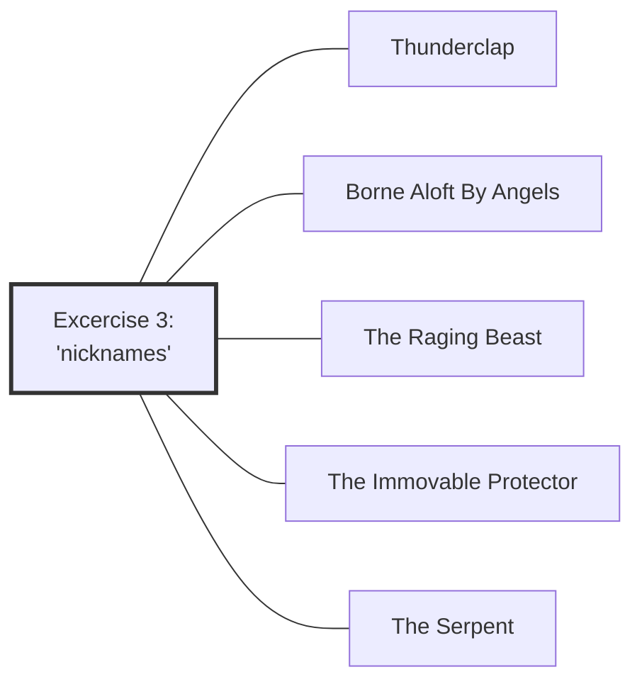

#Talk

[[Preliminaries Regarding Voice, Movement, and Gesture - Part 1|Preliminaries Regarding Voice, Movement, and Gesture - Part 1 🡄]] | [[2020 Vajra Music|🡅]] | [[Preliminaries Regarding Voice, Movement, and Gesture - Part 3|🡆 Preliminaries Regarding Voice, Movement, and Gesture - Part 3]]

Series: [[2020 Vajra Music]]
Transcript: [[0302 Preliminaries Regarding Voice, Movement, and Gesture - Part 2]]
Transcript PDF: [[2020_0302 Preliminaries Regarding Voice, Movement, and Gesture - Part 2.pdf]]

<audio controls preload=metadata style=" width:300px;" controlslist="nodownload"><source src="https://dharmaseed.org/talks/62453/20200302-Rob_Burbea-GAIA-preliminaries_regarding_voice_movement_and_gesture_part_2-62453.mp3" type="audio/mpeg">???</audio>

## Index
_<a data-href="Embodiment" class="internal-link">Embodiment</a> (95) · <a data-href="Soul" class="internal-link">Soul</a> (88) · <a data-href="Image" class="internal-link">Image</a> (62) · <a data-href="Retreat" class="internal-link">Retreat</a> (34) · <a data-href="Soulmaking" class="internal-link">Soulmaking</a> (30) · <a data-href="Energy body" class="internal-link">Energy body</a> (28) · <a data-href="Circuits" class="internal-link">Circuits</a> (22) · <a data-href="Daimon" class="internal-link">Daimon</a> (22) · <a data-href="Imaginal" class="internal-link">Imaginal</a> (17) · <a data-href="Anger" class="internal-link">Anger</a> (15) · <a data-href="Experience" class="internal-link">Experience</a> (14) · <a data-href="Soulmaking dynamic" class="internal-link">Soulmaking dynamic</a> (14) · <a data-href="Energy" class="internal-link">Energy</a> (13) · <a data-href="Dharma" class="internal-link">Dharma</a> (12) · <a data-href="Preliminaries" class="internal-link">Preliminaries</a> (12) · <a data-href="Mind" class="internal-link">Mind</a> (10) · <a data-href="Eros" class="internal-link">Eros</a> (9) · <a data-href="Inertia" class="internal-link">Inertia</a> (8) · <a data-href="Sankhara" class="internal-link">Sankhara</a> (7) · <a data-href="Duty" class="internal-link">Duty</a> (6) · <a data-href="Pedagogy" class="internal-link">Pedagogy</a> (6) · <a data-href="The Self" class="internal-link">The Self</a> (6) · <a data-href="Thunderclap" class="internal-link">Thunderclap</a> (6) · <a data-href="Meditation" class="internal-link">Meditation</a> (5) · <a data-href="The Immovable Protector" class="internal-link">The Immovable Protector</a> (5) · <a data-href="Ethics" class="internal-link">Ethics</a> (4) · <a data-href="Goenka" class="internal-link">Goenka</a> (4) · <a data-href="Grief" class="internal-link">Grief</a> (4) · <a data-href="Manifestations" class="internal-link">Manifestations</a> (4) · <a data-href="Music" class="internal-link">Music</a> (4) · <a aria-label-position="top" aria-label="Music > Jazz" data-href="Music#Jazz" class="internal-link">Music &gt; Jazz</a> (4) · <a data-href="The Serpent" class="internal-link">The Serpent</a> (4) · <a data-href="Alchemy" class="internal-link">Alchemy</a> (3) · <a data-href="Diamond Approach" class="internal-link">Diamond Approach</a> (3) · <a data-href="Dukkha" class="internal-link">Dukkha</a> (3) · <a data-href="Habit" class="internal-link">Habit</a> (3) · <a data-href="Insight" class="internal-link">Insight</a> (3) · <a data-href="Sila" class="internal-link">Sila</a> (3) · <a data-href="Sociology" class="internal-link">Sociology</a> (3) · <a data-href="Awareness" class="internal-link">Awareness</a> (2) · <a data-href="Beauty" class="internal-link">Beauty</a> (2) · <a data-href="Borne Aloft By Angels" class="internal-link">Borne Aloft By Angels</a> (2) · <a data-href="Citta" class="internal-link">Citta</a> (2) · <a data-href="Contraction" class="internal-link">Contraction</a> (2) · <a data-href="Devotion" class="internal-link">Devotion</a> (2) · <a data-href="Dominant culture" class="internal-link">Dominant culture</a> (2) · <a data-href="Hindrances" class="internal-link">Hindrances</a> (2) · <a data-href="Juiciness" class="internal-link">Juiciness</a> (2) · <a data-href="Love" class="internal-link">Love</a> (2) · <a data-href="Mindfulness" class="internal-link">Mindfulness</a> (2) · <a data-href="Pain" class="internal-link">Pain</a> (2) · <a data-href="Personhood" class="internal-link">Personhood</a> (2) · <a data-href="Precepts" class="internal-link">Precepts</a> (2) · <a data-href="Psyche" class="internal-link">Psyche</a> (2) · <a data-href="The Spreading of Five Wings" class="internal-link">The Spreading of Five Wings</a> (2) · <a data-href="Vessel" class="internal-link">Vessel</a> (2) · <a data-href="Voice, Movement, and the Possibilities of Soul" class="internal-link">Voice, Movement, and the Possibilities of Soul</a> (2) · <a data-href="Buddhism" class="internal-link">Buddhism</a> · <a data-href="Catherine McGee" class="internal-link">Catherine McGee</a> · <a data-href="Create-Discover" class="internal-link">Create-Discover</a> · <a data-href="Dana" class="internal-link">Dana</a> · <a data-href="Dharma Seed" class="internal-link">Dharma Seed</a> · <a data-href="Dimensionality" class="internal-link">Dimensionality</a> · <a data-href="Fantasy" class="internal-link">Fantasy</a> · <a data-href="Foundations of a Soulmaking Dharma" class="internal-link">Foundations of a Soulmaking Dharma</a> · <a data-href="Gaia House" class="internal-link">Gaia House</a> · <a data-href="Impermanence" class="internal-link">Impermanence</a> · <a data-href="In Psyche's Orchard" class="internal-link">In Psyche&#x27;s Orchard</a> · <a data-href="Logos" class="internal-link">Logos</a> · <a data-href="Metta" class="internal-link">Metta</a> · <a data-href="Middle Way" class="internal-link">Middle Way</a> · <a data-href="Passion" class="internal-link">Passion</a> · <a data-href="Receptivity" class="internal-link">Receptivity</a> · <a data-href="Relationships" class="internal-link">Relationships</a> · <a data-href="Sangha" class="internal-link">Sangha</a> · <a data-href="Sila and Soul" class="internal-link">Sila and Soul</a> · <a data-href="Spirituality" class="internal-link">Spirituality</a> · <a data-href="The Image of Ethics" class="internal-link">The Image of Ethics</a> · <a data-href="The Raging Beast" class="internal-link">The Raging Beast</a> · <a data-href="Theravada" class="internal-link">Theravada</a> · <a data-href="Wonder" class="internal-link">Wonder</a>_
 

## Referenced talks
- <a data-href="Daimon, Refracted" class="internal-link">Daimon, Refracted</a>
- <a data-href="Voice, Movement, and the Possibilities of Soul" class="internal-link">Voice, Movement, and the Possibilities of Soul</a>
- <a data-href="Sila and Soul" class="internal-link">Sila and Soul</a>
- <a data-href="The Image of Ethics" class="internal-link">The Image of Ethics</a>
- <a data-href="The Spreading of Five Wings" class="internal-link">The Spreading of Five Wings</a>
- <a data-href="Pain, as Void and as Sacrament" class="internal-link">Pain, as Void and as Sacrament</a>

## Paragraphs
[[Preliminaries Regarding Voice, Movement, and Gesture - Part 2 -|plain list]]

### Intro
##### Third set of excercises, but a few general things first
<a aria-label-position="top" aria-label="0302 Preliminaries Regarding Voice, Movement, and Gesture - Part 2 > ^1-1" data-href="0302 Preliminaries Regarding Voice, Movement, and Gesture - Part 2#^1-1" class="internal-link">1-1</a>

---
##### "Daimon, Refracted" 🟢
**<a aria-label-position="top" aria-label="0302 Preliminaries Regarding Voice, Movement, and Gesture - Part 2 > ^1-2" data-href="0302 Preliminaries Regarding Voice, Movement, and Gesture - Part 2#^1-2" class="internal-link">1-2</a>**: _<a data-href="Embodiment" class="internal-link">Embodiment</a> (2) · <a data-href="Retreat" class="internal-link">Retreat</a> · <a data-href="Meditation" class="internal-link">Meditation</a> · <a data-href="Soulmaking" class="internal-link">Soulmaking</a>_

references <a data-href="Daimon, Refracted" class="internal-link">Daimon, Refracted</a>

---
##### "Voice, Movement, and the Possibilities of Soul" ... but how many have picked it up? 🟢
**<a aria-label-position="top" aria-label="0302 Preliminaries Regarding Voice, Movement, and Gesture - Part 2 > ^1-3" data-href="0302 Preliminaries Regarding Voice, Movement, and Gesture - Part 2#^1-3" class="internal-link">1-3</a>**: _<a data-href="Retreat" class="internal-link">Retreat</a> · <a data-href="Foundations of a Soulmaking Dharma" class="internal-link">Foundations of a Soulmaking Dharma</a> · <a data-href="Dharma Seed" class="internal-link">Dharma Seed</a> · <a data-href="Voice, Movement, and the Possibilities of Soul" class="internal-link">Voice, Movement, and the Possibilities of Soul</a>_

---
##### If not, why not?
**<a aria-label-position="top" aria-label="0302 Preliminaries Regarding Voice, Movement, and Gesture - Part 2 > ^1-4" data-href="0302 Preliminaries Regarding Voice, Movement, and Gesture - Part 2#^1-4" class="internal-link">1-4</a>**: _<a data-href="Inertia" class="internal-link">Inertia</a> · <a data-href="Energy" class="internal-link">Energy</a> · <a data-href="Meditation" class="internal-link">Meditation</a>_

NOTE

revisits <a data-href="Inertia" class="internal-link">Inertia</a> 

---
##### "Why not?" points to failing to discriminate/discern signifiance
**<a aria-label-position="top" aria-label="0302 Preliminaries Regarding Voice, Movement, and Gesture - Part 2 > ^2-1" data-href="0302 Preliminaries Regarding Voice, Movement, and Gesture - Part 2#^2-1" class="internal-link">2-1</a>**: _<a data-href="Inertia" class="internal-link">Inertia</a> (2)_

---
##### The question also sheds light on pedagogy
**<a aria-label-position="top" aria-label="0302 Preliminaries Regarding Voice, Movement, and Gesture - Part 2 > ^2-2" data-href="0302 Preliminaries Regarding Voice, Movement, and Gesture - Part 2#^2-2" class="internal-link">2-2</a>**: _<a data-href="Pedagogy" class="internal-link">Pedagogy</a> (2) · <a data-href="Mind" class="internal-link">Mind</a> · <a data-href="Inertia" class="internal-link">Inertia</a>_

---
##### Recap from yesterday: it's about sensitivity
**<a aria-label-position="top" aria-label="0302 Preliminaries Regarding Voice, Movement, and Gesture - Part 2 > ^2-3" data-href="0302 Preliminaries Regarding Voice, Movement, and Gesture - Part 2#^2-3" class="internal-link">2-3</a>**: _<a data-href="Soulmaking" class="internal-link">Soulmaking</a> (2) · <a data-href="Energy body" class="internal-link">Energy body</a>_

---
##### We are often held back or holding in of our energy
**<a aria-label-position="top" aria-label="0302 Preliminaries Regarding Voice, Movement, and Gesture - Part 2 > ^2-4" data-href="0302 Preliminaries Regarding Voice, Movement, and Gesture - Part 2#^2-4" class="internal-link">2-4</a>**: _<a data-href="The Self" class="internal-link">The Self</a> · <a data-href="Sociology" class="internal-link">Sociology</a> · <a data-href="Energy" class="internal-link">Energy</a> (4) · <a data-href="Embodiment" class="internal-link">Embodiment</a> (2) · <a data-href="Sankhara" class="internal-link">Sankhara</a> (7) · <a data-href="Eros" class="internal-link">Eros</a> (3) · <a data-href="Soul" class="internal-link">Soul</a> (2) · <a data-href="Dominant culture" class="internal-link">Dominant culture</a> · <a data-href="Dharma" class="internal-link">Dharma</a>_

---
##### "Preliminaries" can become ensouled
**<a aria-label-position="top" aria-label="0302 Preliminaries Regarding Voice, Movement, and Gesture - Part 2 > ^3-1" data-href="0302 Preliminaries Regarding Voice, Movement, and Gesture - Part 2#^3-1" class="internal-link">3-1</a>**: _<a data-href="Preliminaries" class="internal-link">Preliminaries</a> (7) · <a data-href="Mindfulness" class="internal-link">Mindfulness</a> · <a data-href="Energy body" class="internal-link">Energy body</a> · <a data-href="Soul" class="internal-link">Soul</a> · <a data-href="Retreat" class="internal-link">Retreat</a>_

---
##### Energy body excercises open towards relating to it as imaginal image
**<a aria-label-position="top" aria-label="0302 Preliminaries Regarding Voice, Movement, and Gesture - Part 2 > ^3-2" data-href="0302 Preliminaries Regarding Voice, Movement, and Gesture - Part 2#^3-2" class="internal-link">3-2</a>**: _<a data-href="Soul" class="internal-link">Soul</a> (4) · <a data-href="Preliminaries" class="internal-link">Preliminaries</a> · <a data-href="Energy body" class="internal-link">Energy body</a> (4) · <a data-href="Awareness" class="internal-link">Awareness</a> (2) · <a data-href="Embodiment" class="internal-link">Embodiment</a> · <a data-href="Imaginal" class="internal-link">Imaginal</a> (4)_

---
##### "Sila and Soul", "The Image of Ethics" 🟢
**<a aria-label-position="top" aria-label="0302 Preliminaries Regarding Voice, Movement, and Gesture - Part 2 > ^3-3" data-href="0302 Preliminaries Regarding Voice, Movement, and Gesture - Part 2#^3-3" class="internal-link">3-3</a>**: _<a data-href="Sila" class="internal-link">Sila</a> (3) · <a data-href="Ethics" class="internal-link">Ethics</a> (4) · <a data-href="Dharma" class="internal-link">Dharma</a> (3) · <a data-href="Precepts" class="internal-link">Precepts</a> (2) · <a data-href="Theravada" class="internal-link">Theravada</a> · <a data-href="Buddhism" class="internal-link">Buddhism</a> · <a data-href="Sila and Soul" class="internal-link">Sila and Soul</a> · <a data-href="The Image of Ethics" class="internal-link">The Image of Ethics</a> · <a data-href="Soulmaking dynamic" class="internal-link">Soulmaking dynamic</a> · <a data-href="Imaginal" class="internal-link">Imaginal</a> · <a data-href="Soul" class="internal-link">Soul</a> (2) · <a data-href="Dimensionality" class="internal-link">Dimensionality</a> · <a data-href="Beauty" class="internal-link">Beauty</a>_

---
##### Why "preliminaries"? Because it expands soulmaking
**<a aria-label-position="top" aria-label="0302 Preliminaries Regarding Voice, Movement, and Gesture - Part 2 > ^3-4" data-href="0302 Preliminaries Regarding Voice, Movement, and Gesture - Part 2#^3-4" class="internal-link">3-4</a>**: _<a data-href="Soul" class="internal-link">Soul</a> · <a data-href="Dana" class="internal-link">Dana</a> · <a data-href="Mindfulness" class="internal-link">Mindfulness</a> · <a data-href="Preliminaries" class="internal-link">Preliminaries</a> (3) · <a data-href="Soulmaking dynamic" class="internal-link">Soulmaking dynamic</a> (2) · <a data-href="Experience" class="internal-link">Experience</a> (2) · <a data-href="Insight" class="internal-link">Insight</a> · <a data-href="Vessel" class="internal-link">Vessel</a>_

---
##### If we like practicing soulmaking the soulmaking dynamic will expand
**<a aria-label-position="top" aria-label="0302 Preliminaries Regarding Voice, Movement, and Gesture - Part 2 > ^4-1" data-href="0302 Preliminaries Regarding Voice, Movement, and Gesture - Part 2#^4-1" class="internal-link">4-1</a>**: _<a data-href="Soulmaking" class="internal-link">Soulmaking</a> · <a data-href="Soulmaking dynamic" class="internal-link">Soulmaking dynamic</a> (2) · <a data-href="Vessel" class="internal-link">Vessel</a> · <a data-href="Embodiment" class="internal-link">Embodiment</a>_

<audio controls preload=metadata style=" width:300px;" controlslist="nodownload"><source src="https://dharmaseed.org/talks/62453/20200302-Rob_Burbea-GAIA-preliminaries_regarding_voice_movement_and_gesture_part_2-62453.mp3#t=15:46" type="audio/mpeg">???</audio>

---
##### There can be blocks which are too entrenched
**<a aria-label-position="top" aria-label="0302 Preliminaries Regarding Voice, Movement, and Gesture - Part 2 > ^4-2" data-href="0302 Preliminaries Regarding Voice, Movement, and Gesture - Part 2#^4-2" class="internal-link">4-2</a>**: _<a data-href="Embodiment" class="internal-link">Embodiment</a> (2) · <a data-href="Soulmaking dynamic" class="internal-link">Soulmaking dynamic</a> (5) · <a data-href="Eros" class="internal-link">Eros</a> (3) · <a data-href="Psyche" class="internal-link">Psyche</a> · <a data-href="Logos" class="internal-link">Logos</a> · <a data-href="Soul" class="internal-link">Soul</a>_

---
##### Those areas remain out of reach
**<a aria-label-position="top" aria-label="0302 Preliminaries Regarding Voice, Movement, and Gesture - Part 2 > ^4-3" data-href="0302 Preliminaries Regarding Voice, Movement, and Gesture - Part 2#^4-3" class="internal-link">4-3</a>**: _<a data-href="Soulmaking dynamic" class="internal-link">Soulmaking dynamic</a> (2) · <a data-href="Create-Discover" class="internal-link">Create-Discover</a> · <a data-href="Soul" class="internal-link">Soul</a> (2)_

---
##### What does it mean for movement/gesture/voice to be ensouled?
**<a aria-label-position="top" aria-label="0302 Preliminaries Regarding Voice, Movement, and Gesture - Part 2 > ^4-4" data-href="0302 Preliminaries Regarding Voice, Movement, and Gesture - Part 2#^4-4" class="internal-link">4-4</a>**: _<a data-href="Embodiment" class="internal-link">Embodiment</a> (2) · <a data-href="Soul" class="internal-link">Soul</a> (2)_

<audio controls preload=metadata style=" width:300px;" controlslist="nodownload"><source src="https://dharmaseed.org/talks/62453/20200302-Rob_Burbea-GAIA-preliminaries_regarding_voice_movement_and_gesture_part_2-62453.mp3#t=19:22" type="audio/mpeg">???</audio>

---
##### There are roads that are open
**<a aria-label-position="top" aria-label="0302 Preliminaries Regarding Voice, Movement, and Gesture - Part 2 > ^4-5" data-href="0302 Preliminaries Regarding Voice, Movement, and Gesture - Part 2#^4-5" class="internal-link">4-5</a>**: _<a data-href="Soul" class="internal-link">Soul</a> (8) · <a data-href="Embodiment" class="internal-link">Embodiment</a> (4) · <a data-href="Music" class="internal-link">Music</a>_

---
##### (1) If soul wants to manifest, it can
**<a aria-label-position="top" aria-label="0302 Preliminaries Regarding Voice, Movement, and Gesture - Part 2 > ^5-1" data-href="0302 Preliminaries Regarding Voice, Movement, and Gesture - Part 2#^5-1" class="internal-link">5-1</a>**: _<a data-href="Soul" class="internal-link">Soul</a> (7) · <a data-href="Embodiment" class="internal-link">Embodiment</a>_

What does it mean for movement/gesture/voice to be ensouled?
1. if soul wants to manifest, it can
2. ordinary usages of movement/gesture/voice can be sensed with soul

❝

So <i>if</i> it wants to express and communicate through and using those aspects of being, if soul wants that, it <i>can</i>. ... There's not something that bars those directions and domains from being ensouled, bars soul from flowing through and expressing and communicating in and through and with those aspects of our being. 

---
##### (2) Ordinary usages of movement/gesture/voice can be sensed with soul
**<a aria-label-position="top" aria-label="0302 Preliminaries Regarding Voice, Movement, and Gesture - Part 2 > ^5-2" data-href="0302 Preliminaries Regarding Voice, Movement, and Gesture - Part 2#^5-2" class="internal-link">5-2</a>**: _<a data-href="Embodiment" class="internal-link">Embodiment</a> (3) · <a data-href="Soul" class="internal-link">Soul</a> (4) · <a data-href="Daimon" class="internal-link">Daimon</a> (2) · <a data-href="Soulmaking" class="internal-link">Soulmaking</a>_

❝

A second thing that it means is that the movement, gesture, and voice of oneself or of another, in their everyday, ordinary usages - just the voice speaking, or just having a conversation, or exclaiming something, or the hand moving as it speaks, or whatever it is - those ordinary usages of movement, of gesture, of voice can be sensed with soul, can be sensed, therefore, as angelic, as refracting the <a aria-label-position="top" aria-label="Daimon" data-href="Daimon" class="internal-link">angel</a>, the daimon.  

---
##### With regard to the "grief", there were plenty of things within jazz that I figured out on my own
**<a aria-label-position="top" aria-label="0302 Preliminaries Regarding Voice, Movement, and Gesture - Part 2 > ^5-3" data-href="0302 Preliminaries Regarding Voice, Movement, and Gesture - Part 2#^5-3" class="internal-link">5-3</a>**: _<a data-href="Grief" class="internal-link">Grief</a> (3) · <a aria-label-position="top" aria-label="Music > Jazz" data-href="Music#Jazz" class="internal-link">Music &gt; Jazz</a> (4) · <a data-href="Music" class="internal-link">Music</a> · <a data-href="Eros" class="internal-link">Eros</a>_

[[Preliminaries Regarding Voice, Movement, and Gesture - Part 1#Soul-grief from not practicing being fluid]]

---
##### I could have just kept bashing away, but I didn't
**<a aria-label-position="top" aria-label="0302 Preliminaries Regarding Voice, Movement, and Gesture - Part 2 > ^5-4" data-href="0302 Preliminaries Regarding Voice, Movement, and Gesture - Part 2#^5-4" class="internal-link">5-4</a>**: _<a data-href="Music" class="internal-link">Music</a> · <a data-href="Pedagogy" class="internal-link">Pedagogy</a>_

❝

Yes, I wasn't taught it, because, as I said, there wasn't the <a data-href="pedagogy" class="internal-link">pedagogy</a> there at that time. But I could have just kept bashing away in this dogged way that one has if one really wants something. I didn't. I chose other things instead. So there's regret. There's some responsibility that falls on me. 

---
##### So practice in a way that you don't end up regretting
**<a aria-label-position="top" aria-label="0302 Preliminaries Regarding Voice, Movement, and Gesture - Part 2 > ^6-1" data-href="0302 Preliminaries Regarding Voice, Movement, and Gesture - Part 2#^6-1" class="internal-link">6-1</a>**: _<a data-href="Soulmaking" class="internal-link">Soulmaking</a> (2) · <a data-href="Soul" class="internal-link">Soul</a> (3)_

❝

In a way, I'm offering these particular teachings now, offering them so that there's the possibility that you can practise, and practise in a way that you don't end up regretting, that you don't end up regretting not supporting yourself fully, or allowing yourself or enabling yourself fully to move in the direction or be moved in the direction of what <i>you</i> want with respect to <a aria-label-position="top" aria-label="Soulmaking" data-href="Soulmaking" class="internal-link">Soulmaking Dharma</a>, and also what you want with respect to <a data-href="soul" class="internal-link">soul</a> in life, the expression and the living of soul in life, <i>your</i> soul in <i>your</i> life. We must call that Soulmaking Dharma; it's not something separate. 

---
##### We need to take care about the basic nuts and bolts
**<a aria-label-position="top" aria-label="0302 Preliminaries Regarding Voice, Movement, and Gesture - Part 2 > ^6-2" data-href="0302 Preliminaries Regarding Voice, Movement, and Gesture - Part 2#^6-2" class="internal-link">6-2</a>**: _<a data-href="Grief" class="internal-link">Grief</a> · <a data-href="Soul" class="internal-link">Soul</a>_

<audio controls preload=metadata style=" width:300px;" controlslist="nodownload"><source src="https://dharmaseed.org/talks/62453/20200302-Rob_Burbea-GAIA-preliminaries_regarding_voice_movement_and_gesture_part_2-62453.mp3#t=28:15" type="audio/mpeg">???</audio>

---
##### What does hearing about preliminaries do to you? First extreme: never bother
**<a aria-label-position="top" aria-label="0302 Preliminaries Regarding Voice, Movement, and Gesture - Part 2 > ^6-3" data-href="0302 Preliminaries Regarding Voice, Movement, and Gesture - Part 2#^6-3" class="internal-link">6-3</a>**: _<a data-href="Embodiment" class="internal-link">Embodiment</a> · <a data-href="Preliminaries" class="internal-link">Preliminaries</a>_

---
##### Second extreme: spend hours and years on them before doing something else
**<a aria-label-position="top" aria-label="0302 Preliminaries Regarding Voice, Movement, and Gesture - Part 2 > ^6-4" data-href="0302 Preliminaries Regarding Voice, Movement, and Gesture - Part 2#^6-4" class="internal-link">6-4</a>**: _<a data-href="Middle Way" class="internal-link">Middle Way</a> · <a data-href="Inertia" class="internal-link">Inertia</a> · <a data-href="Insight" class="internal-link">Insight</a>_

---
##### And always listen to you body, adapt it if necessary
**<a aria-label-position="top" aria-label="0302 Preliminaries Regarding Voice, Movement, and Gesture - Part 2 > ^6-5" data-href="0302 Preliminaries Regarding Voice, Movement, and Gesture - Part 2#^6-5" class="internal-link">6-5</a>**: _<a data-href="Embodiment" class="internal-link">Embodiment</a> (5)_

---
### Excercise 3
##### Excercise 3 has 5 parts
**<a aria-label-position="top" aria-label="0302 Preliminaries Regarding Voice, Movement, and Gesture - Part 2 > ^7-1" data-href="0302 Preliminaries Regarding Voice, Movement, and Gesture - Part 2#^7-1" class="internal-link">7-1</a>**: _<a data-href="Energy body" class="internal-link">Energy body</a> (3) · <a data-href="Image" class="internal-link">Image</a>_

==variations==
- do it concretely, physically
- do it just with the energy body, with the image-sense

---
##### The parts have nicknames
<a aria-label-position="top" aria-label="0302 Preliminaries Regarding Voice, Movement, and Gesture - Part 2 > ^7-2" data-href="0302 Preliminaries Regarding Voice, Movement, and Gesture - Part 2#^7-2" class="internal-link">7-2</a>

---
#### 🟡 Excercise 3.1: _Thunderclap_
##### This was the one which started it all
**<a aria-label-position="top" aria-label="0302 Preliminaries Regarding Voice, Movement, and Gesture - Part 2 > ^7-4" data-href="0302 Preliminaries Regarding Voice, Movement, and Gesture - Part 2#^7-4" class="internal-link">7-4</a>**: _<a data-href="Thunderclap" class="internal-link">Thunderclap</a> (2)_

<audio controls preload=metadata style=" width:300px;" controlslist="nodownload"><source src="https://dharmaseed.org/talks/62453/20200302-Rob_Burbea-GAIA-preliminaries_regarding_voice_movement_and_gesture_part_2-62453.mp3#t=33:34" type="audio/mpeg">???</audio>

Interesting

This one was the one which made Rob compile those offerings, so it's really, really important 

---
##### Emphatic gesture
**<a aria-label-position="top" aria-label="0302 Preliminaries Regarding Voice, Movement, and Gesture - Part 2 > ^7-5" data-href="0302 Preliminaries Regarding Voice, Movement, and Gesture - Part 2#^7-5" class="internal-link">7-5</a>**: _<a data-href="Energy" class="internal-link">Energy</a> (2) · <a data-href="Soul" class="internal-link">Soul</a> (5) · <a data-href="Imaginal" class="internal-link">Imaginal</a> · <a data-href="Eros" class="internal-link">Eros</a> · <a data-href="Mind" class="internal-link">Mind</a> · <a data-href="Embodiment" class="internal-link">Embodiment</a> (3)_
- relativly short
- maybe with vocalization
- emphatic, i.e. force, energy, strength in it
- soul is coming through

---
##### Thunderclap examples
**<a aria-label-position="top" aria-label="0302 Preliminaries Regarding Voice, Movement, and Gesture - Part 2 > ^7-6" data-href="0302 Preliminaries Regarding Voice, Movement, and Gesture - Part 2#^7-6" class="internal-link">7-6</a>**: _<a data-href="Mind" class="internal-link">Mind</a> · <a data-href="Embodiment" class="internal-link">Embodiment</a> (3)_
- stamp the foot
- gesture with arms or fists
- kick
- karate chop

=> needs coming togehter, coherence, congruence

---
##### ==variations==
<a aria-label-position="top" aria-label="0302 Preliminaries Regarding Voice, Movement, and Gesture - Part 2 > ^7-7" data-href="0302 Preliminaries Regarding Voice, Movement, and Gesture - Part 2#^7-7" class="internal-link">7-7</a>

❝

you don't actually know what you're going to do. You just feel the impulse, and let that coalesce, and let it come out. Or it could be it's a precise move. You've rehearsed it, and you know exactly what it looks like and what it's going to sound like, and you do that. Those two alternatives will apply to all of these five examples. 

- sponteneous
- rehearsed

=> up to fifteen seconds, then kind of gathering (citta, energy body, awareness), stopping, regrouping. Then another burst

**"Phet"**
- https://www.youtube.com/watch?v=iqNhj5QL5GA&ab_channel=RoamingYogi
- https://www.youtube.com/watch?v=ycK9s495xlY&ab_channel=PemakoBuddhism
- https://www.youtube.com/watch?v=0VeK_XCyRRc&ab_channel=PemakoBuddhism

---
##### Bring everything together: mind, intention, soul, body
**<a aria-label-position="top" aria-label="0302 Preliminaries Regarding Voice, Movement, and Gesture - Part 2 > ^8-1" data-href="0302 Preliminaries Regarding Voice, Movement, and Gesture - Part 2#^8-1" class="internal-link">8-1</a>**: _<a data-href="Mind" class="internal-link">Mind</a> · <a data-href="Soul" class="internal-link">Soul</a> · <a data-href="Embodiment" class="internal-link">Embodiment</a>_

---
##### You assess it first (the student)
**<a aria-label-position="top" aria-label="0302 Preliminaries Regarding Voice, Movement, and Gesture - Part 2 > ^8-2" data-href="0302 Preliminaries Regarding Voice, Movement, and Gesture - Part 2#^8-2" class="internal-link">8-2</a>**: _<a data-href="Retreat" class="internal-link">Retreat</a> (4) · <a data-href="Thunderclap" class="internal-link">Thunderclap</a> (2) · <a data-href="Embodiment" class="internal-link">Embodiment</a> · <a data-href="Energy" class="internal-link">Energy</a>_

---
##### Then I assess it (the teacher)
**<a aria-label-position="top" aria-label="0302 Preliminaries Regarding Voice, Movement, and Gesture - Part 2 > ^8-3" data-href="0302 Preliminaries Regarding Voice, Movement, and Gesture - Part 2#^8-3" class="internal-link">8-3</a>**: _<a data-href="Dominant culture" class="internal-link">Dominant culture</a> · <a data-href="Dharma" class="internal-link">Dharma</a> (2) · <a data-href="Retreat" class="internal-link">Retreat</a> (2)_

❝

But I think even the ability to really read these things in another person and sense them is also quite rare ... For most people, it will probably only develop through practice and through doing it oneself. Then some people will develop the ability to sort of get a sense with other people. We can be easily misled in these areas, very easily misled. 

---
##### "I'll come back to what's this assessment bit about" ^assessment-1
**<a aria-label-position="top" aria-label="0302 Preliminaries Regarding Voice, Movement, and Gesture - Part 2 > ^8-4" data-href="0302 Preliminaries Regarding Voice, Movement, and Gesture - Part 2#^8-4" class="internal-link">8-4</a>**: _<a data-href="Retreat" class="internal-link">Retreat</a> (2) · <a data-href="Meditation" class="internal-link">Meditation</a> · <a data-href="Energy body" class="internal-link">Energy body</a> · <a data-href="Imaginal" class="internal-link">Imaginal</a> · <a data-href="Gaia House" class="internal-link">Gaia House</a>_

see [[Preliminaries Regarding Voice, Movement, and Gesture - Part 2#^assessment-2|below]]

---
#### 🟡 Excercise 3.2: _Borne Aloft by Angels_
##### Make your body buoyant
**<a aria-label-position="top" aria-label="0302 Preliminaries Regarding Voice, Movement, and Gesture - Part 2 > ^9-1" data-href="0302 Preliminaries Regarding Voice, Movement, and Gesture - Part 2#^9-1" class="internal-link">9-1</a>**: _<a data-href="Borne Aloft By Angels" class="internal-link">Borne Aloft By Angels</a> (2) · <a data-href="Embodiment" class="internal-link">Embodiment</a> (4) · <a data-href="Image" class="internal-link">Image</a> · <a data-href="Love" class="internal-link">Love</a>_
==timing==
- max 2 minutes
- certainly >20 seconds
- either 2 minutes straight or 15s bursts

---
##### Be moved by these angels
**<a aria-label-position="top" aria-label="0302 Preliminaries Regarding Voice, Movement, and Gesture - Part 2 > ^9-2" data-href="0302 Preliminaries Regarding Voice, Movement, and Gesture - Part 2#^9-2" class="internal-link">9-2</a>**: _<a data-href="Embodiment" class="internal-link">Embodiment</a> (6) · <a data-href="Daimon" class="internal-link">Daimon</a> (2) · <a data-href="Energy body" class="internal-link">Energy body</a> · <a data-href="Soul" class="internal-link">Soul</a> · <a data-href="Retreat" class="internal-link">Retreat</a>_
- express with body of being borne aloft
- weightless angels carry me => soaring
- held up by gossamer threads of love and light
- almost as if we celebrate something
- body becomes fluid
- surrendering
- carried by people in a concert
- being held and being moved

---
#### 🟡 Excercise 3.3: _The Raging Beast_
##### Different types of beasts
**<a aria-label-position="top" aria-label="0302 Preliminaries Regarding Voice, Movement, and Gesture - Part 2 > ^9-3" data-href="0302 Preliminaries Regarding Voice, Movement, and Gesture - Part 2#^9-3" class="internal-link">9-3</a>**: _<a data-href="The Raging Beast" class="internal-link">The Raging Beast</a> · <a data-href="Mind" class="internal-link">Mind</a>_
==variations==
- only raging
- with horns, fangs
- _a_ raging beast vs _the_

---
##### Gather the citta, then another burst
**<a aria-label-position="top" aria-label="0302 Preliminaries Regarding Voice, Movement, and Gesture - Part 2 > ^9-4" data-href="0302 Preliminaries Regarding Voice, Movement, and Gesture - Part 2#^9-4" class="internal-link">9-4</a>**: _<a data-href="Hindrances" class="internal-link">Hindrances</a> (2) · <a data-href="Embodiment" class="internal-link">Embodiment</a> (2) · <a data-href="Citta" class="internal-link">Citta</a> · <a data-href="Energy body" class="internal-link">Energy body</a>_

---
##### Vocalization is possible, not necessary - - get more discriminating
**<a aria-label-position="top" aria-label="0302 Preliminaries Regarding Voice, Movement, and Gesture - Part 2 > ^9-5" data-href="0302 Preliminaries Regarding Voice, Movement, and Gesture - Part 2#^9-5" class="internal-link">9-5</a>**: _<a data-href="Embodiment" class="internal-link">Embodiment</a>_

---
#### 🟡 Excercise 3.4: _The Immovable Protector_
##### Human? Angel? Mythic Figure? What are they protecting?
**<a aria-label-position="top" aria-label="0302 Preliminaries Regarding Voice, Movement, and Gesture - Part 2 > ^9-6" data-href="0302 Preliminaries Regarding Voice, Movement, and Gesture - Part 2#^9-6" class="internal-link">9-6</a>**: _<a data-href="The Immovable Protector" class="internal-link">The Immovable Protector</a> (4) · <a data-href="Fantasy" class="internal-link">Fantasy</a> · <a data-href="Sociology" class="internal-link">Sociology</a> (2) · <a data-href="Embodiment" class="internal-link">Embodiment</a>_

<audio controls preload=metadata style=" width:300px;" controlslist="nodownload"><source src="https://dharmaseed.org/talks/62453/20200302-Rob_Burbea-GAIA-preliminaries_regarding_voice_movement_and_gesture_part_2-62453.mp3#t=46:55" type="audio/mpeg">???</audio>

==variations==
- type of guardian
	- human guardan
	- inhuman
	- demonic
	- angelic
	- animal
	- mythic creature
- what's protected?
	- earth
	- social justice
- modes might change from time to time

---
##### Modalities
**<a aria-label-position="top" aria-label="0302 Preliminaries Regarding Voice, Movement, and Gesture - Part 2 > ^10-1" data-href="0302 Preliminaries Regarding Voice, Movement, and Gesture - Part 2#^10-1" class="internal-link">10-1</a>**: _<a data-href="The Immovable Protector" class="internal-link">The Immovable Protector</a> · <a data-href="Energy body" class="internal-link">Energy body</a> (2) · <a data-href="Mind" class="internal-link">Mind</a> · <a data-href="Soul" class="internal-link">Soul</a> · <a data-href="Image" class="internal-link">Image</a>_
==variations==
- range of movement
	- immovable
	- little movement
	- a lot of movement
	- no movement
- stance
- posture

---
##### 🟡 Excercise 3.5: _The Serpent_
**<a aria-label-position="top" aria-label="0302 Preliminaries Regarding Voice, Movement, and Gesture - Part 2 > ^10-2" data-href="0302 Preliminaries Regarding Voice, Movement, and Gesture - Part 2#^10-2" class="internal-link">10-2</a>**: _<a data-href="The Serpent" class="internal-link">The Serpent</a> (4)_

<audio controls preload=metadata style=" width:300px;" controlslist="nodownload"><source src="https://dharmaseed.org/talks/62453/20200302-Rob_Burbea-GAIA-preliminaries_regarding_voice_movement_and_gesture_part_2-62453.mp3#t=49:02" type="audio/mpeg">???</audio>

[[Preliminaries Regarding Voice, Movement, and Gesture - Part 4#^the-serpent]]

---
##### Summary of some modalities
**<a aria-label-position="top" aria-label="0302 Preliminaries Regarding Voice, Movement, and Gesture - Part 2 > ^10-3" data-href="0302 Preliminaries Regarding Voice, Movement, and Gesture - Part 2#^10-3" class="internal-link">10-3</a>**: _<a data-href="Energy body" class="internal-link">Energy body</a> · <a data-href="Imaginal" class="internal-link">Imaginal</a> (2) · <a data-href="Image" class="internal-link">Image</a> · <a data-href="Embodiment" class="internal-link">Embodiment</a>_

---
##### Excercise 3 ends
<a aria-label-position="top" aria-label="0302 Preliminaries Regarding Voice, Movement, and Gesture - Part 2 > ^10-4" data-href="0302 Preliminaries Regarding Voice, Movement, and Gesture - Part 2#^10-4" class="internal-link">10-4</a>

<audio controls preload=metadata style=" width:300px;" controlslist="nodownload"><source src="https://dharmaseed.org/talks/62453/20200302-Rob_Burbea-GAIA-preliminaries_regarding_voice_movement_and_gesture_part_2-62453.mp3#t=50:32" type="audio/mpeg">???</audio>

---
### Again: Why?
##### Ability to gather momentum (e.g. for Thunderclap) is quite rare
**<a aria-label-position="top" aria-label="0302 Preliminaries Regarding Voice, Movement, and Gesture - Part 2 > ^10-5" data-href="0302 Preliminaries Regarding Voice, Movement, and Gesture - Part 2#^10-5" class="internal-link">10-5</a>**: _<a data-href="Passion" class="internal-link">Passion</a> · <a data-href="Thunderclap" class="internal-link">Thunderclap</a> (2) · <a data-href="Citta" class="internal-link">Citta</a> · <a data-href="Soul" class="internal-link">Soul</a> · <a data-href="Mind" class="internal-link">Mind</a> · <a data-href="Embodiment" class="internal-link">Embodiment</a> · <a data-href="Energy" class="internal-link">Energy</a> · <a data-href="Wonder" class="internal-link">Wonder</a> · <a data-href="Dharma" class="internal-link">Dharma</a> (2)_

---
##### Circuits aren't connected, and it limits what arises imaginally
**<a aria-label-position="top" aria-label="0302 Preliminaries Regarding Voice, Movement, and Gesture - Part 2 > ^10-6" data-href="0302 Preliminaries Regarding Voice, Movement, and Gesture - Part 2#^10-6" class="internal-link">10-6</a>**: _<a data-href="Embodiment" class="internal-link">Embodiment</a> · <a data-href="Mind" class="internal-link">Mind</a> · <a data-href="Energy" class="internal-link">Energy</a> · <a data-href="Soul" class="internal-link">Soul</a> · <a data-href="Circuits" class="internal-link">Circuits</a> (5) · <a data-href="Image" class="internal-link">Image</a> (7) · <a data-href="Soulmaking" class="internal-link">Soulmaking</a> (2) · <a data-href="Imaginal" class="internal-link">Imaginal</a> · <a data-href="Soulmaking dynamic" class="internal-link">Soulmaking dynamic</a> (2)_

---
##### This affects the whole psyche, heart, relation to others
**<a aria-label-position="top" aria-label="0302 Preliminaries Regarding Voice, Movement, and Gesture - Part 2 > ^11-1" data-href="0302 Preliminaries Regarding Voice, Movement, and Gesture - Part 2#^11-1" class="internal-link">11-1</a>**: _<a data-href="Circuits" class="internal-link">Circuits</a> (2) · <a data-href="Image" class="internal-link">Image</a> (5) · <a data-href="Embodiment" class="internal-link">Embodiment</a> · <a data-href="Energy body" class="internal-link">Energy body</a> · <a data-href="The Self" class="internal-link">The Self</a> · <a data-href="Soulmaking" class="internal-link">Soulmaking</a> (4) · <a data-href="Meditation" class="internal-link">Meditation</a> · <a data-href="Soul" class="internal-link">Soul</a> (4) · <a data-href="Duty" class="internal-link">Duty</a> · <a data-href="Psyche" class="internal-link">Psyche</a> · <a data-href="Relationships" class="internal-link">Relationships</a>_

---
##### It also affects the decision to practice these kind of excercises
**<a aria-label-position="top" aria-label="0302 Preliminaries Regarding Voice, Movement, and Gesture - Part 2 > ^11-2" data-href="0302 Preliminaries Regarding Voice, Movement, and Gesture - Part 2#^11-2" class="internal-link">11-2</a>**: _<a data-href="Circuits" class="internal-link">Circuits</a> · <a data-href="Soulmaking" class="internal-link">Soulmaking</a> · <a data-href="Soul" class="internal-link">Soul</a>_

---
##### So careful if you feel resistance to some of these excercises
<a aria-label-position="top" aria-label="0302 Preliminaries Regarding Voice, Movement, and Gesture - Part 2 > ^11-3" data-href="0302 Preliminaries Regarding Voice, Movement, and Gesture - Part 2#^11-3" class="internal-link">11-3</a>

❝

Just an invitation to really ponder: is there something, a much larger trajectory, absence of trajectory here, in one's life - patterning, limitation, blind spots, incapacities, impossibilities? You can do what you want, but just the invitation to take care, and to really inquire into that. 

---
##### Why would you neglect to practice this?
**<a aria-label-position="top" aria-label="0302 Preliminaries Regarding Voice, Movement, and Gesture - Part 2 > ^12-1" data-href="0302 Preliminaries Regarding Voice, Movement, and Gesture - Part 2#^12-1" class="internal-link">12-1</a>**: _<a data-href="Image" class="internal-link">Image</a> · <a data-href="Energy body" class="internal-link">Energy body</a> · <a data-href="Embodiment" class="internal-link">Embodiment</a>_

---
##### There are consequences to neglecting
**<a aria-label-position="top" aria-label="0302 Preliminaries Regarding Voice, Movement, and Gesture - Part 2 > ^12-2" data-href="0302 Preliminaries Regarding Voice, Movement, and Gesture - Part 2#^12-2" class="internal-link">12-2</a>**: _<a data-href="Image" class="internal-link">Image</a> · <a data-href="Energy body" class="internal-link">Energy body</a> · <a data-href="Embodiment" class="internal-link">Embodiment</a> · <a data-href="Manifestations" class="internal-link">Manifestations</a> · <a data-href="Soulmaking" class="internal-link">Soulmaking</a> · <a data-href="Inertia" class="internal-link">Inertia</a>_

❝

There will be consequences to neglecting, not picking up, and just kind of giving in to one's <a data-href="inertia" class="internal-link">inertia</a> without really examining it and questioning it. 

---
##### "Do I really know what's going on for me here?"
<a aria-label-position="top" aria-label="0302 Preliminaries Regarding Voice, Movement, and Gesture - Part 2 > ^12-3" data-href="0302 Preliminaries Regarding Voice, Movement, and Gesture - Part 2#^12-3" class="internal-link">12-3</a>

---
##### It may take repeated practice to reopen the circuits
**<a aria-label-position="top" aria-label="0302 Preliminaries Regarding Voice, Movement, and Gesture - Part 2 > ^12-4" data-href="0302 Preliminaries Regarding Voice, Movement, and Gesture - Part 2#^12-4" class="internal-link">12-4</a>**: _<a data-href="Circuits" class="internal-link">Circuits</a> (3) · <a data-href="Soul" class="internal-link">Soul</a> · <a data-href="Embodiment" class="internal-link">Embodiment</a> (2)_

<audio controls preload=metadata style=" width:300px;" controlslist="nodownload"><source src="https://dharmaseed.org/talks/62453/20200302-Rob_Burbea-GAIA-preliminaries_regarding_voice_movement_and_gesture_part_2-62453.mp3#t=01:01:50" type="audio/mpeg">???</audio>

---
##### It's not about self-empowerment or catharsis, it's to let soul do what soul wants
**<a aria-label-position="top" aria-label="0302 Preliminaries Regarding Voice, Movement, and Gesture - Part 2 > ^12-5" data-href="0302 Preliminaries Regarding Voice, Movement, and Gesture - Part 2#^12-5" class="internal-link">12-5</a>**: _<a data-href="Anger" class="internal-link">Anger</a> · <a data-href="Soul" class="internal-link">Soul</a> (3) · <a data-href="Image" class="internal-link">Image</a> (2) · <a data-href="Energy body" class="internal-link">Energy body</a> (2) · <a data-href="Duty" class="internal-link">Duty</a> (2)_

---
##### And it's about everyday sensing with soul
**<a aria-label-position="top" aria-label="0302 Preliminaries Regarding Voice, Movement, and Gesture - Part 2 > ^13-1" data-href="0302 Preliminaries Regarding Voice, Movement, and Gesture - Part 2#^13-1" class="internal-link">13-1</a>**: _<a data-href="Retreat" class="internal-link">Retreat</a> · <a data-href="Embodiment" class="internal-link">Embodiment</a> · <a data-href="Soul" class="internal-link">Soul</a> (2)_

---
##### Why this business about assessment? ^assessment-2
**<a aria-label-position="top" aria-label="0302 Preliminaries Regarding Voice, Movement, and Gesture - Part 2 > ^13-2" data-href="0302 Preliminaries Regarding Voice, Movement, and Gesture - Part 2#^13-2" class="internal-link">13-2</a>**: _<a data-href="Dharma" class="internal-link">Dharma</a> (3) · <a data-href="Retreat" class="internal-link">Retreat</a> · <a data-href="The Self" class="internal-link">The Self</a> · <a data-href="Manifestations" class="internal-link">Manifestations</a> (2) · <a data-href="Soul" class="internal-link">Soul</a> · <a data-href="Energy" class="internal-link">Energy</a> · <a data-href="Embodiment" class="internal-link">Embodiment</a>_

see [[Preliminaries Regarding Voice, Movement, and Gesture - Part 2#^assessment-1|above]] 

---
##### Because it makes it more challenging, and fit for life
**<a aria-label-position="top" aria-label="0302 Preliminaries Regarding Voice, Movement, and Gesture - Part 2 > ^13-3" data-href="0302 Preliminaries Regarding Voice, Movement, and Gesture - Part 2#^13-3" class="internal-link">13-3</a>**: _<a data-href="Soul" class="internal-link">Soul</a> (2)_

❝

Putting that piece in, the assessment, the sort of exam piece, actually makes it more difficult, usually, and more challenging, and that's actually part of it, because that reflects, mimics, the actual situation that <a data-href="soul" class="internal-link">soul</a> finds itself in in life. Soul is in life. That's what we need to work with. 

---
##### It seems to be difficult to understand why we are introducing those excercises
<a aria-label-position="top" aria-label="0302 Preliminaries Regarding Voice, Movement, and Gesture - Part 2 > ^13-4" data-href="0302 Preliminaries Regarding Voice, Movement, and Gesture - Part 2#^13-4" class="internal-link">13-4</a>

---
##### Sometimes yogis need me to demonstrate it, and/or they forget it
**<a aria-label-position="top" aria-label="0302 Preliminaries Regarding Voice, Movement, and Gesture - Part 2 > ^13-5" data-href="0302 Preliminaries Regarding Voice, Movement, and Gesture - Part 2#^13-5" class="internal-link">13-5</a>**: _<a data-href="Embodiment" class="internal-link">Embodiment</a> · <a data-href="Insight" class="internal-link">Insight</a> · <a data-href="Habit" class="internal-link">Habit</a>_

---
##### Sometimes there's a lack of sensitivity to the energy body
**<a aria-label-position="top" aria-label="0302 Preliminaries Regarding Voice, Movement, and Gesture - Part 2 > ^13-6" data-href="0302 Preliminaries Regarding Voice, Movement, and Gesture - Part 2#^13-6" class="internal-link">13-6</a>**: _<a data-href="Energy body" class="internal-link">Energy body</a> · <a data-href="Energy" class="internal-link">Energy</a> · <a data-href="Embodiment" class="internal-link">Embodiment</a> (2)_

---
##### Loud Heavy Metal or Punk voices can still be contracted
**<a aria-label-position="top" aria-label="0302 Preliminaries Regarding Voice, Movement, and Gesture - Part 2 > ^14-1" data-href="0302 Preliminaries Regarding Voice, Movement, and Gesture - Part 2#^14-1" class="internal-link">14-1</a>**: _<a data-href="Contraction" class="internal-link">Contraction</a> (2) · <a data-href="Embodiment" class="internal-link">Embodiment</a>_

---
##### There are singers whose energy is fully inhabiting the space they are in
**<a aria-label-position="top" aria-label="0302 Preliminaries Regarding Voice, Movement, and Gesture - Part 2 > ^14-2" data-href="0302 Preliminaries Regarding Voice, Movement, and Gesture - Part 2#^14-2" class="internal-link">14-2</a>**: _<a data-href="Embodiment" class="internal-link">Embodiment</a> (4) · <a data-href="Energy" class="internal-link">Energy</a>_

---
##### Doing the excercises can feel alien or comical, or  go against what's associated with spirituality 🟢
**<a aria-label-position="top" aria-label="0302 Preliminaries Regarding Voice, Movement, and Gesture - Part 2 > ^14-3" data-href="0302 Preliminaries Regarding Voice, Movement, and Gesture - Part 2#^14-3" class="internal-link">14-3</a>**: _<a data-href="Retreat" class="internal-link">Retreat</a> · <a data-href="Voice, Movement, and the Possibilities of Soul" class="internal-link">Voice, Movement, and the Possibilities of Soul</a> · <a data-href="Embodiment" class="internal-link">Embodiment</a> · <a data-href="Spirituality" class="internal-link">Spirituality</a> · <a data-href="Dharma" class="internal-link">Dharma</a>_

---
##### It's something that can be strikingly underdeveloped for practitioners
<a aria-label-position="top" aria-label="0302 Preliminaries Regarding Voice, Movement, and Gesture - Part 2 > ^14-4" data-href="0302 Preliminaries Regarding Voice, Movement, and Gesture - Part 2#^14-4" class="internal-link">14-4</a>

<audio controls preload=metadata style=" width:300px;" controlslist="nodownload"><source src="https://dharmaseed.org/talks/62453/20200302-Rob_Burbea-GAIA-preliminaries_regarding_voice_movement_and_gesture_part_2-62453.mp3#t=01:14:23" type="audio/mpeg">???</audio>

---
##### Interview situation: opening up to a whole new sense of self, "wow"
**<a aria-label-position="top" aria-label="0302 Preliminaries Regarding Voice, Movement, and Gesture - Part 2 > ^14-5" data-href="0302 Preliminaries Regarding Voice, Movement, and Gesture - Part 2#^14-5" class="internal-link">14-5</a>**: _<a data-href="Dukkha" class="internal-link">Dukkha</a> (3) · <a data-href="Energy body" class="internal-link">Energy body</a> (4) · <a data-href="Image" class="internal-link">Image</a> (3) · <a data-href="Alchemy" class="internal-link">Alchemy</a> (2) · <a data-href="The Self" class="internal-link">The Self</a> · <a data-href="Embodiment" class="internal-link">Embodiment</a>_

---
##### The new capacity often reverts back to the usual shapes and structures
**<a aria-label-position="top" aria-label="0302 Preliminaries Regarding Voice, Movement, and Gesture - Part 2 > ^15-1" data-href="0302 Preliminaries Regarding Voice, Movement, and Gesture - Part 2#^15-1" class="internal-link">15-1</a>**: _<a data-href="The Self" class="internal-link">The Self</a> (2) · <a data-href="Embodiment" class="internal-link">Embodiment</a> · <a data-href="Experience" class="internal-link">Experience</a> (2) · <a data-href="Alchemy" class="internal-link">Alchemy</a> · <a data-href="Energy body" class="internal-link">Energy body</a> · <a data-href="Image" class="internal-link">Image</a> (3) · <a data-href="Beauty" class="internal-link">Beauty</a> · <a data-href="Soul" class="internal-link">Soul</a>_

---
##### The excercises here are more like scales and technical excercises, not "wow"
**<a aria-label-position="top" aria-label="0302 Preliminaries Regarding Voice, Movement, and Gesture - Part 2 > ^15-2" data-href="0302 Preliminaries Regarding Voice, Movement, and Gesture - Part 2#^15-2" class="internal-link">15-2</a>**: _<a data-href="Experience" class="internal-link">Experience</a>_

---
##### Dramatic "wow" experiences do not necessarily make long-term differences
**<a aria-label-position="top" aria-label="0302 Preliminaries Regarding Voice, Movement, and Gesture - Part 2 > ^15-3" data-href="0302 Preliminaries Regarding Voice, Movement, and Gesture - Part 2#^15-3" class="internal-link">15-3</a>**: _<a data-href="Pedagogy" class="internal-link">Pedagogy</a> · <a data-href="Meditation" class="internal-link">Meditation</a> · <a data-href="Retreat" class="internal-link">Retreat</a>_

---
##### What does make a difference is a practice that's helpful and has eros for me
**<a aria-label-position="top" aria-label="0302 Preliminaries Regarding Voice, Movement, and Gesture - Part 2 > ^15-4" data-href="0302 Preliminaries Regarding Voice, Movement, and Gesture - Part 2#^15-4" class="internal-link">15-4</a>**: _<a data-href="Retreat" class="internal-link">Retreat</a> (3) · <a data-href="Experience" class="internal-link">Experience</a> (2) · <a data-href="Eros" class="internal-link">Eros</a>_

---
##### Just every day, getting on a track
**<a aria-label-position="top" aria-label="0302 Preliminaries Regarding Voice, Movement, and Gesture - Part 2 > ^15-5" data-href="0302 Preliminaries Regarding Voice, Movement, and Gesture - Part 2#^15-5" class="internal-link">15-5</a>**: _<a data-href="Retreat" class="internal-link">Retreat</a> (3)_

❝

 just every day, getting on a track, something that I'm really interested in, and repeating it, developing it, growing with it. So that would be more my answer to what has really made a genuine, long-term difference in helpful ways, different kinds of helpful ways. 

---
##### How much do "wow" experiences overlap with what makes long-term differences?
<a aria-label-position="top" aria-label="0302 Preliminaries Regarding Voice, Movement, and Gesture - Part 2 > ^16-1" data-href="0302 Preliminaries Regarding Voice, Movement, and Gesture - Part 2#^16-1" class="internal-link">16-1</a>

---
##### Goenka retreat as high-discipline prison
**<a aria-label-position="top" aria-label="0302 Preliminaries Regarding Voice, Movement, and Gesture - Part 2 > ^16-2" data-href="0302 Preliminaries Regarding Voice, Movement, and Gesture - Part 2#^16-2" class="internal-link">16-2</a>**: _<a data-href="Retreat" class="internal-link">Retreat</a> (2) · <a data-href="Goenka" class="internal-link">Goenka</a> (2) · <a data-href="Pain" class="internal-link">Pain</a>_

---
##### This can break the momentum of unhelpful patterns
**<a aria-label-position="top" aria-label="0302 Preliminaries Regarding Voice, Movement, and Gesture - Part 2 > ^16-3" data-href="0302 Preliminaries Regarding Voice, Movement, and Gesture - Part 2#^16-3" class="internal-link">16-3</a>**: _<a data-href="Goenka" class="internal-link">Goenka</a> (2) · <a data-href="Retreat" class="internal-link">Retreat</a> · <a data-href="Habit" class="internal-link">Habit</a>_

---
##### In this case "wow" can lead to long-term change - - but how about beautiful soulmaking or metta retreats?
**<a aria-label-position="top" aria-label="0302 Preliminaries Regarding Voice, Movement, and Gesture - Part 2 > ^16-4" data-href="0302 Preliminaries Regarding Voice, Movement, and Gesture - Part 2#^16-4" class="internal-link">16-4</a>**: _<a data-href="Experience" class="internal-link">Experience</a> (5) · <a data-href="Retreat" class="internal-link">Retreat</a> (8) · <a data-href="Soulmaking" class="internal-link">Soulmaking</a> (2) · <a data-href="Metta" class="internal-link">Metta</a>_

---
##### Maybe steady courses, classes, groups can provide a different kind of support
**<a aria-label-position="top" aria-label="0302 Preliminaries Regarding Voice, Movement, and Gesture - Part 2 > ^17-1" data-href="0302 Preliminaries Regarding Voice, Movement, and Gesture - Part 2#^17-1" class="internal-link">17-1</a>**: _<a data-href="Sangha" class="internal-link">Sangha</a> · <a data-href="Soulmaking" class="internal-link">Soulmaking</a> (3) · <a data-href="Pedagogy" class="internal-link">Pedagogy</a> (2) · <a data-href="Retreat" class="internal-link">Retreat</a> · <a data-href="Experience" class="internal-link">Experience</a> · <a data-href="Soul" class="internal-link">Soul</a> (2)_

❝

Beautiful as the <a data-href="experience" class="internal-link">experience</a> of that week can be, or some of the experiences on that week can be, and touching, might it be that something more steady - courses, classes, groups, etc. - actually provide maybe not <i>more</i> support, but a different kind of support, and a necessary kind of support for making a real, more long-term difference in terms of <a data-href="soul" class="internal-link">soul</a> and soulmaking and what soul needs? That's something to think about. 

---
##### Simile: stuck keys on a piano
**<a aria-label-position="top" aria-label="0302 Preliminaries Regarding Voice, Movement, and Gesture - Part 2 > ^17-2" data-href="0302 Preliminaries Regarding Voice, Movement, and Gesture - Part 2#^17-2" class="internal-link">17-2</a>**: _<a data-href="Experience" class="internal-link">Experience</a> · <a data-href="Image" class="internal-link">Image</a> · <a data-href="Music" class="internal-link">Music</a>_

---
##### The soul needs the circuits to be connected
**<a aria-label-position="top" aria-label="0302 Preliminaries Regarding Voice, Movement, and Gesture - Part 2 > ^17-3" data-href="0302 Preliminaries Regarding Voice, Movement, and Gesture - Part 2#^17-3" class="internal-link">17-3</a>**: _<a data-href="Soul" class="internal-link">Soul</a> (4) · <a data-href="Circuits" class="internal-link">Circuits</a> · <a data-href="Embodiment" class="internal-link">Embodiment</a>_

---
##### Sometimes we don't let certain expressions of movement/gesture/voice into the body
**<a aria-label-position="top" aria-label="0302 Preliminaries Regarding Voice, Movement, and Gesture - Part 2 > ^17-4" data-href="0302 Preliminaries Regarding Voice, Movement, and Gesture - Part 2#^17-4" class="internal-link">17-4</a>**: _<a data-href="Embodiment" class="internal-link">Embodiment</a> (5) · <a data-href="Manifestations" class="internal-link">Manifestations</a>_

---
##### we want the whole range of images to be available 🟢
**<a aria-label-position="top" aria-label="0302 Preliminaries Regarding Voice, Movement, and Gesture - Part 2 > ^17-5" data-href="0302 Preliminaries Regarding Voice, Movement, and Gesture - Part 2#^17-5" class="internal-link">17-5</a>**: _<a data-href="Image" class="internal-link">Image</a> (11) · <a data-href="Soul" class="internal-link">Soul</a> (3) · <a data-href="Embodiment" class="internal-link">Embodiment</a> (3) · <a data-href="Imaginal" class="internal-link">Imaginal</a> (2) · <a data-href="The Spreading of Five Wings" class="internal-link">The Spreading of Five Wings</a> (2) · <a data-href="Inertia" class="internal-link">Inertia</a>_

❝

Soul wants the whole palette to be available for its art. And it wants that not just in imaginal practice, but also in the body and in the voice, and the <a aria-label-position="top" aria-label="Embodiment" data-href="Embodiment" class="internal-link">expressions of body</a> and voice, movement and gesture, etc.  

---
##### Closed circuit might lead to black-and-white thinking
**<a aria-label-position="top" aria-label="0302 Preliminaries Regarding Voice, Movement, and Gesture - Part 2 > ^18-1" data-href="0302 Preliminaries Regarding Voice, Movement, and Gesture - Part 2#^18-1" class="internal-link">18-1</a>**: _<a data-href="Soul" class="internal-link">Soul</a> · <a data-href="Embodiment" class="internal-link">Embodiment</a> (4) · <a data-href="Anger" class="internal-link">Anger</a> (5) · <a data-href="Circuits" class="internal-link">Circuits</a> (2) · <a data-href="Mind" class="internal-link">Mind</a> (2) · <a data-href="Image" class="internal-link">Image</a> · <a data-href="Habit" class="internal-link">Habit</a>_

<audio controls preload=metadata style=" width:300px;" controlslist="nodownload"><source src="https://dharmaseed.org/talks/62453/20200302-Rob_Burbea-GAIA-preliminaries_regarding_voice_movement_and_gesture_part_2-62453.mp3#t=01:33:03" type="audio/mpeg">???</audio>

❝

And that's something that often goes with anger when anger is not so healthy: it gets very black and white, the thinking and the viewing. But there may well be a relationship between the prevention, the absence, the block, the non-existence of those circuits of movement, gesture, and voice, and the entrenchment and habit of black-and-white thinking and viewing... 

---
##### It can also get brittle
**<a aria-label-position="top" aria-label="0302 Preliminaries Regarding Voice, Movement, and Gesture - Part 2 > ^18-2" data-href="0302 Preliminaries Regarding Voice, Movement, and Gesture - Part 2#^18-2" class="internal-link">18-2</a>**: _<a data-href="Embodiment" class="internal-link">Embodiment</a> (2) · <a data-href="Anger" class="internal-link">Anger</a>_

---
##### The anger can be brittle and not have depth to it
**<a aria-label-position="top" aria-label="0302 Preliminaries Regarding Voice, Movement, and Gesture - Part 2 > ^18-3" data-href="0302 Preliminaries Regarding Voice, Movement, and Gesture - Part 2#^18-3" class="internal-link">18-3</a>**: _<a data-href="Anger" class="internal-link">Anger</a> (7) · <a data-href="Juiciness" class="internal-link">Juiciness</a> (2) · <a data-href="Circuits" class="internal-link">Circuits</a> · <a data-href="Embodiment" class="internal-link">Embodiment</a>_

---
##### Something can shatter in an unhelpful way
**<a aria-label-position="top" aria-label="0302 Preliminaries Regarding Voice, Movement, and Gesture - Part 2 > ^18-4" data-href="0302 Preliminaries Regarding Voice, Movement, and Gesture - Part 2#^18-4" class="internal-link">18-4</a>**: _<a data-href="Anger" class="internal-link">Anger</a> · <a data-href="Circuits" class="internal-link">Circuits</a> · <a data-href="Embodiment" class="internal-link">Embodiment</a>_

---
##### When to concretize an image of a ritual in an actual one? 🟢
**<a aria-label-position="top" aria-label="0302 Preliminaries Regarding Voice, Movement, and Gesture - Part 2 > ^19-1" data-href="0302 Preliminaries Regarding Voice, Movement, and Gesture - Part 2#^19-1" class="internal-link">19-1</a>**: _<a data-href="Pain" class="internal-link">Pain</a> · <a data-href="In Psyche's Orchard" class="internal-link">In Psyche&#x27;s Orchard</a> · <a data-href="Energy body" class="internal-link">Energy body</a> · <a data-href="Image" class="internal-link">Image</a>_

referenced <a data-href="Pain, as Void and as Sacrament" class="internal-link">Pain, as Void and as Sacrament</a>

---
##### When does an image need to be concretized in movement, gesture, voice?
**<a aria-label-position="top" aria-label="0302 Preliminaries Regarding Voice, Movement, and Gesture - Part 2 > ^19-2" data-href="0302 Preliminaries Regarding Voice, Movement, and Gesture - Part 2#^19-2" class="internal-link">19-2</a>**: _<a data-href="Embodiment" class="internal-link">Embodiment</a> (5) · <a data-href="Image" class="internal-link">Image</a> (5) · <a data-href="Soulmaking" class="internal-link">Soulmaking</a> (4) · <a data-href="Energy body" class="internal-link">Energy body</a> · <a data-href="Soul" class="internal-link">Soul</a>_

---
##### What's the most soulmaking in the more long-term?
**<a aria-label-position="top" aria-label="0302 Preliminaries Regarding Voice, Movement, and Gesture - Part 2 > ^19-3" data-href="0302 Preliminaries Regarding Voice, Movement, and Gesture - Part 2#^19-3" class="internal-link">19-3</a>**: _<a data-href="Soulmaking" class="internal-link">Soulmaking</a> (2) · <a data-href="Soul" class="internal-link">Soul</a> · <a data-href="Receptivity" class="internal-link">Receptivity</a> · <a data-href="Inertia" class="internal-link">Inertia</a>_

---
##### 2 temporalities
**<a aria-label-position="top" aria-label="0302 Preliminaries Regarding Voice, Movement, and Gesture - Part 2 > ^19-4" data-href="0302 Preliminaries Regarding Voice, Movement, and Gesture - Part 2#^19-4" class="internal-link">19-4</a>**: _<a data-href="Image" class="internal-link">Image</a> (3) · <a data-href="Soulmaking" class="internal-link">Soulmaking</a> (2) · <a data-href="Embodiment" class="internal-link">Embodiment</a>_
- what allows the image to become more soulmaking _now_?
- what is it that allows a fuller soulmaking in my life, over the _long term_?

---
##### The image needs to be refracted into duty - - are the circuits working?
**<a aria-label-position="top" aria-label="0302 Preliminaries Regarding Voice, Movement, and Gesture - Part 2 > ^19-5" data-href="0302 Preliminaries Regarding Voice, Movement, and Gesture - Part 2#^19-5" class="internal-link">19-5</a>**: _<a data-href="Image" class="internal-link">Image</a> (2) · <a data-href="Embodiment" class="internal-link">Embodiment</a> (2) · <a data-href="Duty" class="internal-link">Duty</a> (2) · <a data-href="Circuits" class="internal-link">Circuits</a>_

---
##### Sometimes something is so cut that we don't even feel the soul's want
**<a aria-label-position="top" aria-label="0302 Preliminaries Regarding Voice, Movement, and Gesture - Part 2 > ^19-6" data-href="0302 Preliminaries Regarding Voice, Movement, and Gesture - Part 2#^19-6" class="internal-link">19-6</a>**: _<a data-href="Soul" class="internal-link">Soul</a> (5) · <a data-href="Embodiment" class="internal-link">Embodiment</a> (2) · <a data-href="Circuits" class="internal-link">Circuits</a> (3)_

❝

Sometimes something is so cut that we don't even feel the soul's want. If the circuit is alive, we're more likely to be able to feel the soul want, the soul's want, if there is one. Then we can make the choice. Then we can listen better. 

---
##### Blocks are normal. The angels come, and they help.
**<a aria-label-position="top" aria-label="0302 Preliminaries Regarding Voice, Movement, and Gesture - Part 2 > ^20-1" data-href="0302 Preliminaries Regarding Voice, Movement, and Gesture - Part 2#^20-1" class="internal-link">20-1</a>**: _<a data-href="Personhood" class="internal-link">Personhood</a> · <a data-href="Soul" class="internal-link">Soul</a> (2) · <a data-href="Daimon" class="internal-link">Daimon</a> (3) · <a data-href="Image" class="internal-link">Image</a> (5) · <a data-href="Imaginal" class="internal-link">Imaginal</a> (2) · <a data-href="Embodiment" class="internal-link">Embodiment</a>_

<audio controls preload=metadata style=" width:300px;" controlslist="nodownload"><source src="https://dharmaseed.org/talks/62453/20200302-Rob_Burbea-GAIA-preliminaries_regarding_voice_movement_and_gesture_part_2-62453.mp3#t=01:45:03" type="audio/mpeg">???</audio>

---
##### Diamond Approach: "impeccability"
**<a aria-label-position="top" aria-label="0302 Preliminaries Regarding Voice, Movement, and Gesture - Part 2 > ^20-2" data-href="0302 Preliminaries Regarding Voice, Movement, and Gesture - Part 2#^20-2" class="internal-link">20-2</a>**: _<a data-href="Diamond Approach" class="internal-link">Diamond Approach</a> (3) · <a data-href="Catherine McGee" class="internal-link">Catherine McGee</a> · <a data-href="Daimon" class="internal-link">Daimon</a> (4) · <a data-href="Love" class="internal-link">Love</a> · <a data-href="Imaginal" class="internal-link">Imaginal</a> (3) · <a data-href="Soul" class="internal-link">Soul</a> (2) · <a data-href="Devotion" class="internal-link">Devotion</a> · <a data-href="Image" class="internal-link">Image</a>_

<audio controls preload=metadata style=" width:300px;" controlslist="nodownload"><source src="https://dharmaseed.org/talks/62453/20200302-Rob_Burbea-GAIA-preliminaries_regarding_voice_movement_and_gesture_part_2-62453.mp3#t=01:46:42" type="audio/mpeg">???</audio>

❝

... what they really mean is ... the capacity to really be steady and grounded and consistent and follow through with your plans or what you said, honour your word - if you said you would do this, to really do it. 

---
##### Sometimes angels reconnect the circuits, and sometimes we excercise to open the circuits
**<a aria-label-position="top" aria-label="0302 Preliminaries Regarding Voice, Movement, and Gesture - Part 2 > ^20-3" data-href="0302 Preliminaries Regarding Voice, Movement, and Gesture - Part 2#^20-3" class="internal-link">20-3</a>**: _<a data-href="Daimon" class="internal-link">Daimon</a> (11) · <a data-href="Devotion" class="internal-link">Devotion</a> · <a data-href="Soulmaking" class="internal-link">Soulmaking</a> (2) · <a data-href="Image" class="internal-link">Image</a> (6) · <a data-href="Impermanence" class="internal-link">Impermanence</a> · <a data-href="Soul" class="internal-link">Soul</a> (4) · <a data-href="Duty" class="internal-link">Duty</a> · <a data-href="Personhood" class="internal-link">Personhood</a> · <a data-href="Circuits" class="internal-link">Circuits</a> (2)_
