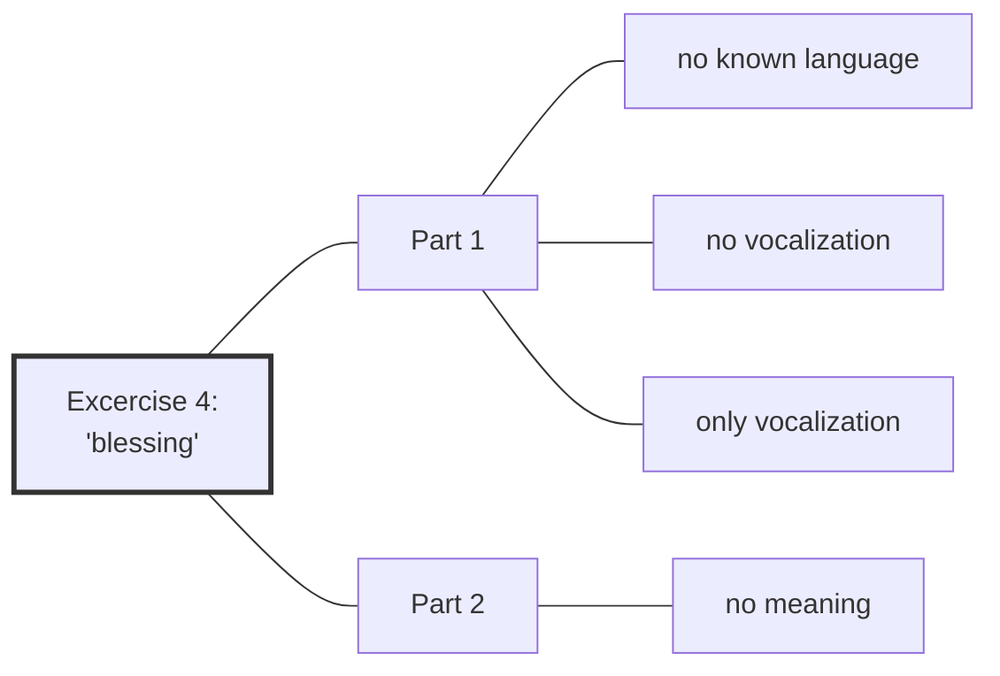

#Talk

[[Preliminaries Regarding Voice, Movement, and Gesture - Part 2|Preliminaries Regarding Voice, Movement, and Gesture - Part 2 🡄]] | [[2020 Vajra Music|🡅]] | [[Preliminaries Regarding Voice, Movement, and Gesture - Part 4|🡆 Preliminaries Regarding Voice, Movement, and Gesture - Part 4]]

Series: [[2020 Vajra Music]]
Transcript: [[0303 Preliminaries Regarding Voice, Movement, and Gesture - Part 3]]
Transcript PDF: [[2020_0303 Preliminaries Regarding Voice, Movement, and Gesture - Part 3.pdf]]

<audio controls preload=metadata style=" width:300px;" controlslist="nodownload"><source src="https://dharmaseed.org/talks/62454/20200303-Rob_Burbea-GAIA-preliminaries_regarding_voice_movement_and_gesture_part_3-62454.mp3" type="audio/mpeg">???</audio>

## Index
_<a data-href="Daimon" class="internal-link">Daimon</a> (80) · <a data-href="Soul" class="internal-link">Soul</a> (70) · <a data-href="Centre" class="internal-link">Centre</a> (53) · <a data-href="Image" class="internal-link">Image</a> (43) · <a data-href="Skandhas" class="internal-link">Skandhas</a> (26) · <a data-href="Blessing" class="internal-link">Blessing</a> (24) · <a data-href="Personhood" class="internal-link">Personhood</a> (21) · <a data-href="Imaginal" class="internal-link">Imaginal</a> (16) · <a data-href="Energy body" class="internal-link">Energy body</a> (14) · <a data-href="Soulmaking" class="internal-link">Soulmaking</a> (14) · <a data-href="Dukkha" class="internal-link">Dukkha</a> (10) · <a data-href="The Self" class="internal-link">The Self</a> (10) · <a data-href="Insight" class="internal-link">Insight</a> (9) · <a data-href="Divinity" class="internal-link">Divinity</a> (8) · <a data-href="Dyad" class="internal-link">Dyad</a> (8) · <a data-href="Fabrication" class="internal-link">Fabrication</a> (8) · <a data-href="Conceptual framework" class="internal-link">Conceptual framework</a> (7) · <a data-href="Sabbath" class="internal-link">Sabbath</a> (7) · <a data-href="Death" class="internal-link">Death</a> (6) · <a data-href="Embodiment" class="internal-link">Embodiment</a> (6) · <a data-href="Emptiness" class="internal-link">Emptiness</a> (6) · <a data-href="Anatta" class="internal-link">Anatta</a> (5) · <a data-href="Dharma" class="internal-link">Dharma</a> (5) · <a data-href="Dimensionality" class="internal-link">Dimensionality</a> (5) · <a data-href="Buddha" class="internal-link">Buddha</a> (4) · <a data-href="Desire" class="internal-link">Desire</a> (4) · <a data-href="Duty" class="internal-link">Duty</a> (4) · <a data-href="Emotions" class="internal-link">Emotions</a> (4) · <a data-href="Experience" class="internal-link">Experience</a> (4) · <a data-href="Dependent Origination" class="internal-link">Dependent Origination</a> (3) · <a data-href="Dominant culture" class="internal-link">Dominant culture</a> (3) · <a data-href="Eternality" class="internal-link">Eternality</a> (3) · <a data-href="Gratitude" class="internal-link">Gratitude</a> (3) · <a data-href="Metta" class="internal-link">Metta</a> (3) · <a data-href="Nondualism" class="internal-link">Nondualism</a> (3) · <a data-href="Perception" class="internal-link">Perception</a> (3) · <a data-href="Sensing the other as angel" class="internal-link">Sensing the other as angel</a> (3) · <a data-href="Ultimate truth" class="internal-link">Ultimate truth</a> (3) · <a data-href="Unfathomability" class="internal-link">Unfathomability</a> (3) · <a data-href="Via Negativa" class="internal-link">Via Negativa</a> (3) · <a data-href="Ways of looking" class="internal-link">Ways of looking</a> (3) · <a data-href="Antinomy" class="internal-link">Antinomy</a> (2) · <a data-href="Buddhism" class="internal-link">Buddhism</a> (2) · <a data-href="Christianity" class="internal-link">Christianity</a> (2) · <a data-href="Dakini" class="internal-link">Dakini</a> (2) · <a data-href="Eros" class="internal-link">Eros</a> (2) · <a data-href="Four Noble Truths" class="internal-link">Four Noble Truths</a> (2) · <a data-href="History" class="internal-link">History</a> (2) · <a data-href="Infinity" class="internal-link">Infinity</a> (2) · <a data-href="Love" class="internal-link">Love</a> (2) · <a data-href="Mind" class="internal-link">Mind</a> (2) · <a data-href="Receptivity" class="internal-link">Receptivity</a> (2) · <a data-href="Retreat" class="internal-link">Retreat</a> (2) · <a data-href="Attention" class="internal-link">Attention</a> · <a data-href="Awareness" class="internal-link">Awareness</a> · <a data-href="Beauty" class="internal-link">Beauty</a> · <a data-href="Ethics" class="internal-link">Ethics</a> · <a data-href="Gestalt psychology" class="internal-link">Gestalt psychology</a> · <a data-href="Impermanence" class="internal-link">Impermanence</a> · <a data-href="In Psyche's Orchard" class="internal-link">In Psyche&#x27;s Orchard</a> · <a data-href="Judaism" class="internal-link">Judaism</a> · <a data-href="Logos" class="internal-link">Logos</a> · <a data-href="Meaningfulness" class="internal-link">Meaningfulness</a> · <a data-href="Meditation" class="internal-link">Meditation</a> · <a data-href="Middle Way" class="internal-link">Middle Way</a> · <a data-href="Passion" class="internal-link">Passion</a> · <a data-href="Phenomenology" class="internal-link">Phenomenology</a> · <a data-href="Relationships" class="internal-link">Relationships</a> · <a data-href="Sila and Soul" class="internal-link">Sila and Soul</a> · <a data-href="Soulmaking dynamic" class="internal-link">Soulmaking dynamic</a> · <a data-href="Temenos" class="internal-link">Temenos</a> · <a data-href="The Image of Ethics" class="internal-link">The Image of Ethics</a> · <a data-href="Vajrayana" class="internal-link">Vajrayana</a>_
 

## Referenced talks
- <a data-href="Practising with Death and Dying" class="internal-link">Practising with Death and Dying</a>
- <a data-href="Pain, as Void and as Sacrament" class="internal-link">Pain, as Void and as Sacrament</a>
- <a data-href="Heat and the Material" class="internal-link">Heat and the Material</a>
- <a data-href="Sila and Soul" class="internal-link">Sila and Soul</a>
- <a data-href="The Image of Ethics" class="internal-link">The Image of Ethics</a>

## Paragraphs
[[Preliminaries Regarding Voice, Movement, and Gesture - Part 3 -|plain list]]

##### Fourth excercise with two parts, but first intro into terminology
**<a aria-label-position="top" aria-label="0303 Preliminaries Regarding Voice, Movement, and Gesture - Part 3 > ^1-1" data-href="0303 Preliminaries Regarding Voice, Movement, and Gesture - Part 3#^1-1" class="internal-link">1-1</a>**: _<a data-href="Soulmaking" class="internal-link">Soulmaking</a> · <a data-href="Personhood" class="internal-link">Personhood</a> (2)_
I'm not quite sure what will be possible today, but I would like to introduce the fourth exercise, which, as I'll explain when I get to it, could be seen as two exercises. I would like to introduce that, and maybe the fifth one. But before even introducing the fourth, I just thought I'd spend a little time opening up and considering some of the words and the vocabulary we've been using. By now, it's quite familiar to a lot of you who are familiar with <a aria-label-position="top" aria-label="Soulmaking" data-href="Soulmaking" class="internal-link">Soulmaking Dharma</a> teachings. Some of these words, and some of these terms - particularly as they inform and inflect and open up our sense of <a aria-label-position="top" aria-label="Personhood" data-href="Personhood" class="internal-link">human being</a>, and our human person, and [[personhood]], and what it is to be a person. I just want to say a few things about that.

---
##### A few weeks ago I felt "thrown off centre"
**<a aria-label-position="top" aria-label="0303 Preliminaries Regarding Voice, Movement, and Gesture - Part 3 > ^1-2" data-href="0303 Preliminaries Regarding Voice, Movement, and Gesture - Part 3#^1-2" class="internal-link">1-2</a>**: _<a data-href="Centre" class="internal-link">Centre</a> · <a data-href="Death" class="internal-link">Death</a> (2)_
A few weeks ago, not very long ago - two or three weeks ago - I was trying to remember the actual details, and I can't remember exactly what it was that I was feeling really quite pressured about, and I'm going to say <a aria-label-position="top" aria-label="Centre" data-href="Centre" class="internal-link">thrown off centre</a>, unbalanced, pressured, flattened. But there were a lot of things that seemed like they needed deciding at the time - practical things, things in relation to preparing for [[death]], and my will, and the future of the teachings, and teacher training, and all kinds of things. A lot of things that needed, seemed to need figuring out and arranging before my [[death]].

---
##### "I've lost my centre", "I need to regain my centre"
**<a aria-label-position="top" aria-label="0303 Preliminaries Regarding Voice, Movement, and Gesture - Part 3 > ^1-3" data-href="0303 Preliminaries Regarding Voice, Movement, and Gesture - Part 3#^1-3" class="internal-link">1-3</a>**: _<a data-href="Centre" class="internal-link">Centre</a> (4)_
Within that, there were, it seemed, lots of different people's requests and opinions and voices in there. I can't remember exactly what it was, but it was to do with those kinds of things, and particularly in relation to the teachings, and the future of the teachings, and teachers, and things like that. But at some point, I realized that, "Yeah, I'm really not feeling okay with all this. This has all gotten a bit crazy." And the language that came to me, or the language that seemed very natural at that point to describe what was missing for myself at that point - and that language [was] also very insightful, but it came very naturally - it was not the language of "I've <a aria-label-position="top" aria-label="Centre" data-href="Centre" class="internal-link">lost my centre</a>," as I said a minute ago, or "I'm uncentered," or "I need to <a aria-label-position="top" aria-label="Centre" data-href="Centre" class="internal-link">get centred</a>. I need to <a aria-label-position="top" aria-label="Centre" data-href="Centre" class="internal-link">regain my centre</a>, or <a aria-label-position="top" aria-label="Centre" data-href="Centre" class="internal-link">centre myself</a>," or whatever. That wasn't the language that came. I would understand, of course, those kinds of situations, and that kind of feeling flustered and pulled in so many directions, and so many decisions and all that, that that would very easily be a way that someone, that we in our contemporary society, might describe to ourself what has happened and then what needs to happen.

---
##### Solution: reconnect with the angels
**<a aria-label-position="top" aria-label="0303 Preliminaries Regarding Voice, Movement, and Gesture - Part 3 > ^1-4" data-href="0303 Preliminaries Regarding Voice, Movement, and Gesture - Part 3#^1-4" class="internal-link">1-4</a>**: _<a data-href="Insight" class="internal-link">Insight</a> (4) · <a data-href="Daimon" class="internal-link">Daimon</a> (5) · <a data-href="Image" class="internal-link">Image</a>_
But the words that came, the description that came organically, naturally, spontaneously, and that contained, of course, the [[insight]], the seeds of [[insight]] for what I needed to do to redress the situation was that, "I've lost my connection with the <a aria-label-position="top" aria-label="Daimon" data-href="Daimon" class="internal-link">angels</a>. I've lost my connection with the [[daimon]]. And I need to somehow reconnect, find that connection again with the <a aria-label-position="top" aria-label="Daimon" data-href="Daimon" class="internal-link">angel</a>, with the [[daimon]], with the [[image]]." And as I said, the [[insight]] was there. In the description of the problem was the [[insight]] of the direction needed for a solution - where I needed to orient, what I needed to do, how I needed to look, how I needed to relate and think about things. And that was exactly what did indeed help: finding again these connections with the <a aria-label-position="top" aria-label="Daimon" data-href="Daimon" class="internal-link">angels</a> in relation to all this, all that was difficult, and what was at the middle, the pith of the difficulty in relation to the teachings, basically, because most of it centred around the teachings and the future of the teachings and all that stuff.

NOTE

This relates to Aspect 5 below 

---
##### I had gone into a much more one-dimensional mode of understanding
**<a aria-label-position="top" aria-label="0303 Preliminaries Regarding Voice, Movement, and Gesture - Part 3 > ^2-1" data-href="0303 Preliminaries Regarding Voice, Movement, and Gesture - Part 3#^2-1" class="internal-link">2-1</a>**: _<a data-href="Daimon" class="internal-link">Daimon</a> (3) · <a data-href="Insight" class="internal-link">Insight</a>_
Finding my connection again, finding again my connection with the <a aria-label-position="top" aria-label="Daimon" data-href="Daimon" class="internal-link">angels</a>, in my relationship with them in relation to the teachings - all of that. That's what had got lost, and I was trying to figure out, solve, find answers to, get through a lot of decisions and things that needed to be made. It all felt quite pressured. But I had lost that connection. I had gone into a much more one-dimensional mode of <a aria-label-position="top" aria-label="Insight" data-href="Insight" class="internal-link">understanding</a> that and relating to all that set of issues and decisions and problems and conundra. It was all one-dimensional. The <a aria-label-position="top" aria-label="Daimon" data-href="Daimon" class="internal-link">angel</a> wasn't there. I wasn't in relationship with the <a aria-label-position="top" aria-label="Daimon" data-href="Daimon" class="internal-link">angel</a> with all of that.

---
##### Whats the logos of "centring"?
**<a aria-label-position="top" aria-label="0303 Preliminaries Regarding Voice, Movement, and Gesture - Part 3 > ^2-2" data-href="0303 Preliminaries Regarding Voice, Movement, and Gesture - Part 3#^2-2" class="internal-link">2-2</a>**: _<a data-href="Centre" class="internal-link">Centre</a> (6) · <a data-href="Personhood" class="internal-link">Personhood</a> (2) · <a data-href="The Self" class="internal-link">The Self</a> · <a data-href="Logos" class="internal-link">Logos</a> · <a data-href="Conceptual framework" class="internal-link">Conceptual framework</a>_
So when a person today uses language like "I <a aria-label-position="top" aria-label="Centre" data-href="Centre" class="internal-link">lost my centre</a>. I need to <a aria-label-position="top" aria-label="Centre" data-href="Centre" class="internal-link">get centred</a> or <a aria-label-position="top" aria-label="Centre" data-href="Centre" class="internal-link">centre myself</a> or <a aria-label-position="top" aria-label="Centre" data-href="Centre" class="internal-link">find my centre</a>, <a aria-label-position="top" aria-label="Centre" data-href="Centre" class="internal-link">regain my centre</a>," what does that word kind of tend to imply, or what's wrapped up in that kind of notion and that kind of vocabulary? Particularly, what's wrapped up, what's it tend to imply about the <a aria-label-position="top" aria-label="Personhood" data-href="Personhood" class="internal-link">human being</a>, and about [[the self]], and about the person? What's the [[logos]], the <a data-href="Conceptual framework" class="internal-link">Conceptual framework</a> of <a aria-label-position="top" aria-label="Personhood" data-href="Personhood" class="internal-link">human being</a>, self, person, that is kind of implicitly tied in with a notion such as '<a aria-label-position="top" aria-label="Centre" data-href="Centre" class="internal-link">centring</a>'?

- Aspect 1: interiority
- Aspect 2: circumscription
- Aspect 3: singularity
- Aspect 4: stillness
- Aspect 5: <a aria-label-position="top" aria-label="Divinity" data-href="Divinity" class="internal-link">theophany</a>

---
##### Often the centre is conceived something within, an interiority (Aspect 1)
**<a aria-label-position="top" aria-label="0303 Preliminaries Regarding Voice, Movement, and Gesture - Part 3 > ^2-3" data-href="0303 Preliminaries Regarding Voice, Movement, and Gesture - Part 3#^2-3" class="internal-link">2-3</a>**: _<a data-href="Centre" class="internal-link">Centre</a> (8) · <a data-href="Embodiment" class="internal-link">Embodiment</a> · <a data-href="Conceptual framework" class="internal-link">Conceptual framework</a> · <a data-href="Personhood" class="internal-link">Personhood</a>_
There are probably quite a few, and it's not set in stone. It may vary, etc. But we could think about a few of them. For instance, <a aria-label-position="top" aria-label="Centre" data-href="Centre" class="internal-link">interiority</a> is one of them, generally. Not necessarily, but generally. The <a aria-label-position="top" aria-label="Centre" data-href="Centre" class="internal-link">centre of gravity</a>, _my_ <a aria-label-position="top" aria-label="Centre" data-href="Centre" class="internal-link">centre of gravity</a>, and therefore my <a aria-label-position="top" aria-label="Embodiment" data-href="Embodiment" class="internal-link">sense of balance</a>, my point of balance, is conceived then usually _within_, somehow within me. Here one's feeling perhaps pulled out, so to speak, to all these diverse distractions or pulls or demands or questions or whatever it is, needs, and the <a aria-label-position="top" aria-label="Centre" data-href="Centre" class="internal-link">centre of gravity</a>, the <a aria-label-position="top" aria-label="Centre" data-href="Centre" class="internal-link">still point</a>, the balance point, is conceived of as _within_, usually. So there's a kind of <a aria-label-position="top" aria-label="Centre" data-href="Centre" class="internal-link">interiority</a> there that's part of the <a data-href="Conceptual framework" class="internal-link">Conceptual framework</a> of the <a aria-label-position="top" aria-label="Personhood" data-href="Personhood" class="internal-link">human being</a> that goes with words like '<a aria-label-position="top" aria-label="Centre" data-href="Centre" class="internal-link">centring</a>' and notions like '<a aria-label-position="top" aria-label="Centre" data-href="Centre" class="internal-link">centring</a>,' perhaps.

---
##### Centre also relates to the centre of a circumscribed area (Aspect 2)
**<a aria-label-position="top" aria-label="0303 Preliminaries Regarding Voice, Movement, and Gesture - Part 3 > ^2-4" data-href="0303 Preliminaries Regarding Voice, Movement, and Gesture - Part 3#^2-4" class="internal-link">2-4</a>**: _<a data-href="Personhood" class="internal-link">Personhood</a> · <a data-href="The Self" class="internal-link">The Self</a> · <a data-href="Centre" class="internal-link">Centre</a> (6)_
Secondly, also, is perhaps a notion of circumscription of the <a aria-label-position="top" aria-label="Personhood" data-href="Personhood" class="internal-link">human being</a>, of [[the self]]. Like, where do I end? I end here. The world starts there, or you start there, whatever it is. When we talk about a <a data-href="Centre" class="internal-link">Centre</a>, we talk about a [[centre]] _of_ something, usually. It's a [[centre]] of a circle, or a [[centre]] of a geometrical structure or whatever it is - a [[centre]] of a limited space, a limited area. <a data-href="Centre" class="internal-link">Centre</a> of a country, whatever. So there's a delimited space, a circumscribed space. Where I end, that's my boundary, if you like. That's my border.

---
##### Rather than "this area is me" we have a sense of the larger human being (image and analogue) 🟢
**<a aria-label-position="top" aria-label="0303 Preliminaries Regarding Voice, Movement, and Gesture - Part 3 > ^2-5" data-href="0303 Preliminaries Regarding Voice, Movement, and Gesture - Part 3#^2-5" class="internal-link">2-5</a>**: _<a data-href="Centre" class="internal-link">Centre</a> · <a data-href="Daimon" class="internal-link">Daimon</a> (6) · <a data-href="Personhood" class="internal-link">Personhood</a> (2) · <a data-href="Death" class="internal-link">Death</a> · <a data-href="In Psyche's Orchard" class="internal-link">In Psyche&#x27;s Orchard</a> · <a data-href="Image" class="internal-link">Image</a> (3)_
That notion also seems wrapped up, kind of subtly, implicitly, with the notion of '<a aria-label-position="top" aria-label="Centre" data-href="Centre" class="internal-link">centring</a>.' Now, I could still have a kind of circumscribed notion of where I end. That could still be involved when I use the language and the idea of connection with the [[daimon]] or connection with the <a aria-label-position="top" aria-label="Daimon" data-href="Daimon" class="internal-link">angel</a>. But what I meant and what I mean by that, or what I would like to emphasize right now by that connection with the <a aria-label-position="top" aria-label="Daimon" data-href="Daimon" class="internal-link">angels</a>, and re-finding that connection with the <a aria-label-position="top" aria-label="Daimon" data-href="Daimon" class="internal-link">angel</a> or <a aria-label-position="top" aria-label="Daimon" data-href="Daimon" class="internal-link">angels</a>, is more a kind of expanded notion or sense of a <a aria-label-position="top" aria-label="Personhood" data-href="Personhood" class="internal-link">human being</a>. As we talked about, I think it was in the talk on <a aria-label-position="top" aria-label="Death" data-href="Death" class="internal-link">death and dying</a> in _<a data-href="In Psyche's Orchard" class="internal-link">In Psyche&#x27;s Orchard</a>_, rather than "this area is me," we have a sense of the larger <a aria-label-position="top" aria-label="Personhood" data-href="Personhood" class="internal-link">human being</a> is both <a aria-label-position="top" aria-label="Image" data-href="Image" class="internal-link">image and analogue</a>.^["[[ Practising with Death and Dying]]"] There are a couple of parts there: the first part has to do with circumscription, and the second part has to do with singularity. But just to stay with the circumscription: <a aria-label-position="top" aria-label="Image" data-href="Image" class="internal-link">image and analogue</a>. I, in my life, am, to the best of my ability, or more or less at different times, the analogue of that [[image]], of the <a aria-label-position="top" aria-label="Daimon" data-href="Daimon" class="internal-link">angel</a>.

references <a data-href="Practising with Death and Dying" class="internal-link">Practising with Death and Dying</a>

---
##### Where do I end?
**<a aria-label-position="top" aria-label="0303 Preliminaries Regarding Voice, Movement, and Gesture - Part 3 > ^3-1" data-href="0303 Preliminaries Regarding Voice, Movement, and Gesture - Part 3#^3-1" class="internal-link">3-1</a>**: _<a data-href="Gestalt psychology" class="internal-link">Gestalt psychology</a> · <a data-href="Image" class="internal-link">Image</a> (5) · <a data-href="Imaginal" class="internal-link">Imaginal</a> · <a data-href="Daimon" class="internal-link">Daimon</a> · <a data-href="Unfathomability" class="internal-link">Unfathomability</a>_
Where, then, do _I_ end? If I have this more expanded notion of self, I am actually this whole … 'system' is too technical a word, but this whole <a aria-label-position="top" aria-label="Gestalt psychology" data-href="Gestalt psychology" class="internal-link">gestalt</a>, this whole constellation of <a aria-label-position="top" aria-label="Image" data-href="Image" class="internal-link">image and analogue</a>, or maybe <a aria-label-position="top" aria-label="Image" data-href="Image" class="internal-link">images and analogues</a>, and that's all me, then where do I end in that? Where is my circumscription in that exactly? And anyway, then, the [[image]], because of the <a aria-label-position="top" aria-label="Imaginal" data-href="Imaginal" class="internal-link">elements of the imaginal</a>, the <a aria-label-position="top" aria-label="Daimon" data-href="Daimon" class="internal-link">angel</a>, the [[image]], where does the [[image]] end? Because that's going to be unfathomable, and have <a aria-label-position="top" aria-label="Unfathomability" data-href="Unfathomability" class="internal-link">unfathomable beyonds</a>, etc.

---
##### Singularity of self (Aspect 3)
**<a aria-label-position="top" aria-label="0303 Preliminaries Regarding Voice, Movement, and Gesture - Part 3 > ^3-2" data-href="0303 Preliminaries Regarding Voice, Movement, and Gesture - Part 3#^3-2" class="internal-link">3-2</a>**: _<a data-href="Personhood" class="internal-link">Personhood</a> · <a data-href="Centre" class="internal-link">Centre</a> (7) · <a data-href="The Self" class="internal-link">The Self</a>_
<audio controls preload=metadata style=" width:300px;" controlslist="nodownload"><source src="https://dharmaseed.org/talks/62454/20200303-Rob_Burbea-GAIA-preliminaries_regarding_voice_movement_and_gesture_part_3-62454.mp3#t=11:42" type="audio/mpeg">???</audio>
[11:42] Where do I draw the line, then, of self there, of my <a aria-label-position="top" aria-label="Personhood" data-href="Personhood" class="internal-link">human being</a>? And so where, then, exactly, is the <a data-href="Centre" class="internal-link">Centre</a> of it? If I can't draw the line of, the edge of the circle or whatever, I don't know where to place the [[centre]]. I cannot say the [[centre]] is here or there. So that's another aspect: <a aria-label-position="top" aria-label="Centre" data-href="Centre" class="internal-link">interiority</a>, circumscription. But also, as I mentioned, singularity. Sometimes, usually, with this notion of <a aria-label-position="top" aria-label="Centre" data-href="Centre" class="internal-link">centring</a>, there can be a sense of the singularity of self: "I need to <a aria-label-position="top" aria-label="Centre" data-href="Centre" class="internal-link">find my centre</a>. I, as a singular self, need to kind of have recourse to my self, find the resource of my, find my resource in my self, in my [[centre]]." And the sense then is <a aria-label-position="top" aria-label="The Self" data-href="The Self" class="internal-link">the self as singular</a>.

---
##### You can reach out horizontally (socially) but also more plurally
**<a aria-label-position="top" aria-label="0303 Preliminaries Regarding Voice, Movement, and Gesture - Part 3 > ^3-3" data-href="0303 Preliminaries Regarding Voice, Movement, and Gesture - Part 3#^3-3" class="internal-link">3-3</a>**: _<a data-href="The Self" class="internal-link">The Self</a> (2) · <a data-href="Personhood" class="internal-link">Personhood</a> · <a data-href="Death" class="internal-link">Death</a> · <a data-href="Phenomenology" class="internal-link">Phenomenology</a> · <a data-href="Experience" class="internal-link">Experience</a> · <a data-href="Anatta" class="internal-link">Anatta</a> · <a data-href="Image" class="internal-link">Image</a> (2) · <a data-href="Daimon" class="internal-link">Daimon</a> (2)_
Now, a person in contemporary society, of course, could say, "I feel terrible. I feel really pressured. I reach out to friends and colleagues or whatever it is," and reaching out horizontally, socially, to the horizontal sense of society and friends, etc. But one could also reach out more plurally, if you like. Not so much just to the singular self, not only reaching out horizontally to the flatly conceived society of others in which I exist, but rather conceiving of <a aria-label-position="top" aria-label="The Self" data-href="The Self" class="internal-link">the self as a plurality</a>. So just the fact of conceiving of the <a aria-label-position="top" aria-label="Personhood" data-href="Personhood" class="internal-link">human being</a>, conceiving of the human person, as I described and tried to really emphasize in that talk on <a aria-label-position="top" aria-label="Death" data-href="Death" class="internal-link">death and dying</a>, conceiving of the human person actually, <a aria-label-position="top" aria-label="Phenomenology" data-href="Phenomenology" class="internal-link">phenomenologically</a>, and when we have a deep sense both of our selves and of another, and when another has a deep <a aria-label-position="top" aria-label="The Self" data-href="The Self" class="internal-link">sense of our selves</a>, that the [[experience]] is not necessarily completely singular. And I don't mean it's fragmented in the way sometimes <a data-href="Anatta" class="internal-link">Anatta</a> gets taught, but I mean it's plural, or rather, not simply singular in the way that we are both <a aria-label-position="top" aria-label="Image" data-href="Image" class="internal-link">image and analogue</a> or <a aria-label-position="top" aria-label="Image" data-href="Image" class="internal-link">images and analogues</a> - several <a aria-label-position="top" aria-label="Daimon" data-href="Daimon" class="internal-link">angels</a>, perhaps, and servant to analogue, to that plurality, even, of <a aria-label-position="top" aria-label="Daimon" data-href="Daimon" class="internal-link">angels</a>.

---
##### The sense and sensing of being larger, having angelic dimensions
**<a aria-label-position="top" aria-label="0303 Preliminaries Regarding Voice, Movement, and Gesture - Part 3 > ^3-4" data-href="0303 Preliminaries Regarding Voice, Movement, and Gesture - Part 3#^3-4" class="internal-link">3-4</a>**: _<a data-href="Centre" class="internal-link">Centre</a> · <a data-href="Personhood" class="internal-link">Personhood</a> (3) · <a data-href="Perception" class="internal-link">Perception</a> · <a data-href="Image" class="internal-link">Image</a> · <a data-href="Dimensionality" class="internal-link">Dimensionality</a> · <a data-href="Duty" class="internal-link">Duty</a>_
Quite different notions there. Interiority, circumscription and borders, and singularity are not the sort of default mode of sense of the human being, the human person. And they weren't in that case. And I find more and more these days, when things are difficult, when there's challenge different ways, that the sense (and I mean that word in its double meaning: the sense, the actual perception, and the idea) of my human being or another human being is more along the lines of this image and analogue, of having angelic dimensions which are refracted into the human life more or less at different times, with a duty to that. There's a kind of doubleness there, if you like.

❝

 And I find more and more these days, when things are difficult, when there's challenge different ways, that the sense (and I mean that word in its double meaning: the sense, the actual <a data-href="perception" class="internal-link">perception</a>, and the idea) of my human being or another human being is more along the lines of this <a aria-label-position="top" aria-label="Image" data-href="Image" class="internal-link">image and analogue</a>, of having <a aria-label-position="top" aria-label="Dimensionality" data-href="Dimensionality" class="internal-link">angelic dimensions</a> which are refracted into the human life more or less at different times, with a <a data-href="duty" class="internal-link">duty</a> to that.  

---
##### Finding in one's core the self, or stillness (Aspect 4)
**<a aria-label-position="top" aria-label="0303 Preliminaries Regarding Voice, Movement, and Gesture - Part 3 > ^3-5" data-href="0303 Preliminaries Regarding Voice, Movement, and Gesture - Part 3#^3-5" class="internal-link">3-5</a>**: _<a data-href="Centre" class="internal-link">Centre</a> (10) · <a data-href="Dharma" class="internal-link">Dharma</a> (3) · <a data-href="The Self" class="internal-link">The Self</a>_
'<a aria-label-position="top" aria-label="Centre" data-href="Centre" class="internal-link">Centring</a>,' that word, '<a aria-label-position="top" aria-label="Centre" data-href="Centre" class="internal-link">centring</a>,' a fourth aspect or fourth notion that might be wrapped up in it, or idea that might be wrapped up in '<a aria-label-position="top" aria-label="Centre" data-href="Centre" class="internal-link">centring</a>' is that one then encounters one's self, or one's true self, or one's core, if you like, or whatever, at the [[centre]]. Introspecting, one then finds one's self at the [[centre]]. Maybe not <a aria-label-position="top" aria-label="Dharma" data-href="Dharma" class="internal-link">Dharma 101</a>, but pretty soon in the <a data-href="Dharma" class="internal-link">Dharma</a>, you're going to encounter the idea - and it's not just particular to <a aria-label-position="top" aria-label="Dharma" data-href="Dharma" class="internal-link">Buddhadharma</a> - "when I look for [[the self]], I can't find it, actually." ==One could think about <a aria-label-position="top" aria-label="Centre" data-href="Centre" class="internal-link">centring</a> as, "I need to [[centre]] because I need to encounter that self at my [[centre]]." Or it could be that what I'm expecting at the [[centre]] is a kind of infinite depth of still nothingness, of stillness and nothingness - which is a wonderful sense: one can look inside, and there are different kinds of nothingness, different kinds of stillness. ==But that kind of infinite depth of stillness and nothingness is what one maybe encounters at the [[centre]].

Interesting

Think about this "Dharma 101" view of not being able to find a self anywhere (and therefore certainly not in the centre). 

---
##### Looking deep inside myself, I encounter nothing
**<a aria-label-position="top" aria-label="0303 Preliminaries Regarding Voice, Movement, and Gesture - Part 3 > ^4-1" data-href="0303 Preliminaries Regarding Voice, Movement, and Gesture - Part 3#^4-1" class="internal-link">4-1</a>**: _<a data-href="Christianity" class="internal-link">Christianity</a> (2) · <a data-href="Centre" class="internal-link">Centre</a> (2) · <a data-href="Image" class="internal-link">Image</a> · <a data-href="Emptiness" class="internal-link">Emptiness</a> · <a data-href="Via Negativa" class="internal-link">Via Negativa</a> (3)_
They talk about, in the <a aria-label-position="top" aria-label="Christianity" data-href="Christianity" class="internal-link">Christian tradition</a>, in the twentieth century, there was a restimulation, a revivification of some of their contemplative practices in the <a aria-label-position="top" aria-label="Christianity" data-href="Christianity" class="internal-link">Catholic tradition</a> - <a aria-label-position="top" aria-label="Centre" data-href="Centre" class="internal-link">centring prayer</a>. I think it's changed now, but originally it meant just that: in the [[centre]] is this still nothingness. Beyond any <a aria-label-position="top" aria-label="Image" data-href="Image" class="internal-link">image of God</a>, beyond any word or directive, is just a kind of [[emptiness]]. This is tied up also with the [[Via negativa]], the <a aria-label-position="top" aria-label="Via Negativa" data-href="Via Negativa" class="internal-link">apophatic tradition</a>. Looking deep inside myself, I encounter nothing, and that nothingness, the depth of that nothingness, is the same as the depth of the <a aria-label-position="top" aria-label="Via Negativa" data-href="Via Negativa" class="internal-link">nothingness of God</a>.

---
##### If we do not aim for Aspect 4 we might see the face of the divine (Aspect 5)
**<a aria-label-position="top" aria-label="0303 Preliminaries Regarding Voice, Movement, and Gesture - Part 3 > ^4-2" data-href="0303 Preliminaries Regarding Voice, Movement, and Gesture - Part 3#^4-2" class="internal-link">4-2</a>**: _<a data-href="Centre" class="internal-link">Centre</a> (4) · <a data-href="Experience" class="internal-link">Experience</a> · <a data-href="Daimon" class="internal-link">Daimon</a> (4) · <a data-href="Image" class="internal-link">Image</a> · <a data-href="Divinity" class="internal-link">Divinity</a> (4) · <a data-href="Emptiness" class="internal-link">Emptiness</a> (3)_
This is wonderful, and this is a real mystical resource, but still, meaning something quite different. If we're _not_, if I _wasn't_ gravitating towards that notion and that movement of centring and of needing centring, it's not that I'm expecting to encounter my self at the centre, nor am I expecting, nor am I kind of hoping for an experience of the still nothingness at the centre, which may, of course, be very helpful at different times. But rather, I need to reconnect with the angels. And the angel, the image, is other, _and_ it's self. It's both and neither. It's me and not me, and it's not me and _not_ not me. This angel, in the mystery of their being, in the mystery of this angelic constellation, this angelic relationship, this angel is both other and self. But it's theophany. It's a face of the divine. It's an expression of the divine, which is different than an emptiness. An emptiness is not a theophany. An emptiness is usually construed as an essence, usually construed as a transcendent essence beyond all attributes. A theophany is a face, a presentation of, we could say, attributes, or is a being in itself, a person in itself, you could say.

❝

This angel, in the mystery of their being, in the mystery of this angelic constellation, this angelic relationship, this angel is both other and self. But it's <a aria-label-position="top" aria-label="Divinity" data-href="Divinity" class="internal-link">theophany</a>. It's a face of the divine. It's an expression of the divine, which is different than an <a data-href="emptiness" class="internal-link">emptiness</a>. An emptiness is not a theophany. An emptiness is usually construed as an essence, usually construed as a transcendent essence beyond all attributes. A theophany is a face, ... a being in itself...  

---

---
##### Not "at the centre", but "in relationship with a theophany"
**<a aria-label-position="top" aria-label="0303 Preliminaries Regarding Voice, Movement, and Gesture - Part 3 > ^4-3" data-href="0303 Preliminaries Regarding Voice, Movement, and Gesture - Part 3#^4-3" class="internal-link">4-3</a>**: _<a data-href="Centre" class="internal-link">Centre</a> (3) · <a data-href="Divinity" class="internal-link">Divinity</a> · <a data-href="Soulmaking" class="internal-link">Soulmaking</a> · <a data-href="Soul" class="internal-link">Soul</a> (3)_
<audio controls preload=metadata style=" width:300px;" controlslist="nodownload"><source src="https://dharmaseed.org/talks/62454/20200303-Rob_Burbea-GAIA-preliminaries_regarding_voice_movement_and_gesture_part_3-62454.mp3#t=20:04" type="audio/mpeg">???</audio>
So rather than encountering my self at the <a data-href="Centre" class="internal-link">Centre</a>, rather than encountering a deep well of still nothingness, wonderful as that might be, actually not at the [[centre]], but _in relationship with_ a <a aria-label-position="top" aria-label="Divinity" data-href="Divinity" class="internal-link">theophany</a>. Not at the [[centre]] of anything, but in relationship with. Where exactly is that in space? Quite different notions. And some of this will be, to different degrees, familiar if you're familiar with <a aria-label-position="top" aria-label="Soulmaking" data-href="Soulmaking" class="internal-link">Soulmaking Dharma</a>, some of the ways we use these words. Really what I'm wanting to point to is where the words point to, the direction of possibility in which these words and these terms point, as opposed to they themselves define this or that, and this is the circumscription, and this is the limit and definition, delimitation of these words. More to get a sense of the words are directions. They're directions of <a aria-label-position="top" aria-label="Soul" data-href="Soul" class="internal-link">soul-possibility</a>, directions of <a aria-label-position="top" aria-label="Soul" data-href="Soul" class="internal-link">soul-experience</a> and <a aria-label-position="top" aria-label="Soul" data-href="Soul" class="internal-link">soul-conception</a>.

---

---
##### More on the word "angel" 🟢
**<a aria-label-position="top" aria-label="0303 Preliminaries Regarding Voice, Movement, and Gesture - Part 3 > ^4-4" data-href="0303 Preliminaries Regarding Voice, Movement, and Gesture - Part 3#^4-4" class="internal-link">4-4</a>**: _<a data-href="Daimon" class="internal-link">Daimon</a> (4) · <a data-href="Image" class="internal-link">Image</a> · <a data-href="Soulmaking" class="internal-link">Soulmaking</a> (3) · <a data-href="Energy body" class="internal-link">Energy body</a> · <a data-href="Attention" class="internal-link">Attention</a> · <a data-href="Receptivity" class="internal-link">Receptivity</a> · <a data-href="Judaism" class="internal-link">Judaism</a> · <a data-href="Sabbath" class="internal-link">Sabbath</a> (4) · <a data-href="Personhood" class="internal-link">Personhood</a>_
If we linger on this word '<a aria-label-position="top" aria-label="Daimon" data-href="Daimon" class="internal-link">angel</a>' a little bit, we've used it quite a lot over the last years, but just to say a few more things about it. Careful, for instance, of a limiting idea that the <a aria-label-position="top" aria-label="Daimon" data-href="Daimon" class="internal-link">angel</a> or an <a aria-label-position="top" aria-label="Daimon" data-href="Daimon" class="internal-link">angel</a> or an [[image]] kind of shows up out of the blue and will help you with something, or give you an idea, or give you a creative impulse or whatever it is, a seed or something. It might. It might show up out of the blue. And we talked about - again, I can't remember when, but I used the phrase 'the <a aria-label-position="top" aria-label="Soulmaking" data-href="Soulmaking" class="internal-link">poise of soulmaking</a>' or something like that, 'the <a aria-label-position="top" aria-label="Soulmaking" data-href="Soulmaking" class="internal-link">soulmaking poise</a>.'^["[[Pain, as Void and as Sacrament]]""] In other words, taking care of the stance, the poise of one's being, one's [[energy body]], one's [[attention]], one's [[receptivity]], one's humility and all of that. And in that poise, in the <a aria-label-position="top" aria-label="Soulmaking" data-href="Soulmaking" class="internal-link">soulmaking poise</a>, it's sort of opening the space, priming and preparing the space. I'm thinking now of parallels with the <a aria-label-position="top" aria-label="Judaism" data-href="Judaism" class="internal-link">Jewish tradition</a> of preparing for the <a data-href="Sabbath" class="internal-link">Sabbath</a>, and the <a data-href="Sabbath" class="internal-link">Sabbath</a> is the reception of the <a aria-label-position="top" aria-label="Sabbath" data-href="Sabbath" class="internal-link">Shekhinah</a>, the reception of the <a data-href="Sabbath" class="internal-link">Sabbath</a> <a aria-label-position="top" aria-label="Daimon" data-href="Daimon" class="internal-link">angel</a> who visits, who comes on that evening, on that day, and the <a aria-label-position="top" aria-label="Personhood" data-href="Personhood" class="internal-link">human being</a>'s job is partly to prepare, to make the space and the time beautiful, ready, prepared, holy, special, hospitable.

references <a data-href="Pain, as Void and as Sacrament" class="internal-link">Pain, as Void and as Sacrament</a>

---
##### One becomes a space of hospitality of the angels
**<a aria-label-position="top" aria-label="0303 Preliminaries Regarding Voice, Movement, and Gesture - Part 3 > ^5-1" data-href="0303 Preliminaries Regarding Voice, Movement, and Gesture - Part 3#^5-1" class="internal-link">5-1</a>**: _<a data-href="Soulmaking" class="internal-link">Soulmaking</a> · <a data-href="Daimon" class="internal-link">Daimon</a> (4) · <a data-href="Imaginal" class="internal-link">Imaginal</a>_
So it may well be that, with an attitude of humility, we learn to take care with that <a aria-label-position="top" aria-label="Soulmaking" data-href="Soulmaking" class="internal-link">soulmaking poise</a>, and in that way, we are in a kind of humbly waiting and primed or prepared space. Our being becomes that space, becomes a space of hospitality for the <a aria-label-position="top" aria-label="Daimon" data-href="Daimon" class="internal-link">angels</a>, and they may visit, then, sort of out of the blue. And then, with that, there may be a gift. We may be helped with this or that in our lives, given something - given an idea, given creative seeds, whatever. But careful of that as an idea that might limit our sense of <a aria-label-position="top" aria-label="Daimon" data-href="Daimon" class="internal-link">angels</a>, and what they are, and how they arise, and what our relationship with them is. Because it's often the case - and this is something I've shared before - that one has already started something. Perhaps it's a creative project, or a big piece of work, and an idea. And perhaps it feels like a lot. It feels like a stretch or a challenge. And the <a aria-label-position="top" aria-label="Daimon" data-href="Daimon" class="internal-link">angel</a> comes _then_. And the coming of the <a aria-label-position="top" aria-label="Daimon" data-href="Daimon" class="internal-link">angel</a> might be the work itself, or this project itself, becoming [[imaginal]]. _It_ becomes angelic.

---
##### Me, my project, the angel
**<a aria-label-position="top" aria-label="0303 Preliminaries Regarding Voice, Movement, and Gesture - Part 3 > ^5-2" data-href="0303 Preliminaries Regarding Voice, Movement, and Gesture - Part 3#^5-2" class="internal-link">5-2</a>**: _<a data-href="Daimon" class="internal-link">Daimon</a> (2) · <a data-href="Imaginal" class="internal-link">Imaginal</a> · <a data-href="Desire" class="internal-link">Desire</a> (2) · <a data-href="Eros" class="internal-link">Eros</a>_
It might be there's me, and there's this project, and then there's this third character, called the '<a aria-label-position="top" aria-label="Daimon" data-href="Daimon" class="internal-link">angel</a>,' that's going to help me with, in my relationship with the project. But it might also be that the work itself, or the idea that's beginning to take shape, that I'm grappling with, that I'm kind of gestating, or is wanting to come through, whatever it is, or this big project that I need to do, whatever that might be, that _it_ becomes <a aria-label-position="top" aria-label="Daimon" data-href="Daimon" class="internal-link">angel</a>. _It_ becomes angelic. _It_ becomes <a aria-label-position="top" aria-label="Imaginal" data-href="Imaginal" class="internal-link">imaginal person</a>, with autonomy, with [[desire]], its own [[eros]], its own [[desire]], etc.

---
##### We have to delimit
**<a aria-label-position="top" aria-label="0303 Preliminaries Regarding Voice, Movement, and Gesture - Part 3 > ^5-3" data-href="0303 Preliminaries Regarding Voice, Movement, and Gesture - Part 3#^5-3" class="internal-link">5-3</a>**: _<a data-href="Daimon" class="internal-link">Daimon</a> (3)_
Careful of, again, not delimiting too tightly what we mean by 'angel.' We have to delimit; we're not just open for any old ideas about angels and all that business. That's why I said the words, the concepts, are pointing us in a direction, and pointing us along a road, but that road is infinite. It has boundaries. It's not like _anything_ can fall under the scope of that road, and you can just call anything 'angel,' which is, in some circles, fairly common. They just use that word too easily, whether it's used completely unspiritually, just as a kind of term of endearment, or in certain spiritual or New Age circles or whatever. And we're _not_ using it in those ways.

❝

We have to delimit; we're not just open for any old ideas about angels and all that business. That's why I said the words, the concepts, are pointing us in a direction, and pointing us along a road, but that road is infinite. It has boundaries. It's not like <i>anything</i> can fall under the scope of that road... 

---
##### The terrain around the road develops as you walk down that road
**<a aria-label-position="top" aria-label="0303 Preliminaries Regarding Voice, Movement, and Gesture - Part 3 > ^5-4" data-href="0303 Preliminaries Regarding Voice, Movement, and Gesture - Part 3#^5-4" class="internal-link">5-4</a>**: _<a data-href="Daimon" class="internal-link">Daimon</a> · <a data-href="Dependent Origination" class="internal-link">Dependent Origination</a> · <a data-href="Soulmaking" class="internal-link">Soulmaking</a> (2) · <a data-href="Sabbath" class="internal-link">Sabbath</a> (3) · <a data-href="Eros" class="internal-link">Eros</a> · <a data-href="Soul" class="internal-link">Soul</a> (2) · <a data-href="Love" class="internal-link">Love</a> · <a data-href="Embodiment" class="internal-link">Embodiment</a> · <a data-href="Imaginal" class="internal-link">Imaginal</a>_
Maybe that's a good analogy: it's like, we're pointing in a certain direction, and then one can just keep travelling in that direction. And the road changes. The road develops. The terrain around the road develops as you walk down that road. But another way of saying this is, an <a aria-label-position="top" aria-label="Daimon" data-href="Daimon" class="internal-link">angel</a> is also (like everything) a <a aria-label-position="top" aria-label="Dependent Origination" data-href="Dependent Origination" class="internal-link">dependent arising</a>. In what I was just talking about, we could say, in the first instance, it's dependent on the <a aria-label-position="top" aria-label="Soulmaking" data-href="Soulmaking" class="internal-link">poise of soulmaking</a>. The visitation of the <a aria-label-position="top" aria-label="Sabbath" data-href="Sabbath" class="internal-link">Shekhinah</a> on Shabbat is dependent on the reverence and humility, and the [[eros]] of the [[soul]], and the [[love]] of the [[soul]] for the <a aria-label-position="top" aria-label="Sabbath" data-href="Sabbath" class="internal-link">Shekhinah</a> and for the divine, and expressing that by the way it takes care of creating the space for the <a data-href="Sabbath" class="internal-link">Sabbath</a>, in terms of <a aria-label-position="top" aria-label="Embodiment" data-href="Embodiment" class="internal-link">body</a> and house and setting and environment. So of course, all this applies in so many ways to [[soulmaking]] and <a aria-label-position="top" aria-label="Imaginal" data-href="Imaginal" class="internal-link">imaginal work</a> and ritual and all that.

---
##### The angel may visit in reponse to the task that I'm given
**<a aria-label-position="top" aria-label="0303 Preliminaries Regarding Voice, Movement, and Gesture - Part 3 > ^5-5" data-href="0303 Preliminaries Regarding Voice, Movement, and Gesture - Part 3#^5-5" class="internal-link">5-5</a>**: _<a data-href="Dependent Origination" class="internal-link">Dependent Origination</a> (2) · <a data-href="Daimon" class="internal-link">Daimon</a> (3) · <a data-href="Imaginal" class="internal-link">Imaginal</a>_
But it's a <a aria-label-position="top" aria-label="Dependent Origination" data-href="Dependent Origination" class="internal-link">dependent arising</a>, an <a aria-label-position="top" aria-label="Daimon" data-href="Daimon" class="internal-link">angel</a> is a <a aria-label-position="top" aria-label="Dependent Origination" data-href="Dependent Origination" class="internal-link">dependent arising</a>, also, in possibly another sense, which is, as I said, something is already there. It's already stretching me. And then the <a aria-label-position="top" aria-label="Daimon" data-href="Daimon" class="internal-link">angel</a> visits _in response to that stretch_, in response to that task that I'm given, in response to that work that I have to do. And it might be that one possibility within that is that the work itself, the task itself, becomes <a aria-label-position="top" aria-label="Daimon" data-href="Daimon" class="internal-link">angel</a>. It becomes [[imaginal]], angelic.

---
##### Some people ask: "Why don't the angels seem to come to me?"
**<a aria-label-position="top" aria-label="0303 Preliminaries Regarding Voice, Movement, and Gesture - Part 3 > ^5-6" data-href="0303 Preliminaries Regarding Voice, Movement, and Gesture - Part 3#^5-6" class="internal-link">5-6</a>**: _<a data-href="Image" class="internal-link">Image</a> (3) · <a data-href="Daimon" class="internal-link">Daimon</a> (5) · <a data-href="Imaginal" class="internal-link">Imaginal</a> · <a data-href="Duty" class="internal-link">Duty</a>_
I've touched on this before, actually quite a few times, this question that some people say, "Oh, I don't get any <a aria-label-position="top" aria-label="Image" data-href="Image" class="internal-link">images</a>," or "I don't get <a aria-label-position="top" aria-label="Image" data-href="Image" class="internal-link">images</a>." And sometimes people are okay with that, but sometimes it's like people get a little bit frustrated: "Why don't I get <a aria-label-position="top" aria-label="Image" data-href="Image" class="internal-link">images</a>?" Or they might say, if they use slightly different language, having heard other language being used, they might say, "Why don't the <a aria-label-position="top" aria-label="Daimon" data-href="Daimon" class="internal-link">angels</a> seem to come to me? They seem to come to other people, or I hear this person or that person talk about <a aria-label-position="top" aria-label="Daimon" data-href="Daimon" class="internal-link">angels</a> coming, or the <a aria-label-position="top" aria-label="Daimon" data-href="Daimon" class="internal-link">angel</a> coming, or whatever. Why don't they seem to come to me?" Or it might be voiced as, "The <a aria-label-position="top" aria-label="Daimon" data-href="Daimon" class="internal-link">angels</a>, the gods, they don't seem to want anything from me. I hear this person or that person talk, and I hear them talk about the demand of the <a aria-label-position="top" aria-label="Daimon" data-href="Daimon" class="internal-link">angel</a>, the demand of the [[imaginal]], or the [[duty]], or this or that. But they don't seem to come to me," or "They don't seem to want anything from me."

---
##### There are lots of reasons
**<a aria-label-position="top" aria-label="0303 Preliminaries Regarding Voice, Movement, and Gesture - Part 3 > ^6-1" data-href="0303 Preliminaries Regarding Voice, Movement, and Gesture - Part 3#^6-1" class="internal-link">6-1</a>**: _<a data-href="Perception" class="internal-link">Perception</a> · <a data-href="Image" class="internal-link">Image</a> (3) · <a data-href="Soul" class="internal-link">Soul</a> · <a data-href="Relationships" class="internal-link">Relationships</a> · <a data-href="Emotions" class="internal-link">Emotions</a> · <a data-href="Energy body" class="internal-link">Energy body</a> · <a data-href="Daimon" class="internal-link">Daimon</a> · <a data-href="Desire" class="internal-link">Desire</a>_
So this whole constellation of ideas and <a aria-label-position="top" aria-label="Perception" data-href="Perception" class="internal-link">perceptions</a> and things that people might think, I've talked about it quite a lot over the years: "Why don't I get <a aria-label-position="top" aria-label="Image" data-href="Image" class="internal-link">images</a>?", and what do we actually mean by '[[image]],' and what are the kind of preparations, poises of [[soul]], but also [[relationships]] with one's [[emotions]] and [[energy body]] and all kinds of other factors that support the generation, the arising, the creation/discovery of <a aria-label-position="top" aria-label="Image" data-href="Image" class="internal-link">images</a>, <a aria-label-position="top" aria-label="Daimon" data-href="Daimon" class="internal-link">angels</a>, etc. There are lots of reasons, which I've elaborated elsewhere. One I've touched on, I just want to touch on again, and that actually has to do with [[desire]] and need - maybe two aspects.

---
##### Images would arise, if you really deeply wanted them
**<a aria-label-position="top" aria-label="0303 Preliminaries Regarding Voice, Movement, and Gesture - Part 3 > ^6-2" data-href="0303 Preliminaries Regarding Voice, Movement, and Gesture - Part 3#^6-2" class="internal-link">6-2</a>**: _<a data-href="Image" class="internal-link">Image</a> (5) · <a data-href="Emotions" class="internal-link">Emotions</a> · <a data-href="Desire" class="internal-link">Desire</a>_
Sometimes people say, "Why don't I get <a aria-label-position="top" aria-label="Image" data-href="Image" class="internal-link">images</a>?" I don't know. Other reasons that I've elaborated elsewhere aside - so there may well be that actually, for many people, this isn't a relevant reason, what I'm about to say. Maybe there are just other things: they're not relating in the right way to their [[emotions]] or whatever it is. But sometimes, it's like, actually, if you really, really deeply wanted <a aria-label-position="top" aria-label="Image" data-href="Image" class="internal-link">images</a>, they would come. You would have <a aria-label-position="top" aria-label="Image" data-href="Image" class="internal-link">images</a>. <a aria-label-position="top" aria-label="Image" data-href="Image" class="internal-link">Images</a> would visit you. They would arise, if you really deeply wanted them. So something, sometimes, for some people, the issue is one of [[desire]]. A person asks, "Why don't I get <a aria-label-position="top" aria-label="Image" data-href="Image" class="internal-link">images</a>?", or "They seem to get more. This person seems to get more than I do," or whatever. But it may be that actually it's not something we really deeply want, and so they don't necessarily arise. It may be, sometimes, for some people, that _that_ actually is the relevant factor.

---
##### Or they don't need you and you don't need them
**<a aria-label-position="top" aria-label="0303 Preliminaries Regarding Voice, Movement, and Gesture - Part 3 > ^6-3" data-href="0303 Preliminaries Regarding Voice, Movement, and Gesture - Part 3#^6-3" class="internal-link">6-3</a>**: _<a data-href="Daimon" class="internal-link">Daimon</a> (4) · <a data-href="Imaginal" class="internal-link">Imaginal</a> (2) · <a data-href="Soul" class="internal-link">Soul</a>_
And/or - and maybe they're related - it might be that for some people, at some times (again, this is not going to be relevant to some people, or in some instances it won't be relevant), it may be, "Why don't the angels seem to come to me? Why don't the gods, the angels, seem to want anything from me?", it may be that you and I and the imaginal figures, the angels, don't need each other. We actually don't need each other. They don't need me and I don't need them. They don't need you and you don't need them, because there's nothing in the way a person is living and the choices that a person is making that needs the help or presence of the angels, of the imaginal figures. There's nothing really on the line, so to speak. There isn't really a soul-stretch.

❝

They don't need you and you don't need them, because there's nothing in the way a person is living and the choices that a person is making that needs the help or presence of the angels, of the imaginal figures. There's nothing really on the line, so to speak. There isn't really a <a aria-label-position="top" aria-label="Soul" data-href="Soul" class="internal-link">soul-stretch</a>. 

---
##### Daimons won't choose someone who is not willing to stretch 🟢
**<a aria-label-position="top" aria-label="0303 Preliminaries Regarding Voice, Movement, and Gesture - Part 3 > ^6-4" data-href="0303 Preliminaries Regarding Voice, Movement, and Gesture - Part 3#^6-4" class="internal-link">6-4</a>**: _<a data-href="Soul" class="internal-link">Soul</a> (4) · <a data-href="Daimon" class="internal-link">Daimon</a> (2) · <a data-href="Imaginal" class="internal-link">Imaginal</a>_
We've touched on this before, if you remember; I can't remember where.^["Heat and the Material"] They're not living and choosing in their life in ways that really stretch their soul or that open them to kind of soul-risks, if we might use that phrase. There's nothing really on the line. And they might be stretched in all kinds of ways - might be very busy, might be stretched doing something very helpful in the world, whatever, but it's not actually a soul-stretch, and there's no real risk there. And maybe it's that the angels, the imaginal figures, the daimons, don't need and won't choose someone who is not willing to stretch - stretch themselves, stretch their lives, stretch their soul. So this is also a factor to consider. As I said, it won't be relevant in a lot of instances, but sometimes it is important to realize, "This is actually what's happening," or "This is a reason why something is _not_ happening."

references <a data-href="Heat and the Material" class="internal-link">Heat and the Material</a>

❝

They're not living and choosing in their life in ways that really stretch their <a data-href="soul" class="internal-link">soul</a> or that open them to kind of soul-risks, if we might use that phrase. There's nothing really on the line. And they might be stretched in all kinds of ways - might be very busy, might be stretched doing something very helpful in the world, whatever, but it's not actually a soul-stretch, and there's no real risk there. And maybe it's that the <a aria-label-position="top" aria-label="Daimon" data-href="Daimon" class="internal-link">angels</a>, the <a aria-label-position="top" aria-label="Imaginal" data-href="Imaginal" class="internal-link">imaginal figures</a>, the daimons, don't need and won't choose someone who is not willing to stretch - stretch themselves, stretch their lives, stretch their soul. 

---
##### Maybe it needs a kind of antinomy to call forth the angels 🟢
**<a aria-label-position="top" aria-label="0303 Preliminaries Regarding Voice, Movement, and Gesture - Part 3 > ^6-5" data-href="0303 Preliminaries Regarding Voice, Movement, and Gesture - Part 3#^6-5" class="internal-link">6-5</a>**: _<a data-href="Daimon" class="internal-link">Daimon</a> (2) · <a data-href="Antinomy" class="internal-link">Antinomy</a> (2) · <a data-href="Ethics" class="internal-link">Ethics</a> · <a data-href="Sila and Soul" class="internal-link">Sila and Soul</a> · <a data-href="The Image of Ethics" class="internal-link">The Image of Ethics</a> · <a data-href="Soul" class="internal-link">Soul</a> (2) · <a data-href="Love" class="internal-link">Love</a> · <a data-href="Duty" class="internal-link">Duty</a> (2)_
<audio controls preload=metadata style=" width:300px;" controlslist="nodownload"><source src="https://dharmaseed.org/talks/62454/20200303-Rob_Burbea-GAIA-preliminaries_regarding_voice_movement_and_gesture_part_3-62454.mp3#t=34:45" type="audio/mpeg">???</audio>
It may also be - and again, this will be even in only perhaps some instances of the instances that I've just talked about, where that _is_ the case - it may be that the kind of stretch needed to invite or call forth the <a aria-label-position="top" aria-label="Daimon" data-href="Daimon" class="internal-link">angel</a>, the <a aria-label-position="top" aria-label="Daimon" data-href="Daimon" class="internal-link">angels</a>, the kind of stretch to which they respond, maybe it needs to be one which involves or must involve a sense of [[antinomy]]. Remember that word from the [[ethics]] talks, from "<a data-href="Sila and Soul" class="internal-link">Sila and Soul</a>"" and "<a data-href="The Image of Ethics" class="internal-link">The Image of Ethics</a>." Antinomies deeply felt in the [[soul]], and having to choose, faced with that [[antinomy]], the branches, the roads of their divergent pulls and callings, felt sharply, deeply, genuinely in the [[soul]]. One is almost crucified, pulled this way and that by two opposing values, by the [[love]] of and the [[duty]] of, [[duty]] to, two antinomical values. And it may be that that kind of stretch, that kind of difficulty, is the kind of stretch that's sometimes - or, I don't know, maybe it's in every case - needed. That's part of what it means to be stretched. It may be just that's a certain kind of stretch; I'm not sure.

---
##### If it doesn't bother you, ok
**<a aria-label-position="top" aria-label="0303 Preliminaries Regarding Voice, Movement, and Gesture - Part 3 > ^7-1" data-href="0303 Preliminaries Regarding Voice, Movement, and Gesture - Part 3#^7-1" class="internal-link">7-1</a>**: _<a data-href="Daimon" class="internal-link">Daimon</a> · <a data-href="Image" class="internal-link">Image</a>_
So all these are things to, I think, ponder. And of course, some people - going back to something I said earlier - well, it might not bother me that much that this sense of <a aria-label-position="top" aria-label="Daimon" data-href="Daimon" class="internal-link">angels</a> that I hear people talking about or <a aria-label-position="top" aria-label="Image" data-href="Image" class="internal-link">images</a> don't come to me. And if it doesn't, okay. Leave it. But if it actually _does_, then these are things that you might want to include in your kind of inquiry and self-questioning.

---

---
##### A teacher said: "I don't really relate to the word 'soul'"
**<a aria-label-position="top" aria-label="0303 Preliminaries Regarding Voice, Movement, and Gesture - Part 3 > ^7-2" data-href="0303 Preliminaries Regarding Voice, Movement, and Gesture - Part 3#^7-2" class="internal-link">7-2</a>**: _<a data-href="Soulmaking" class="internal-link">Soulmaking</a> (2) · <a data-href="Soul" class="internal-link">Soul</a> (4) · <a data-href="Dharma" class="internal-link">Dharma</a> · <a data-href="Ways of looking" class="internal-link">Ways of looking</a> · <a data-href="Fabrication" class="internal-link">Fabrication</a> (2) · <a data-href="Insight" class="internal-link">Insight</a>_
<audio controls preload=metadata style=" width:300px;" controlslist="nodownload"><source src="https://dharmaseed.org/talks/62454/20200303-Rob_Burbea-GAIA-preliminaries_regarding_voice_movement_and_gesture_part_3-62454.mp3#t=37:22" type="audio/mpeg">???</audio>
Then, just briefly, someone was saying something about Soulmaking Dharma and _da-da-da_, and basically, the upshot was, or one of the pieces was, "Well, I'm sure it's all really great" - I'm very much paraphrasing - "but I don't really relate to the word 'soul.'" And this was from a person who had been practising Dharma a long, long time. She's a teacher. A long, long time - decades and decades. Which is, you know, probably quite a common reaction, I imagine, not really relating to that word 'soul' at all. Oftentimes it's the 'making' that people don't relate to, the word 'making.' Of course, if you understand the whole track of exploration of ways of looking and fabrication ('fabrication' is just another word for 'making'), and how that deepens, and how it opens out, and the understanding it opens out, then the word 'making' is almost an indispensable word in 'soulmaking.' But for a lot of people, it's very puzzling, because you'd usually think of the word 'soul,' or have a sense of soul, or use that in a very reified way: it wouldn't be something that we _make_. It would be something that _is_, or we discover, or that just is a level of being or whatever.

❝

Oftentimes it's the 'making' that people don't relate to, the word 'making.' Of course, if you understand the whole track of exploration of <a data-href="ways of looking" class="internal-link">ways of looking</a> and <a data-href="fabrication" class="internal-link">fabrication</a> ('fabrication' is just another word for 'making'), and how that deepens, and how it opens out, and the understanding it opens out, then the word 'making' is almost an indispensable word in 'soulmaking.' But for a lot of people, it's very puzzling, because you'd usually think of the word 'soul,' or have a sense of soul, or use that in a very reified way: it wouldn't be something that we <i>make</i>. It would be something that <i>is</i>, or we discover, or that just is a level of being or whatever. 

---
##### "Well, do you really relate to the word 'aggregate'"
**<a aria-label-position="top" aria-label="0303 Preliminaries Regarding Voice, Movement, and Gesture - Part 3 > ^7-3" data-href="0303 Preliminaries Regarding Voice, Movement, and Gesture - Part 3#^7-3" class="internal-link">7-3</a>**: _<a data-href="Soul" class="internal-link">Soul</a> · <a data-href="Buddhism" class="internal-link">Buddhism</a> · <a data-href="Skandhas" class="internal-link">Skandhas</a> (4) · <a data-href="Emptiness" class="internal-link">Emptiness</a> (2) · <a data-href="Anatta" class="internal-link">Anatta</a> (2) · <a data-href="Dharma" class="internal-link">Dharma</a> · <a data-href="Insight" class="internal-link">Insight</a>_
Anyway, this person, it was the word '[[soul]].' And I thought about that, and know them a little bit. I said, "That's interesting. You've been involved in <a data-href="Buddhism" class="internal-link">Buddhism</a> for thirty, forty years or whatever it is. Do you really relate to the word '<a aria-label-position="top" aria-label="Skandhas" data-href="Skandhas" class="internal-link">aggregate</a>' (<a aria-label-position="top" aria-label="Skandhas" data-href="Skandhas" class="internal-link">khandha</a>, <a aria-label-position="top" aria-label="Skandhas" data-href="Skandhas" class="internal-link">skandha</a> in Sanskrit)?" Or put the question in the past tense: "Did you really relate to that word when you first heard it, or the words '[[emptiness]]' or <a data-href="Anatta" class="internal-link">Anatta</a>, '<a aria-label-position="top" aria-label="Anatta" data-href="Anatta" class="internal-link">no-self</a>,' those kinds of words and concepts?" Probably not. It might be sometimes with words like '[[emptiness]],' sometimes a sort of predisposition many <a data-href="Dharma" class="internal-link">Dharma</a> folk have to that, kind of an intuition, if you like, of that [[insight]] and that whole direction and that whole teaching, even before one's really encountered the teaching. But a word like '<a aria-label-position="top" aria-label="Skandhas" data-href="Skandhas" class="internal-link">aggregate</a>,' it's hard to think that one would really relate to that immediately when one hears it. It might be, but probably not.

---
##### We are trained in certain words
**<a aria-label-position="top" aria-label="0303 Preliminaries Regarding Voice, Movement, and Gesture - Part 3 > ^7-4" data-href="0303 Preliminaries Regarding Voice, Movement, and Gesture - Part 3#^7-4" class="internal-link">7-4</a>**: _<a data-href="Skandhas" class="internal-link">Skandhas</a> (5) · <a data-href="Ways of looking" class="internal-link">Ways of looking</a> · <a data-href="Ultimate truth" class="internal-link">Ultimate truth</a> · <a data-href="Personhood" class="internal-link">Personhood</a> · <a data-href="Buddhism" class="internal-link">Buddhism</a>_
What has probably happened instead is one has been trained and trained oneself to use words like '<a aria-label-position="top" aria-label="Skandhas" data-href="Skandhas" class="internal-link">aggregate</a>' as skilful and helpful concepts, and then perhaps even as [[ways of looking]]. One has been trained in the use of a word like '<a aria-label-position="top" aria-label="Skandhas" data-href="Skandhas" class="internal-link">aggregate</a>,' or a concept like '<a aria-label-position="top" aria-label="Skandhas" data-href="Skandhas" class="internal-link">aggregate</a>,' trained to use them and think of them in skilful and helpful ways. They're not <a aria-label-position="top" aria-label="Ultimate truth" data-href="Ultimate truth" class="internal-link">ultimate truths</a>. This is something I've said many times. The <a aria-label-position="top" aria-label="Skandhas" data-href="Skandhas" class="internal-link">five aggregates</a> is not at all an obvious way of dividing up a <a aria-label-position="top" aria-label="Personhood" data-href="Personhood" class="internal-link">human being</a>, and it's hardly, I would suspect, a way of thinking about self that one would have arrived at by oneself, if one wasn't actually handed this teaching: the <a aria-label-position="top" aria-label="Skandhas" data-href="Skandhas" class="internal-link">five aggregates</a>, and "this is what they are." It was handed to us by someone in a position of authority, with the authority of 2,500 years of <a aria-label-position="top" aria-label="Buddhism" data-href="Buddhism" class="internal-link">Buddhist tradition</a>. And then we trained ourself in those words.

---
##### Couldn't 'soul' be similarly unfamiliar at first, but eventually become helpful like 'aggregate'?
**<a aria-label-position="top" aria-label="0303 Preliminaries Regarding Voice, Movement, and Gesture - Part 3 > ^8-1" data-href="0303 Preliminaries Regarding Voice, Movement, and Gesture - Part 3#^8-1" class="internal-link">8-1</a>**: _<a data-href="Soul" class="internal-link">Soul</a> (3) · <a data-href="Insight" class="internal-link">Insight</a> · <a data-href="Skandhas" class="internal-link">Skandhas</a> (5) · <a data-href="Dukkha" class="internal-link">Dukkha</a> (2) · <a data-href="Ultimate truth" class="internal-link">Ultimate truth</a> (2)_
So just the fact that one doesn't really relate to a word that one is not familiar with in itself means nothing much at all. Couldn't the word '[[soul]]' be similarly unfamiliar at first, but eventually, with practice and <a aria-label-position="top" aria-label="Insight" data-href="Insight" class="internal-link">understanding</a>, actually become, like the word '<a aria-label-position="top" aria-label="Skandhas" data-href="Skandhas" class="internal-link">aggregate</a>,' very fruitful, like the concept '<a aria-label-position="top" aria-label="Skandhas" data-href="Skandhas" class="internal-link">aggregate</a>,' and in fact, even be, the word '[[soul]],' the concept '[[soul]],' be something that contributes and supports to the reduction of particular sorts of <a aria-label-position="top" aria-label="Dukkha" data-href="Dukkha" class="internal-link">suffering</a>, just as the way '<a aria-label-position="top" aria-label="Skandhas" data-href="Skandhas" class="internal-link">aggregates</a>' does? That's the function of the word '<a aria-label-position="top" aria-label="Skandhas" data-href="Skandhas" class="internal-link">aggregate</a>.' As I said, it's not an [[ultimate truth]]. What the teachings of the <a aria-label-position="top" aria-label="Skandhas" data-href="Skandhas" class="internal-link">aggregates</a> do, or are supposed to do, are designed to do, is just that. They're just a group of concepts in the service of reducing <a aria-label-position="top" aria-label="Dukkha" data-href="Dukkha" class="internal-link">suffering</a>. It's not an [[ultimate truth]].

---
##### The dukkha of soullessness
**<a aria-label-position="top" aria-label="0303 Preliminaries Regarding Voice, Movement, and Gesture - Part 3 > ^8-2" data-href="0303 Preliminaries Regarding Voice, Movement, and Gesture - Part 3#^8-2" class="internal-link">8-2</a>**: _<a data-href="Soul" class="internal-link">Soul</a> (4) · <a data-href="Insight" class="internal-link">Insight</a> · <a data-href="Dukkha" class="internal-link">Dukkha</a> (5) · <a data-href="Skandhas" class="internal-link">Skandhas</a> · <a data-href="Four Noble Truths" class="internal-link">Four Noble Truths</a> (2) · <a data-href="Dominant culture" class="internal-link">Dominant culture</a> · <a data-href="Beauty" class="internal-link">Beauty</a> · <a data-href="Dimensionality" class="internal-link">Dimensionality</a>_
And couldn't '[[soul]]' be just something similar? Unfamiliar at first, but with training, with practice, as <a aria-label-position="top" aria-label="Insight" data-href="Insight" class="internal-link">understanding</a> grows, it becomes very fruitful as a term of vocabulary and a concept, and fruitful in many ways, but in one particular way: in reducing certain kinds of <a aria-label-position="top" aria-label="Dukkha" data-href="Dukkha" class="internal-link">suffering</a>. The word '<a aria-label-position="top" aria-label="Skandhas" data-href="Skandhas" class="internal-link">aggregate</a>' will not, on its own, authentically and finally reduce the <a aria-label-position="top" aria-label="Soul" data-href="Soul" class="internal-link">suffering of soullessness</a>, for example. Again, if we open up, "What does that <a aria-label-position="top" aria-label="Four Noble Truths" data-href="Four Noble Truths" class="internal-link">First Noble Truth</a> mean? What kinds of <a aria-label-position="top" aria-label="Dukkha" data-href="Dukkha" class="internal-link">suffering</a> are there, and therefore what does the <a aria-label-position="top" aria-label="Four Noble Truths" data-href="Four Noble Truths" class="internal-link">Third Noble Truth</a> mean, ending <a aria-label-position="top" aria-label="Dukkha" data-href="Dukkha" class="internal-link">suffering</a>?", we could say these days there is the <a aria-label-position="top" aria-label="Soul" data-href="Soul" class="internal-link">suffering of soullessness</a> in our society, <a aria-label-position="top" aria-label="Dominant culture" data-href="Dominant culture" class="internal-link">in our culture</a>. The <a aria-label-position="top" aria-label="Dukkha" data-href="Dukkha" class="internal-link">suffering</a> in part of that is a <a aria-label-position="top" aria-label="Dukkha" data-href="Dukkha" class="internal-link">suffering</a> of meaninglessness. We could bag it all together as the <a aria-label-position="top" aria-label="Soul" data-href="Soul" class="internal-link">suffering of soullessness</a>. It's also to do with lack of [[beauty]] and aesthetics, and lack of depth, refusal of [[dimensionality]] - all kinds of things.

---
##### Words from other conceptual frameworks might turn out to be useful, like words from psychology
**<a aria-label-position="top" aria-label="0303 Preliminaries Regarding Voice, Movement, and Gesture - Part 3 > ^8-3" data-href="0303 Preliminaries Regarding Voice, Movement, and Gesture - Part 3#^8-3" class="internal-link">8-3</a>**: _<a data-href="Skandhas" class="internal-link">Skandhas</a> (2) · <a data-href="Dukkha" class="internal-link">Dukkha</a> · <a data-href="Soul" class="internal-link">Soul</a> (2) · <a data-href="Dominant culture" class="internal-link">Dominant culture</a> · <a data-href="Conceptual framework" class="internal-link">Conceptual framework</a> (5) · <a data-href="History" class="internal-link">History</a>_
But the word '<a aria-label-position="top" aria-label="Skandhas" data-href="Skandhas" class="internal-link">aggregate</a>,' on its own, will not finally, fully, and authentically reduce _that_ kind of <a aria-label-position="top" aria-label="Dukkha" data-href="Dukkha" class="internal-link">suffering</a>, the <a aria-label-position="top" aria-label="Soul" data-href="Soul" class="internal-link">suffering of soullessness</a>. In fact, it might even _support_ it. The <a aria-label-position="top" aria-label="Soul" data-href="Soul" class="internal-link">suffering of soullessness</a> may be worsened by the teachings on the <a aria-label-position="top" aria-label="Skandhas" data-href="Skandhas" class="internal-link">aggregates</a> if I'm not careful how I pick them up, and if or when I put them down. We could choose other words as well, even words from our <a aria-label-position="top" aria-label="Dominant culture" data-href="Dominant culture" class="internal-link">contemporary culture</a>, not from Buddhist culture, like 'trauma.' It's an idea. Actually, it's a whole <a data-href="Conceptual framework" class="internal-link">Conceptual framework</a>. Nowadays, when we speak psychologically, and we draw on that word and we use that term, we're actually invoking and implying a whole <a data-href="Conceptual framework" class="internal-link">Conceptual framework</a> of psychology there. You can say, "I don't really relate to that." In other times, other cultures, other periods of [[history]], it would have been a quite bizarre notion, or even just the sort of broader notion of, say, for instance, parenting experiences shape the psychology, or are a dominant factor in the shaping of later psychology. Again, there's a whole <a data-href="Conceptual framework" class="internal-link">Conceptual framework</a>. Actually, there are _many_ <a aria-label-position="top" aria-label="Conceptual framework" data-href="Conceptual framework" class="internal-link">conceptual frameworks</a>, many alternate <a aria-label-position="top" aria-label="Conceptual framework" data-href="Conceptual framework" class="internal-link">conceptual frameworks</a>, which overlap, that we're invoking when we even say words that point to that whole idea and that whole framework of ideas. So it could be really, really helpful, but we may not relate to it at first. It may be very, very useful, these words borrowed from psychology, and these psychological concepts and notions.

---
##### Or words like 'brain'
**<a aria-label-position="top" aria-label="0303 Preliminaries Regarding Voice, Movement, and Gesture - Part 3 > ^8-4" data-href="0303 Preliminaries Regarding Voice, Movement, and Gesture - Part 3#^8-4" class="internal-link">8-4</a>**: _<a data-href="Buddha" class="internal-link">Buddha</a> (2) · <a data-href="Dominant culture" class="internal-link">Dominant culture</a> · <a data-href="Mind" class="internal-link">Mind</a> (2)_
Or even when we use the word 'brain.' I mean, certainly in the <a data-href="Buddha" class="internal-link">Buddha</a>'s time they were aware there was an organ in the middle of the head. They had their word for it. I've forgotten what the Pali is. They looked at corpses and dissected them and whatever. But the way we use the word 'brain' now, or the way many people <a aria-label-position="top" aria-label="Dominant culture" data-href="Dominant culture" class="internal-link">in our culture</a> use the word 'brain' now, as synonymous with '[[mind]],' definitely was not at all how the <a data-href="Buddha" class="internal-link">Buddha</a> meant the word 'brain' or '[[mind]],' as being something that was necessarily primarily physical, even, or certainly not completely physical.

---
##### Like 'aggregates', 'soul' can be a word I can relate to skillfully over time
**<a aria-label-position="top" aria-label="0303 Preliminaries Regarding Voice, Movement, and Gesture - Part 3 > ^9-1" data-href="0303 Preliminaries Regarding Voice, Movement, and Gesture - Part 3#^9-1" class="internal-link">9-1</a>**: _<a data-href="History" class="internal-link">History</a> · <a data-href="Soul" class="internal-link">Soul</a> · <a data-href="Skandhas" class="internal-link">Skandhas</a> · <a data-href="Ways of looking" class="internal-link">Ways of looking</a> · <a data-href="Anatta" class="internal-link">Anatta</a> (2) · <a data-href="Fabrication" class="internal-link">Fabrication</a> (4) · <a data-href="Dukkha" class="internal-link">Dukkha</a>_
So there are lots of words and concepts. "This time in [[history]], in culture, or at this time in my evolution and my practice and my journey, I don't really relate to this word, '[[soul]].'" It's like, so what? It doesn't mean that it cannot then be, become, with training, a very useful, very fruitful, very freeing idea, word, term of vocabulary, and concept. Back to that word, '<a aria-label-position="top" aria-label="Skandhas" data-href="Skandhas" class="internal-link">aggregates</a>,' even if it's just picked up as a kind of notion, without much skill in using it as a <a aria-label-position="top" aria-label="Ways of looking" data-href="Ways of looking" class="internal-link">way of looking</a> in terms of <a data-href="Anatta" class="internal-link">Anatta</a>, etc., as I would kind of outline that direction of practice, the <a aria-label-position="top" aria-label="Anatta" data-href="Anatta" class="internal-link">anattā practice</a>, it still functions to <a aria-label-position="top" aria-label="Fabrication" data-href="Fabrication" class="internal-link">fabricate</a> less. As a term of vocabulary, it <a aria-label-position="top" aria-label="Fabrication" data-href="Fabrication" class="internal-link">fabricates</a> less <a aria-label-position="top" aria-label="Dukkha" data-href="Dukkha" class="internal-link">suffering</a>. It certainly <a aria-label-position="top" aria-label="Fabrication" data-href="Fabrication" class="internal-link">fabricates</a> less self-sense. It dissects and kind of undercuts self-construction, self-[[fabrication]]. It might do that at all different levels, let's say, depending on how much skill one has in actually practising with that notion.

---
##### But: the notion of the aggregates and the notion of soul are divergent directions when making sense of a person
**<a aria-label-position="top" aria-label="0303 Preliminaries Regarding Voice, Movement, and Gesture - Part 3 > ^9-2" data-href="0303 Preliminaries Regarding Voice, Movement, and Gesture - Part 3#^9-2" class="internal-link">9-2</a>**: _<a data-href="Fabrication" class="internal-link">Fabrication</a> (2) · <a data-href="Dukkha" class="internal-link">Dukkha</a> · <a data-href="Skandhas" class="internal-link">Skandhas</a> (3) · <a data-href="Personhood" class="internal-link">Personhood</a> (5) · <a data-href="Death" class="internal-link">Death</a> · <a data-href="Soul" class="internal-link">Soul</a>_
But as a term, it's what it does, is it moves in the direction, it stimulates the direction of less [[fabrication]] of <a aria-label-position="top" aria-label="Dukkha" data-href="Dukkha" class="internal-link">suffering</a> and of self, or of some sufferings and of some levels of self, let's say. In so doing just that, in this movement towards <a aria-label-position="top" aria-label="Fabrication" data-href="Fabrication" class="internal-link">fabricating</a> less self, at the same time, the other side of the coin is that therefore it doesn't honour and respect and keep in focus or keep in the sense the person. Again, the person as someone in relationship, in meaningful relationship, that gets lost. The minute we start emphasizing talk of the <a aria-label-position="top" aria-label="Skandhas" data-href="Skandhas" class="internal-link">aggregates</a> and a view of the <a aria-label-position="top" aria-label="Skandhas" data-href="Skandhas" class="internal-link">aggregates</a>, then we simultaneously lose sight of, lose sense of, the richness and multidimensionality of [[personhood]], and the relationality of [[personhood]]. Again, I'm going back to that talk - I'm pretty sure it was the one on <a aria-label-position="top" aria-label="Death" data-href="Death" class="internal-link">death and dying</a> - sort of thinking, what could we use this word, 'person,' to mean, perhaps, when we're talking about a <a aria-label-position="top" aria-label="Personhood" data-href="Personhood" class="internal-link">human subject</a>, a <a aria-label-position="top" aria-label="Personhood" data-href="Personhood" class="internal-link">human being</a> that's more than subject, because they're in meaningful relationship, and so they're more than just self? They become a person, if we really want to honour and respect and keep in our sense, in our senses, and keep making sense of the <a aria-label-position="top" aria-label="Personhood" data-href="Personhood" class="internal-link">personhood of a person</a>. So they're kind of divergent directions or modes: the notion of the <a aria-label-position="top" aria-label="Skandhas" data-href="Skandhas" class="internal-link">aggregates</a>, or the notion of, let's say, [[soul]].

---
##### Even Vajrayana (with seeing the aggregates as holy) misses the person
**<a aria-label-position="top" aria-label="0303 Preliminaries Regarding Voice, Movement, and Gesture - Part 3 > ^9-3" data-href="0303 Preliminaries Regarding Voice, Movement, and Gesture - Part 3#^9-3" class="internal-link">9-3</a>**: _<a data-href="Vajrayana" class="internal-link">Vajrayana</a> · <a data-href="Skandhas" class="internal-link">Skandhas</a> (5) · <a data-href="Personhood" class="internal-link">Personhood</a> · <a data-href="Divinity" class="internal-link">Divinity</a> · <a data-href="Buddha" class="internal-link">Buddha</a> (2) · <a data-href="Dakini" class="internal-link">Dakini</a> (2) · <a data-href="Soul" class="internal-link">Soul</a>_
Later on, in <a aria-label-position="top" aria-label="Vajrayana" data-href="Vajrayana" class="internal-link">Vajrayāna</a> teachings, there's the possibility of seeing the <a aria-label-position="top" aria-label="Skandhas" data-href="Skandhas" class="internal-link">aggregates</a>, the <a aria-label-position="top" aria-label="Skandhas" data-href="Skandhas" class="internal-link">five aggregates</a>, as divine, as holy. But even then, we actually lose the [[personhood]] of the person. It dimensionalizes in a different way. Each <a aria-label-position="top" aria-label="Skandhas" data-href="Skandhas" class="internal-link">aggregate</a>, depending on different tantras, each <a aria-label-position="top" aria-label="Skandhas" data-href="Skandhas" class="internal-link">aggregate</a> is associated with a different [[divinity]], a different <a data-href="Buddha" class="internal-link">Buddha</a> or <a data-href="Buddha" class="internal-link">Buddha</a>'s <a aria-label-position="top" aria-label="Dakini" data-href="Dakini" class="internal-link">consort</a>, or <a aria-label-position="top" aria-label="Dakini" data-href="Dakini" class="internal-link">ḍākinī</a> or whatever. There's a wonderful kind of dimensionalizing and divinizing, divination that can come through that, but it still misses the person. Beautiful range of practices, yet it still misses the person. So the term '<a aria-label-position="top" aria-label="Skandhas" data-href="Skandhas" class="internal-link">aggregates</a>' and the term '[[soul]]' almost instigate mutually exclusive, opposite movements, almost.

---

---
##### All this emerges naturally through the process of sensing with soul
**<a aria-label-position="top" aria-label="0303 Preliminaries Regarding Voice, Movement, and Gesture - Part 3 > ^9-4" data-href="0303 Preliminaries Regarding Voice, Movement, and Gesture - Part 3#^9-4" class="internal-link">9-4</a>**: _<a data-href="Soul" class="internal-link">Soul</a> (2) · <a data-href="Daimon" class="internal-link">Daimon</a> · <a data-href="Soulmaking" class="internal-link">Soulmaking</a> · <a data-href="Dimensionality" class="internal-link">Dimensionality</a> · <a data-href="Dyad" class="internal-link">Dyad</a> (2)_
I talk about [[soul]], talk about <a aria-label-position="top" aria-label="Daimon" data-href="Daimon" class="internal-link">angels</a>, talk about all this, but in dyadic practice, in <a aria-label-position="top" aria-label="Soulmaking" data-href="Soulmaking" class="internal-link">soulmaking practice</a>, and even in some of these exercises, all this that we're pointing to now when we talk about these different words, and all the different shades and meanings and scopes and <a aria-label-position="top" aria-label="Dimensionality" data-href="Dimensionality" class="internal-link">dimensions</a> of what these words mean, and what they point away from, and where they point towards, and what they open up, all this kind of emerges naturally, I would say, through the process of <a aria-label-position="top" aria-label="Soul" data-href="Soul" class="internal-link">sensing with soul</a>. You've probably experienced it if you've done <a aria-label-position="top" aria-label="Dyad" data-href="Dyad" class="internal-link">dyad practice</a>. At certain points, "Who am I in relationship to here? Who is this other?", or a <a aria-label-position="top" aria-label="Dyad" data-href="Dyad" class="internal-link">triad</a>, "Who are these others?"

---
##### Sensing the other as angel
**<a aria-label-position="top" aria-label="0303 Preliminaries Regarding Voice, Movement, and Gesture - Part 3 > ^9-5" data-href="0303 Preliminaries Regarding Voice, Movement, and Gesture - Part 3#^9-5" class="internal-link">9-5</a>**: _<a data-href="Retreat" class="internal-link">Retreat</a> · <a data-href="Soul" class="internal-link">Soul</a> (5) · <a data-href="Sensing the other as angel" class="internal-link">Sensing the other as angel</a> (3) · <a data-href="Daimon" class="internal-link">Daimon</a> (3) · <a data-href="Passion" class="internal-link">Passion</a> · <a data-href="Image" class="internal-link">Image</a>_
And sometimes when we've been leading that on a [[retreat]], you'll hear on the recordings, sometimes we stimulate a shift in the sense towards <a aria-label-position="top" aria-label="Soul" data-href="Soul" class="internal-link">sensing with soul</a>, towards [[sensing the other as angel]], others as <a aria-label-position="top" aria-label="Daimon" data-href="Daimon" class="internal-link">angels</a>, just by asking the question. When there is <a aria-label-position="top" aria-label="Soul" data-href="Soul" class="internal-link">soulfulness</a>, when there's <a aria-label-position="top" aria-label="Soul" data-href="Soul" class="internal-link">soulfulness</a> in the field, and then asking that question, "Who are these others? Who is this now that I'm beholding?" Just asking the question in a field of <a aria-label-position="top" aria-label="Soul" data-href="Soul" class="internal-link">soulfulness</a> can stimulate a further opening of the <a aria-label-position="top" aria-label="Soul" data-href="Soul" class="internal-link">sensing with soul</a>, or we begin to <a aria-label-position="top" aria-label="Sensing the other as angel" data-href="Sensing the other as angel" class="internal-link">perceive other as angel</a>. Other times, we might deliberately suggest: "Can you see them now as <a aria-label-position="top" aria-label="Daimon" data-href="Daimon" class="internal-link">angels</a>?" Or deliberately just start speaking of these others as <a aria-label-position="top" aria-label="Daimon" data-href="Daimon" class="internal-link">angels</a>. Or a person makes that deliberate shift in their sensing, like deliberately <a aria-label-position="top" aria-label="Passion" data-href="Passion" class="internal-link">calling</a> up an [[image]], deliberately deciding to <a aria-label-position="top" aria-label="Sensing the other as angel" data-href="Sensing the other as angel" class="internal-link">sense/see other as angel</a>.

---
##### Words like 'angel', 'soul', 'image' imply unfathomability
**<a aria-label-position="top" aria-label="0303 Preliminaries Regarding Voice, Movement, and Gesture - Part 3 > ^10-1" data-href="0303 Preliminaries Regarding Voice, Movement, and Gesture - Part 3#^10-1" class="internal-link">10-1</a>**: _<a data-href="Daimon" class="internal-link">Daimon</a> (9) · <a data-href="Soul" class="internal-link">Soul</a> (6) · <a data-href="Image" class="internal-link">Image</a> (3) · <a data-href="Unfathomability" class="internal-link">Unfathomability</a> (2) · <a data-href="Nondualism" class="internal-link">Nondualism</a> (3) · <a data-href="Dimensionality" class="internal-link">Dimensionality</a> · <a data-href="Divinity" class="internal-link">Divinity</a> · <a data-href="Infinity" class="internal-link">Infinity</a> (2) · <a data-href="Imaginal" class="internal-link">Imaginal</a> · <a data-href="Middle Way" class="internal-link">Middle Way</a>_
<audio controls preload=metadata style=" width:300px;" controlslist="nodownload"><source src="https://dharmaseed.org/talks/62454/20200303-Rob_Burbea-GAIA-preliminaries_regarding_voice_movement_and_gesture_part_3-62454.mp3#t=53:43" type="audio/mpeg">???</audio>
But all these words - 'angel,' 'soul,' 'image' - they imply an unfathomability. They also imply, going back to something I said earlier today, neither a simple singularity nor a simple doubleness. If I'm seeing this person as angel, I'm seeing them as neither simply single, nor double: "They are usual Tom, Dick, or Harry, and Tom, Dick, or Harry's angel or whatever." There's a mystery in the kind of impossibility of finally dividing them up as one or two, this being that I'm encountering, this being that I'm sensing with soul. But all these words, when we use words like 'angel,' or 'soul,' or 'my soul,' or any time we talk about image, there's that unfathomability there. And there's this 'neither one nor two,' _really_, _simply_, as well as, implied in the words 'angel,' 'soul,' or 'image,' etc., the dimensionality, the divinity, the infinite echoing and mirroring. So that infinite echoing and mirroring is of the angel into this person's life, and this person's life and this person's being as the infinite echoing and mirroring of the angel, and the angel also a mirror and an echo of the being, in a kind of two-way, back-and-forth echoing and mirroring each other. The mystery of that kind of sense and notion is also wrapped up in the sense of 'angel' and 'soul,' as of course is also the imaginal Middle Way, neither real nor not real, the theatre-like quality.

❝

There's a mystery in the kind of impossibility of finally dividing them up as one or two, this being that I'm encountering, this being that I'm sensing with soul. ... So that infinite echoing and mirroring is of the angel into this person's life, and this person's life and this person's being as the infinite echoing and mirroring of the angel, and the angel also a mirror and an echo of the being, in a kind of two-way, back-and-forth echoing and mirroring each other. 

---
##### Angel is not of space or time
**<a aria-label-position="top" aria-label="0303 Preliminaries Regarding Voice, Movement, and Gesture - Part 3 > ^10-2" data-href="0303 Preliminaries Regarding Voice, Movement, and Gesture - Part 3#^10-2" class="internal-link">10-2</a>**: _<a data-href="Daimon" class="internal-link">Daimon</a> (11) · <a data-href="Soul" class="internal-link">Soul</a> (2) · <a data-href="Image" class="internal-link">Image</a> (2) · <a data-href="Eternality" class="internal-link">Eternality</a> (2) · <a data-href="Death" class="internal-link">Death</a>_
So when we use these words, 'angel,' 'soul,' just like 'image,' all this is wrapped up there. And also eternality. The angelic dimension is the timeless dimension. I perceive this person as angel, perceive an angel, just an image, or the angel that I'm in relationship to, or the soul, etc.; implied is eternality. So the angel, as we said, I think, in that talk on death and dying (I think it was that one), angel is not of space or time. The being of the angel, the dimension of the being of the angel, is not of space. It's not located inside me, or next to me, or behind me, or wherever, above me, below me, but nor is it located in time. It's refracted, this angel. He/she/they are refracted into space and time. And there's a sense, too, of participation - that the angel is something, if we talk, again, going back to the examples I gave of needing to reconnect with the angels, there's also a sense of re-participating in something, or reconnecting with my sense of participating in something, and the mystery of that word.

❝

The being of the angel, the dimension of the being of the angel, is not of space. It's not located inside me, or next to me, or behind me, or wherever, above me, below me, but nor is it located in time. It's refracted ... into space and time. And there's a sense, too, of participation ... or reconnecting with my sense of participating in something, and the mystery of that word. 

---
##### Those words have soft and elastic edges, they will stretch
**<a aria-label-position="top" aria-label="0303 Preliminaries Regarding Voice, Movement, and Gesture - Part 3 > ^10-3" data-href="0303 Preliminaries Regarding Voice, Movement, and Gesture - Part 3#^10-3" class="internal-link">10-3</a>**: _<a data-href="Soul" class="internal-link">Soul</a> (4) · <a data-href="Daimon" class="internal-link">Daimon</a> (3) · <a data-href="Image" class="internal-link">Image</a> · <a data-href="Perception" class="internal-link">Perception</a> · <a data-href="Divinity" class="internal-link">Divinity</a> · <a data-href="Eternality" class="internal-link">Eternality</a> · <a data-href="Soulmaking" class="internal-link">Soulmaking</a> · <a data-href="Soulmaking dynamic" class="internal-link">Soulmaking dynamic</a>_
So when we use these words, all these other words, all these other notions, are kind of woven into the meaning of these words. They've become really rich words, '[[soul]],' '<a aria-label-position="top" aria-label="Daimon" data-href="Daimon" class="internal-link">angel</a>,' just like '[[image]].' And again, similar to the analogy I said about these words are like roads: they point in a certain direction, but that road goes on forever. It's another way of saying all these words and concepts and <a aria-label-position="top" aria-label="Perception" data-href="Perception" class="internal-link">perceptions</a>, especially like '[[soul]]' and '<a aria-label-position="top" aria-label="Daimon" data-href="Daimon" class="internal-link">angel</a>,' they have soft and elastic edges. Actually, all those words, like 'participation' and '[[divinity]]' and '[[eternality]],' all of them: soft and elastic edges. And they will stretch. So our notion of what we're talking about when we say '[[soul]]' and '<a aria-label-position="top" aria-label="Daimon" data-href="Daimon" class="internal-link">angel</a>,' that will stretch over time. It will deepen. It will be deepened. It will be complexified. It will be variegated as the <a aria-label-position="top" aria-label="Soul" data-href="Soul" class="internal-link">sensing with soul</a> is encouraged, as [[soulmaking]] goes on, as the [[soulmaking dynamic]] is allowed to do what it wants to do. Soft and elastic edges. They will stretch. They will deepen, complexify, and yeah, variegate.

---

---
##### 2 dyad excercises
**<a aria-label-position="top" aria-label="0303 Preliminaries Regarding Voice, Movement, and Gesture - Part 3 > ^11-1" data-href="0303 Preliminaries Regarding Voice, Movement, and Gesture - Part 3#^11-1" class="internal-link">11-1</a>**: _<a data-href="Dyad" class="internal-link">Dyad</a> (2)_
Okay, so let's introduce - let's call it the fourth exercise. We might consider it two exercises, so the fourth and the fifth, or set of exercises; I don't know. This one is in fact a [[dyad]] exercise, or these two are [[dyad]] exercises. So I'll try and describe.

---
[59:49, **exercise four, part one + variations** begins]

---
##### Excercise 4.1: One person blesses, the other person receives the blessing
**<a aria-label-position="top" aria-label="0303 Preliminaries Regarding Voice, Movement, and Gesture - Part 3 > ^11-3" data-href="0303 Preliminaries Regarding Voice, Movement, and Gesture - Part 3#^11-3" class="internal-link">11-3</a>**: _<a data-href="Dyad" class="internal-link">Dyad</a> (2) · <a data-href="Temenos" class="internal-link">Temenos</a> · <a data-href="Blessing" class="internal-link">Blessing</a> (2)_
<audio controls preload=metadata style=" width:300px;" controlslist="nodownload"><source src="https://dharmaseed.org/talks/62454/20200303-Rob_Burbea-GAIA-preliminaries_regarding_voice_movement_and_gesture_part_3-62454.mp3#t=59:49" type="audio/mpeg">???</audio>
If we take it as two exercises, the first part - if you say it's two exercises, two parts, of one exercise in two parts - the first part in a [[dyad]], and setting that up, whatever it needs to set that up, in terms of the [[temenos]], in terms of the space, in terms of the presence. In the first part, really, one person in the [[dyad]] blesses the other, and the other person receives the other's [[blessing]]. So one is [[blessing]], and one is receiving. We've done quite a bit of this in different ways in the past, but I just want to add a few more pieces in there, a few more variations as well. So some of it will be familiar, and some will be maybe less so.

---
##### 🟡 Excercise 4.1.1. no known language for blessing
**<a aria-label-position="top" aria-label="0303 Preliminaries Regarding Voice, Movement, and Gesture - Part 3 > ^11-4" data-href="0303 Preliminaries Regarding Voice, Movement, and Gesture - Part 3#^11-4" class="internal-link">11-4</a>**: _<a data-href="Embodiment" class="internal-link">Embodiment</a> · <a data-href="Blessing" class="internal-link">Blessing</a> (5)_
**(4.1)** One person, it's their turn, and they bless the other. They bless them through <a aria-label-position="top" aria-label="Embodiment" data-href="Embodiment" class="internal-link">movement, gesture, and voice</a>. But what you cannot do as the blesser is you cannot use any known language, any language known to human beings. You can utter sounds, you can use your voice, but not any known language. Somehow you're conveying [[blessing]] and emanating [[blessing]], expressing and manifesting [[blessing]]. So one thing here is, what does that _mean_, that word, '[[blessing]]'? And again, back to what we just said about these words - soft and elastic edges, and it will grow, and it will deepen. The meaning of the word '[[blessing]]' may already be very wide, or it may not. It may start as, "Well, I'm not really even sure what it means exactly."

---
##### It can start with metta, praise, doxology, gratitude
**<a aria-label-position="top" aria-label="0303 Preliminaries Regarding Voice, Movement, and Gesture - Part 3 > ^11-5" data-href="0303 Preliminaries Regarding Voice, Movement, and Gesture - Part 3#^11-5" class="internal-link">11-5</a>**: _<a data-href="Soul" class="internal-link">Soul</a> · <a data-href="Blessing" class="internal-link">Blessing</a> (3) · <a data-href="Metta" class="internal-link">Metta</a> (3) · <a data-href="Gratitude" class="internal-link">Gratitude</a> (3)_
But it is potentially wide, deep, and multidimensional, and open, and elastic, soft and elastic. So that, as we practise more, <a aria-label-position="top" aria-label="Soul" data-href="Soul" class="internal-link">sensing with soul</a> and especially in relation to [[blessing]] and being blessed, we can hopefully create and discover more and more of what '[[blessing]]' might mean. It might start, for instance, as just <a aria-label-position="top" aria-label="Metta" data-href="Metta" class="internal-link">mettā</a>: "I'm not really sure about that word, '[[blessing]],' but I know what <a aria-label-position="top" aria-label="Metta" data-href="Metta" class="internal-link">mettā</a> means, and I'm familiar with that." It might just start as that. Okay. Let it start as that. Maybe it includes praise, what they call - 'doxology' is the fancy word. Words of praise. Doxo-logy. Or, in this case, movements, gestures, and vocalizations of praise. So maybe that's a slight expansion from just the notion of <a aria-label-position="top" aria-label="Metta" data-href="Metta" class="internal-link">mettā</a>. It starts expanding. Maybe it includes that. Maybe it includes also [[gratitude]] - that in one's praise, there's [[gratitude]] wrapped up in it. I remember - again, I can't remember what talk it was from, but that word, Eucharist, actually means 'thankfulness' or '[[gratitude]],' I think, in Greek.^[Burbea, [[Pain, as Void and as Sacrament]]]

---
##### The notion grows what it means to bless and to be blessed - all becomes image
**<a aria-label-position="top" aria-label="0303 Preliminaries Regarding Voice, Movement, and Gesture - Part 3 > ^11-6" data-href="0303 Preliminaries Regarding Voice, Movement, and Gesture - Part 3#^11-6" class="internal-link">11-6</a>**: _<a data-href="Soulmaking" class="internal-link">Soulmaking</a> · <a data-href="Soul" class="internal-link">Soul</a> · <a data-href="Experience" class="internal-link">Experience</a> · <a data-href="The Self" class="internal-link">The Self</a> (2) · <a data-href="Image" class="internal-link">Image</a> (3) · <a data-href="Imaginal" class="internal-link">Imaginal</a> (2) · <a data-href="Blessing" class="internal-link">Blessing</a>_
It may be, as I said, either within this exercise, or as we repeat the exercise, or as we generally just do more <a aria-label-position="top" aria-label="Soulmaking" data-href="Soulmaking" class="internal-link">soulmaking practice</a>, and our sense of <a aria-label-position="top" aria-label="Soul" data-href="Soul" class="internal-link">soulfulness</a> grows, and the range of [[experience]] and ideation grows, it may be that this whole notion grows, of what it means to bless, and what it means to be blessed. And in the exercise, it might be that as we're doing the exercise, [[the self]], the sense of [[the self]], the sense of the other, and the sense of the world, the environment, maybe even time or whatever, all that can become [[image]]. Maybe if I'm trying to use my voice without language, and trying to say, trying to bless, but without language, it might be that the sounds, the words, or maybe not even words, but the sounds uttered and heard become [[image]]. They become [[imaginal]]. And who is [[blessing]]? And who is blessed? All this becomes [[image]], and in so doing, it becomes <a aria-label-position="top" aria-label="Imaginal" data-href="Imaginal" class="internal-link">imaginal image</a>, its meaning expands and deepens.

---
##### The blessed one is not responding but is sensitive with the energy body
**<a aria-label-position="top" aria-label="0303 Preliminaries Regarding Voice, Movement, and Gesture - Part 3 > ^12-1" data-href="0303 Preliminaries Regarding Voice, Movement, and Gesture - Part 3#^12-1" class="internal-link">12-1</a>**: _<a data-href="Dyad" class="internal-link">Dyad</a> · <a data-href="Receptivity" class="internal-link">Receptivity</a> · <a data-href="Energy body" class="internal-link">Energy body</a> (5) · <a data-href="Blessing" class="internal-link">Blessing</a> · <a data-href="Emotions" class="internal-link">Emotions</a> · <a data-href="Soul" class="internal-link">Soul</a> · <a data-href="Impermanence" class="internal-link">Impermanence</a>_
So just in terms of the exercise, then, maybe you're in a [[dyad]]. You're facing each other. One person takes the first turn to be the blesser. The job of the other is the one who is blessed. Their job, their task, is twofold. It really has to do with just silent sensitivity and [[receptivity]]. They want to notice. They're looking at and listening to and opening their <a aria-label-position="top" aria-label="Energy body" data-href="Energy body" class="internal-link">whole energy body</a>. We've done all this kind of thing before. You open the <a aria-label-position="top" aria-label="Energy body" data-href="Energy body" class="internal-link">whole energy body</a>, and all the senses open to the other and their [[blessing]], and their movement and voice and gesture. Open to the sound and the visuals and all the senses, the <a aria-label-position="top" aria-label="Energy body" data-href="Energy body" class="internal-link">whole energy body</a> in relationship with, sensing with the <a aria-label-position="top" aria-label="Energy body" data-href="Energy body" class="internal-link">whole energy body</a>. But then sensitive to one's own experiences, one's own experiences as the one who is blessed, and one's own experiences of the [[energy body]]. And that includes whatever [[emotions]], whatever <a aria-label-position="top" aria-label="Soul" data-href="Soul" class="internal-link">soul-resonances</a>, etc., <a aria-label-position="top" aria-label="Impermanence" data-href="Impermanence" class="internal-link">arise and pass</a> within that.

---
##### Include sensing with soul the whole relational field
**<a aria-label-position="top" aria-label="0303 Preliminaries Regarding Voice, Movement, and Gesture - Part 3 > ^12-2" data-href="0303 Preliminaries Regarding Voice, Movement, and Gesture - Part 3#^12-2" class="internal-link">12-2</a>**: _<a data-href="Energy body" class="internal-link">Energy body</a> (4) · <a data-href="Blessing" class="internal-link">Blessing</a> · <a data-href="Emotions" class="internal-link">Emotions</a> · <a data-href="Awareness" class="internal-link">Awareness</a> · <a data-href="Soul" class="internal-link">Soul</a> (3) · <a data-href="Experience" class="internal-link">Experience</a> · <a data-href="The Self" class="internal-link">The Self</a>_
So for the one who is blessed, it's a task in sensitivity, and opening the [[energy body]] and the senses to that really full relationship with the one who is [[blessing]]. And then tracking, noticing what happens, primarily in the [[energy body]] and the [[emotions]], as this person blesses you. One wants to establish that, a really good [[energy body]] and emotional sensitivity and [[awareness]]. And then, on top of that, when that's ready - probably that needs to be there before one then opens it up to including any <a aria-label-position="top" aria-label="Soul" data-href="Soul" class="internal-link">sensing with soul</a> or <a aria-label-position="top" aria-label="Soul" data-href="Soul" class="internal-link">soul-sense</a> of the whole relational field there, and the whole [[experience]] of being blessed, the other, [[the self]], the moment, all of it. But practically speaking, or at least from the outside, so to speak, one is just silent and still and open, and the task is one of sensitivity in the [[energy body]], in the emotion, and then in the <a aria-label-position="top" aria-label="Soul" data-href="Soul" class="internal-link">soul-sense</a>. One is not responding.

---
##### Change after (probably max) 10 minutes, depending on how awkward it is
**<a aria-label-position="top" aria-label="0303 Preliminaries Regarding Voice, Movement, and Gesture - Part 3 > ^12-3" data-href="0303 Preliminaries Regarding Voice, Movement, and Gesture - Part 3#^12-3" class="internal-link">12-3</a>**: _<a data-href="Meditation" class="internal-link">Meditation</a>_
And then, maybe after ten minutes - well, you can time it yourself. Ten minutes might feel like a lot, doing something like this. It may be that this is really quite difficult, that some people find this really quite difficult. They're a bit sort of baffled or stumped what to do, how to do this at all. But hopefully it can also be fun. A few variations to throw in, but yeah, let's say after about ten minutes, you can reverse roles, and maybe you need some <a aria-label-position="top" aria-label="Meditation" data-href="Meditation" class="internal-link">silent meditation</a> or something in between, perhaps, to gather, or maybe not. You'll have to see. Ten minutes, as I said, may feel very long. It may feel very difficult and awkward, and one isn't quite sure what to do and what sounds to make, etc. Or it may be that actually it needs ten minutes, or it needs longer, to get going, to get into a kind of groove, because it's unfamiliar. For some people, it may not be at all. But either way, even if it's difficult, hopefully it can be fun as well. Lots to discover there as an exercise.

---
##### Blessing ==variations==
**<a aria-label-position="top" aria-label="0303 Preliminaries Regarding Voice, Movement, and Gesture - Part 3 > ^12-4" data-href="0303 Preliminaries Regarding Voice, Movement, and Gesture - Part 3#^12-4" class="internal-link">12-4</a>**: _<a data-href="Blessing" class="internal-link">Blessing</a> · <a data-href="Soul" class="internal-link">Soul</a> · <a data-href="Soulmaking" class="internal-link">Soulmaking</a> · <a data-href="Imaginal" class="internal-link">Imaginal</a>_
So if you're in the [[blessing]] role, then you can improvise your utterances. Improvise what comes through your mouth. Take your time. It may be very fast - there's a very fast flow - or a very slow flow. It may be there are pauses in between utterances or movements or gestures, or that it's just continuous streams. Or maybe a continuous stream, then a pause or whatever. It may be loud or soft. See if you can let your sense of any <a aria-label-position="top" aria-label="Soul" data-href="Soul" class="internal-link">soulfulness</a> that's there, any sense of [[soulmaking]], let that sense guide you, just as we use that as a guide in <a aria-label-position="top" aria-label="Imaginal" data-href="Imaginal" class="internal-link">imaginal practice</a>, etc.
- fast or slow
- pauses between utterances or continuous stream.
- loud or soft
=> let the sense of soulfulness guide you

---
##### Feel resonances in the soul and the energy body, maybe bring in deliberate imaginal sense
**<a aria-label-position="top" aria-label="0303 Preliminaries Regarding Voice, Movement, and Gesture - Part 3 > ^12-5" data-href="0303 Preliminaries Regarding Voice, Movement, and Gesture - Part 3#^12-5" class="internal-link">12-5</a>**: _<a data-href="Energy body" class="internal-link">Energy body</a> (3) · <a data-href="Soul" class="internal-link">Soul</a> (2) · <a data-href="Blessing" class="internal-link">Blessing</a> (2) · <a data-href="Image" class="internal-link">Image</a> (5) · <a data-href="Imaginal" class="internal-link">Imaginal</a> (2)_
So you want to be feeling, sensing the [[energy body]], the resonances in the [[soul]] and the [[energy body]]. You want to be putting, as you're [[blessing]], your <a aria-label-position="top" aria-label="Energy body" data-href="Energy body" class="internal-link">whole energy body</a> in relationship with the other. It may be that you deliberately bring in or play with the deliberate introduction of an [[image]] of yourself, that you inhabit a certain [[image]], perhaps that you're familiar with, or certainly that's arising at the time, or an [[image]] of the other, a <a aria-label-position="top" aria-label="Soul" data-href="Soul" class="internal-link">sensing with soul</a> of the other, or of the space you're in or, as I said, of the movements and gestures and utterances themselves - that you bring in deliberate <a aria-label-position="top" aria-label="Image" data-href="Image" class="internal-link">images</a>, a deliberate <a aria-label-position="top" aria-label="Imaginal" data-href="Imaginal" class="internal-link">imaginal sense</a> of what they are. It may be that there's an [[image]] that you bring in that's a third, so that this <a aria-label-position="top" aria-label="Imaginal" data-href="Imaginal" class="internal-link">imaginal figure</a> is somehow coming or, if you like, in touch with you, and through you, they are [[blessing]] the other, but it's really coming from this. So there are all kinds of possibilities here. For some people, this is going to be really quite strange, and may take a little getting used to. It may feel a little awkward; others, maybe not at all, and it's just easeful and delightful and fun.

---
##### 🟡 Excercise 4.1.2: no vocalizations
**<a aria-label-position="top" aria-label="0303 Preliminaries Regarding Voice, Movement, and Gesture - Part 3 > ^13-1" data-href="0303 Preliminaries Regarding Voice, Movement, and Gesture - Part 3#^13-1" class="internal-link">13-1</a>**: _<a data-href="Embodiment" class="internal-link">Embodiment</a> · <a data-href="Soul" class="internal-link">Soul</a>_
<audio controls preload=metadata style=" width:300px;" controlslist="nodownload"><source src="https://dharmaseed.org/talks/62454/20200303-Rob_Burbea-GAIA-preliminaries_regarding_voice_movement_and_gesture_part_3-62454.mp3#t=01:12:19" type="audio/mpeg">???</audio>
**(4.2)** Then a few variations, okay? One is (4.1), the only rule is 'no words.' You can make any movement or any gesture or any vocalization. So any <a aria-label-position="top" aria-label="Embodiment" data-href="Embodiment" class="internal-link">movement, gesture</a>, or vocalization is okay, but not words, as I said. No language. A second possibility (4.2) is no words and also no vocalizations. So you can only use movement and gesture, no voice. Still, how do you bless just through movement and gesture? What wants to come? What feels <a aria-label-position="top" aria-label="Soul" data-href="Soul" class="internal-link">soulful</a> there? Can I sense that, be in relationship, and follow that thread?

==variations==
- no words, no language (4.1.1)
- gestures/movements, not only no words but no vocalizations whatsoever (4.1.2)
- no gestures/movements, only vocalizations (4.1.3)

---
##### 🟡 Excercise 4.1.3: only vocalizations
<a aria-label-position="top" aria-label="0303 Preliminaries Regarding Voice, Movement, and Gesture - Part 3 > ^13-2" data-href="0303 Preliminaries Regarding Voice, Movement, and Gesture - Part 3#^13-2" class="internal-link">13-2</a>
**(4.3)** And a third possibility is no words, but no movements or gestures either - only vocalizations. Okay? So you've got (4.1) movements, gestures, vocalizations, all okay. Then you've got (4.2) only movement and gesture is okay. And then you've got (4.3) only vocalization is okay. So three variations.

---
##### Treat singing as "not vocalizing", but then also try not singing
**<a aria-label-position="top" aria-label="0303 Preliminaries Regarding Voice, Movement, and Gesture - Part 3 > ^13-3" data-href="0303 Preliminaries Regarding Voice, Movement, and Gesture - Part 3#^13-3" class="internal-link">13-3</a>**: _<a data-href="Blessing" class="internal-link">Blessing</a> (2)_
Sometimes it might occur to you to sing a melody if you're allowed to vocalize. That's fine. Maybe that's part of the [[blessing]]. You hum or sing something, and it's part of the [[blessing]]. If you do do that, make sure that sometimes you try it without singing a melody, without singing anything. Again, we're interested in really opening up ranges here.
==variations==
- singing (instead of vocalizing)
- humming

---
##### 🟡 Excercise 4.2 (2nd part)
<a aria-label-position="top" aria-label="0303 Preliminaries Regarding Voice, Movement, and Gesture - Part 3 > ^13-4" data-href="0303 Preliminaries Regarding Voice, Movement, and Gesture - Part 3#^13-4" class="internal-link">13-4</a>
Okay, now, either the second part, or a separate exercise - we could conceive of them either way. You could separate this exercise number four into two separate exercises and do them at different times, or you can kind of just segue one part into the next.

---
(**exercise four, part two** begins)

---
##### Drop any idea of an attempt to express some meaning
**<a aria-label-position="top" aria-label="0303 Preliminaries Regarding Voice, Movement, and Gesture - Part 3 > ^13-6" data-href="0303 Preliminaries Regarding Voice, Movement, and Gesture - Part 3#^13-6" class="internal-link">13-6</a>**: _<a data-href="Blessing" class="internal-link">Blessing</a> · <a data-href="Image" class="internal-link">Image</a> · <a data-href="Embodiment" class="internal-link">Embodiment</a>_
<audio controls preload=metadata style=" width:300px;" controlslist="nodownload"><source src="https://dharmaseed.org/talks/62454/20200303-Rob_Burbea-GAIA-preliminaries_regarding_voice_movement_and_gesture_part_3-62454.mp3#t=01:14:32" type="audio/mpeg">???</audio>
The second part, or the second exercise, would be then the same thing, but dropping any idea of an attempt to express or convey some meaning - in other words, something that one _could_ say in words. Even blessing may be something that one could, aspects of it could translate into words. Maybe it's just a second part. You're taking it to another level, really, dropping any idea of an attempt to express or convey any meaning, something that _could_ get put into words, or an emotion. You're not conveying or expressing an emotion, or an image, or an event, or a story, or my story, or your story, or whatever it is. There's just movement, gesture, and voice. And dropping any sense of an attempt to express something with that, to convey something that _means_ anything with that.

❝

You're taking it to another level, really, dropping any idea of an attempt to express or convey any meaning, something that <i>could</i> get put into words, or an emotion. You're not conveying or expressing an emotion, or an <a data-href="image" class="internal-link">image</a>, or an event, or a story, or my story, or your story, or whatever it is. There's just <a aria-label-position="top" aria-label="Embodiment" data-href="Embodiment" class="internal-link">movement, gesture, and voice</a>. And dropping any sense of an attempt to express something with that, to convey something that <i>means</i> anything with that. 

---
##### Soul is more than any meaning
**<a aria-label-position="top" aria-label="0303 Preliminaries Regarding Voice, Movement, and Gesture - Part 3 > ^13-7" data-href="0303 Preliminaries Regarding Voice, Movement, and Gesture - Part 3#^13-7" class="internal-link">13-7</a>**: _<a data-href="Imaginal" class="internal-link">Imaginal</a> · <a data-href="Meaningfulness" class="internal-link">Meaningfulness</a> · <a data-href="Soul" class="internal-link">Soul</a> (4) · <a data-href="Blessing" class="internal-link">Blessing</a>_
Remember, we have the element of the [[imaginal]] '[[meaningfulness]],' and this also 'not reduced to a single meaning.' So what happens, then, if we recognize [[soul]] is more than this or that meaning? Even if the meanings are important, even if the meanings are important to [[soul]], [[soul]] is _more_ than that meaning, than any meaning. And [[soul]] is also more than heart. So what happens now? Perhaps, then, also the notion of [[blessing]] may get kind of altered or dropped. Does that make sense as an exercise? [shuffles papers] I'll just see if there's anything else I want to say about that.

---
##### "Blessing" is already at the edge of meaning, and Part 2 goes beyond even that
**<a aria-label-position="top" aria-label="0303 Preliminaries Regarding Voice, Movement, and Gesture - Part 3 > ^13-8" data-href="0303 Preliminaries Regarding Voice, Movement, and Gesture - Part 3#^13-8" class="internal-link">13-8</a>**: _<a data-href="Blessing" class="internal-link">Blessing</a> (3)_
In what happens in that second part, then we could say maybe we've gone beyond [[blessing]] in the usual sense. It's an interesting word, '[[blessing]],' and I think it sort of occupies an area that's at the edge of what could be put into other words. But in a way, in the second part of this exercise, we're just encouraging what we're doing through movement and gesture and voice to extend beyond the notion of [[blessing]] in the usual sense, because we're trying to drop any attempt at expressing or conveying any meaning or anything that could be put into words.

---

---
(**exercises end** - see Part 4 for elaboration on and a variation of the exercises in this talk)

---
##### It might feel awkward, but it can grow and deepen
**<a aria-label-position="top" aria-label="0303 Preliminaries Regarding Voice, Movement, and Gesture - Part 3 > ^14-2" data-href="0303 Preliminaries Regarding Voice, Movement, and Gesture - Part 3#^14-2" class="internal-link">14-2</a>**: _<a data-href="The Self" class="internal-link">The Self</a> · <a data-href="Retreat" class="internal-link">Retreat</a>_
<audio controls preload=metadata style=" width:300px;" controlslist="nodownload"><source src="https://dharmaseed.org/talks/62454/20200303-Rob_Burbea-GAIA-preliminaries_regarding_voice_movement_and_gesture_part_3-62454.mp3#t=01:18:31" type="audio/mpeg">???</audio>
I think that's it. Hopefully that's clear for that exercise. I think we'll stop for today there, and add the fifth exercise at a different time. Hopefully that's enough to be going with, and that makes sense, and you can play with that. As I said, it might feel very awkward. It might feel very, very strange for some people, and maybe not at all for others, everything in between. It might feel difficult. You might feel very <a aria-label-position="top" aria-label="The Self" data-href="The Self" class="internal-link">self-conscious</a>. All kinds of things. But it might also be fun. Wherever it starts, it can grow. It might start, even, it feels all very nice, and maybe you're used to it from different <a aria-label-position="top" aria-label="Retreat" data-href="Retreat" class="internal-link">retreats</a> that we've done to some extent, but then even from where it is there, it can grow and deepen and complexify and become a lot more subtle as well, and involve a lot more sensitivity, both on the part of the one who blesses, and the part of the one who is blessed.

---
##### Recognising soul is the main point
**<a aria-label-position="top" aria-label="0303 Preliminaries Regarding Voice, Movement, and Gesture - Part 3 > ^14-3" data-href="0303 Preliminaries Regarding Voice, Movement, and Gesture - Part 3#^14-3" class="internal-link">14-3</a>**: _<a data-href="Blessing" class="internal-link">Blessing</a> · <a data-href="Dyad" class="internal-link">Dyad</a> · <a data-href="Embodiment" class="internal-link">Embodiment</a> · <a data-href="Soul" class="internal-link">Soul</a> (7) · <a data-href="Dimensionality" class="internal-link">Dimensionality</a>_
Maybe in the second part of this exercise, we're even talking about something that's beyond the notion of [[blessing]], in the way that we usually use that word anyway. There's just an exercise, or there is just a [[dyad]], using <a aria-label-position="top" aria-label="Embodiment" data-href="Embodiment" class="internal-link">movement/gesture/voice</a> with the purpose of, the intention towards, deepening sensitivity, extending range, and being receptive to [[soul]], receptive to [[soul]] and a vehicle for [[soul]], a vehicle of [[soul]]. And all that - that sensitivity, and that opening up of where we can sense [[soul]], and how [[soul]] can express through us, and what we can recognize as [[soul]] - all that becomes the main point, and it has an extraordinary range of subtlety that's possible there, and sensitivity, and growth, and [[dimensionality]]. That's a big part - range and depth, sensitivity and including subtlety. Of course, it doesn't have to be subtle only, but it can move into that territory more and more. So that's what this is for. That's the purpose of this. That's the invitation.
---
