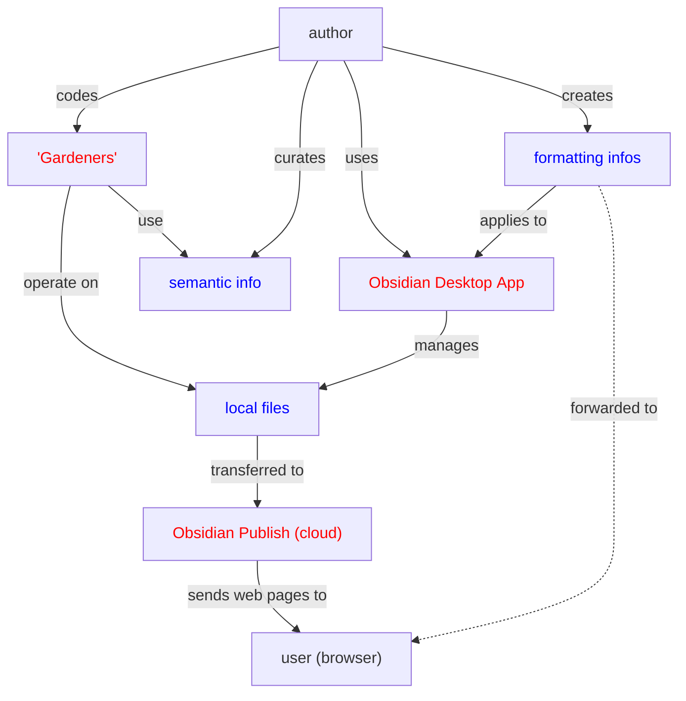

### Obsidian
Obsidian is actually 2 things:

- Desktop App
	- visual workbench for authoring pages and linking them
	- origin: personal knowledge management => single user, not web-based
	- everything is plaintext, with certain plaintext formatting characters ("markdown")
- Obsidian Publish
	- desktop app can upload pages to the cloud
	- Obsidian Publish transforms them on the fly into web pages
	- look & feel for navigation is like the desktop app
	- no authoring on the web, use app and publish added/changed pages

### Markdown
[Mastering Markdown](https://guides.github.com/features/mastering-markdown/)
[Basic Syntax](https://www.markdownguide.org/basic-syntax/)

[[Preliminaries Regarding Voice, Movement, and Gesture - Part 1]]

### "Gardeners"
[[Index]]
- generate from main [RB.yaml](file:///S:/work/Python/HAF/RB.yaml)
- example: "Einstein, Albert"
- index management (rename, delete, sort)
- [[Rob Burbea/Diacritics]] management

[[0301 Preliminaries Regarding Voice, Movement, and Gesture - Part 1]]
- automatic indexing
- footnotes excluded

[[Preliminaries Regarding Voice, Movement, and Gesture - Part 1]]
- linking to transcript paragraphs
- collecting index entries, with counts

[[Energy Body]]
- linking to transcripts
- copy/paste citations from transcript

... and helpers scripts:
- do certain transformations on the source markup before publishing it
- replace links to local audio files with Dharma Seed
- pruning the link charts for summaries
- todo list managers
